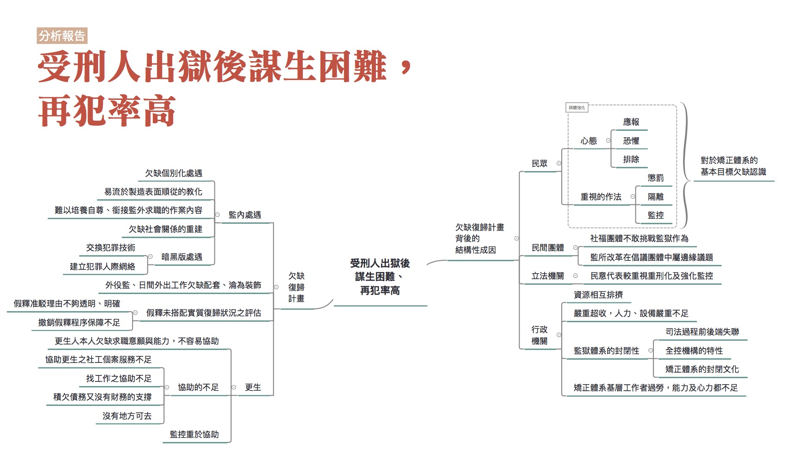

## 受刑人出獄後謀生困難，再犯率高

### 彙整人：林瑋婷

### 彙整範圍：
* 林瑋婷成因分析報告
* 0628全民司改運動第二階段籌備會議討論
* 0709評估會議討論

### 司法問題：

[受刑人出獄後謀生困難，再犯率高。](http://talk.justice.care/t/%E5%8F%97%E5%88%91%E4%BA%BA%E5%87%BA%E7%8D%84%E5%BE%8C%E8%AC%80%E7%94%9F%E5%9B%B0%E9%9B%A3%EF%BC%8C%E5%86%8D%E7%8A%AF%E7%8E%87%E9%AB%98/25/3)

國家把犯罪人送進監獄，以讓社會大眾安心。但是將犯罪人送去監獄後，往往只是把人關著，藉由各種生活條件的剝奪來懲罰人，而沒有好好把握機會協助他們脫離犯罪生活。出獄後也沒有提供充足的社會支援，協助曾犯過罪的人重新融入社會，造成再犯率高。

### 網路意見：

無

### 分析範圍：

從入監到出監更生的階段，皆涵蓋在分析範圍內。但是由於報告人的資訊來源主要是監所申訴案、監所參訪的經驗以及詢問監所人員，所以對於更生部分的著墨較少。

### 利害關係人：

民眾、公民團體、受刑人、更生保護會、法務部矯正署、監獄工作人員、觀護人

### 相關法律：

監獄行刑法、監獄行刑法施行細則、行刑累進處遇條例、行刑累進處遇條例施行細則、更生保護法、法務部矯正署組織法

### 相關議題：

監所、更生、復歸、監所外部監督

### 分析結果：

本題的司法問題談的其就是受刑人「社會復歸」的困境。社會復歸指的就是透過許許多多的措施，協助受刑人能夠回到並適應社會生活。有與會者強調，監獄不應該是殘酷對待的地方，應該視監獄是第二次的機會，關鍵是賦予受刑人人性尊嚴、恢復公民身分。在這樣的觀點下，社會復歸就不會是上對下地幫受刑人訂出他的生活方式，要求他做到，沒有做到就是失敗。相反地，應該視為提供協助的「機會」，讓受刑人有機會脫離入監前的生活網絡，重新建立起關係以及與人相處的方式。

雖然我國已經成立了矯正署，專門負責獄政工作，但是仍然沒有針對個別受刑人提供完整的復歸計畫，也就是從監獄內的處遇銜接到出獄後的社會內處遇，整體性、連續性的協助他們重新適社會生活的措施。這也是受刑人出獄後謀生困難，再犯率高的重要成因。以下的討論會先從欠缺復歸計畫的狀況談起，之後再進一步說明欠缺復歸計畫背後涉及的，從社會到政府各層面的結構性成因。

#### 欠缺復歸計畫

欠缺復歸計畫這個現象，必須從監內處遇講到出監後的更生協助，不能只談監內的情形。因為出監後才是受刑人真正面對遇到各種重新適應社會之困難的時候，所以從入監到出監後的相關協助都必須納入討論的範圍。以下將監內的處遇(也就是機構處遇)談起，再到中間處遇，也就是介於完全監禁的機構處遇，到回歸社會中在社會內給予復歸協助的社會內處遇之間的過渡階段處遇。最後再說明社會內處遇的狀況，這個階段部分也是常常聽到的「更生」。

##### 監內處遇

###### 欠缺個別化處遇

目前在監獄裡面的處遇，最根本的問題就是沒有「個別化處遇」。個別化處遇說的就是：依不同人的不同情況，給予不同的協助，以協助受刑人回歸社會。例如受刑人可能因為有人際關係方面問題，造成其暴力犯罪，那我們可能就要針對他處理人際關係的能力，給予協助。又例如受刑人有不同的就業意願與能力，需要的協助也不同。目前監獄雖然有對受刑人進行分類，但是比較是基於管理上方便。例如依罪行輕重分類，是擔心罪行輕者受罪行重者影響；依幫派進行分類是為避免打架、吵架情形發生。

###### 易流於製造表面順從的教化

搭配欠缺個別化處遇的情形，使得目前監所內的教化，很容易變成流於製造表面順從的教化，因為那些教化措施往往不是基於不同受刑人的不同狀況來設計。流於表面順從的教化措施並不能讓受刑人真正接受某些價值規範，進而產生行為上改變，而只是人在監獄不得不低頭。一些容易流於製造表面順從的教化方式如下：

1. 靜坐

    一般認為當其靜靜的坐著反省所作所為，就可以達到教化目的。但靜坐若要達成其反省目的，必須靜坐者真正認同靜坐這件事所要達成的目標。目前監所內要求靜坐，主要是為達成方便管理的目的，畢竟根本無法得知當一個人靜靜坐著，腦袋裡到底在想什麼。

2. 違規房

    違規時受刑人可能被送入違規房。在違規房內則透過剝奪其生活用品（現在規定上已經不允許這樣做了，但我不確定實際上是否已經完全沒有這樣的情形了）、長時間靜坐等方式處罰受刑人。特別是長時間的靜坐，要求不能亂動、維持一定姿勢，會帶來相當的身體痛苦。這樣藉由恐懼、害怕，讓受刑人改變的手段，或許對某些人長期的行為改變是有效的，但其他人可能只是迫於現實壓力而暫時低頭。回到個別化處遇的想法，就算是在監內的違規，其實也是要了解違規者的個別狀況，協助他改變這種狀況，而非單純地壓制。

3. 流於形式的道德勸說

    監所內的一些教化課程，往往流於道德教條的背誦，例如要求受刑人背誦弟子規，最會背的人可以得獎。這樣道德教條的背誦，或許在某個時代有它的意義，但是在當代是否還適合，就要好好思考了。因為這些道德教條對於人們來說，可能不是不知道，而是沒辦法認同這些道德教條的意義，或是這些道德教條實在與他如何在社會上求生存離太遠了。

##### 難以培養自尊、銜接監獄外求職的作業

監所內的作業往往與社會上的需求脫節。如折金紙、紙蓮花等作業，對於受刑人出監後求職的幫助不大。有種說法是：這類作業有助於受刑人培養勞動習慣。但若我們真的要協助受刑人復歸，就應該針對當代工作需求做調整，而非只是單純勞動。當勞動失去目標，勞動很容易變成折磨，只是為了做而做。

另外，監內作業的收入其實可以有讓受刑人自食其力、建立自尊的功能，甚至把錢存起來成為出監後生活或找工作的基本資金。可惜的是，根據與會者的說法，這種可以有較高收入的工作，限於少數自營作業項目，如麵線班或醬油班，一個月可以有一萬塊的收入，普遍的情形則是前面提到的折金紙、紙蓮花等委外加工的作業類型。不過，針對目前監所的自營作業，如麵線班或醬油班，仍有與會者表示對受刑人是沒有幫助的，因為職缺可能不多。應該要提供的職業訓練是有社會需求而且更具專業性的技術工，例如油漆、木工。

##### 欠缺社會關係的重建

監獄是一種全控式機構，在這種機構中，人們的既有的社會關係會被切斷，活動範圍限於機構內，所有活動都由機構來安排或規範，並且受到機構的監控。切斷既有的社會關係，在過去被認為是擺脫犯罪生活，適應監內生活的重要作法。但是由於絕大多數的受刑人總有一天要回到社會，從回到社會的角度來看，重建社會關係的重要性是遠大於切斷關係的，但可惜的是，受刑人社會關係的重建是相對受到忽視的。

1. 不當剝奪社會關係

    在監獄裡，有一些社會關係的剝奪，從社會復歸的角度來看，是根本沒必要，甚至是有害的。例如在剛入監時，受刑人的接見通信受到相對多的限制。依行刑處遇條例的規定，剛入監的受刑人屬於第四級受刑人，接見通信的對象只限於親屬，而且每星期只能通信接見一次。但是這樣的規定對於復歸社會來說，真的有必要嗎？會不會反而讓他更感到孤立無助、在適應監獄生活的過程中更感到痛苦？另外 ，奇怪的還有，依行刑處遇條例的規定「第二級以上受刑人之獨居房內，得許其置家屬照片」，也就是說，在監獄裡面持有家屬照片屬於一種特權。這個規定真的很奇怪，因為受刑人思念家屬，有家屬的照片對他們來說是有意義的，到底是為什麼不讓人家持有家屬照片？正是因為這個規定太奇怪了，所以2014年矯正署有一個函釋是說，在不違反善良風俗或妨害監獄紀律與安全的情形下，各監獄「得」開放受刑人持有家屬照片。可是具體的開放情形，由於各監獄有裁量權限，各監的狀況不一定相同。

2. 忽視監外人際網絡的重建

    有些受刑人在監外的人際網絡就是犯罪人際網，有些則是家庭支持非常薄弱。入監後固然可能暫時性地切斷犯罪人際網，但是如果沒有辦法在監獄中就逐步重建一些出監後可以尋求支持的人際網絡，或是逐步修復家庭關係，出監後可能很容易走回犯罪人際網。在這裡公民團體的介入是重要，因為如果公民團體進入監獄與受刑人建立關係，而且這種關係可以維繫到出監，繼續讓受刑人在社會中也有尋求協助或安全感的人際網的話，那對受刑人重新適應社會生活可能是有幫助的。目前有一些公民團體很努力在做這一塊，但是政府並沒有那麼重視將資源投入這個部分，只能依賴個別公民團體的善心與堅持。特別是有些公民團體的財務窘困，而這類監獄服務又不是討喜的募款題材，根本就是勒緊褲帶在做。

#### 暗黑版處遇

在目前的監獄中，不僅許多作法根本上無益於社會復歸，更麻煩的是，其實只要人被關到監獄中，他可能反而更容易在監獄中，建立起犯罪人際網。「監獄大學」、「進監獄進修」等說法，其實就是監獄將許多犯罪者置於同一個空間共同生活的必然結果，大家在裡面交換犯罪技術、建立犯罪認同與人際網絡，宛如暗黑版的監獄內處遇。

##### 中間處遇

受刑人從監內到監外的更生階段需要中間處遇的協助，但是中間處遇的重要性卻常常遭忽略。因為在監獄內的生活封閉而且受到較高程度地監控，狀況與重回社會時的情形落差太大，特別是對於長刑期的受刑人來說，這更是個問題。因此比較好的作法是，從高度監控與封閉的監獄內生活到重回社會的過程中，透過中間半開放的處遇方式，一邊確認受刑人的狀況，一邊協助受刑人逐漸建立在社會中生存的能力與方法，是重要的。但是目前台灣一些帶有中間處遇色彩的措施往往效能不彰。

###### 外役監

外役監其實還是比較偏向機構處遇，但是因為它的開放性相較於一般監獄高，因此我還是將它歸類於中間處遇。理想中的外役監應該要逐漸開放受刑人與外界接觸，訓練當代工作所需之能力，藉此讓受刑人可以重新融入社會。但台灣外役監主要工作內容限於農牧業，與當代工作型態落差過大，而且也只限少數表現良好的人才能去，難以扮演起社會復歸中的重要角色。

###### 日間外出工作

在欠缺個別化處遇與整體規劃的情況下，日間外出就像外役監一樣，妝點意義大於實質社會復歸的意義。再來，如果社會還是持續以擔心受刑人再犯、逃亡的觀點來看日間外出工作，那這個制度必然會因為過重的戒護人力需求，以及真實的再犯、逃亡案例而遭到質疑甚至捨棄。我在這邊還是要提醒，如果沒有以社會復歸的角度真正給予受刑人協助，就算是期滿出監還是可能再犯。過於看重監獄的隔離功能只是安慰劑，不能真正解決問題。 

##### 假釋

在社會復歸的觀點下，假釋是激勵受刑人接受各種處遇措施，早點重獲自由的重要誘因。而假釋審查，則是前面提供許多配套，協助受刑人取得在社會上生活的能力後，確認之前成果的時間點。在社會復歸的觀點下，受刑人的假釋被駁掉，意義不只是受刑人個人再犯可能未降低的問題，還必須檢討既有的處遇措施到底哪裡有所不足。

在此觀點下，針對網友 @Jon_Huang 的說法，不能以人滿為患為藉口，大開假釋之門，可能的回應如下：不能以人滿為患為藉口，大開假釋之門，這樣的說法是在承認監獄有發揮復歸作用的前提下才會比較有意義。當然，民眾可以基於受刑人再犯可能那麼高，怎麼能放出來為由而反對假釋，但不能忘記，除非採取初犯或再犯即採超長刑期或終身監禁的措施（但這種作法會衍生其他嚴重的問題，甚至掩蓋了犯罪的社會成因），受刑人總有一天會回到社會，這樣的說法只是把鴕鳥心態而已。如果看到目前監獄復歸作用的不足，就可以理解目前為何會以人滿為患作為理由而把後門（即假釋）開大一些。正是因為監獄難以發揮復歸作用，人不會越關越好，甚至還會越關越糟。

在目前監獄難以發揮復歸作用的情形下，假釋的准駁理由有時就會顯得恣意。在假釋審查委員會上，一個受刑人只有非常簡略的准駁假釋理由，其實很難實質對准駁理由作檢驗。而為何准駁理由會很簡略，其實就是因為根本沒有個別化處遇，確實地給予受刑人不同的復歸協助，並在過程中留下具體的評估記錄。另外，也也讓特權問題滋生，例如顏清標的假釋很快就通過，就被質疑有特權問題。

目前假釋制度除了駁准理由過於恣意外，還有「奇怪的統一標準」。監察院曾有一個調查報告，指出各監所假釋標準不一，為了回應這個調查報告，後來法務部就很重視表面上的類似情節的犯行應該抓差不多時間假釋；另外，為了求得表面上的公平，法務部也很重視各監獄抓的「執行率」應該要差不多。執行率是說某一類的犯罪在執行到百分之幾的刑期時，才會准予假釋。而執行率還會隨著社會氛圍、輿論來作調整。這種統一標準的邏輯，其實就是間接地承認個別化處遇在監獄內根本不存在，假釋核准率只是監獄在面對社會安全感及解決超收難題下的操作槓桿。

最後，假釋通過後，假釋的撤銷也是完全沒考慮受刑人實質復歸狀況是否需要再回到監獄。有與會者表示，台灣的刑法規定，如果你在假釋期間內犯了兩個月有期徒刑以上的罪，例如酒駕，沒有任何轉圜空間，就要撤銷假釋。撤銷假釋完全沒有法律保留原則、沒有聽審權的保障，檢察官直接就可以撤銷假釋，問題很大。

##### 更生

當受刑人離開監獄重新開始社會生活時，真正的考驗才開始。如何重新適應社會生活，如何避免走回犯罪的回頭路，這一切都還需要協助。之前的機構處遇、中間處遇，就是為了舖陳受刑人在回到社會時，能多一些機會脫離犯罪生活，而社會內處遇就是延續之前的相關處遇措施，繼續努力的重要部分。但可惜的是社會內處遇也沒有得到應有的重視，部分更生人既找不到工作，又沒有安身之所，無法融入一般社會的生活，只能走回(入)犯罪人際網路，在底層社會討生活。情形說明如下：

###### 更生人個人因素

根據調查研究，其實有些更生人本身就欠缺就業意願，如果是這種情形，要協助他們找工作本來就比較困難。有些人的工作能力本來也就有所不足，學歷大概也偏向高中職以下，如果在監獄時就沒有協助他提升基本的工作能力或學歷，那出獄求職時也就容易遇到困難。最後，如果更生人本身的社會支持力本來就不足，出獄後無處可回，也無法不去工作就能夠生存，走回(入)犯罪人際網路，在底層社會討生活，自然成了選項。

###### 協助之不足

1. 更生保護會首長不要求具備社會內處遇專業背景

    更生保護會是目前定位上由政府補助，最立基於社會復歸觀點而成立的協助更生人的組織，但奇怪的是更生保護會首長並不要求具備社會內處遇專業背景。更生保護會的董事長目前是高檢署檢察長兼任，董事長的話是：「檢察官代表國家追訴犯罪、伸張正義 ，一方面固是制裁壞人，另一方面則在保障好人，依據法律扮演謹守法律、維護公義，安定人心、穩定社會的角色，位尊權重 ，故應事事以民為念。身為法律的守護者，公義的代言人，更應時時以『外慚清議，內疚神明』自持，樹立公正、優質、有效率的司法 ，貼近民意，滿足人民的需求，此即為司法為民之真諦，亦 為檢察同仁共同努力之目標。歡迎各界批評指教，謝謝！」整段話和更生根本欠缺關係，令人擔憂更生保護會的最高長官可能不太懂更生，比較懂怎麼抓壞人。更別提部分更分會的主任委員，背景一看就是八竿子跟社會內處遇打不上關係的人，令人強烈懷疑只是酬庸。

2. 更生保護會不重視社工個案服務

    相對於觀護人兼具監控與協助兩種可能矛盾的職責，更生保護會如果願意投注心力發展社工個案服務，應該是更能夠專注於協助的職責。但是或許是因為長官本來就不見得具備社會內處遇的專業，更生保護會其實相對忽視社工的個案服務。更生保護會常常花許多心力辦很多活動，以讓他們看起來「很有績效」，但不願意投入資源作個案服務，深入了解每位受刑人的需求、追蹤他們出監後的狀況，以調度相關資源。這也讓一些在更生保護會工作的社工，原本懷抱著服務的熱情進入，灰心離開。

3. 找工作之協助不足

    更生人常常被貼上標籤，監所內又難以培養工作所需的技能，這讓更生人可能在出獄後就遭遇求職的困難。雖然目前更生保護會有與廠商合作，提供更生人工作機會，但據與會者的說法，有些更生保護會合作的餐廳假裝說跟法務單位去拿補助款，比如說雇主只要負擔一半的錢，更生單位會補助一半的錢，但其實收容人實際拿到的只有五千塊或六千塊，但他要簽名讓那個餐廳有拿到補助，變成聘僱收容人、取得好名聲、還賺錢。另外，據某位更生人的說法，有些合作廠商會苛扣薪水、要求超時工作等，讓更生人成為血汗勞工。就此來說，更生保護會有沒有好好監督或挑選廠商，是有疑問的。

4. 積欠債務又沒有財務的支持

    一些更生人有背負卡債，他們會希望工作是領現或不要勞保，這讓他們變得更為弱勢。另外有些更生人想自行創業時則往往受限於自身資金的不足，又難以取得貸款，加上與社會脫節已久，對於技術或市場的了解有所欠缺，創業之路難行。

    目前更生保護會有提供小額的創業貸款，但是據某位更生人表示，因為之前有更生人取得貸款後就跑路了，更生保護會申請貸款的條件就變得嚴格不容易通過。

5. 沒地方可去

    有些入監服刑的人，本身人際支持、家庭支持就是有問題的，所以出監之後很可能沒地方可以去。理論上，這時候需要社會安全網進來提供協助，例如中途之家提供暫時的居所，但這部份的資源是否足夠可能是有疑的。依據某位更生人的說法，他當初出監的時候沒有地方可去，想去中途之家，中途之家的床位又有限，要排隊等很久，那時他真的感到非常無助。

###### 監控重於協助

目前政府對待假釋出獄者的方式，設計上其實監控重於協助，而偏偏這些監控可能有礙復歸。

1. 觀護人協助與監控角色的衝突

    獲得假釋的更生人要定期到觀護人那邊報到。觀護人理論上主要的工作應該是關照更生人的生活，積極協助他重新適應社會，而同時也要監控更生人，注意並防止他再犯。但是監控者與協助者兩種角色是有內在衝突的。例如社工有時候為了協助案主，雖然知道案主有些違法行為，例如吸毒，他其實不適合去舉發，因為一旦舉發，信任關係破滅，案主有狀況就不願意跟社工講了。而從現在的發展來看觀護人的工作重點也比較是擺在監控，相關觀護工作的新發展，也是電子監控、性侵犯預防性測謊。不過必須要強調的是，就算整體政策走向偏向監控，觀護人如果用心做他們的工作，真心地鼓勵更生人、接納更生人，是可以給予更生人相當大的協助。

2. 前科造成的求職問題

    更生人出去就業會遇到前科資料問題，一般更生人不願意講出前科資料，擔心老闆會因此不用他。這樣的擔心確實有一定的道理，因為有些企業會不想用有前科的人，尤其是毒品案。不過有些企業對更生人是友善的，這些企業想知道更生人為何犯罪，之後管理上會比較有方式。例如因為暴力犯罪，可能容易情緒失控，財產犯罪的話也可以另外作防範。

    企業會想了解員工是否有前科，是哪一類的前科，員工有所隱瞞事後被知道可能更糟。前科記錄怎麼讓企業知道，也協助企業了解、接受、管理有前科記錄者，是重要的問題，不過目前這部分的協助也不足。

3. 法律限制有前科記錄者可擔任的工作類型

    有些法律會限制有前科記錄者可擔任的工作類型。例如公務員、計程車司機、保全人員等等。在此要注意不能擔任的工作類型和前科是否有關連性。

### 成因

欠缺復歸計畫這個現象的具體狀況描述已在前面有所說明，接下來要講的就是從社會面到國家面的各種結構性成因。

#### 社會面

社會面的部分又可分成一般民眾和公民社會兩方面來談，因為這兩方面狀況有些不同。

##### 民眾

許多民眾對於犯罪主要抱持著心態是：應報、恐懼、排除。這樣的心態導致在應對犯罪的作法傾向支持懲罰（認為罪犯應該付出相應的痛苦代價）、隔離（因為害怕罪犯，覺得要好好監控他們，把他們排除、隔離於一般社會之外），以及監控（回到社會內還是有可能再犯，要好好監視）。但這樣的心態非常不利於社會復歸，甚至是與社會復歸相違背的。因為社會復歸講的是，大家必須體認到犯罪人總有一天要回歸社會，並且思考彼此要怎麼共存，但是前面的心態作法卻是要將犯罪人視為它者，強化監控或排除。

這樣的思維在面對再犯時，容易想到的作法就是再犯就關，關到死最好，永遠不要出來；不然就是用死刑，人死了也不用浪費國家資源在犯罪人身上。但可惜的是，這樣的思維往往不能解決問題，反而會讓國家財政更為困難（因為要蓋更多監獄）、監獄爆滿又無教化功能，甚至掩蓋了犯罪的社會性成因。而偏偏前述心態與作法又特別容易透過媒體而放大。例如湯姆熊殺童案，多數的新聞報導強調被告曾文欽是個人魔應該判死刑，他裝病以躲過死刑，但其實他的犯案與人際支持網崩壞有關。

在媒體上很容易出現訴求重刑、死刑的情形，但這只能換取暫時的安全感。而在感到安全之後就鬆了一口氣，不去追問犯罪的社會性成因，解決社會問題，反而放任社會問題不斷生成新的犯罪，這才更是個問題。

對犯罪抱持著應報、恐懼、排除的心態，反面來也就是說，對於矯正體系的基本價值欠缺認識。與會者指出，矯正體系有三個基本價值：第一，特別預防，也就是這個人你希望他怎麼回歸到人群中。最基本的做法就是，找出他出了什麼問題，個人能做怎樣的改變。第二，一般預防，也就是藉由對個人施以不同輕重程度的刑罰，讓大眾知道不同犯罪行為的嚴重性，並進而不要做這些行為。這不等同於「殺雞儆猴」，也就是無論行為違法性的嚴重程度，給予重刑以讓人害怕。因為這樣的作法反而破壞了罪與刑的衡平關係，讓人覺得反正已經犯了罪，都要關很久或是被處死刑，那多犯一些罪也無所謂了（此部分在7月9日評估會議中比較看不出來，是彙整人會後再跟當時的發言人黃致豪確認後補充）。第三，犯罪社會成因研究，受刑人是社會研究的基本樣本，他們所顯現出來的行為偏差展現了這個社會出了什麼問題，也就是讓我們有研究成因，避免類似情況再度發生。

附帶一提，在7月9日的評估會議中，也有網友質疑無期徒刑的本意就是永久隔離，怎麼可以有假釋，為什麼要原諒他們。關於這個問題，與會者認為應該要看台灣選擇說在未來的十年我們倒退往北韓或中國的方向走，還是往類似歐洲的方向走。要往北韓或中國的方向，就是選擇報復；要往類似歐洲的方向，就是選擇前面提到的矯正體系的基本價值。

##### 公民社會

在公民社會中，會有一些公民團體浮現，它們相較於個別的民眾較有團體的資源與力量投入於某個公共議題之中。比較跟監獄議題相關的公民團體大致有社福團體與倡議團體兩大類。社福團體跟監所有比較多的合作，例如宗教團體常常會參與監獄內的教誨工作。這些社福團體較常提供輔助性的服務，但不太挑戰監獄結構性的問題，以避免產生衝突。社福團體某種程度上能和緩監獄教化、復歸問題，但改革則較需要倡議團體來推動。但可惜的是，監所改革在倡議團體中也屬於較邊緣議題，少有團體碰觸。

#### 國家面

國家面的問題則大致可分成立法機關及行政機關兩個面向來談。

##### 立法機關

在台灣的立法機關，民意代表的監督方向其實會呼應民意的需求，因此會傾向重刑化，或是強化監控。例如酒駕三犯一定要入獄就是重刑化的例子。但酒駕通常會涉及酒癮的問題，應該協助犯罪人改善酒癮的的狀況，把人關起來其實不太能解決問題。而強化監控則可見於各種質詢要求行政機關要加強治安維護。不過由於民意代表也會受到倡議團體的遊說，有些民意代表也會傾向接受倡議團體的說法，從人權的觀點強調不應過於重刑化，要小心國家強化監控帶來的副作用。這樣雖然可以某程度抑制過度的重刑化與監控的強化，但說到要推動行政機關投入大量資源來作社會復歸，卻仍遠遠不足，因為支持的民意代表有限，而且會遇到政府資源相互排擠的問題。

##### 行政機關

###### 政府資源互相排擠

承接前面所提到的問題。在許多弱勢議題上，都會出現資源排擠的問題。例如拿監所來跟勞工比較，為什麼要投入資源幫更生人找工作，如果有資源的話不是更應該投入來協助一般的失業勞工嗎？這讓弱勢議題看似變成弱弱相殘，彼此競逐有限的資源。在此情形下，不討喜又不受重視的受刑人社會復歸議題，能投入的資源就更少了。

###### 嚴重超收，人力、設備嚴重不足

台灣的監所有嚴重的超收問題。在2015年底，依規定全台監獄只能收5676人，但實際上收到7223人，超收率為13%。不同監獄的超收情形不一，以台北監獄來看，超收率已達40%。在嚴重超收的情形下，受刑人不僅是基本生活條件差，每個受刑人能獲得的復歸協助也不佳。每個教誨師能夠了解受刑人的個別狀況的時間會被壓縮，而且技能訓練往往也要搭配設備，人那麼多，設備就只有那些，結果就是只能讓少數人受培訓。超收嚴重的問題，與前面提到的民眾重視排除隔離，重刑化政策有關，也與政府資源有限的情形有關(不可能無限蓋監獄)。

###### 監獄體系的封閉性

監獄復歸功能不彰的問題，除了因為一般民眾本來就相對不關心這個議題之外，也與監獄體系封閉，外界難以了解、監督內部作為有關。這種封閉性與以下情形相關：

1. 全控式機構的特性

    監獄是一種全控式機構，如之前所說的，在這種機構中，人們的既有的社會關係會被切斷，活動範圍限於機構內，這本來就會讓機構內外的資訊流通有困難。

2. 司法前後端失聯

    監獄是司法的後端，而前端的司法在制度上沒有設計一個機制，讓它必須去了解監獄的狀況，也是讓監獄更能保持封閉性的理由。法官在判案的時候，並不會考量監所內實際教化、復歸的情形。檢察官也是相同心態，認為把人送進去之後就與他們無關了。雖然每年也有檢察官定期視察監所，但走的都是所謂「完美路線」(也就是只帶參訪者看沒問題的地方)，並不會看到問題在哪。律師在案子結束後，委任關係解除，也不太可能關心監所內的狀況。因此可以說，常見的法曹三者其實都對監所欠缺認識。

3. 矯正體系的封閉文化

    監獄體系的封閉性，也與矯正體系的封閉文化有關。之前我曾經去參訪監所，與監所的一些長官互動時，有時不禁會覺得他們說話避重就輕，很重視表面功夫。另外因業務而跟矯正體系的人有互動時，也覺得他們很重視上下服從關係，矯正署與各監獄有上下服從關係、各監獄典獄長又是監獄的頭，在監獄裡由他說了算。重視表面功夫又重視上下服從關係就容易形成封閉性。因此我們常常有時會看到監獄的業配文，說教化作得多好多好，但問題一堆都不太說。

###### 矯正體系基層工作者的無助少被重視

在監獄體系封閉的情形下，社會復歸的不足涉及到矯正體系基層工作者的無助一事，也就少被重視。

1. 工作量過大

    監所超收問題嚴重，監所人員有過勞問題。除了超收之外，教誨師業務龐雜，要花很多時間去計算累進處遇的分數，以及各種上級交待的績效要求。例如過去曾經舉辦過受刑人隊形變化的表演比賽，這類意義不明的活動造成基層人員許多壓力，也排擠了他們處理一般業務的時間。在此情形下根本難以期待教誨師有足夠時間一一了解受刑人的狀況，處理好復歸的工作。

    過勞所涉及的另一個問題是，它不僅使基層沒時間做好復歸的工作，甚至會逼使基層人員更不願意協助受刑人。在重視上下服從關係又禁止組成工會的情形下，監所人員面對過勞的問題只能自我工具化。就算對於過勞心中感到非常不滿，覺得自己不被當人看，但是也不敢反抗上級。而如果覺得自己不被當人看，其實也很難期待監所人員把受刑人當「人」對待。畢竟在不增加資源的情形下，對他們提出多照顧受刑人的要求，對監所人員來說都是沉重的負擔。

    但是要附帶一提的是，有一些監所人員縱使在惡劣的勞動條件下，仍然十分用心地對待受刑人，真正把受刑人當成「人」看。我就曾遇到不只一位的更生人跟我說，他在獄中遇到了真的關心他、在乎他的監所人員，他非常感謝。甚至也有更生人說自己不太會寫字，希望我幫他寫信謝謝某幾位監所人員。

2. 能力不足

    有時候社會復歸的困難也在於監所基層人員不知道該怎麼做。目前台灣監所人員主要是出身警察大學，警察大學比較是從犯罪防治的角度來教育學生，重視戒護管理，但不見得知道怎麼協助受刑人復歸社會。相較之下，國外有矯正心理學(correctional psychology)這支應用心理學分支，參與復歸計畫的人要具備這部分的知識，甚至是專門的執照。但是台灣沒有將這類人才制度性地納入監所。不過也必須承認，國外的矯正心理學仍然是持續發展中的學門，仍有許多不足及待解決的問題。但是至少矯正的相關知識是受到相當的重視，而且持續、有系統地在累積。

    附帶一提，除了監獄人員自身不見得知道要怎麼協助受刑人復歸社會，矯正機關所引入的志工也不見得有此能力，甚至完全不具備基本的諮商倫理概念，就在作輔導受刑人的事。例如應曉薇在鄭捷槍決後對外發表她在輔導鄭捷的過程中，覺得鄭捷很可怕、不認錯，引起一些了解諮商倫理的人的反彈，事後矯正署並公開澄清，應曉薇不是「教誨志工」，而是台北看守所自行遴選的「社會志工」。

3. 流動性過大，經驗無法累積

    根據2011年研考會關於獄政改革的研究計畫，台灣北部、東部監所工作人員的流動性很高，常需以約聘人力替代或不斷訓練新人，造成管理上的空窗期。一直待在同一監所固然有形成次文化，抗拒改革的問題，但人員過快流動，以致經驗難以累積，也是個問題。

4. 心態消極

    在監所基層人員過勞、欠缺矯正心理學相關知識，部分監所人力流動性過大，難以累積經驗的情形下，也讓監所人員抱持著「只要不出事就好了」的消極心態。
