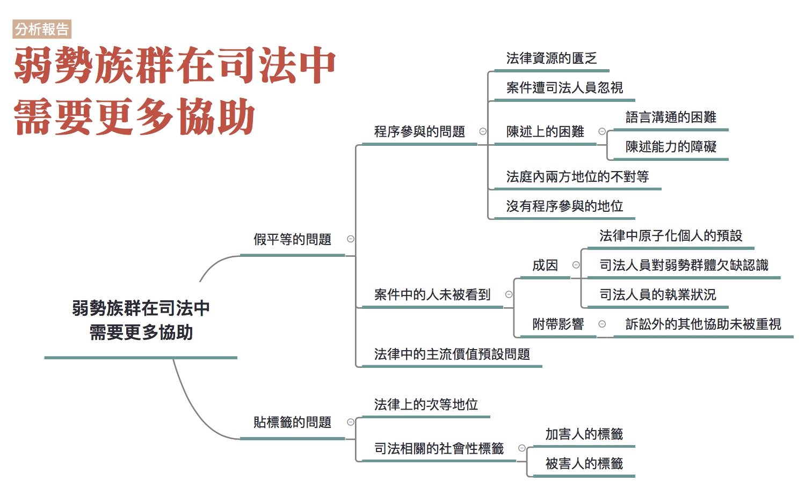

## 弱勢族群在司法中需要更多協助

### 彙整人：林瑋婷

### 彙整範圍：

* 李艾倫口述成因分析記錄（記錄人：廖禾安、林瑋婷）
* 張靜如成析分析報告
* 0621全民司改運動第二階段籌備會議討論
* 林作逸相關文章(我是受害者家屬，我主張廢除死刑、畸戀殺機 父母慘死 林作逸推被害人保護)
* 0702、0709評估會議會議討論

### 司法問題：

[弱勢族群在司法中需要更多協助](http://talk.justice.care/t/%E5%BC%B1%E5%8B%A2%E6%97%8F%E7%BE%A4%E5%9C%A8%E5%8F%B8%E6%B3%95%E4%B8%AD%E9%9C%80%E8%A6%81%E6%9B%B4%E5%A4%9A%E5%8D%94%E5%8A%A9/32)

有些弱勢族群，如原住民、新住民、身心障礙者等等，因為文化背景或是語言與台灣主流文化不同，或是因為自身的弱勢處境未受司法所重視，因此在司法過程中遇到許多不被理解，或未受到適當協助的困境。

例如原住民、新住民吃上官司，聽不太懂警察、檢察官、法官在講什麼，所以需要通譯來幫他們翻譯。但是通譯的品質參差不齊，有的會自己加減內容或是對法律用語也不是很了解，導致這些人在官司中吃了虧也不自知。

又例如一些智能不足者，被詐騙集團騙走他的銀行帳戶，卻被當成詐欺幫助犯來處理。或是過動兒被當成罪犯送到少輔院，沒有接受特教協助，反而把他當成很不乖的孩子加以教訓、處罰，甚至最後慘死。

相關報導：[《後來怎麼了》15歲少年的悲劇人生／壹週刊](http://www.nextmag.com.tw/magazine/people/20141105/10116336)

### 網友意見：

@zero490

法官對環境不好或學歷低的被告，常以與本案無關為由不給被告發言，有礙發現真實。

我法庭觀摩的情形是被告要做解釋，描述前因後果，法官卻以與本案無關為由不給發言，而告訴人是高知識背景卻給他最完整的待遇，並在判決書上以告訴人描述的前因後果為判決背景，但對於告訴人的描述，相信很多人都可以知道告訴人會加油添醋，即便錯了，最後也會以記憶模糊來逃避其不實描述。

環境不好或學歷低並非弱勢族群，在弱勢族群上我國司法積極推動保護，弱勢族群在法律上有大概的界定，我所指的是經濟與學歷上的弱勢必須被強調，這部分的人是沒受到特別保護但有被輕視的，弱勢族群在司法中需要更多協助這問題中已經有人提到經濟地位，但應該繼而強調職業與學歷，以前的新聞曾報導高學歷代表有教化可能從輕判決?

舉例而言一個總裁跟一個清潔婦，審理竊盜罪(30000元為例)，法官可能劈頭就問清潔婦她知不知道對方是總裁(潛意識就認為總才不會為這小前爭執而認為清潔婦有犯罪行為)。再以仙人跳的相反例子，一個老師與一個業務員，老師不法侵權業務員，業務員要求賠償，卻最先被認為是仙人跳，只因對方職業不高向?

所以我認為應該強調職業與學歷，只描述弱勢族群可能會使這部分人被忽略。

補充一點，有前科的人也容易影響法官心證。

不過我還是希望能將職業與學歷的弱勢強調一下，我的經驗是法律輔導的，幾年前我曾經在輔導法律問題時就發現了一個問題，當單親家庭或原住民來問問題時，我這邊都可以轉介公設辯護人，而如果是學生或一般家庭的媽媽，我這邊卻不知道怎麼回答，幾個例子讓我記憶猶新，一個是大學女生為她男朋友卻只能請律師，一個媽媽剛死了丈夫帶著小孩只能請律師，一個媽媽剛破產也只能請律師，處理情形是只要你不是低收入戶或原住民或身心障礙你只能請律師，我是希望是不是能將在標題上就將學歷與職業補充上去或著是改成司法弱勢，一般人認知的弱勢族群，像我還沒輔導前我認知的弱勢族群只有有證書的低收入戶、原住民、身心障礙人士，而司法弱勢卻不局限於弱勢族群。

### 分析範圍：

各種弱勢當事人，但是因為原報告人的分析重點分別是法律扶助基金會工作時所會遇到弱勢當事人的狀況，以及移工和新移民，因此本彙整報告所能提及的分析範圍也是以此為主。

### 利害關係人：

法官、檢察官、警察、精神及智能障礙者、少年、移工和新移民、經濟弱勢者

### 相關法律：

民事訴訟法、刑事訴訟法、少年及家事法院組織法、行政訴訟法、法律扶助法

### 相關議題：

司法精神鑑定、法律扶助制度、司法可親近性、現代法律中的基本預設

### 分析結果

對於弱勢族群在司法上需要更多協助這個問題，一開始必須處理的問題就是，討論框架到底要用不同的身份別來區分，還是被不當對待的方式來區分？在7/9的評估會議中，與會者提到用身份作區分可能產生另外的危險，這是因為身份的區分一方面是讓弱勢者的弱勢情況可以被看到，但另一方面產生的危險就是標籤化或是漏未注意。在考量到不可能將所有弱勢者的類型窮盡、避免不必要的標籤化，以及其實一些弱勢處境是普遍的，一般人也會陷入，因此在以下的討論中，將採用被不當對待的弱勢處境來區分。

而一旦不再用常見的身份別來作區分，例如智能障礙者、原住民、移工或移民等等，那到底怎樣叫「被不當對待的弱勢處境」？這些弱勢處境的分類基本上整理自原有的弱勢身份別遭受對待的方式，至於什麼叫做「不當」，由於本篇分析報告是歸納現有的狀況，因此所謂的「不當」，是隨著社會對於弱勢處境的「承認」來變動。舉例來說，歐洲認定弱勢者可能是他和社會溝通的能力比較差，這是比較講求緊密互動的情況下才會認定的弱勢，但關於這部分的討論在台灣目前還不太有，就沒有放到本報告之中。

至於「需要更多協助」到底是指需要哪些協助，其實是解決方法的討論，在本階段不處理，而只先探討應該要注意到的弱勢處境類型。
最後在進入正式分析前還是要提醒，最根本的與其說是要清點完所有弱勢者或弱勢處境，不如說希望大家願意真心理解不同個體以及個體的處境，這才是改變的契機。

在司法中的弱勢處境，大致可以分成兩種情形。第一種是「假平等」的問題，也就是宣稱法律之前人人平等，但其實不同人的處境可能很不同，沒有注意到這些不同而導致人們處於相對不利的地位或易受傷害的處境。第二種是「貼標籤」的問題，也就是注意到某些群體的特殊性，但不去進一步了解或接納被歸類為某些群體的人的真實狀況，甚至傷害他們。

#### 假平等的問題

假平等的問題，大致可分成以下幾個面向來探討：

##### 程序參與的問題

訴訟法上雖然對於當事人有相關的訴訟程序權，但是弱勢者實際上卻可能因為弱勢處境未受到應有的重視，實際上在司法程序的參與過程中，容易處於相對不利、遭忽略的地位，甚至是遭到傷害。

###### 法律資源的匱乏

弱勢者在司法中遇到的第一個難題就是法律資源的匱乏。他可能在經濟上有困難，請不起律師；資訊上有所不足，不知道有法律扶助基金會、不知道怎麼找可靠的律師，甚至不知道自己在法律上可獲得的保護。例如智能障礙者根本不知道自己有「智能障礙」，而且可以作為量刑上減輕的因素。又例如卡債族根本不知道有法律針對卡債有設特別的處理機制。文化上也可能阻礙個人去尋求法律資源，例如原住民在觀念上認為找律師就是作賊心虛，於是放棄在偵查中請律師的權利。

###### 案件遭司法人員忽視

弱勢者無權無勢，有時候他的案件就會遭到司法人員的忽視。例如說之前屏東漁船上，有兩個移工死掉。一個是掉到海裡、一個死在船上，檢察官查了半天連起訴都沒有起訴。又例如或者是來台工作的移工在工地遭電擊重傷後死亡，所有人都表示不認識他、沒有僱用他，但工地包商的前妻卻又曾匯錢給那位移工的家屬。最後找不到人要為這名移工的死亡負責，家屬也沒有獲得賠償（參「電焊工人神秘死亡案」）。

###### 陳述上的困難

一些弱勢者在司法過程中，也會遇到陳述上的困難。這種困難大致可分成兩種情況，第一是陳述能力的障礙，第二是語言溝通的困難。

1. 陳述能力的障礙

    一些精神或智能障礙者不見得能夠理解司法程序在做什麼，也就不知道要怎麼為自己主張權益。一些精神或智能障礙者本身是被害者，但是由於陳述能力的不足，說的話難以被法院所採信。這樣的困境在特教學校的性侵害案件上，又顯得更為嚴重，相關討論可以參考「特殊孩子無法做證？」等相關文章。

    也有一些人不算醫學上所認定的身心障礙者，但是陳述能力也不是很好，法官沒有受過心理溝通的訓練，也不知道該怎麼跟他們溝通。而且法官通常訂庭期只給十五、二十等分鐘，在時間的壓力下，也就更難好好和當事人溝通了。

2. 語言溝通的困難

    語言溝通的困難則常見於外國人、移工、新移民，或是原住民等，母語並非中文的人。在台灣，法庭溝通是以中文為主，在法庭上非以中文為母語者，可能就會因語言的問題而實質上難以充分了解、參與法庭活動。

  1. 熟悉日常語言的使用不代表熟悉法律用語

      外國人、移工、移民或原住民可能日常語言溝通沒問題，而未被詢問是否有通譯之需求，縱使有主動詢問，他們也可能認為自己中文能力已足堪應付司法活動，但實際上他們對於中文無法精確的掌握或根本無法理解法律語言，往往因為理解錯誤而造成誤答，形成不利之結果。

  2. 通譯制度不健全

    1. 缺乏通譯

        根據近三年之統計資料，司法單位與警察機關受理之家暴案件11萬件當中，新移民配偶為家庭暴力受暴者約有9,500多件，但是這當中運用通譯人力資源的僅有108件，比例明顯偏低。東南亞移工相較於東南亞新移民配偶而言，中文能力更貧乏，但是在面對訴訟糾紛時，常常面臨缺乏通譯的窘境。根據聯合國《公民與政治權利公約》第十四條第三款「審判被控刑事罪時，被告一律有權平等享受下列最低限度之保障：(六)如不通曉或不能使用法院所用之語言，應免費為備通譯協助之。」然而，台灣社會制度長期忽視通譯服務在人權上的重要性，在司法審訊相關過程當中，往往只有在法庭庭訊時才有特約通譯人員的編制，在警察機關或其他第一線現場，卻不見得有通譯人員提供翻譯服務。而通譯需求數量被高度低估，也使得專業通譯工作者承接案量有限，無法發展穩定職涯。

        這種通譯的缺乏，也有城鄉差距，以及不同語系缺乏嚴重度不同的狀況。以移民署所提供的通譯人才資料庫為例，目前在那個資料庫上登錄，提供東南亞語系有1326位，然各語言通譯人員所擁有的人數並非一致，且未及於台灣各縣市，部分區域有通譯需求時，將面臨無通譯可提供協助狀況。

        ＜表一＞內政部移民署 通譯人才資料庫東南亞語種通譯服務人數概況
        （資料日期：105/06/15）

        

        在缺乏通譯的情形下，許多僅是粗通中文的新移民常常面臨到，必須以不熟悉的語言進行攸關個人權益至鉅的訊問與筆錄，這當中可能造成的人權斲傷，卻長期遭到漠視。

    2. 通譯品質未妥善控管

        縱使好不容易有了通譯，但是通譯的品質良莠不齊也是嚴重的問題。由於缺乏通譯，常會使用臨時的通譯工作者，但是在面對司法相關名詞的通譯工作時，許多臨時的通譯工作者無法精準、正確地進行通譯工作；或者是，通譯者本身就是案件當事人，例如常見的仲介與移工之間的契約糾紛，通譯者本身的立場已經涉入其中，而失去通譯專業所需的中立性。

        通譯的品質良莠不齊與通譯的培訓考核制度不完備有關。法院與檢察署建置之特約通譯名單，二年一期，每期皆須接受相關通譯、法律素養、庭務等等相關培訓；相較之下，移民署所提供的通譯人才資料庫(以各類相關公務單位之通譯溝通服務為主)，雖要求通譯人員必須通過筆試及口試要求方能取得結業證書，然而培訓課程內容及要求之時數顯然不足以應付各類相關公務單位在溝通時，可能會使用的專業用語。為了釐清責任，移民署多次說明，該平台僅為整合現有通譯資源，而不具有培訓、檢核、管理、以及財務支持。但這也呈現了培訓考核制度不完善的現狀。

    3. 通譯費標準不一

        可能使用到通譯的單位包括法院、檢察署、警政單位、移民署、勞政機關、家暴中心及社會局等。但是這些單位通譯並無統一法規，擔任通譯之旅費、交通費等各單位之給付標準也不一致。

    4. 相關單位(例如警察)未正確使用通譯

        除了通譯本身的問題外，使用通譯的相關單位，對於如何正確使用通譯欠缺認識，也是個問題。有警察要求通譯以利誘等方式協助不正取供。甚至有早在通譯到場之前，筆錄已完成，通譯根本未參與所有活動，卻仍要通譯仍簽名於筆錄之上的情形。

###### 法庭內兩方地位的不對等

法庭內的兩造當事人都各自帶著他們既有的社會資源進入法庭，而這些社會資源的差異，就可能會讓兩造在法庭內的地位實質上很不對等，以致於訴訟的勝敗與其說是因為事證本身，而不如說是受兩造不同的社會資源所影響。例如勞資爭議中，資方有專門的法務在協助他，訴訟資料也多半在資方，勞方能取得的有限證據也不見得被採納。又例如在行政法庭上面對政府單位的人民也有類似的困境，政府單位比較有能力請律師、資料在它手上。更麻煩的是政府提供給行政法院的資料還可能用各種理由，要求法院不要提供給人民看。如果行政法院欠缺對於權力不平等的認識，很容易就限制人民閱卷，使人民更陷入訴訟上的不利處境。

###### 沒有程序參與的地位

在當代被害人權益開始受到討論之時，刑事案件的被害人在刑事訴訟過程中不被當成主體也成為了問題。現行的刑事法律主要是處理被告有沒有罪，要判刑多久的問題，而被害人可能希望在刑事司法過程中去了解事情發生的經過，提出自己的想法。在現行的刑事法律中，被害人想追求真相的心情，有時是被忽略的，被害人連想了解最基本的司法到底查了什麼事，都會遇到困難，例如必須請律師去閱卷才能拿到卷宗資料。另外，被害人想追求的真相有時是和司法體系所關心的真相不同。被害人想知道為什麼是自己？為什麼要殺害自己的親人？他是如何殺害？加害人真的後悔了嗎？但事實上可能嗎？這些可能都是被害人關心的，但不是司法的關心所在。
被害人在刑事司法中的參與是很被動的，是由法官、檢察官視需要才傳來問，不想傳的話連講話的機會都不太有。傳來問的時候，也不見得注意到被害人需要受保護的需求。有的檢察官在偵查庭的時候，還把告發人和被告是放在一起，同一庭在偵查，那試問告發人怎麼敢真正地講出來他告發的原因？

##### 案件中的人未被看到

弱勢者除了在程序參與的過程陷入不利處境，他在司法過程中，本身也容易被化約成案件。至於他本案之外的生命經驗、所處的複雜社會處境，都可能被忽略。

#### 成因

1. 基本法律預設是原子化的個人

    當代法律中預設的人是「原子化的個人」。原子化的個人指的就是，人不被視為存在於社會關係之中，而是一個個獨立的個體。人的個體差異被抹除，在法律上都被預設為獨立而同質的具理性思考能力個體。而這樣的預設其實容易讓弱勢者因為所處的社會情勢，導致他處於相對不利或易受傷害的位置的這個問題，遭到忽略。

    當代法律預設著原子化的個人，容易讓司法人員把活生生的人，切割放入法律框架中來看待。舉個例，像是毒品案件，爸爸因為毒品案件入獄了，家裡就沒有經濟來源，媽媽也不太有工作能力，或是工作能力不足，媽媽入不敷出有了卡債。當小朋友開始長大，需要打很多工的媽媽疏於管教，開始出現少年問題；爸爸回來後又失業，開始跟媽媽爭執，就有了家暴、家事案件；若家裡有長輩，又有長照問題。辦案的時候，會發現像粽子一樣，關連性很強；但在法院就只是案號。法官只是看到自己手上的案件，卻沒有看到「人」。

2. 司法人員對弱勢群體欠缺認識

    雖然當代法律基本的預設是原子化個人，但是某些弱勢群體的處境已經逐漸為人所知，甚至規範到法律內，但部分司法人員對這些弱勢群體仍欠缺認識。例如精神障礙及智能障礙者的情形，在司法人員對精神障礙及智能障礙者欠缺認識的情形下，容易誤以為他們就是邪惡、頑劣，或是假裝以逃避刑罰。又例如卡債族的情形，司法人員會問當事人說「都有債務了為什麼不找更好的工作？」、「為甚麼小孩要文具，買文具要錢啊？」、「那你都有卡債了為什麼還要扶養父母？」有些問題問起來很奇怪，背後可能涉及法官不了解處境也不了解相關法律。

3. 司法人員的執業狀況

    為什麼司法人員傾向看見案件卻沒有看見人呢？不同類的司法人員的狀況又可能有些不同：

  1. 法官

      第一點，法官都是非常優秀的人，唸書時成績就非常亮眼、通過司法官特考，某種程度上來說，人生的道路比較順遂。有些法官比較不能理解其他沒有那麼優秀的人為什麼會做這些事情？會有這樣的表現？而有些法官則覺得我苦過，我可以，你為什麼不行？但明顯的是你比較聰明、能考過考試。弱勢不只是比較沒有錢，可能還面臨沒有能力、沒有關係等問題。比如說一位律師，他今天也許一時沒有錢，可是他至少有專業能力，也認識有能力的人。而弱勢民眾相較起來，所認識的人就與前者非常不同，他很容易會在那個輪迴裡一直繞。這是法官難以理解的。

      第二點，管考的問題，當用數字的方式去管理考核法官的表現，結案就變成很重要的事(例如多久可以結案、一個月結掉多少案子)。有的法官會多花點時間傾聽、了解民眾，但也會碰到法官想要快速結案。例如外籍當事人可能要請通譯，也許有一些不是很好的翻譯，或是表達能力沒那麼好，但法官要結案，就會變成壓力。又例如有躁鬱症的當事人，表達的方式會不一樣，但法律人的腦袋有一定習慣的思考模式後，比較不容易去理解他們的思考方式、同理弱勢的處境。這些情形再加上結案的壓力，情況會更不理想。

  2. 檢察官

      檢察官的環境比法官更封閉且更沒有保障。如與相對獨立的法官相比，案件更容易被干擾。而檢察官也一樣有案件壓力。另外，檢察官應該一併注意有利不利，但因為他必須追訴，可能常常會忽略對被告有利的證據。

  3. 警察

      警察相較之下又更便宜行事。譬如說，刑事訴訟法有規定智能障礙者、精神障礙者等在偵查中必須有律師在場。之前有個案件當事人犯了很輕的罪，但警察撥電話給法扶時撥錯號碼，一個小時都沒有接通。警察當時就覺得算了，想趕快問一問，就開始問當事人。後來調閱錄影帶，可以發現那位當事人有相當長的精神疾病病史，他在受詢問的過程表現得很奇怪。警察或許會覺得這是小案件，趕快做完就可以下班，但他沒意識到，這樣的行為讓當事人權利受損。

  4. 律師

      公設辯護人案件量很高，因此分配給每個案件的時間常常受到壓縮，實在很難好好處理每個案子。至於一般律師接法扶案件的狀況，有些律師在面對一些比較不容易相處、溝通、精神狀況也不太穩定的當事人時，會有著「為什麼今天我要提供免費服務？」一種高高在上的感覺。忽略了即便是他們不喜歡的人，也有接近法律的權利。特別是有些年長律師容易較有優越感，會用比較權威的態度對待當事人。

###### 附帶影響：訴訟外的其他協助未被重視

在司法過程中，個體的社會弱勢可能被化約成案件，有時候他的整體弱勢情況在司法過程外也同樣會遭到忽視。甚至因為過於將某類群體的問題「司法案件化」，而忽略了更加社會面的支持與協助。例如少年犯罪的問題，雖然《少年事件處理法》已經有針對少年有特別的保護，但是當少年犯被送到少年矯正體系時，是否受到足夠人性的對待仍是有疑問的。

又例如欠卡債的人，不能只是看到欠卡債要上法庭的問題，而要看到卡債族重新站起來，可能也需要心理支持。

又例如要保護犯罪被害人，不能只看到抓到兇手破案的問題而已，被害人要能重新站起來，需要將他們視為主體來作相關的制度性設計。他們可能需要金錢、需要社會支持，也可能需要與加害人關係的修復，需要單一窗口來處理種種需求。而國家也要看到犯罪發生的社會性成因，不能將問題只推給犯罪者，主動承擔起改善社會、協助被害人的責任。（犯罪被害人的弱勢處境另可參：法務部100年度委託研究計畫--「犯罪被害人保護政策體檢報告」成果報告書）

##### 法律中的主流價值預設問題

在法律當中，也有可能有看似普遍、中立的規定，但其實採用的是主流社會價值的預設。例如當代司法講求是非對錯，不太有關係修復的概念，但是對原住民來說，關係的修復是更重要的，忽視這一點會讓使用司法的原住民造成更多恐懼。例如部落中發生強暴案件，加害人是被害人的親戚，被害人會被說若你訴諸法律，會造成家庭破裂，受害者反而覺得是自己的問題。

又例如原住民狩獵屬於他們的傳統文化，但是當代法律有限制捕殺野生動物、使用槍枝的規定。這些規定原本出自於生活中沒有狩獵傳統者的考量，到底如何能在法律規範中納入原住民文化的考量，現在越來越受到討論，但如何規範仍有爭議。又例如越南有吃狗肉的習慣，就跟台灣人吃雞肉、牛肉一樣。但是台灣的《動物保護法》卻基於台灣人的生活習慣，將狗視為陪伴人的寵物，不可殺來吃，一概將越南移工殺狗來吃的行為視為犯罪。

#### 貼標籤的問題

貼標籤的問題，則主要呈現在以下兩個面向：

##### 法律上的次等地位

在面對一些弱勢者時，有時法律甚至會特別劃定出這一群人的身份，不但不協助他們，反而基於他們的身份而給予特別不利益的對待。例如東南亞籍的婚姻移民常被懷疑是假結婚，並基於懷疑他們是假結婚而設計了一套針對東南亞等特定21國人民的「境外結婚面談」制度。又例如針對移民訂定恣意而空泛的國籍取得限制，或是對於遭受家暴離婚或喪偶的外籍配偶，仍要求嚴苛的財力證明，才能取得我國國籍。這些法律明定的次等地位，使得這些弱勢者縱使走入法院也得不到任何協助。

##### 司法相關的社會性標籤

在司法過程中，有時某些弱勢者的弱勢處境沒有被真正了解並接納，連帶地他還會被貼上標籤，讓他的社會處境更為惡劣。刑事案件中的加害人是一例，先不論冤案的情形，縱使是真正的犯罪加害人，他會犯案也有可能是一系列社會弱勢處境累加的後果(例如湯姆熊隨機殺人案被告曾文欽的情形。相關報導請參：血是怎麼冷卻的：一個隨機殺人犯的世界)。而司法如果不去看到其中的結構性因素，也不給予相關協助，只是讓這些人的處境更為惡劣。更可憐的還有加害人的親人，也還被迫一起承受其他人的排斥與厭惡。

除了加害人之外，弔詭的是刑事案件的被害人也是被貼標籤的一群人。在發生兇殺案件的時候，輿論會以還被害人一個公道為由，要求判被告死刑，但其實不是所有被害人都這樣想。有些被害人是希望淡忘、遠離這些痛苦；有些被害人是希望真正地了解加害人、為什麼他這麼做，然後選擇原諒。然而如果有被害人表達出這樣的心情，反而會被輿論攻擊說「你不了解其他被害人的痛苦嗎？」、「你難道不知道這些人最死有應得嗎？」之類的話。此外輿論雖然表面上是同情被害人的，但是講到真的要協助被害人時，例如幫忙照顧遺族，其實沒有幾個人願意。甚至在論及婚嫁時，被害經驗因為有時會伴隨著坎坷的成長過程，還可能被拿出來挑剔，被認為不是好的結婚對象。

前述貼標籤的問題，可能不只是推動反歧視法，或相關人權公約(如CRPT)的國內法化就能解決的。首先，反歧視法本身另外還有不當限制言論自由的疑慮；再來更重要的是，如果人們不是真正地去理解並接納差異，縱有法律規定，在執行上也會出現難以落實的問題。
