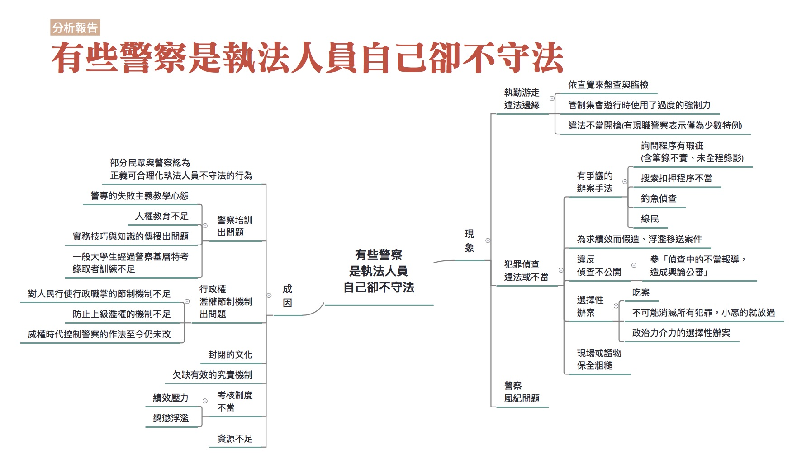

## 有些警察是執法人員自己卻不守法

### 彙整人：林瑋婷

### 彙整範圍：

* 郭德田口述成因分析記錄（記錄人：黃盈嘉）
* 現職警察口述成因分析記錄（報告人：林瑋婷。記錄人：廖禾安）
* 時瑋辰成因分析報告
* 0628全民司改運動第二階段籌備會議討論
* 0709評估會議討論

### 司法問題：

[有些警察是執法人員自己卻不守法](http://talk.justice.care/t/24)

台灣的警察在執勤或辦案時，時常不守法。在盤查時未出示自己是警察的證件，未附具體理由就要求民眾提供個資、對民眾進行搜身或翻看身邊的物品。在辦案時，以半強迫的方式取得犯罪嫌疑人的「同意搜索」，甚至以各種可能違反刑事訴訟法的作法，如刑求逼供，或是以威脅、利誘等方式對嫌犯套話，之後再正式作筆錄並錄音。

### 網路意見：

無

### 分析範圍：

本報告分析的範圍涵蓋整個「有些警察是執法人員自己卻不守法」。但是由於大家在討論這個問題時，時常跳到其他警察制度的問題，這些問題雖然不在原本的討論範圍內，但本身相當重要又與警察執法狀況相關，因此在本彙整報告中，也會呈現這個部分。

### 利害關係人：

警察、一般民眾、被告

### 相關法律：

警察法、警察勤務條例、警察職權行使法、警察偵查犯罪手冊、刑事鑑識手冊、集會遊行法

### 相關議題：

臨檢、盤查、偵查、不正訊問、鑑識、集會遊行、用槍、同意搜索、警察風紀、績效、警察養成、警察過勞

### 分析結果：

關於警察執法可能違法或不當的情形，我們分成執勤、犯罪偵查、風紀三面向的問題來討論。執勤指的就是警察執行的各項勤務工作，在這裡指的比較限於涉及行政調查但又還沒有正式進入刑事偵查的工作內容，例如巡邏、臨檢、盤查等等。這類勤務可能涉及對人民即時性地使用強制力，容易有違法或不當的情形，就特別拉出來談。

犯罪偵查也算廣義的執勤範圍，但是特別拉出來談，理由是因為犯罪偵查的後端就是刑事處罰，涉及到把人抓到監獄去關，甚至執行死刑，弄錯的話是很嚴重的事。此外，為了能讓犯罪偵查能夠順利進行，國家也容許對於被告進行各種更加侵害他權利的各種調查行動。此時有必要討論怎樣的調查行動是可以的，而哪些又是不行的。這部分在司法中特別重要，因此把犯罪偵查可能違法或不當的部分又特別拉出來討論。

警察風紀的問題很重要，因為容易涉及包庇犯罪，是嚴重的警察不法問題。但是因為資訊不足，我們沒辦法對這部分的問題比較詳細而且可靠的成因分析。
 
#### 現象

##### 執勤遊走法律邊緣

警察執勤遊走法律邊緣的問題，常見的有以下幾類：

###### 依直覺來盤查與臨檢

其實警察對某些人進行盤查與臨檢，往往依據的是自己的直覺。這些直覺是當警察久了累積起來的，例如會覺得有些人是吸毒臉，或是有前科，結果一查確實是這樣。又例如不願出事證件的人，警察通常就會起疑，會想用各種方式查證，看他是不是通緝犯。又或是有的警察會覺得見警就逃非姦即盜。很多警察都有這種經驗，會直觀覺得你有毛病，因為行為模式還是會透漏出某些訊息。但是這些直覺很難符合釋字535號要求的臨檢要有「相當理由」足認其行為已構成或即將發生危害者。

###### 集會遊行中使用了過度的強制力

在群眾抗爭的場合，警察與民眾間常有肢體接觸，警方該如何拿捏執法的強度，牽涉到比例原則，這在實務上往往操作上不夠細膩。
在集會遊行的狀況，若發生肢體衝突，如果是因警方過度操作執法的強制力，因而造成民眾不必要的受傷，是不是有必要如此，這是要討論的，如果過度操作警察職權行使法的強制力，就有可能牴觸法律界線。

在做成釋字718號解釋後，大法官仍然認為集會遊行需事先申請，譬如說民眾圍在立院門口，警察會直接認定違法而開啟管制，管制方法可能是把民眾圍成一圈，不讓民眾進出，或以優勢警力將建築物圍起來，有人要離開的時候，此時衝突就會發生。有民眾要試圖突破警方管制，過程中與警察發生衝突，民眾覺得我要離開都不行，因而罵了髒話，警察就用現行犯依妨害公務罪嫌逮捕，這就涉及警察利用國家權力的優勢，激起民眾跳入違法的圈套的問題。

###### 違法不當開槍

當今還有一個熱門的問題，警匪追逐的過程中可不可以開槍？警方追捕嫌犯，有時候追的是行政違失行為，此時若警方開槍，開槍的時機往往會被事後檢討。若開槍造成傷亡，勢必還會有國賠責任的問題，而現在法院常做出對警察不利的判定，而使警方必須因此負國賠責任。

法院判決認為如果現場有更好的措施，那就不該開槍，但警察覺得難以達成，可能需要進一步檢討，警察的訓練是不是有所欠缺，讓他們在開槍的時候沒有辦法做好判斷，以致於緊急狀況時無法應付。

關於法院這樣的判決，引發警界不滿。部分警察認為，那就讓嫌犯逃走，避免使用槍械；也有警察強烈要求放寬用槍，警察才能維護治安，保護市民。到底這樣的判決是否會助長警察不當用槍的風氣，存有不見看法。口述訪談記錄的受訪者郭德田律師認為，這反而助長消極、不願改進的風氣，使違法不當開槍的狀況不減反增。但是受訪的現職員警察認為，許多警察對國賠案反彈，認為應該要放寬用槍，其實是希望避免背法律責任，而不是真的想要用槍。事實上，用槍是非常非常少的特殊個案，大部分的警察都會盡量避免用槍。因為大部分的人都承認自己槍法沒有很準，不小心打錯地方了很麻煩。警察在學校為了保持射擊能力，一週打二十發，然而實務上是無法維持這樣的訓練量，通常半年才打二十發，密度完全不能比，因此很難維持射擊能力。如果出事情會被告、被調查，因此警察通常是會消極不使用槍枝。

##### 犯罪偵查違法或不當

犯罪偵查違法或不當的情形，有以下幾種常見類型：

###### 有爭議的辦案手法

1. 詢問程序有瑕疵

    關於詢問程序有瑕疵的問題，十分常見的是正式詢問前先溝通。根據現職警察的說法，詢問前的溝通其實有點像正式演出前的準備，會告訴受詢問人大致方向，或是提示一下，告訴他其實證據都齊全了，請他配合一點，如果不配合也只是讓檢察官印象更不好之類的，然後再開始做筆錄。7月9日評估會議中，有與會者認為這樣的作法有好有壞。好處是，警察一開始根本就不知道發生了什麼事情，你叫他去問，他其實也問不出個所以然來。所以他一定是透過聊天，「一支菸給你，你今天做了什麼事情？」，大概先了解一下來龍去脈之後，他才會進入正式的詢問。而壞處是，警察可能想要透過訊前訊問去誘導一些證人或被告講出不實在的話。

    另外的詢問瑕疵還有：警方不將嫌疑人列為被告，卻列為關係人、證人行詢問，但實際上把嫌疑人當作被告在問。或警察明知當事人有找辯護人來，卻把辯護人支開，把被告帶到小房間去「曉以大義」。可以想見，若被告沒有選任辯護人，可能被告就會要求自白，這樣筆錄的真實性就有疑慮。

    詢問本身有瑕疵的問題，搭配著警察詢問筆錄常常有記載不實的情形(例如明明是誘導，卻記錄成被告主動說出)，以及詢問過程未全程錄音錄影，就更形嚴重，因為後兩者會掩蓋了詢問瑕疵，讓這件事情不受檢視。

2. 搜索扣押程序不當

    搜索扣押程序不當常見之一是「同意搜索」的問題。基本上搜索因為涉及自由權的侵犯，因此原則上是要經過法院准許後才能夠進行搜索，但是「同意搜索」是例外，因為同意搜索講的是警察取得被搜索人真摯的同意，被搜索人自願放棄他的自由權，法院沒有必要為了保障他的自由權再限制警察進行搜索。

    進行搜索。但是實務上時常出現以各種方式威脅勸誘被搜索人同意搜索，而非取得被搜索人真擎的同意。

    另一個常見的搜索扣押程序不當，是濫行扣押手機。

    手機屬於當代的產物，當行為人有違法行為時，現場蒐證警察可能會因為認為手機是可為證據之物，或者是犯罪工具，而要求扣押手機，但可能從表面上行為人違法的事由，看不出扣押手機的關聯性。

    例如在集會遊行中，行為人罵警察、聚眾不解散，其實犯罪事實與行為人持有手機沒有密切關聯，且在正當法律程序之要求下，也不是警察決定要扣就扣，需要有檢察官支持，但部分的檢察官會容許警察扣押手機。

    於7月9日的評估會議中，與會者也指出，不限於手機，在其他證物的扣押部分，也可能有執行不當的情形存在。

3. 釣魚偵查

    基本上這種調查手法並沒有直接牴觸法律。在釣魚偵查的情況，學界討論是可以允許此種調查方式，但若是行為人原本毫無犯意，警察卻故意引起犯意，使行為人實行犯罪因而逮捕，則是不被允許的。

4. 線民

    每個警察單位都有線民，否則沒有情報來源。因為警察不可能穿制服到處抓人，所以若不透過線民，將無法知悉犯罪如何發生。線民的使用，有時會涉及

    容許容許小犯罪發生，目標是要抓到後面的大的。例如毒品案件沒內線很難破獲，也許就要容許小的藥頭暫時存在，以獲取更重要的情報。

###### 為求績效而造假、浮濫移送案件

台灣警察辦案深受績效壓力的影響，有些警察會為了爭取績效而造假或浮濫移送案件。

造假的案例有與會者提供以下例子：以前有肅槍專案，就規定說你一定要在期限之內查獲幾把槍出來。以前士林分局就有一個很有名的栽槍案，他最後一天績效掛零，傍晚突然就通知記者出去，說弄到三把槍。後來那三把槍證實去一個黑道的家裡，然後繳出三把槍叫小弟扛罪。另有與會者提供警界的笑話：以前大家都在垃圾桶撿到槍，後來後來上級就規定不能在垃圾桶撿到槍。大家就變成在什麼河堤邊、公車站牌撿到槍。

浮濫移送案件的情形則是指，有罪的證據不夠充分，警察仍然將案件移送給檢察官。由於警察是為了獲得績效而浮濫移送案件，因此將案件移送之後他又因為業績壓力減小，難有移送前的辦案動力，縱使檢察官要求警察補足資料，警察也不見得會理會。另參「法官檢察官案件量負擔大，辦案品質受影響」。

###### 選擇性辦案與吃案

警察不是每個案子都會辦，一定會有挑的情形。

有一些選擇不辦案的情形，就是常聽到的「吃案」。也就是民眾報案但警察不想處理，所以就連報案記錄都沒有。

另外有一些選擇性不辦案的狀況，比較涉及的是犯罪社會學的問題。學法律的人可能覺得警察知有犯罪發生就應該要偵辦，否則就是違法。但現職警察表示，犯罪是被定義出來的。社會上本來就有很多現象，有個強而有力的力量去要求界定犯罪的時候，就會把很多東西變成犯罪。但是事實上這些東西存在很久了，不可能一次消滅。當警察面對現場的時候就會判斷，這到底有沒有這麼高的惡性？對於常在辦理性交易的警察而言，性交易就是一個本來就存在社會上的東西，但是對於到底要不要『刻意』去抓，有沒有『必要』會讓人感到困惑。

另外還有一些選擇性辦案與不辦案可能就是政治力介入了。

###### 現場或證物保全粗糙

有些警察到現場後會更動現場或移動證物位置，這些都可能影響犯罪事實的還原。另外，警方的證物保全有時候也顯得有些粗糙，證物可能就放在警察辦公室的抽屜，甚至沒有證物袋。例如證物上的指紋是重要的證據，指紋要保存於溫度較低的地方，但各地警察局可能欠缺這些設備，沒有妥善保存，指紋日後進到法院可能就驗不到了。

###### 違反偵查不公開

參「[偵查中的不當報導，造成輿論公審](http://talk.justice.care/t/235)」這一題的討論。

##### 警察風紀問題

警察風紀是重要的問題。一些警察可能涉及簽賭、收賄、包庇犯罪等等的情形。

#### 成因

##### 部分民眾與警察認為正義可合理化執法人員不守法的行為

警察一些執勤或犯罪偵查上的違法或不當行為，部分民眾可能不只不反對，甚至還支持，理由是因為「正義」可以合理化這些行為。

以違法或不當用槍的問題來說，部分民眾期待警察積極用槍，希望警察當場制裁犯罪。在此民眾混淆了警察在法治國家中行為的界線。在法治國家中，為了保護人民權利不受到國家的過度侵害，要讓某個人為犯罪負起責任，會將權力分散給不同機關去判斷及執行，警察並沒有直接對人民執法的權力。可惜的是，政府沒有很努力去教育民眾關於法治國的觀念。像之前的死刑執行，法務部沒有去跟民眾教育、溝通，告訴民眾，為什麼要執行，為什麼這個案子已經符合兩公約最後手段的程度了，只是利用民氣，會讓民眾誤會，我們就是很快要把壞人槍決掉。

而部分警察自己也會用「正義」來合理化不守法的行為。例如部分警察依直覺來盤查與臨檢，這跟法律的規定不符，但因為多數的警察都會有使命感和正義感，有些人就會用正義來合理化自己的行為。

##### 警察培訓出問題

###### 警專的失敗主義教學心態

警專的教育人員有一種很奇怪的心態，就是認為自己的學生程度很差。這種心態讓警專的教育辦得不好。

###### 人權教育不足

目前警專、警大的人權教育是不足的。警專、警大目前是有刑事訴訟法相關的課程，有講一些人權問題，但是就警察的執法需要來說，還是遠不足夠的。

舉例來說，在警察培訓體系中，對於集會遊行的介紹不是從理解人民為什麼要集會遊行，如何保障人民的相關權利著手，而是帶著敵意地將集會遊行界定成暴力事件，這可以參考《保安警察實務》一書。另外，即使是警專的教科書和題目，提到美麗島事件，都還是講高雄暴力事件。學校內就是這樣定調，經過兩年教育之後就覺得這是暴力事件。

又例如，警察會無端去盤查移工的居留證，過程裡面都非常粗糙，帶著很大歧視性。警察對待移工或者新移民，應該要有多元的認識，包容或種族平等等等這樣的觀念。7月9日評估會議的與會者甚至認為，這些認識根本是更基本的人文教育的一部分，但目前這些卻是缺乏的。

在7月9日評估會議中，有與會者指出其實聯合國或是國際的人權組織目前已經有出了非常多人權的教材，包括說警察的改革的教材，或者說警察怎麼比較好地處理集會遊行等等，但是這些警察培訓體系應該都沒有納入。

最後，警專、警大的人權教育不足，不只是教材的問題，更重要的是跟警專、警大中學生就是以不人權的方式被對待，這在生活上就是嚴重的反人權教育。警專、警大重視所謂的「精神教育」，強調服從、上下關係，很像當兵，實際上就是軍事訓練。有現職警察表示，以前在警大被管理的時候，常常讓他感覺非常矛盾，像是學校都有教刑事訴訟法，講說要重視人權，但學校的內務檢查卻直接翻動他們的私人物品。大家覺得得很矛盾，你課堂上學的是人權保障，但實際上卻要接受非人權的待遇，我到底要遵守哪一種？其實警察是有人權概念的，但因為教育被扭曲成說一套、做一套，讓警察覺得很矛盾。

###### 實務技巧與知識的傳授出問題

有現職警察表示，警專、警大中的教學，與警察實務工作所需要的技巧與知識是脫節的，一些實務技巧與知識往往是單位中的前輩教的。這位現職警察表示，當他一畢業就派到外勤時，衝擊很大。去現場搜索，大家都知道法律規範，但到底要怎麼搜索？問人要怎麼問，兇人要到什麼程度，界線在哪裡？被質疑的時候怎麼反駁？這其實都應該在學校講，但實際上是畢業後才在職場中學到。又例如詢問被告前先溝通好要講的內容，他剛畢業的時候也是懷疑這樣好嗎？後來自己承辦案件才發現，如果不事先溝通，其實會問不下去。這些正式詢問前的溝通技巧，是單位裡的前輩教新人的。學校裡的課程縱使有提到警察詢問，也是從刑事訴訟法的角度去講，但是學了法律是不會知道當面對受詢問人時，要怎麼問才能問出東西。搜索也是類似的情形，怎麼做搜索，往往都會看前輩怎麼做，然後學。

關於現場或證物保全粗糙的問題，也與學校教的和實務脫節有關。有現職警察表示，刑事鑑識課程會教一些鑑識科學，但學校教的往往和實務情形不一樣。例如學校裡都教要封鎖現場，但問題在於，你如果必須要進到現場，才會知道真的是現場。不知道這是否是現場，就不會知道是否要封鎖。例如說自殺，要看到屍體才知道，可是當警察一進去，現場就被破壞了。另外，第一線基層員警都要工作，不能一直上課，而殺人等需要鑑識知識的案件又少，知識與經驗都可能跟不上。 

###### 一般大學生經過警察基層特考錄取者訓練不足

7月9日評估會議中有與會者指出，事實上現在除了警大跟警專的教育之外，還有警察基層特考三四等考試，一年有一千多個人是透過這種國家考試進去當警察。他們可能是英文系、電機系、藝術系、音樂系畢業，沒有受過任何的警察專業訓練，只有到警專作基層特考訓練，出來就要擔任警察的勤務。但是警察工作太繁雜了，相關的訓練是嚴重不足的。

##### 行政權權濫權節制機制出問題

警察的英文是Police，這個詞原本就是希臘文，意思就是行政，其實警察是一個行政權。行政權有對人民行使職權時的行政職掌如何節制的問題，這就是涉及警察風紀出問題的原因。我們說不怕官只怕管，你再小的官，再小的管區的警員，你都有管到一樣東西，你管到這樣東西就會有利益，管到這樣東西權力是過大還是過小，這個東西要有節制的配套、制度。

另外，行政權還有如何防止上級濫權的問題，這就涉及上級基於政治考量要基層員警選擇性辦案，或是上級明示暗示基層員警不必守法的問題。在324佔領行政院事件，據了解之所以會發生警察打人的情形，其實是因為長官私下暗示，打的越兇，他們就不敢再佔領，因此警察直覺的反應就是...。可惜的是，關於如何防止上級濫權的機制，目前也是不足的。而警專、警大重視所謂的「精神教育」，強調服從、上下關係，形塑警察體系內部的上命下從文化，也讓上級濫權的問題更為嚴重。

在6月28日全民司改運動第二階段籌備會議討論中，有與會者指出，這其實也涉及轉型正義問題。在威權時代，要先控制警察有服從的性格才能控制社會。為了控制警察，警察採軍隊化的設計，並搭配績效獎懲來控制警察。此外政府也用高福利去換取警察的效忠。

##### 封閉的文化

警察體系有著封閉的文化，也就是說不去了解外界，過於重視內部的團體性，甚至為了自我保護，說一套作一套。這種封閉文化會讓某些反人權的想法在內部不斷強化。例如警察有很多LINE群組，會有工作用的、沒長官的、同單位的、同期的、同隊的等等，一個警察平均有四五個警察群組，關於集會遊行的片面、片斷訊息，會在這些Line群組裡不斷流傳。在這些流傳的訊息中，集會遊行看起來就像是暴民們的行動，有時候看了這些訊息也不知道集會遊行實際訴求的內容。

關於警察的究責，也有受封閉文化影響的問題。如果追究責任會涉及到一整群人，自我保護的機制就會發揮。7月9日評估會議有與會者表示318學運、324佔領行政院中的暴力行為，警察內部是沒有追究的。他不能追究的理由是，那是個集體行為，從下令的現場指揮官到現場的員警，其實不是打人那個有問題，是打人那個跟他旁邊一整群人的問題。但是如果是個別人的檢舉，則仍然可能被團體作切割處理，例如如果有社會地位的人去檢舉個別警察，這個行為可以跟團體作切割的話，例如態度不佳、罵髒話，個別警察如果沒有錄影證明自己沒有前述情形，就會被記申誡。

封閉文化其實從警專、警大就開始形成，因為警專、警大都是集體生活，與外界隔離。有現職警察就表示，封閉其實很不好，警大不像其他大學一樣可以接觸其他系所，接觸不同社會新知；此外警大生絕大多數的時間都要待在學校，對於之後自己執法時所要面對的民眾，容易缺乏接觸與理解。那最終培養出來的警大生就只會考試，與社會脫節，實際上面對民眾時也不知道怎麼辦。

##### 欠缺有效的究責機制

關於警察執勤游走違法邊緣，以及犯罪偵查違法或不當，目前也欠缺有效的究責機制。7月9日評估會議的與會者就指出，目前警察執勤時雖然有編號，但沒有配戴名牌，民眾不容易記憶，讓究責困難。有些民眾在集會遊行的現場被警察暴力對待，在混亂之下，實在難以單靠編號記住施暴警察。另外，檢察官、法官也不太會去追究違法取得證據的警察的責任，這可能與這三者在工作職務上常常需要合作，所以也就睜一隻眼閉一隻眼有關。最後，目前關於警察違法取證的問題，在目前的判例中，也根本不構成濫權追訴罪，因為濫權追訴罪限於追究法官和檢察官。

##### 考核制度不當

警察的考核制度有很嚴重的問題，目前提到的情形有以下幾個：

###### 績效的問題

績效會影響警察的執勤和犯罪偵查，特別是專案績效更是問題重重。專案是由警政署頒佈的重點工作目標，專案會有專案的績效，各個警察局分局的績效也會受到評比。每個專案長則一個月，短則幾天。專案制度本身很不合理。因為怎麼有特定案件就剛好在這個禮拜發現、偵破？如果這段期間剛好那一類型的案件都沒發生怎麼辦？有某些評比項目甚至是傳統或一般偵查手法就很難做的，有點強人所難，例如要求必須在網路上查獲特定案件。

因應專案績效的要求，有些警察就會造假、浮濫移送案件。另外有些警察則會囤案。囤案就在專案執行前就先囤好案，然後到時候看需要什麼再把它拿出來。因為移送可以隔三個月，所以這一切合法，但就是行政效率低。明明都辦完，卻等春安這類專案的執行時間到，再一次移送。矛盾的是，囤案又會跟管考衝突，因為公文管考又會問你為什麼這麼晚移送。

專案其實主要是長官求表現，多數基層警察其實很反感。長官重視專案是因為這就是民眾用來檢視警察表現的方法，而且議員質詢時也會問到警察有什麼作為，專案在這個時候就可以拿出來講。

###### 獎懲浮濫

警察的獎懲非常浮濫。警察可能會因為一些很小的事被記過，例如警察帽子沒有戴好也要被記過。但同時因為有績效又很容易記功，所以有的警察被記幾百個小過，但他也有幾百個小功。過於浮濫的獎懲，讓考核制度失去效用。

##### 資源不足

部分警察一些執勤和犯罪偵查的違法與不當，也與資源不足有關。

現場或證物保全粗糙的問題，跟資源不足密切相關。第一線的鑑識人員其實是不足，很現實的原因就是感覺「不經濟」。真正重大或矚目刑案也並不是那麼多，因此會認為沒必要生產那麼多人員。另外，鑑識相關設備也是不足的。依照規定，警察進入現場要戴手套、頭套、腳套，但實際上有手套就不錯了。警察不會帶手套、頭套、腳套去出勤務，派出所也沒腳套。警察腰包有槍、手銬、相機、警棍、手電筒等等，這些就夠重了，如果還要帶更多，大概會走不動。

另外，警察對集會遊行的敵視，也與在資源有限的情形下，警察負擔過重的勤務有關。一旦有集會遊行發生，警察就要全面停休，吃也不成吃、休也不成休，回去還要做完業務才能下班，工作量暴增，壓力非常大。這強化了警察對陳抗的敵視。

延伸來談，警察過勞其實本身就是目前警界的重要問題。警察的勤務過多，很多勤務其實與維護治安沒有關係，例如有些法院文件領不到就會送到派出所，教召也由警察送。另外，110專線也沒有好好篩選案件，而110派了案基層員警就一定要去現場看，例如有警察曾協助過抓蟑螂、抓鬼、吃臭豆腐太辣、公車冷氣太強等案件。有現職警察表示，台灣公務機關的屬性就是大家互相推事，可以推的就馬上推過去，警政署有點像大家的小弟，很多事情都被到警察身上。

另外，有些勤務根本沒有效果，卻還是要做。例如早有研究指出，見警率(人民看見警察的程度與頻率)對治安的維護是無效的，唯一達成的效果就是安撫人心而已。像明明人多的地方根本不適合使用槍枝，鄭捷案後還是規定要警察揹槍上捷運。不過因為被質詢時，可以拿出來講，所以警方還是會重視提高見警率。又例如派出所員警每個月要去查戶口，像是毒品、竊盜等。訪查其實沒有強制力在，只能聽被查戶口的人口述，也不能得知他說的是真還是假的。而且也不是大家都乖乖在家裡等警察來查，後來很多時候內容是造假的。又例如警察站交通崗其實並沒有疏通交通的功能。但是大家還是很希望看到警察在那裡揮手，就有安全感。疏通交通要靠控燈，可是長官希望基層警察站在那裡，因為這樣能被「看到」。

改善警察過勞的重要作法，就是基層員警團結起來，透過協會或工會，警察的工作環境可以漸進、緩慢的改善。有現職警察表示，警察其實很欠缺「勞動意識」，現在警察常常不被當做人，而是被當做工具使用。如果警察的勞動意識覺醒，也許也可以在其他的方面，例如對陳抗的理解、人權等等做更多反省。
