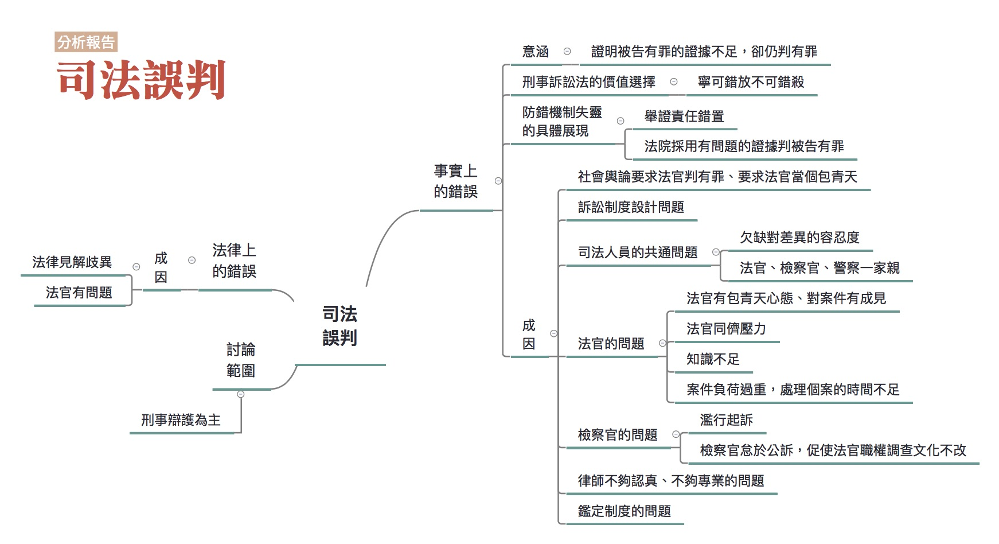

## 司法誤判

### 彙整人：林瑋婷

### 彙整範圍：

* 林俊宏成因分析報告
* 現職警察口述成因分析記錄(報告人：林瑋婷。記錄人：廖禾安)
* 0628全民司改運動第二階段籌備會議討論
* 0709評估會議

### 司法問題：

[司法誤判造成當事人二度傷害](http://talk.justice.care/t/20)

對司法來說，作出妥當正確的判斷是非常重要的事情。但是這件事就像遙不可及的夢想。部分案件當事人會覺得法官的裁判、檢察官的起訴或不起訴等等弄錯了事實、誤用了法條，遇到事情要上法庭已經夠倒楣了，還遇到誤判更是造成當事人二度傷害。 

例如東海之狼性侵案，紀富仁被警方懷疑涉案，就被踩下體逼著自白，又被逼著下跪跟被害人求婚，檢方並將他起訴求處死刑。後來在紀富仁被羈押的期間，又有一件性侵案發生，DNA鑑定的結果和東海之狼性侵案嫌犯的DNA一致，才發現搞錯人了，真犯人是一位海巡士官長。

### 網路意見：

@102

如何認定誤判！？這應該是整個司法程序應更加嚴謹的問題，且各個學派見解各異，採不同見解自然有不同結果，誤判概念似乎難以適用，或許將證據能力的判斷標準更嚴格化會較有實益。

### 分析範圍：

刑事案件為主。

### 利害關係人：

法官、檢察官、律師、被告

### 相關法律：

刑事訴訟法

### 相關議題：

舉證責任、無罪推定、供述證據、科學證據

### 分析依據：

個人實務經驗

### 分析結果：

在討論司法誤判之前，必須要先認清一個殘忍的現實，司法誤判是司法制度必然發生的一環。因為審判者是人，不是神，人沒有全能全知的能力，無法回到過去，人會被誤導，會有偏見，人會犯錯，所以審判者當然會犯錯，因此只要司法審判是人在審判，誤判這件事，就永遠不可能消失。

因此，為了把誤判的風險降到最低，所以制度上做了各種設計，以防止錯誤的發生，而我們刑事訴訟法制的設計，本質上就是依據這個思考脈絡，所衍生出的一種防錯機制。然而，當防錯機制失效或無作用的時候，就會有錯誤的發生，誤判就會出現。

誤判的發生，用最簡化的分法，大概可以分為法律上的錯誤及事實上的錯誤。因為判決主要是由事實和法律所構成，因此，如果有誤判發生，要不就是事實搞錯了，要不就是法律弄錯了。

#### 法律上的錯誤

法律弄錯了這點，有可能是法律見解歧異的問題，除此之外，應該是比較單純的，大概就是法官用錯了法條，或是法條不該用而用，主要問題應該會出在法官本身。

#### 事實上的錯誤

為什麼事實會弄錯？

##### 事實弄錯的意涵

在這邊要先說明的是法院要如何認定事實？我想大家都清楚，法院是依據證據認定事實。如果證據與認定的事實對不起來，就是「事實弄錯了」。事實弄錯了，在邏輯上可能有「有罪證據充足，但認定為無罪」、「有罪證據不足，但認定有罪」、「無罪證據充足，但認定有罪」，以及「無罪證據不足，但認定無罪」，在這裡我們選擇切入探討事實弄錯的角度是「有罪證據不足，但認定有罪」。為什麼如此選擇，首先是因為這個角度是刑事訴訟法整個防錯設計的最在意的情形。也就是說如果證據無法證明的，即便被告是真的行為人，法院也不能判決有罪。此外，「有罪證據不足，但認定有罪」的相關防錯機制，也涵蓋更嚴重的錯誤情形，也就是「無罪證據充足，但認定有罪」的情形。

而「有罪證據充足，但認定為無罪」也構成誤判，但是並非刑事訴訟法防錯的核心，待之後有時間心力時再處理。

至於「無罪證據不足，但認定無罪」，其實在刑事訴訟法上是說不通的，更極端地來說，這種情形在刑事訴訟法上不能被視為誤判，因為這涉及刑事訴訟法上的舉證責任設定，以及背後的價值選擇。而這正是我們接下來要說明的。

##### 刑事訴訟法的價值選擇

再談「有罪證據不足，但認定有罪」是刑事訴訟法防錯機制的核心，以及乍看很奇怪的「無罪證據不足，但認定無罪」不是刑事訴訟法上的誤判，要先建立舉證責任的觀念。

舉證責任就是事實無法被確認的時候，該由何人來負責？如果是要求檢察官負舉證責任，就表示事實無法被證明的時候，應該由檢察官負責，所以法院應該下一個與檢察官主張相反的認定，認為檢察官所主張的事實不存在。相反的，如果是要求被告對於事實無法被證明這件事負責，當事實沒辦法被證明的時候，法院就應該認為被告主張的事實不存在。舉例來說，如果認為檢察官要負責證明A殺了B，就表示說檢察官要對A殺B這件事負舉證責任，如果檢察官無法證明A殺了B，那就要認為根本沒有A殺B這件事。

如果對於舉證責任最基本的原則沒有問題，下個問題是，如何決定要由什麼人來負舉證責任？在現行刑事訴訟制度的架構之下，原則上就是由檢察官對於犯罪事實的存在負舉證責任。所以當檢察官沒辦法提出證據，證明犯罪事實存在時，法院就不能判決被告有罪。這也就是「無罪推定原則」。

此外，舉證責任還有一個部分，必須要說明，就是我們要用什麼樣的標準，來認定事實已經被證明了？也就是說要證明到什麼樣的程度，才能認為負舉證責任的一方已經證明了他應該要證明的事實？

在這邊有一句耳熟能詳但又難以理解的話「超越合理懷疑」或「無合理懷疑」（beyond a reasonable doubt），這是被認為關於檢察官證明犯罪事實存在的程度要求，也就是說，檢察官必須證明犯罪事實存在到無合理懷疑的程度，才能認為檢察官已經證明了犯罪事實，如果檢察官的證明沒有到達這個程度，就不能認為檢察官已經證明犯罪事實存在，法院就不能判決有罪。

這樣的舉證責任安排，大大的墊高了檢察官證明犯罪事實存在的難度，一旦檢察官無法證明犯罪事實存在，或者無法消除法官對於犯罪事實存在的合理懷疑，那麼法院就應該判決無罪。這其實隱含了一個根本的想法，我們「寧可錯放」，也「不可錯殺」。因為，法院判決有罪與否，取決於檢察官的舉證，如果檢察官沒辦法舉證證明，雖然會造成真正的行為人，因為舉證責任這件事，而被判決無罪，但是在這樣的設計下，無罪的人，並不會因為舉證責任的安排，而被判決有罪，所以這樣的設計可以防止錯殺的發生，避免清白的人被誤認為有罪。

談這麼多舉證責任的目的，其實想說的就是，在制度設計時，做了一個價值選擇，選擇了一個以避免錯殺的思考中心為出發點，並且在這個想法之下，決定了檢察官要負責證明一個人有罪，而且為了避免錯殺，而要求檢察官對於犯罪事實的證明，必須到達無合理懷疑的高度門檻。一旦這個設計的基本思考沒有被遵守，那應這個設計所希望的防錯功能就可能會失效或喪失作用。

##### 防錯機制失靈的具體展現

###### 舉證責任錯置

其實要求檢察官負舉證責任這件事，在我們的法院並不是全然被遵守的，甚至我們的法院通常不需要檢察官證明被告有罪，就會先行認定被告有罪，除非被告能夠在審判過程中證明自己無罪，否則被告很難因為檢察官沒辦法證明被告確有犯罪的事實存在，而被判決有罪。也就是說，我們法院其實是反過來要求被告負舉證責任，被告必須證明自己沒有罪，否則法院就會做出一個和被告主張相反的認定，就是認定被告有罪。

這樣的操作結果，正好和前面提到的防止錯殺思考相反，因為，如此一來，勢必會發生清白的人因為欠缺證據，而被法院基於舉證責任的要求，而被認為是有罪的，錯殺的發生，在所難免。

其實這就是第一個防錯機制失效的情形，因為法院根本錯置了舉證責任這件事情，把舉證責任放在被告身上，這也顯示了法院根本上對於「防錯」這件事的錯誤認知，因為防錯的正確思考，應該是防止錯殺，而不是防止錯放，但法院的操作結果卻是防止錯放，思考方向全然相反。

###### 法院採用有問題的證據

在知道證據應該原則上應該要由檢察官提出這點之後，下一個問題是，檢察官所提出的證據，法院一概都要接受嗎？

回到防錯的基本概念，既然要避免錯誤，想當然的，如果證據的使用，會有高度錯誤的風險，那應該就不能用才對。所以，最基本的想法是，證據應該要有最基本的可信性，如果證據的可信性是有問題的，應該就不能允許使用才對。

那接著要談的是，什麼樣的證據是可信的？什麼樣的證據是有問題的？

可以先將證據區分為人的供述和供述以外的證據。

人的供述就是由人將他的親身體驗講出來，讓其他人可以透過他的說明，得知發生了什麼事情。

然而，以一般的經驗來說，人是不可信的，因為人往往會因為其個人利害或者是某些動機，而選擇他所想要提供的訊息。就算是沒有任何利害或是動機，對於相同的事實，每個人也會因為個人對外的觀察能力，或是因為記憶的關係，或是因為陳述能力的不同，而講述出不同的內容。

相對的，人的供述以外的證據，人講的話以外的客觀可以觀察的證據，一般來說，大概就是文書、證物等這類的東西，這些東西因為透過它們本身外在的狀態、形狀及對外的各類表現，來證明到底發生了什麼事，因此，這一類的證據，是一種客觀上存在的外在情狀，因此，除非有一般物理變化、保存不當或遭破壞的情形，否則這類證據所呈現出的事實，應該是比較可信的。

1. 供述證據的採用問題

    因此，在了解了這二種證據的差別後，應該可以很容易得出，如果要證明犯罪事實存在，應該要比較重視非人的供述這類的證據才對。然而，目前法院的運作上，卻是比較依賴人的供述，以人的供述做為認定事實的最主要依據。

    供述證據雖然比較不可信，但也不是全然不可接受。但是前提是要解決供述者動機、利害及其觀察、記憶、陳述等能力的問題，才能說供述是可以相信的。但是目前法院往往在沒有解決這些問題的情形下，就採用了供述證據

2. 非供述證據的採用問題

    相對於人的供述，供述以外的證據因為是以其呈現外在的狀況來證明事實，因此，若供述以外的證據，沒有發生任何會造成其外在狀況發生變化或者保存上發生問題，否則應該是非常可信的。

    但不幸的是，如果非供述證據不具備合理採用條件，其實它也不見得是可信的。首先，如果有現場保及證物全粗糙的問題，那非供述證物就會有變化、消失的可能。再來，一些非供述證據會涉及使用專業知識來解讀，例如指紋、DNA鑑定等等，如果專業知識的解讀過程出問題，那自然非供述證據也就不可靠了。

    可惜的是，由於我們對於供述以外證據的偏廢，對於非供述證據的合理採用條件為何，也就不夠重視。搭配舉證責任的錯置，結果就是只要是可以用來證明被告有罪的，都是好證據。

##### 防錯機制失靈的各種成因：

至於為何會發生防錯機制失靈，以致誤判被告有罪的情形，可能的成因有以下幾種：

###### 社會面的問題：

社會輿論要求對被告採取有罪推定的作法，會對法官產生壓力，讓法官也採取有罪推定。這在性侵害案件特別容易出現。

另外，人民往往期待刑庭的法官，是伸張人民心目中所期待正義的包青天，自己要發現真實查到底。這不僅影響個別法官的心態，也影響我國訴訟制度的設計。訴訟制度設計有兩種思維，一種是包青天思維，希望法官自己要發現真實，一種是現代刑事訴訟制度的思維，希望法官是程序操作者，聽檢察官、被告兩邊的主張，之後決定輸贏。兩種思維在制度設計中彼此糾葛矛盾。

###### 訴訟制度設計的問題：

訴訟制度設計不佳會容易讓舉證責任錯置，法官難以遵守無罪推定、有罪心證門檻降低。

1. 容易形成定錯效應的制度設計：

    多種制度設計不佳中，以會形成「定錨效應」的作法，特別要注意。定錨效應的意思是，如果你在判斷一個事情之前，你對著這個事情已經有太多訊息的時候，很容易你會形成一個預先的想法，這個想法一旦形成之後，要再移動你的想法很難，非常難。

    首先，在台灣，檢察官起訴後，就會將證明被告有罪的卷證資料送交法院，法官可能就先看了檢察官的資料，在還沒看到被告本人以及被告的答辯之前，就形成了對被告的某些想法。

    再來，目前在台灣，檢察官起訴被告的證據，裡面可能有些證據是有瑕疵的，根本不應該給要作判決的法官看到，但是法官都看到了。例如被告主張警局筆錄是刑求而來的，依照刑事訴訟法第156條應該不能夠提出來做證據的，法官會先審查是不是確實有這件事，確認有這件事後，再說這個證據不能用。但是這個「不能用」的證據法官早就看過了，心證也就受到了汙染。

    最後，法院卷證資料中的前科記錄本身，或是關連於特定起訴罪名(例如毒品罪)本身的司法直覺，也可能就讓法官一開始就對被告形成不好的印象。

2. 架空交互詰問的制度設計

    台灣的刑事訴訟法中傳聞法則的設計，有架空交互詰問制度的可能，是個嚴重的問題。傳聞法則就是指法庭外的證人證詞，原則上不能用來當作判被告有罪的證據，但是在哪些例外的狀況下可以使用。為何在法庭外證人的證詞，原則上不能使用，是因為證人在法庭上要經過「交互詰問」這個程序，考驗他證詞的可信度。如果沒有經過交互詰問，證人證詞的可信性根本難以確認，為了避免誤判，所以原則上應該要排除。

    但是我們的刑事訴訟制度，在很多設計上，卻打破了這樣的基本想法，讓許多沒有經過交互詰問的證據，可能直接用來判決被告有罪。目前刑事訴訟法的設計想法，非常可笑，對於證人說的話是不是可以相信？是不是可以用來判決被告有罪？主要是取決於證人在什麼人面前說話，我們的刑事訴訟法相信，人在官越大的人面前說的話，越值得相信，所以，基本上是以聽話者的身分地位，來決定講話的人說的話能不能信。這樣的邏輯和設計，和之前提到的防止錯判的基本想法，完全搭不上線，完全沒辦法達到我們的目的需求，甚至於使我們喪失好好檢驗證據的機會，反而造成使用了錯誤證據，而發生錯殺的結果。

3. 法官自由心證欠缺明確的依循法則：

    在台灣法官的心證可以說不必依循任何明確的法則。在此情形下，所謂超越合理懷疑才能判有罪的心證門檻，根本不需要什麼說明來支持，這樣的心證門檻設計也就容易淪為純粹的宣示意義了。

    與這台灣證據法則的規範相當簡略甚至可能有問題有關。證據法則指的就是判斷哪些證據可以納入作為判決的基礎，而又該怎麼衡量證據可信度高低的法則。前面所提到的傳聞法則就是有問題的證據法則之一。另外一個有問題的例子就是，違法取得的證據可以權衡後使用為判被告有罪的證據。關於如何權衡只有講說要「審酌人權保障及公共利益之均衡維護」，有講等於沒講，只是開了一個大門讓法官可以想用怎樣的證據就用怎樣的證據。

    另外，前面提到關於非供述證據的解讀，也需要搭配完整的證據法則，然而目前法院對於這些非供述證據的專業解讀並沒有形成一套有效的管控方式。相反的，依據刑事訴訟法的規定，反正只要是法院或檢察官所委託的人，這些專業的解讀就可以在法院上使用，就可以用來斷人死生。依目前法院的運作結果，這些專業上的解讀，我們不太需要探究這些幫助法院解讀專業訊息的人，是否真的擁有足夠的專業能力？也不太需要判斷解讀的程序是否完整？是否可能未依照一定的標準流程，而出現解讀上的錯誤？甚至也不太考慮解讀是否有出錯的可能？其實更誇張的部分是，法院甚至不考慮有些所謂的「專業」是否真的是一種「專業」？所謂的「科學」是否是一種真的「科學」？

###### 司法人員共通的問題

光訴訟制度計設不佳，也不一定會使得刑事訴訟法的防錯機制失靈。防錯機制失靈，更重要的是制度中人出了狀況。司法人員不見得懂一般民眾的生活是什麼，對於事實的判斷與了解可能就會出問題。雖然司法人員不一定要經歷那樣的生活，可是確實需要有一些差異的觀點可以被放到訓練裡面，要有一個最低限度的差異容忍度。

另外，法官、檢察官、警察一家親也是個問題。有些法官、檢察官信賴偏袒警察機構，不太去處理警察違法取得證據的問題，例如不積極處理被告的刑求抗辯。

###### 法官的問題：

法官的一些問題，也使得刑事訴訟法的防錯機制失靈：

1. 基本心態出問題

    部分法官本身有包青天心態，不把自己當成中立的審判者，待檢察官舉證讓自己形成有罪心證才作出有罪判決。在包青天心態的情形下，法官覺得自己應該兼具審判者和調查者兩種角色，主持社會正義，挖掘事情的真相。不過麻煩的是，包青天心態在實際的運作上，容易變成法官採取有罪推定，積極調查對被告不利的證據，以定被告的罪，讓刑事訴訟法的防錯機制被架空。

    另外，部分法官對案件本身有成見，不管兩造怎麼辯，他心中早就決定就是要這樣判。有些法官在找鑑定人時，也會有這樣的情形，他會去找一個會講他要的答案的人。在這樣的情形，防錯機制也容易成空。

2. 法官同儕壓力

    法官同儕團體有傾向判有罪的同儕壓力，如果要判無罪，必須幫被告找很多無罪的理由。這部分的討論可以參考「法官檢察官案件量負擔大，辦案品質受影響」。

3. 案件負荷過重，處理個案的時間不足

    法官案件負荷過重，處理個案的時間不足，在制度設計、心態、同儕壓力相配合的情形下，傾向採取對他來說較為輕鬆的有罪判決。這部分的討論可以參考「法官檢察官案件量負擔大，辦案品質受影響」。

4. 知識不足

    法官對供述及非供述證據的不當採用，有時是與法官知識不足有關。目前一些法醫、鑑識相關的科學對於非供述證據的解讀，已經逐漸為法界所知，例如DNA、指紋等等，但這些科學解讀在哪個環節可能出錯，法官不見得懂。因此當專家或自稱專家的人解讀錯誤時，法官不見得知道，甚至可能照單全收。

    另外一些比較偏向社會科學或行為科學相關的專業，是有助於法官判斷案件狀況的，但是法官不知道可以去請教相關的專家，或不覺得需要。例如目前關於供述證據有司法心理學的研究可以提供關於自白、證人證詞何時是不可信的知識，法官可能不知道。涉及原住民的案件可能需要有了解原住民的專家，涉及精神病患的案件，可能需要精神醫學的專家出庭，但是法官不見得知道請這些專家出庭的重要性。

###### 檢察官的問題：

1. 濫行起訴

    刑事訴訟法上，主要的防錯機制是設在法官身上，但是檢察官其實也有「有利不利一律注意」的義務。但是部分檢察官會有濫行起訴的情形，沒有作好誤判的把關，相關討論可以參考「法官檢察官案件量負擔大，辦案品質受影響」。

2. 怠於公訴

    部分檢察官有怠於公訴的情形，也就是不好好舉證並說明被告為何應該有罪。這件事情很弔詭，乍看之下「怠於公訴」應該不會促使被告錯誤地被判有罪才對，甚至可以說「怠於公訴」正好使被告容易獲得無罪才對。但是這樣的情形在搭配法官包青天心態時，會促成法官調查的文化一直不改，結果反而容易使得法官採取有罪推定的心態。

    也就是說如果是單純的「怠於公訴」，這會促成的誤判類型會是「證據充足，但被告被判無罪」。但是如果搭配法官的包青天心態，它就會轉化為防止被告被誤判有罪的機制失靈的搭配性要素。

3. 偵查與公訴不同檢察官

    目前台灣一個案件負責犯罪偵查的檢察官，和起訴後負責到法院出庭的檢察官，是不同人。這樣的分工會導致明明有一個非常熟悉案情的檢察官，不負責出庭舉證並說明為何被告有罪，卻可能由一個不那麼熟悉案情的檢察官來做這事件。這樣的狀況可以由偵查檢察官與公訴檢察官之間的充分溝通來解決，但目前的協調機制是不夠的。如同前面怠於公訴的情形，原則上這會促成的誤判類型會是「證據充足，但被告被判無罪」。但是如果搭配法官的包青天心態，它就會轉化為防止被告被誤判有罪的機制失靈的搭配性要素。

###### 律師的問題：

因為法律程序涉及了高度的法律專業事項，因此一般人通常沒有足夠的能力及智識可以獨自進行相關的程序，因此，為能確保程序的進行是確實符合所來制度所設計規劃的方向運行，也就必須有具備足夠法律專業背景的人，來協助被告。而律師就是負責這樣角色的人，所以律師必須要夠稱職，才能夠確保被告的權利，如果律師的專業能力不足、或是不認真等等的因素，而無法提供實質而有效的協助給當事人，這樣一來，自然就無從確保當事人的權利，也無法避免錯誤的發生。事實上，有許多錯判的情形，確實也是因為律師沒辦法提供實質有效的協助所造成。

律師的專業能力不足，背後涉及的成因則可能包括教育訓練的不足，以及不好的律師欠缺淘汰機制。

###### 警察的問題：

在發現犯罪現場的時候，現場保存、證據處理、蒐證，都是由警方進行。如果警方沒有處理現場證據保存的實務知識，很可能就會破壞現場的證據，導致冤案發生。在鄭性澤案中，現場槍枝位置遭到警方破壞，被認為是造成冤案的原因之一。根據司改會在警方執法一題的分析，只有較專業的刑案警察才有相關知識，許多派出所的第一線員警並不清楚如何保存現場。

除了犯罪現場的保存，證據的收藏也是很重要的問題，比如指紋需要保存於低溫，但目前並沒有專業的證物庫房，證據的收藏品質不佳，甚至在一些案件中還有證據遺失的狀況。

另外，當事人的筆錄也是很重要的證物，因此若是警方在詢問筆錄的時候使用了不當的手法，就可能會引致後續判決出現問題。

###### 鑑定制度的問題：

鑑定制度，在此泛指各種涉及以專業知識保全、處理，以及解讀證據的相關制度。鑑定制度的問題，比較在刑事訴訟法本身的防錯機制失靈的情形下，使得狀況更為惡化的搭配性要素。因為嚴格講起來，如果訴訟制度設計良好，法官也確實遵守的話，有問題的證據本來就應該在訴訟過程中被發現而且不會被採用。只可惜，現狀並不是如此。

在這樣的情形下，鑑定制度出問題，也會促使誤判的產生。而鑑定制度的問題例示如下：

1. 沒有真正建立起證物保管流程

    如同前面所提到的，警察的現場及證物保全有過於粗糙的問題，這部分的問題除了第一線的警察不見得具備相關知識之外，也與鑑識、司法相關單位沒有真正建立起證物的保管流程有關。舉例來說，假設檢察官在法院提出了一把刀，並指出那把刀是被告所使用的兇刀，但是我們根本沒有任何一套方法，可以確認或追朔那把刀是從被告家中或犯罪現場所取得，我們也無法得知取得後的保管過程中究竟是由哪些人接續持有保管？過程中有沒有可能被汙染？有沒有人也接觸過那把刀？有沒有可能被掉包？

2. 鑑定欠缺標準作業程序

    部分鑑定專業沒有一個標準。例如車禍鑑定委員會裡面有很多不同類型的專家，有修車的、有交通管理的、有交大的教授、有警大的教授，可是每個人見解其實是不一樣的。有時候五個委員判出來的見解跟另外五個委員的見解是完全不一樣，其中有些是很離譜的偏離專業的解釋。也就是說要訂定標準作業程序，才能去檢驗哪些人說的話可信或不可信。

3. 鑑定或專家證人不專業

    一些進入法庭鑑定報告或是專家證人的意見可能有不專業的問題。如果法官不知道，就這樣採為有罪基礎時，就容易發生誤判。

4. 官方的鑑定機關偏向配合自己人

    目前主要的鑑定機關都在官方，即調查局、刑事局、法醫研究所，而官方的鑑定機關可能有偏向合配自己人的問題。例如學長辦案，學弟做鑑識，這個意思就是樓下在查案，樓上在作鑑識，學長辦案有瑕疵，學弟做鑑識可能有不敢指出學長辦案瑕疵的情形。有一些案件裡面也有鑑定機關疑似配合法院定罪需求的情形，比如說徐案、蘇案，都疑似有這樣的情形。
