# 前言

如果台灣的民主需要百年來追求，法治的成熟，更企求時空與人心的交互淬鍊，才能沉澱成為文化的底蘊。抱持著恨鐵不成鋼的初衷，我們投身司法議題已經21年，透過倡議、社會運動、培育人才，在司法議題上不斷發聲，一路走來，始終堅持司法改革要由下而上，人民才是司法改革的主角！

於是，我們決定要推動「全民司改運動」——人民的司法，人民來改革！

從去年底對總統候選人的呼籲，到今年五二○就職演說，蔡英文總統承諾召開司法國是會議，人民的聲浪，終於讓官方開始積極有所行動。我們更是未敢懈怠，年初多場規劃會議，4月網站上線，5月單車環島。6、7月第二階段的「司法問題成因分析」，為10月的第三階段開始暖身。

一點一滴累積下來的成果，讓我們對於這種「人民參與、多元對話、資訊透明、溝通共識、深化法治」的「運動方式」，越來越具有信心。

2016年是一個關鍵的時機，當下的台灣，正進入脫胎換骨的關頭。

我們對司法有一個夢，對台灣的法治有一個期待。期待我們在介紹台灣時，除了民主的成就與經濟的奇蹟，更能有充滿榮譽感的法治司法。

  
財團法人民間司法改革基金會 
  董事長 林永頌 
  執行長 高榮志 
  副執行長 陳雨凡 
  暨秘書處全體同仁 
  敬上

==========

# 流程說明

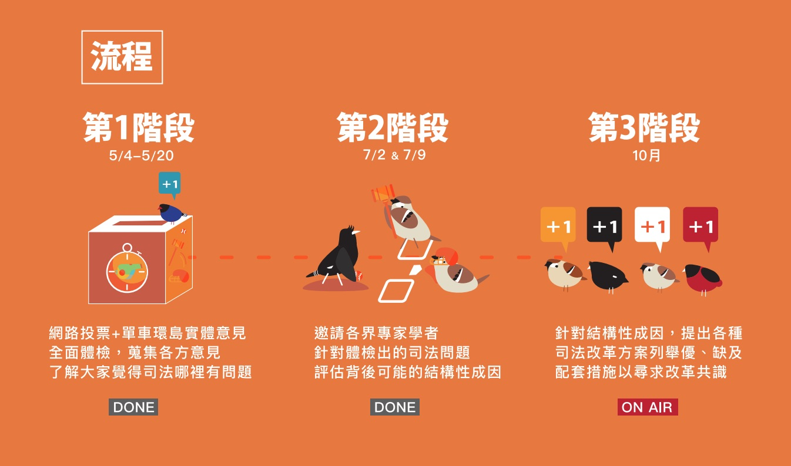

==========

## 第一階段：蒐集問題

要追求頭好壯壯的健康司法，首先就是要「找出問題」，才有辦法往下分析成因，最後找出訓練、強化司法體質的方法。

「司法哪裡有問題呢？」每個人都有不同的想法。一般民眾、法官、檢察官的想法互有差異是很正常的。出過庭的民眾，跟沒有使用過司法的民眾，感覺也會不同。這個階段正是要蒐集不同的人，從不同角度，不同經歷所感受到司法的問題。

此階段蒐集到的問題必定相當多元，並且每個人提出的問題可能會有相互重覆的部分，為了讓蒐集到的問題可以有相當程度的收斂，我們先由民間司改會的申訴中心整理了這幾年當事人最常抱怨的司法問題，供民眾投票。除了這些預先整理的司法問題可供票選之外，民眾也可提出更多的新問題，並且新提出的問題也會成為新的投票項目。

我們使用Discourse開源論壇系統架設論壇，民眾註冊登入後即可留言，論壇版主會與留言者溝通確認其想法，將留言整理成較簡短精準的「一句話」，並避免與已有的問題重覆，新問題在留言者與版主確認後，就會被放入投票項目中。

投票與蒐集問題的時間從平台5/4上線開始，到5/20為一個階段。第二階段的「分析成因」即以此階段蒐集到的問題為優先處理對象。目前第一階段問題列表如下， **其中前12項司法問題已作成分析成因報告**。

第一階段司法問題列表（因平台為即時投票，故票數可能變動）：

1. 偵查中的不當報導，造成輿論公審（票數1363）
2. 媒體未確實查證做出錯誤報導，傷害司法與當事人（票數1359）
3. 受刑人出獄後謀生困難，再犯率高（票數1131）
4. 民眾不熟悉司法運作實務，對司法運作方式產生誤解（票數1124）
5. 弱勢族群在司法中需要更多協助（票數1085）
6. 法官檢察官案件量負擔大，辦案品質受影響（票數1043）
7. 缺乏明確客觀審查標準以淘汰真正不適任的司法官（票數872）
8. 遇到官司民眾常不知該怎麼辦（票數866）
9. 有些警察是執法人員自己卻不守法（票數841）
10. 司法誤判造成當事人二度傷害（票數808）
11. 法學教育培養出只會考試的法律人（票數747）
12. 有些法律不正當，也有些最高法院判例決議與社會脫節（票數728）
13. 官司拖太久，打官司也要花很多錢（票數702）
14. 司法單位應加強與人民溝通，增進透明度（票數684）
15. 被害人的權益不被司法重視（票數675）
16. 檢察官的起訴書、不起訴書等文件，應該公開（票數588）
17. 有些法官檢察官開庭態度不佳 票數：554
18. 司法程序不嚴謹，侵害當事人權益 票數：548
19. 有些法院判決與一般大眾的期待有落差 票數：449
20. 應加強大法官釋憲的效率 票數：390
21. 死刑確定後，應保障合理的上訴、救濟期間 票數：372
22. 應全面檢討毒品政策，以妥善處理毒品犯罪問題 票數：313
23. 法律文書應盡量使用清楚易懂的格式與書寫方式 票數：302
24. 應全面檢討威權獨裁時期的司法官、判決與不當作為 票數：257
25. 有些律師拿錢卻沒好好辦事 票數：253
26. 部分司法案件配合政治辦案 票數：251
27. 部分鑑識人員職業素養不足，間接造成誤判或冤獄 票數：121
28. 應說明司法程序中揭露的當事人隱私資料目的為何 票數：64
29. 法官、檢察官應有管道要求檢討不適當法律 票數：20
30. 獄政管理必須透明化，並建立第三方監督機制 票數：19

==========

## 第二階段：分析成因

在完成第一階段的問題蒐集後，接著進行「成因分析」。此階段目標是分析司法問題背後可能的「成因」。

要了解人們感受到的司法問題，背後可能的成因，無法只靠一般民眾的感受，需要各領域的專家來協助。專家組成包括，審、檢、辯、法學及非法學的學者、民間團體代表。而為避免法律專業人士過度專業化的討論，製造參與的門檻，也為了避免法律專業人士陷入自己的專業盲點，協助作成因分析的專家，非法律背景者超過全體與會者的半數。並且，會議也邀請積極參與網路討論，持續發表高品質言論的民眾來參與。

為讓成因評估會議有效率的進行，我們組成工作小組事先整理論壇中網友的討論意見，並邀請有意願協助的專家撰寫或以訪談專家的方式產出分析報告的初稿，每份分析報告再整理成心智圖以利參與者快速了解報告的內容。報告初稿完成後送評估會議討論，在評估會議前資料會先提供給與會者參考，並預先公開在全民司改運動網站上。

### 工作小組

#### 成員

主要是司改會對於全民司改運動相關議題有參與意願的成員。我們會公佈成因分析報告人的姓名和簡單介紹，以及歷次會議參與者的姓名與簡介，以受公開檢視。不過因為有些司法問題的分析，必須是利害關係人才會知道真正的情況，在這種情況下，我們會去訪問利害關係人，但不會公開他們是誰，因為一旦公開很可能會對他們造成傷害，例如現職的警察提供關於警察不法的觀察意見。

#### 運作方式

我們會先請熟悉或對某些司法問題有興趣者認領題目，認領者可以用自行撰寫或口述由他人記錄的方式，進行成因分析。不過由於民間團體的能量有限，可能不見得能分析完民眾所提的所有司法問題，因此我們會從民眾票選數最高的司法問題逐步往下做。

在工作小組聚會前，會先將成因分析的初步意見放置於討論區，並將初步意見送交評估會議所邀請的專家，請專家提供意見。聚會除了工作小組成員參與之外，也會邀請評估會議的專家在時間允許的情況下一起參與討論。聚會後，我們也會將會議的影音資料及會議記錄上網。如果民眾對於工作小組所試擬的成因分析有想法或不同意見，也歡迎民眾線上留言參與，我們也會將線上的留言納入討論。

#### 7/2評估會議與會者

* NGO
  * 吳靜如／台灣國際勞工協會政策部研究員
  * 李佩雯／婦女新知基金會常務董事
  * 林永頌／民間司法改革基金會董事長
* 原住民代表
  * 洪簡廷卉／法律扶助基金會董事
* 法官
  * 陳欽賢／台南地方法院法官
* 檢察官
  * 白忠志／新北地方法院檢察署主任檢察官
* 律師
  * 吳信賢／中華民國律師公會全國聯合會理事
* 犯罪被害人
  * 林作逸／新北市中和國民小學教師
* 學者
  * 蔡博方／台北醫學大學醫學人文研究所助理教授
* 媒體
  * 曾柏文／Initium Media端傳媒　評論總監
* 人權教育作家
  * 翁麗淑／新北市蘆洲區鷺江國民小學教師
* 網友
  * Bill_Tsai

#### 7/9評估會議與會者

* NGO
  * 陳素香／台灣國際勞工協會理事長
  * 邱伊翎／台灣人權促進會秘書長
  * 陳惠敏／監所關注小組成員
  * 林永頌／民間司法改革基金會董事長
  * 吳宗哲／台灣警察工作權益推動協會常務理事
* 原住民代表
  * 陳以箴／原民會平埔聚落活力計畫專案執行
* 法官
  * 錢建榮／台灣桃園地方法院法官
* 檢察官
  * 白忠志／新北地方法院檢察署主任檢察官
* 律師
  * 黃致豪／執業律師、台大心理研究所博士生
* 警員
  * 石明謹／萬華分局交通分隊警員、足球達人
* 犯罪被害人
  * 林作逸／新北市中和國民小學教師
* 媒體
  * 吳東牧／公視新聞議題中心製作人
* 網友
  * Bill_Tsai

### 問題分析報告範例說明

為讓成因評估會議有效率的進行，我們組成工作小組事先整理論壇中網友的討論意見，並邀請有意願協助的專家撰寫或以訪談專家的方式產出分析報告的初稿，每份分析報告再整理成心智圖以利參與者快速了解報告的內容，在評估會議前資料會先提供給與會者參考，並預先公開在全民司改運動網站上。

#### 司法問題

放第一階段「司法哪裡有問題」的一句話及其說明。

#### 報告人
ＯＯＯ

#### 網路意見

討論區中原本板主就已經有把某些內容較豐富的留言highlight起來，這些留言必須要放到此處。
討論區中板主沒有highlight的留言，報告人可挑選自己覺得想放想討論的。

#### 分析範圍

由於可能將不同問題分拆成不同部分由不同人負責寫報告，所以要說明一下本報告針對前面所列的司法問題，分析範圍到底為何。

#### 利害關係人

列出此司法問題可能影響的人。

#### 相關法律

列出此司法問題可能相關的法律，以利修法參考。因為第三階段解法的討論可能會用到。

#### 相關議題

列出此司法問題所涉及的相關議題，列出來的話可以由此去查更多的相關討論，可能是成因或解法。
分析依據

為了讓讀者了解報告人作成的成因分析是否有依據、是否可靠，因此請報告人盡量列出自己作成因分析的依據。

#### 成因分析報告怎麼寫

##### 為什麼要將司法改革要怎麼做，拆分成三階段來探討？

全民司改運動分成三階段，本階段（第二階段）要做的是「成因分析」。為了讓報告人更精確地掌握成因分析要談的是什麼，因此需要說明一下，為何要分三階段。法界在談司法改革時，常常是直接提倡「解決方法」，而忽略「為什麼要這樣改」、「到底這樣改是為了解決什麼問題」。或許這些要解決的「問題」對於法律專業人士來說很理所當然，但是對於一般民眾來說，卻不見得如此。

而一般民眾可能可以感受到他覺得司法怪怪的、不太對的問題，但卻不見得能精確掌握這種怪怪的感覺，到底涉及的是哪些結構性問題。此外，民眾也可能很快地提出某些解決方法，但這個解決方法卻不見得真的解決他感覺怪怪的地方。

無論是法界或是一般民眾，在探討司法改革時，如果沒有清楚地意識到有這三個階段：感受到的問題（第一階段）、分析感受到的問題所涉及的各種成因（第二階段）、對應著問題成因的解決方法（第三階段），就可能提出不合宜的解決方法，或是為了支持或反對某個教條而爭論。

在第二階段，精確來說又可以分成兩個步驟。第一步是重新詮釋第一階段的感受性問題，或許可稱為「審題」。因為感受性問題不精確，也可能問錯方向，不見得能直接從感受性問題展開分析。第二步才是真正的成因分析，也就是將審題之後的司法問題，拆解成不同部分，說明問題成因何在。

第二階段是承接第一階段，走向第三階段的重要關鍵。特別是走向第三階段的重要性往往會被法律人所忽略。法律人習慣直接提出解決方法，如果解決方法沒辦法發揮預期的效果時，就傾向認為是個人決心不夠或政府無能。但是如果在第二階段看到問題其實是鑲嵌在怎樣的網絡中，或許就可以注意到，某些解決方法之所以沒有發揮預期的效果，其實是因為司法本身就是有限的，而效果的發揮需要其他要素的搭配。正視司法的有限性與脈絡性，把這些東西說清楚，說不定反而更能提出對症的解決方法。

##### 審題

在第一階段蒐集的司法問題，很多時候是人們對於司法的素樸感受，不見得精確，為了讓討論繼續下去，因此針對「問題」本身進行討論是必要的。而在「審題」的過程中，問題分析者所定義的問題，很可能跟原本提問者的意思就不一樣了。為了讓參與第一階段的提問者能明確指出第二階段的問題分析者所界定的問題，與他的理解有落差，必須要將「審題」的過程明確化。

##### 針對審題後的問題，進行成因分析

成因分析隨著不同報告人的能力和切入角度，無論是內容或是探討的深度都有可能有很大的不同。沒有硬性規定，但是希望報告人在分析時可以想一下可能涉及的解法，這會有助於進入第三階段的討論。如果要簡單列一下解法也可以（但非本階段討論的重點）。

##### 專有名詞的處理

在第二階段分析的過程中，開始會陸續出現法律專有名詞，非法律背景者可能會看不懂。要請問題分析者有意識地注意到這種情形，遇到重要的專有名詞，覺得非法律背景者可能會看不懂，要簡單說明一下，或是附上名詞解釋的連結，讓不懂的人可以點進去看。

##### 不知道的部分，也請寫說不知道

人的能力有限，如果報告人有部分的問題所涉及的成因不了解的話，請說不知道。特別是很多法官檢察官的內部狀況像是收錢、裙帶關係或潛規則，不是圈內人不了解或容易弄錯的話，請說明自己並不清楚，或是相關的情形是從哪些現象間接推測得知的。

### 成因分析評估會議

成因分析會議分別於7/2及7/9召開。會議為實體會議，同時以YouTube進行網路直播及即時文播，工作人員會與觀看直播的網友在線上持續互動，網友可在直播頻道中的聊天室留言提出問題，工作人員再將網友的提問轉知現場主持人，主持人再於會議現場協助回應。而會議錄影、發言逐字稿等資料在會議結束後公開上網。

==========

# 分析報告

==========

## 媒體與司法

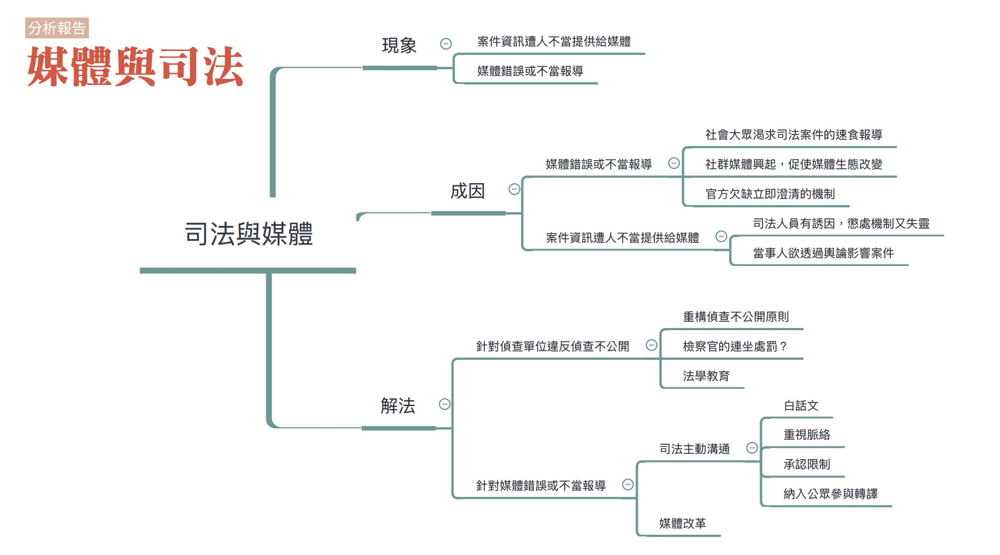

### 報告彙整人：林瑋婷

### 彙整資料範圍：

* 高涌誠與曾柏文口述成因分析記錄(記錄人：黃子潔)
* 0614全民司改運動第二階段籌備會議討論
* 0702評估會議

### 司法問題：

[偵查中的不當報導，造成輿論公審](http://talk.justice.care/t/%E5%81%B5%E6%9F%A5%E4%B8%AD%E7%9A%84%E4%B8%8D%E7%95%B6%E5%A0%B1%E5%B0%8E%EF%BC%8C%E9%80%A0%E6%88%90%E8%BC%BF%E8%AB%96%E5%85%AC%E5%AF%A9/28)

根據偵查不公開的原則，檢察官、警察偵辦的案件內容不該對外公開。但只要發生重大刑案，這個原則好像就自動失效，媒體大肆報導案件細節，甚至捕風捉影描述作案情境。激憤的觀眾於是上網辱罵，甚至到警局想要毆打嫌犯。在案情還不明朗，甚至許多細節遭扭曲的情形下，就形成輿論公審的情勢。

[媒體未確實查證做出錯誤報導，傷害司法與當事人](http://talk.justice.care/t/%E5%AA%92%E9%AB%94%E4%B8%A6%E6%9C%AA%E7%A2%BA%E5%AF%A6%E6%9F%A5%E8%AD%89%EF%BC%8C%E5%81%9A%E5%87%BA%E9%8C%AF%E8%AA%A4%E5%A0%B1%E5%B0%8E%EF%BC%8C%E5%82%B7%E5%AE%B3%E5%8F%B8%E6%B3%95%E8%88%87%E7%95%B6%E4%BA%8B%E4%BA%BA%E3%80%82/48/3)

大眾傳播媒體為非當事人得悉案情的管道，但許多記者朋友並不具法律專業背景，亦未詢問律師或承辦院、檢，其報導往往失去衡平或引人錯誤等，值得檢討。司法行政部門有無適時澄清誤會，也應檢討。

### 網友意見：

針對司法問題「媒體未確實查證做出錯誤報導，傷害司法與當事人」的網友意見

@notbymight

體諒一篇報導製作的艱辛，資料是否百分百正確姑且不論
但背後更艱困的是操控媒體的上司、財團、政治人物，依其所期許的報導他們想要的事實
最艱困的，是普遍不願去查證的人民，也就是我們
我覺得作出錯誤報導並非最可怕，而是普遍大眾因過去自身經驗影響而對於消息無法百分百客觀判斷這件事情，是傷害司法與當事人最恐怖的核心這有賴我們自主地將焦點從自我中心轉移到身邊的人身上
建議從家庭起始，從社區開始動員組織，成立多個家庭小組(同性小組亦可)，以社區的方式推動"探訪關懷、社區教育、資源整合"三大方向作為目標，逐步實踐(資金、聯絡部分可由社區內討論如何統籌)並推行司法教育，拉近司法與人民的距離，自然我們就比較不易用主觀的判斷傷害政府、社會和身邊的人，也能更理解司法和當事人，還有媒體背後需要排解的問題
簡單作個小結：過去我們教育一直強調著孩童制式化教育，擠壓了孩子成長的空間和思想的洞見，或許身為成人的我們應該先自己調整，在自己主動學習且能客觀看待身邊的人時，身邊的環境也將能更好，這不是無法實踐的理想，而是能一步一腳印開拓的現實

### 分析範圍：

「偵查中的不當報導，造成輿論公審」以及「媒體未確實查證做出錯誤報導，傷害司法與當事人」兩題一起分析。

### 利害關係人：

法官、檢察官、警察、媒體、案件當事人、司法院、法務部。

### 相關法律：

刑事訴訟法、偵查不公開作業辦法、廣電三法

### 相關議題：

偵查不公開、社群媒體、社會集體心理、司法透明度、專業主義

### 分析結果：

「偵查中的不當報導，造成輿論公審」原本講的主要是檢警違反偵查不公開原則，媒體將外洩的資訊大肆報導，形成被告勢必有罪的情勢，讓無罪推定原則被架空。而在討論的過程中，參與者逐漸將討論範圍擴大到有人不當洩露或提供案件資訊給媒體的情形，行為人可能是法官、檢察官、調查局、警察、律師、當事人等等。

「媒體未確實查證做出錯誤報導，傷害司法與當事人」講的不僅限於偵查階段案件報導的問題，而涵蓋一切關於司法案件的錯誤或不當報導，而強調的面向不是有人將案件資訊外洩的問題，而是強調媒體報導本身的問題。

前一題討論的重點是案件相關人士不當的資訊散播行為，後一題討論的重點是媒體錯誤或不當報導，兩者雖然不同，但是都涉及了司法與媒體間之關係，所以這兩題放在一起分析。

### 成因

#### 媒體錯誤或不當報導

針對媒體錯誤或不當報導，可能的成因如下：

##### 社會大眾狀況的部分

媒體對司法案件的不當報導其實涉及了社會集體心理的問題，當一個問題發生時，大眾希望有一個解決的方式出來解決這個異常現象，因此媒體呼應這種社會心理，將這個現象或這個犯罪者貼上「他者」的標籤，也就是不屬於我群、令人恐懼的事物。針對這樣的「他者」，媒體和大眾可能就會要求儘快隔離排除，恢復原先的社會秩序。社會大眾有妖魔化異常事件或人物的需求，媒體有創造收視率的需求，兩者相乘就產生惡性循環。

而隨著當代社會變遷，社會集體的焦慮感又更加升高。這是因為當代社會進入了資訊快速流動的時代，網路發達、手機隨時上網記錄各種突發事件、社群媒體興起。知識流動越來越快，人們越來越不知道該往哪裡去，看不到未來，因此這個世代是意義片段化、高焦慮、低安全感的時代。人們對於突發的重大事件會很渴望找到說法，找到說法好像就可以解釋了事情。要安頓焦慮，最好的方式就是妖魔化，標籤化，貼上「他者」的標籤，由此讓這個事情解決掉。媒體也預期到這個問題，因此需要大量的影像，而鄉民想要當英雄，需要刷存在感，種種需求構成這個可以刷存在感的場域。

此外，當代社會還出現了一個重大的變遷，就是專業主義受到質疑。專業主義指的就是一群人對特定領域掌握壟斷性的發言權。但是隨著民主化、資訊流動難以限制，以及專業人士數量膨脹，專業壟斷越來越難維持。過去以「專業」為神主牌阻擋一切的作法已經不可行。也就是說，面對媒體的不當報導，以及社會大眾對於司法的誤解，法律專業人士必須積極溝通回應，否則無法取得社會大眾的信任。

社會大眾希望快速取得某個說明以解消不安，也不可能眼睛一閉把問題交給法律專業人士，這就容易促使媒體以速食的方式去作關於重大司法案件的報導，再搭配上社會大眾的媒體識讀能力不足，也不重視不當報導對當事人的傷害，就更使得媒體不當報導容易被廣為接納。
       
##### 媒體生態的部分

隨著前面提到的社群媒體興起，例如部落格，臉書等等，現在影響民眾的媒體反而可能是大隻鄉民，或取得律師資格的小說家。社群媒體的興起會影響到傳統媒體（指制度性的傳統媒體，例如電視台、報紙，或指由老牌媒體人出身的獨立報導人，強調報導倫理、媒體自律等等價值觀），最直接的影響就是資源的瓜分，廣告收入轉入社群媒體。因此社群媒體雖然促成了知識生產的民主化，也壓縮到傳統媒體的空間，導致無法維持傳統媒體的專業，也越來越難以期待媒體自律。

較仔細地去看傳統媒體的狀況，就可以更了解為什麼它很難抗拒現實壓力，明知是不合理的東西卻仍去報導。傳統媒體的組織運作有它的邏輯，例如看KPI、流量、收視率等，在這樣的情況下當大家一窩蜂在報導的時候，如果它不去報，可能在市場上做不下去。像前陣子端媒體上面胡慕情寫曾文欽的文章，花很久時間調查，文章暴紅，點閱數50幾萬，打趴一堆媒體。可是如果是制度性的媒體，很難做到這樣的事情。甚至有些媒體在這種割喉戰中，刻意激起公憤、妖魔化當事人，蘋果是最聳動的，例如用王景玉翻白眼的照片塑造殺人魔的形象。部分媒體甚至會為了追求點閱數，由小編在新聞下面的留言區留言引導輿論的討論方向，或偽裝網友來引導討論。

##### 官方欠缺立即澄清機制

在專業主義遭到質疑，法律專業人士必須積極溝通回應，否則無法取得社會大眾的信任的社會變遷情勢下，官方對此情勢仍然欠缺認識，並沒有針對不當報導積極設置立即澄清機制。以目前基層檢察官的狀況來說，檢察官投入辦案，其實根本沒有多餘的心力針對案件好好作出澄清。而官方既有的新聞回應機制又容易讓人有說官話，並不是真的想跟社會大眾好好溝通的感覺。以致不當報導流傳，造成當事人或司法的傷害。

#### 案件資訊遭人不當提供給媒體

雖然原本設題討論的是檢警違反偵查不公開的問題，但在討論中被逐漸擴大為案件資訊遭相關人士不當提供給媒體的問題。不當提供包括應保密的資訊外洩，以及故意提供錯誤或扭曲的資訊，而行為人可能是法官、檢察官、律師、調查局、警察或當事人。案件相關人士不當提供案件資訊給媒體，可能的成因如下：

##### 司法人員的問題

首先，警察、調查局調查員、檢察官、法官、律師，都可能有成名的需求。檢察官想升官，就會利用媒體曝光，讓自己的表現可以更被上級看到。有的法官退下來當律師前受訪，以提升自己的知名度，以利接案。部分律師不當地接受採訪，也可能為了提高自己的知名度以吸引客戶。

再來，有些偵查單位害怕不提供案件資訊給媒體，會被媒體用報導來修理。因此也甘冒違反偵查不公開原則，提供偵查中應保密的資訊給媒體。

此外，對於不當外洩案件資訊一事，有些司法人員不太認為是什麼真正嚴重的事，特別是當被外洩的案件當事人被貼上妖魔化的標籤，或是外洩案件資訊被當成辦案手法的一環之時。搭配著經手案件的人眾多，難以確認洩密者是誰，官方針對案件資訊不當外洩的懲處機制就更相應失靈。

除了前面提到的共通問題之外，參與討論者也提到了不同偵查單位的制度性狀況，也構成了不當提供案件資訊給媒體的土壤。

###### 警察生態

除了前面提供的共通問題之外，警察另外受有破案壓力以及績效制度的影響。有些警察也會透過造成媒體輿論、公審，去掩蓋偵查上的問題。早期警方權力更大時，這一套玩得更駕輕就熟，例如逼被告公開認罪之類的。

###### 調查局生態

調查局的問題其實比警察的問題更嚴重，但卻較不受重視。調查局一樣有績效制度的問題，而它掛在法務部底下，但法務部又不太管，檢察官又難以節制調查局調查員，使得問題更形嚴重。

###### 檢察官生態

檢察官除了前面提到的升官動機，有時候檢察官也會用輿論辦案，例如偵查不順利的話，就利用媒體塑造輿論讓他成為一個英雄，結果他本身不符合法定辦案程序的問題就被忽視了，或是透過討好輿論的方式造成媒體公審。

此外，目前台灣的刑事訴訟法的結構，也使得檢察官的權限過大。目前台灣檢察官負有維護治安、控制犯罪之責，有各種調查權限，可以押人再找證據，也可以利用輿論來辦案。相較之下，被告及辯護人那邊則嚴重的資訊不足，而且要調查什麼也得透過檢察官。而如果刑事訴訟法改採完全的當事人主義，檢察官必須先蒐集證據到一定程度後押人直接起訴，如果證據不足亂放話，也會被律師當作訴訟上的攻防點。

#### 當事人

部分有權勢的當事人，特別是政治人物，也可能透過買新聞的方式，來操縱輿論，以影響案件的進行。例如台南地院有某位議長賄選案，當案件發展對議長有利的時候就說政治清明，判決不利就說政治迫害、還我清白。

### 解法

#### 關於違反偵查不公開的問題，要怎麼解決？

為什麼會有偵查不公開原則，是因為採取偵查密行有利於偵查，也有助於保護犯罪嫌疑人名譽。目前行車紀錄器、監視器、警方秘錄器，手機側錄影片等，很多都被新聞報導拿來使用，可能都涉及偵查不公開的範圍。警方拿到這些資料都是不能公開的，例如前陣子很紅的嘶吼姐，不能拿來當笑談。

不過隨著時代變遷，偵查不公開原則本身是否要重構，也成了問題。以前我們假設媒體會配合，會尊重司法專業，但現在連媒體也自身難保。鄉民自己都側錄側拍，即便媒體不透露，輿論已經形成，媒體、鄉民已經定罪了，即使檢察官不公開，隔壁大樓側錄也可能滿天飛，尤其是高指標性的大案子。當代社會專業受質疑、透明性受到重視，司法機構應該思考偵查不公開的核心，以及怎麼更積極的去跟社會對話。而對話也不是指就全部公開，或是就出來講一句「偵查不公開，謝謝指教」，而是要說明現階段檢警所不知道的事、不確定還要查證的事，以及不能說的部分，這反而可能會讓外面的流言少一點。

雖然時代有所變遷，但是檢警在某個時點之前還是有保密義務，至於時點與範圍，則需要再討論。至於要怎麼促使檢警確實遵守偵查不公開的原則，可能的作法如下：

* 教育：告訴檢警為何違反偵查不公開會傷害司法及當事人。

* 檢察官的連坐處罰：不論是哪一個環節出問題，只要有人洩漏，檢察官一併連坐處分，這屬於行政處分上的連坐。不過這個作法有相當的爭議性。如果要採取的話，也必須賦予檢察官更大地節制偵查作為的權限，以符權責。

#### 關於媒體錯誤或不當報導的問題如何解決？

關於媒體錯誤或不當報導的問題，有一部分是要進行媒體改革。媒體改革的可能作法如下：

* 教育：以前司改會跟媒改社有合作過，在17、8年前司改會做過針對新聞記者對法律有初步認識的營隊，希望他擔任司法與社會大眾轉譯的中介人，解釋司法原理，縮小司法與社會大眾質樸正義的落差。現在社群媒體興起，更沒辦法控制監督，教育就更形重要。
在報導下標示警語：這是學奧地利的，他們的傳統媒體，例如報紙社會新聞版，下面會有警語，像跟抽煙一樣，寫說關於上面的社會新聞，未經審判，不能認為他有罪，以判決為準。但因為台灣現在沒有出版審查，對於紙媒的規範比較少，一切靠媒體自律，但觀念上還是可以逐步潛移默化的。

* 透過法律規定來作資源重分配：這樣的作法在電視媒體比較有用，但是在報紙媒體可能就沒用了。因為紙媒在社群媒體興起之下，遭到非常嚴重的衝擊，幾乎都活不下去了。但是電視媒體仍有一定的閱聽眾。因此還有可能透過廣電三法規定的調整，讓有線電視費多一點進去節目製作費之中，以讓電視媒體有較多的資源製作優質節目。

* 關於媒體錯誤或不當報導問題的解決，另一部分則是司法必須與民眾進行主動溝通。這種溝通必須改變既有的官方作法：首先，要白話，用公共評論的寫法就好，不要用半文言的方式，不然又會讓外界亂解讀。再來，相對於片段式的不當報導，澄清必須要是脈絡式的說明。最後，要清楚說明界限。什麼事應該公開而什麼不能公開；什麼是目前已知的，而什麼是官方不知或待查證的。

另外，司法主動溝通也應納入更多的公眾參與。因為公眾參與司法轉譯，可以創造更多的溝通方式。例如找圖文不符或台灣吧合作動畫，做司法小教室，介紹甚麼叫無罪推定原則、理解司法的十個原則等這些重要基本問題。

==========

## 受刑人出獄後謀生困難，再犯率高

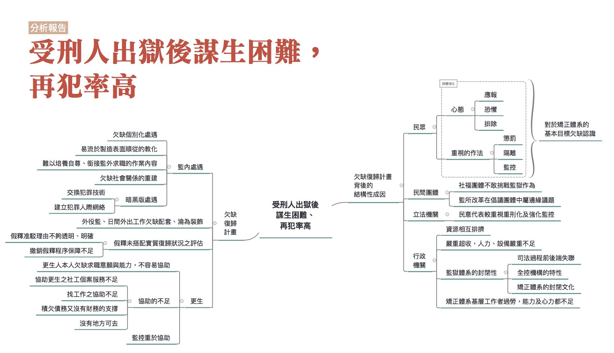

### 彙整人：林瑋婷

### 彙整範圍：
* 林瑋婷成因分析報告
* 0628全民司改運動第二階段籌備會議討論
* 0709評估會議討論

### 司法問題：

[受刑人出獄後謀生困難，再犯率高。](http://talk.justice.care/t/%E5%8F%97%E5%88%91%E4%BA%BA%E5%87%BA%E7%8D%84%E5%BE%8C%E8%AC%80%E7%94%9F%E5%9B%B0%E9%9B%A3%EF%BC%8C%E5%86%8D%E7%8A%AF%E7%8E%87%E9%AB%98/25/3)

國家把犯罪人送進監獄，以讓社會大眾安心。但是將犯罪人送去監獄後，往往只是把人關著，藉由各種生活條件的剝奪來懲罰人，而沒有好好把握機會協助他們脫離犯罪生活。出獄後也沒有提供充足的社會支援，協助曾犯過罪的人重新融入社會，造成再犯率高。

### 網路意見：

無

### 分析範圍：

從入監到出監更生的階段，皆涵蓋在分析範圍內。但是由於報告人的資訊來源主要是監所申訴案、監所參訪的經驗以及詢問監所人員，所以對於更生部分的著墨較少。

### 利害關係人：

民眾、公民團體、受刑人、更生保護會、法務部矯正署、監獄工作人員、觀護人

### 相關法律：

監獄行刑法、監獄行刑法施行細則、行刑累進處遇條例、行刑累進處遇條例施行細則、更生保護法、法務部矯正署組織法

### 相關議題：

監所、更生、復歸、監所外部監督

### 分析結果：

本題的司法問題談的其就是受刑人「社會復歸」的困境。社會復歸指的就是透過許許多多的措施，協助受刑人能夠回到並適應社會生活。有與會者強調，監獄不應該是殘酷對待的地方，應該視監獄是第二次的機會，關鍵是賦予受刑人人性尊嚴、恢復公民身分。在這樣的觀點下，社會復歸就不會是上對下地幫受刑人訂出他的生活方式，要求他做到，沒有做到就是失敗。相反地，應該視為提供協助的「機會」，讓受刑人有機會脫離入監前的生活網絡，重新建立起關係以及與人相處的方式。

雖然我國已經成立了矯正署，專門負責獄政工作，但是仍然沒有針對個別受刑人提供完整的復歸計畫，也就是從監獄內的處遇銜接到出獄後的社會內處遇，整體性、連續性的協助他們重新適社會生活的措施。這也是受刑人出獄後謀生困難，再犯率高的重要成因。以下的討論會先從欠缺復歸計畫的狀況談起，之後再進一步說明欠缺復歸計畫背後涉及的，從社會到政府各層面的結構性成因。

#### 欠缺復歸計畫

欠缺復歸計畫這個現象，必須從監內處遇講到出監後的更生協助，不能只談監內的情形。因為出監後才是受刑人真正面對遇到各種重新適應社會之困難的時候，所以從入監到出監後的相關協助都必須納入討論的範圍。以下將監內的處遇(也就是機構處遇)談起，再到中間處遇，也就是介於完全監禁的機構處遇，到回歸社會中在社會內給予復歸協助的社會內處遇之間的過渡階段處遇。最後再說明社會內處遇的狀況，這個階段部分也是常常聽到的「更生」。

##### 監內處遇

###### 欠缺個別化處遇

目前在監獄裡面的處遇，最根本的問題就是沒有「個別化處遇」。個別化處遇說的就是：依不同人的不同情況，給予不同的協助，以協助受刑人回歸社會。例如受刑人可能因為有人際關係方面問題，造成其暴力犯罪，那我們可能就要針對他處理人際關係的能力，給予協助。又例如受刑人有不同的就業意願與能力，需要的協助也不同。目前監獄雖然有對受刑人進行分類，但是比較是基於管理上方便。例如依罪行輕重分類，是擔心罪行輕者受罪行重者影響；依幫派進行分類是為避免打架、吵架情形發生。

###### 易流於製造表面順從的教化

搭配欠缺個別化處遇的情形，使得目前監所內的教化，很容易變成流於製造表面順從的教化，因為那些教化措施往往不是基於不同受刑人的不同狀況來設計。流於表面順從的教化措施並不能讓受刑人真正接受某些價值規範，進而產生行為上改變，而只是人在監獄不得不低頭。一些容易流於製造表面順從的教化方式如下：

1. 靜坐

    一般認為當其靜靜的坐著反省所作所為，就可以達到教化目的。但靜坐若要達成其反省目的，必須靜坐者真正認同靜坐這件事所要達成的目標。目前監所內要求靜坐，主要是為達成方便管理的目的，畢竟根本無法得知當一個人靜靜坐著，腦袋裡到底在想什麼。

2. 違規房

    違規時受刑人可能被送入違規房。在違規房內則透過剝奪其生活用品（現在規定上已經不允許這樣做了，但我不確定實際上是否已經完全沒有這樣的情形了）、長時間靜坐等方式處罰受刑人。特別是長時間的靜坐，要求不能亂動、維持一定姿勢，會帶來相當的身體痛苦。這樣藉由恐懼、害怕，讓受刑人改變的手段，或許對某些人長期的行為改變是有效的，但其他人可能只是迫於現實壓力而暫時低頭。回到個別化處遇的想法，就算是在監內的違規，其實也是要了解違規者的個別狀況，協助他改變這種狀況，而非單純地壓制。

3. 流於形式的道德勸說

    監所內的一些教化課程，往往流於道德教條的背誦，例如要求受刑人背誦弟子規，最會背的人可以得獎。這樣道德教條的背誦，或許在某個時代有它的意義，但是在當代是否還適合，就要好好思考了。因為這些道德教條對於人們來說，可能不是不知道，而是沒辦法認同這些道德教條的意義，或是這些道德教條實在與他如何在社會上求生存離太遠了。

##### 難以培養自尊、銜接監獄外求職的作業

監所內的作業往往與社會上的需求脫節。如折金紙、紙蓮花等作業，對於受刑人出監後求職的幫助不大。有種說法是：這類作業有助於受刑人培養勞動習慣。但若我們真的要協助受刑人復歸，就應該針對當代工作需求做調整，而非只是單純勞動。當勞動失去目標，勞動很容易變成折磨，只是為了做而做。

另外，監內作業的收入其實可以有讓受刑人自食其力、建立自尊的功能，甚至把錢存起來成為出監後生活或找工作的基本資金。可惜的是，根據與會者的說法，這種可以有較高收入的工作，限於少數自營作業項目，如麵線班或醬油班，一個月可以有一萬塊的收入，普遍的情形則是前面提到的折金紙、紙蓮花等委外加工的作業類型。不過，針對目前監所的自營作業，如麵線班或醬油班，仍有與會者表示對受刑人是沒有幫助的，因為職缺可能不多。應該要提供的職業訓練是有社會需求而且更具專業性的技術工，例如油漆、木工。

##### 欠缺社會關係的重建

監獄是一種全控式機構，在這種機構中，人們的既有的社會關係會被切斷，活動範圍限於機構內，所有活動都由機構來安排或規範，並且受到機構的監控。切斷既有的社會關係，在過去被認為是擺脫犯罪生活，適應監內生活的重要作法。但是由於絕大多數的受刑人總有一天要回到社會，從回到社會的角度來看，重建社會關係的重要性是遠大於切斷關係的，但可惜的是，受刑人社會關係的重建是相對受到忽視的。

1. 不當剝奪社會關係

    在監獄裡，有一些社會關係的剝奪，從社會復歸的角度來看，是根本沒必要，甚至是有害的。例如在剛入監時，受刑人的接見通信受到相對多的限制。依行刑處遇條例的規定，剛入監的受刑人屬於第四級受刑人，接見通信的對象只限於親屬，而且每星期只能通信接見一次。但是這樣的規定對於復歸社會來說，真的有必要嗎？會不會反而讓他更感到孤立無助、在適應監獄生活的過程中更感到痛苦？另外 ，奇怪的還有，依行刑處遇條例的規定「第二級以上受刑人之獨居房內，得許其置家屬照片」，也就是說，在監獄裡面持有家屬照片屬於一種特權。這個規定真的很奇怪，因為受刑人思念家屬，有家屬的照片對他們來說是有意義的，到底是為什麼不讓人家持有家屬照片？正是因為這個規定太奇怪了，所以2014年矯正署有一個函釋是說，在不違反善良風俗或妨害監獄紀律與安全的情形下，各監獄「得」開放受刑人持有家屬照片。可是具體的開放情形，由於各監獄有裁量權限，各監的狀況不一定相同。

2. 忽視監外人際網絡的重建

    有些受刑人在監外的人際網絡就是犯罪人際網，有些則是家庭支持非常薄弱。入監後固然可能暫時性地切斷犯罪人際網，但是如果沒有辦法在監獄中就逐步重建一些出監後可以尋求支持的人際網絡，或是逐步修復家庭關係，出監後可能很容易走回犯罪人際網。在這裡公民團體的介入是重要，因為如果公民團體進入監獄與受刑人建立關係，而且這種關係可以維繫到出監，繼續讓受刑人在社會中也有尋求協助或安全感的人際網的話，那對受刑人重新適應社會生活可能是有幫助的。目前有一些公民團體很努力在做這一塊，但是政府並沒有那麼重視將資源投入這個部分，只能依賴個別公民團體的善心與堅持。特別是有些公民團體的財務窘困，而這類監獄服務又不是討喜的募款題材，根本就是勒緊褲帶在做。

#### 暗黑版處遇

在目前的監獄中，不僅許多作法根本上無益於社會復歸，更麻煩的是，其實只要人被關到監獄中，他可能反而更容易在監獄中，建立起犯罪人際網。「監獄大學」、「進監獄進修」等說法，其實就是監獄將許多犯罪者置於同一個空間共同生活的必然結果，大家在裡面交換犯罪技術、建立犯罪認同與人際網絡，宛如暗黑版的監獄內處遇。

##### 中間處遇

受刑人從監內到監外的更生階段需要中間處遇的協助，但是中間處遇的重要性卻常常遭忽略。因為在監獄內的生活封閉而且受到較高程度地監控，狀況與重回社會時的情形落差太大，特別是對於長刑期的受刑人來說，這更是個問題。因此比較好的作法是，從高度監控與封閉的監獄內生活到重回社會的過程中，透過中間半開放的處遇方式，一邊確認受刑人的狀況，一邊協助受刑人逐漸建立在社會中生存的能力與方法，是重要的。但是目前台灣一些帶有中間處遇色彩的措施往往效能不彰。

###### 外役監

外役監其實還是比較偏向機構處遇，但是因為它的開放性相較於一般監獄高，因此我還是將它歸類於中間處遇。理想中的外役監應該要逐漸開放受刑人與外界接觸，訓練當代工作所需之能力，藉此讓受刑人可以重新融入社會。但台灣外役監主要工作內容限於農牧業，與當代工作型態落差過大，而且也只限少數表現良好的人才能去，難以扮演起社會復歸中的重要角色。

###### 日間外出工作

在欠缺個別化處遇與整體規劃的情況下，日間外出就像外役監一樣，妝點意義大於實質社會復歸的意義。再來，如果社會還是持續以擔心受刑人再犯、逃亡的觀點來看日間外出工作，那這個制度必然會因為過重的戒護人力需求，以及真實的再犯、逃亡案例而遭到質疑甚至捨棄。我在這邊還是要提醒，如果沒有以社會復歸的角度真正給予受刑人協助，就算是期滿出監還是可能再犯。過於看重監獄的隔離功能只是安慰劑，不能真正解決問題。 

##### 假釋

在社會復歸的觀點下，假釋是激勵受刑人接受各種處遇措施，早點重獲自由的重要誘因。而假釋審查，則是前面提供許多配套，協助受刑人取得在社會上生活的能力後，確認之前成果的時間點。在社會復歸的觀點下，受刑人的假釋被駁掉，意義不只是受刑人個人再犯可能未降低的問題，還必須檢討既有的處遇措施到底哪裡有所不足。

在此觀點下，針對網友 @Jon_Huang 的說法，不能以人滿為患為藉口，大開假釋之門，可能的回應如下：不能以人滿為患為藉口，大開假釋之門，這樣的說法是在承認監獄有發揮復歸作用的前提下才會比較有意義。當然，民眾可以基於受刑人再犯可能那麼高，怎麼能放出來為由而反對假釋，但不能忘記，除非採取初犯或再犯即採超長刑期或終身監禁的措施（但這種作法會衍生其他嚴重的問題，甚至掩蓋了犯罪的社會成因），受刑人總有一天會回到社會，這樣的說法只是把鴕鳥心態而已。如果看到目前監獄復歸作用的不足，就可以理解目前為何會以人滿為患作為理由而把後門（即假釋）開大一些。正是因為監獄難以發揮復歸作用，人不會越關越好，甚至還會越關越糟。

在目前監獄難以發揮復歸作用的情形下，假釋的准駁理由有時就會顯得恣意。在假釋審查委員會上，一個受刑人只有非常簡略的准駁假釋理由，其實很難實質對准駁理由作檢驗。而為何准駁理由會很簡略，其實就是因為根本沒有個別化處遇，確實地給予受刑人不同的復歸協助，並在過程中留下具體的評估記錄。另外，也也讓特權問題滋生，例如顏清標的假釋很快就通過，就被質疑有特權問題。

目前假釋制度除了駁准理由過於恣意外，還有「奇怪的統一標準」。監察院曾有一個調查報告，指出各監所假釋標準不一，為了回應這個調查報告，後來法務部就很重視表面上的類似情節的犯行應該抓差不多時間假釋；另外，為了求得表面上的公平，法務部也很重視各監獄抓的「執行率」應該要差不多。執行率是說某一類的犯罪在執行到百分之幾的刑期時，才會准予假釋。而執行率還會隨著社會氛圍、輿論來作調整。這種統一標準的邏輯，其實就是間接地承認個別化處遇在監獄內根本不存在，假釋核准率只是監獄在面對社會安全感及解決超收難題下的操作槓桿。

最後，假釋通過後，假釋的撤銷也是完全沒考慮受刑人實質復歸狀況是否需要再回到監獄。有與會者表示，台灣的刑法規定，如果你在假釋期間內犯了兩個月有期徒刑以上的罪，例如酒駕，沒有任何轉圜空間，就要撤銷假釋。撤銷假釋完全沒有法律保留原則、沒有聽審權的保障，檢察官直接就可以撤銷假釋，問題很大。

##### 更生

當受刑人離開監獄重新開始社會生活時，真正的考驗才開始。如何重新適應社會生活，如何避免走回犯罪的回頭路，這一切都還需要協助。之前的機構處遇、中間處遇，就是為了舖陳受刑人在回到社會時，能多一些機會脫離犯罪生活，而社會內處遇就是延續之前的相關處遇措施，繼續努力的重要部分。但可惜的是社會內處遇也沒有得到應有的重視，部分更生人既找不到工作，又沒有安身之所，無法融入一般社會的生活，只能走回(入)犯罪人際網路，在底層社會討生活。情形說明如下：

###### 更生人個人因素

根據調查研究，其實有些更生人本身就欠缺就業意願，如果是這種情形，要協助他們找工作本來就比較困難。有些人的工作能力本來也就有所不足，學歷大概也偏向高中職以下，如果在監獄時就沒有協助他提升基本的工作能力或學歷，那出獄求職時也就容易遇到困難。最後，如果更生人本身的社會支持力本來就不足，出獄後無處可回，也無法不去工作就能夠生存，走回(入)犯罪人際網路，在底層社會討生活，自然成了選項。

###### 協助之不足

1. 更生保護會首長不要求具備社會內處遇專業背景

    更生保護會是目前定位上由政府補助，最立基於社會復歸觀點而成立的協助更生人的組織，但奇怪的是更生保護會首長並不要求具備社會內處遇專業背景。更生保護會的董事長目前是高檢署檢察長兼任，董事長的話是：「檢察官代表國家追訴犯罪、伸張正義 ，一方面固是制裁壞人，另一方面則在保障好人，依據法律扮演謹守法律、維護公義，安定人心、穩定社會的角色，位尊權重 ，故應事事以民為念。身為法律的守護者，公義的代言人，更應時時以『外慚清議，內疚神明』自持，樹立公正、優質、有效率的司法 ，貼近民意，滿足人民的需求，此即為司法為民之真諦，亦 為檢察同仁共同努力之目標。歡迎各界批評指教，謝謝！」整段話和更生根本欠缺關係，令人擔憂更生保護會的最高長官可能不太懂更生，比較懂怎麼抓壞人。更別提部分更分會的主任委員，背景一看就是八竿子跟社會內處遇打不上關係的人，令人強烈懷疑只是酬庸。

2. 更生保護會不重視社工個案服務

    相對於觀護人兼具監控與協助兩種可能矛盾的職責，更生保護會如果願意投注心力發展社工個案服務，應該是更能夠專注於協助的職責。但是或許是因為長官本來就不見得具備社會內處遇的專業，更生保護會其實相對忽視社工的個案服務。更生保護會常常花許多心力辦很多活動，以讓他們看起來「很有績效」，但不願意投入資源作個案服務，深入了解每位受刑人的需求、追蹤他們出監後的狀況，以調度相關資源。這也讓一些在更生保護會工作的社工，原本懷抱著服務的熱情進入，灰心離開。

3. 找工作之協助不足

    更生人常常被貼上標籤，監所內又難以培養工作所需的技能，這讓更生人可能在出獄後就遭遇求職的困難。雖然目前更生保護會有與廠商合作，提供更生人工作機會，但據與會者的說法，有些更生保護會合作的餐廳假裝說跟法務單位去拿補助款，比如說雇主只要負擔一半的錢，更生單位會補助一半的錢，但其實收容人實際拿到的只有五千塊或六千塊，但他要簽名讓那個餐廳有拿到補助，變成聘僱收容人、取得好名聲、還賺錢。另外，據某位更生人的說法，有些合作廠商會苛扣薪水、要求超時工作等，讓更生人成為血汗勞工。就此來說，更生保護會有沒有好好監督或挑選廠商，是有疑問的。

4. 積欠債務又沒有財務的支持

    一些更生人有背負卡債，他們會希望工作是領現或不要勞保，這讓他們變得更為弱勢。另外有些更生人想自行創業時則往往受限於自身資金的不足，又難以取得貸款，加上與社會脫節已久，對於技術或市場的了解有所欠缺，創業之路難行。

    目前更生保護會有提供小額的創業貸款，但是據某位更生人表示，因為之前有更生人取得貸款後就跑路了，更生保護會申請貸款的條件就變得嚴格不容易通過。

5. 沒地方可去

    有些入監服刑的人，本身人際支持、家庭支持就是有問題的，所以出監之後很可能沒地方可以去。理論上，這時候需要社會安全網進來提供協助，例如中途之家提供暫時的居所，但這部份的資源是否足夠可能是有疑的。依據某位更生人的說法，他當初出監的時候沒有地方可去，想去中途之家，中途之家的床位又有限，要排隊等很久，那時他真的感到非常無助。

###### 監控重於協助

目前政府對待假釋出獄者的方式，設計上其實監控重於協助，而偏偏這些監控可能有礙復歸。

1. 觀護人協助與監控角色的衝突

    獲得假釋的更生人要定期到觀護人那邊報到。觀護人理論上主要的工作應該是關照更生人的生活，積極協助他重新適應社會，而同時也要監控更生人，注意並防止他再犯。但是監控者與協助者兩種角色是有內在衝突的。例如社工有時候為了協助案主，雖然知道案主有些違法行為，例如吸毒，他其實不適合去舉發，因為一旦舉發，信任關係破滅，案主有狀況就不願意跟社工講了。而從現在的發展來看觀護人的工作重點也比較是擺在監控，相關觀護工作的新發展，也是電子監控、性侵犯預防性測謊。不過必須要強調的是，就算整體政策走向偏向監控，觀護人如果用心做他們的工作，真心地鼓勵更生人、接納更生人，是可以給予更生人相當大的協助。

2. 前科造成的求職問題

    更生人出去就業會遇到前科資料問題，一般更生人不願意講出前科資料，擔心老闆會因此不用他。這樣的擔心確實有一定的道理，因為有些企業會不想用有前科的人，尤其是毒品案。不過有些企業對更生人是友善的，這些企業想知道更生人為何犯罪，之後管理上會比較有方式。例如因為暴力犯罪，可能容易情緒失控，財產犯罪的話也可以另外作防範。

    企業會想了解員工是否有前科，是哪一類的前科，員工有所隱瞞事後被知道可能更糟。前科記錄怎麼讓企業知道，也協助企業了解、接受、管理有前科記錄者，是重要的問題，不過目前這部分的協助也不足。

3. 法律限制有前科記錄者可擔任的工作類型

    有些法律會限制有前科記錄者可擔任的工作類型。例如公務員、計程車司機、保全人員等等。在此要注意不能擔任的工作類型和前科是否有關連性。

### 成因

欠缺復歸計畫這個現象的具體狀況描述已在前面有所說明，接下來要講的就是從社會面到國家面的各種結構性成因。

#### 社會面

社會面的部分又可分成一般民眾和公民社會兩方面來談，因為這兩方面狀況有些不同。

##### 民眾

許多民眾對於犯罪主要抱持著心態是：應報、恐懼、排除。這樣的心態導致在應對犯罪的作法傾向支持懲罰（認為罪犯應該付出相應的痛苦代價）、隔離（因為害怕罪犯，覺得要好好監控他們，把他們排除、隔離於一般社會之外），以及監控（回到社會內還是有可能再犯，要好好監視）。但這樣的心態非常不利於社會復歸，甚至是與社會復歸相違背的。因為社會復歸講的是，大家必須體認到犯罪人總有一天要回歸社會，並且思考彼此要怎麼共存，但是前面的心態作法卻是要將犯罪人視為它者，強化監控或排除。

這樣的思維在面對再犯時，容易想到的作法就是再犯就關，關到死最好，永遠不要出來；不然就是用死刑，人死了也不用浪費國家資源在犯罪人身上。但可惜的是，這樣的思維往往不能解決問題，反而會讓國家財政更為困難（因為要蓋更多監獄）、監獄爆滿又無教化功能，甚至掩蓋了犯罪的社會性成因。而偏偏前述心態與作法又特別容易透過媒體而放大。例如湯姆熊殺童案，多數的新聞報導強調被告曾文欽是個人魔應該判死刑，他裝病以躲過死刑，但其實他的犯案與人際支持網崩壞有關。

在媒體上很容易出現訴求重刑、死刑的情形，但這只能換取暫時的安全感。而在感到安全之後就鬆了一口氣，不去追問犯罪的社會性成因，解決社會問題，反而放任社會問題不斷生成新的犯罪，這才更是個問題。

對犯罪抱持著應報、恐懼、排除的心態，反面來也就是說，對於矯正體系的基本價值欠缺認識。與會者指出，矯正體系有三個基本價值：第一，特別預防，也就是這個人你希望他怎麼回歸到人群中。最基本的做法就是，找出他出了什麼問題，個人能做怎樣的改變。第二，一般預防，也就是藉由對個人施以不同輕重程度的刑罰，讓大眾知道不同犯罪行為的嚴重性，並進而不要做這些行為。這不等同於「殺雞儆猴」，也就是無論行為違法性的嚴重程度，給予重刑以讓人害怕。因為這樣的作法反而破壞了罪與刑的衡平關係，讓人覺得反正已經犯了罪，都要關很久或是被處死刑，那多犯一些罪也無所謂了（此部分在7月9日評估會議中比較看不出來，是彙整人會後再跟當時的發言人黃致豪確認後補充）。第三，犯罪社會成因研究，受刑人是社會研究的基本樣本，他們所顯現出來的行為偏差展現了這個社會出了什麼問題，也就是讓我們有研究成因，避免類似情況再度發生。

附帶一提，在7月9日的評估會議中，也有網友質疑無期徒刑的本意就是永久隔離，怎麼可以有假釋，為什麼要原諒他們。關於這個問題，與會者認為應該要看台灣選擇說在未來的十年我們倒退往北韓或中國的方向走，還是往類似歐洲的方向走。要往北韓或中國的方向，就是選擇報復；要往類似歐洲的方向，就是選擇前面提到的矯正體系的基本價值。

##### 公民社會

在公民社會中，會有一些公民團體浮現，它們相較於個別的民眾較有團體的資源與力量投入於某個公共議題之中。比較跟監獄議題相關的公民團體大致有社福團體與倡議團體兩大類。社福團體跟監所有比較多的合作，例如宗教團體常常會參與監獄內的教誨工作。這些社福團體較常提供輔助性的服務，但不太挑戰監獄結構性的問題，以避免產生衝突。社福團體某種程度上能和緩監獄教化、復歸問題，但改革則較需要倡議團體來推動。但可惜的是，監所改革在倡議團體中也屬於較邊緣議題，少有團體碰觸。

#### 國家面

國家面的問題則大致可分成立法機關及行政機關兩個面向來談。

##### 立法機關

在台灣的立法機關，民意代表的監督方向其實會呼應民意的需求，因此會傾向重刑化，或是強化監控。例如酒駕三犯一定要入獄就是重刑化的例子。但酒駕通常會涉及酒癮的問題，應該協助犯罪人改善酒癮的的狀況，把人關起來其實不太能解決問題。而強化監控則可見於各種質詢要求行政機關要加強治安維護。不過由於民意代表也會受到倡議團體的遊說，有些民意代表也會傾向接受倡議團體的說法，從人權的觀點強調不應過於重刑化，要小心國家強化監控帶來的副作用。這樣雖然可以某程度抑制過度的重刑化與監控的強化，但說到要推動行政機關投入大量資源來作社會復歸，卻仍遠遠不足，因為支持的民意代表有限，而且會遇到政府資源相互排擠的問題。

##### 行政機關

###### 政府資源互相排擠

承接前面所提到的問題。在許多弱勢議題上，都會出現資源排擠的問題。例如拿監所來跟勞工比較，為什麼要投入資源幫更生人找工作，如果有資源的話不是更應該投入來協助一般的失業勞工嗎？這讓弱勢議題看似變成弱弱相殘，彼此競逐有限的資源。在此情形下，不討喜又不受重視的受刑人社會復歸議題，能投入的資源就更少了。

###### 嚴重超收，人力、設備嚴重不足

台灣的監所有嚴重的超收問題。在2015年底，依規定全台監獄只能收5676人，但實際上收到7223人，超收率為13%。不同監獄的超收情形不一，以台北監獄來看，超收率已達40%。在嚴重超收的情形下，受刑人不僅是基本生活條件差，每個受刑人能獲得的復歸協助也不佳。每個教誨師能夠了解受刑人的個別狀況的時間會被壓縮，而且技能訓練往往也要搭配設備，人那麼多，設備就只有那些，結果就是只能讓少數人受培訓。超收嚴重的問題，與前面提到的民眾重視排除隔離，重刑化政策有關，也與政府資源有限的情形有關(不可能無限蓋監獄)。

###### 監獄體系的封閉性

監獄復歸功能不彰的問題，除了因為一般民眾本來就相對不關心這個議題之外，也與監獄體系封閉，外界難以了解、監督內部作為有關。這種封閉性與以下情形相關：

1. 全控式機構的特性

    監獄是一種全控式機構，如之前所說的，在這種機構中，人們的既有的社會關係會被切斷，活動範圍限於機構內，這本來就會讓機構內外的資訊流通有困難。

2. 司法前後端失聯

    監獄是司法的後端，而前端的司法在制度上沒有設計一個機制，讓它必須去了解監獄的狀況，也是讓監獄更能保持封閉性的理由。法官在判案的時候，並不會考量監所內實際教化、復歸的情形。檢察官也是相同心態，認為把人送進去之後就與他們無關了。雖然每年也有檢察官定期視察監所，但走的都是所謂「完美路線」(也就是只帶參訪者看沒問題的地方)，並不會看到問題在哪。律師在案子結束後，委任關係解除，也不太可能關心監所內的狀況。因此可以說，常見的法曹三者其實都對監所欠缺認識。

3. 矯正體系的封閉文化

    監獄體系的封閉性，也與矯正體系的封閉文化有關。之前我曾經去參訪監所，與監所的一些長官互動時，有時不禁會覺得他們說話避重就輕，很重視表面功夫。另外因業務而跟矯正體系的人有互動時，也覺得他們很重視上下服從關係，矯正署與各監獄有上下服從關係、各監獄典獄長又是監獄的頭，在監獄裡由他說了算。重視表面功夫又重視上下服從關係就容易形成封閉性。因此我們常常有時會看到監獄的業配文，說教化作得多好多好，但問題一堆都不太說。

###### 矯正體系基層工作者的無助少被重視

在監獄體系封閉的情形下，社會復歸的不足涉及到矯正體系基層工作者的無助一事，也就少被重視。

1. 工作量過大

    監所超收問題嚴重，監所人員有過勞問題。除了超收之外，教誨師業務龐雜，要花很多時間去計算累進處遇的分數，以及各種上級交待的績效要求。例如過去曾經舉辦過受刑人隊形變化的表演比賽，這類意義不明的活動造成基層人員許多壓力，也排擠了他們處理一般業務的時間。在此情形下根本難以期待教誨師有足夠時間一一了解受刑人的狀況，處理好復歸的工作。

    過勞所涉及的另一個問題是，它不僅使基層沒時間做好復歸的工作，甚至會逼使基層人員更不願意協助受刑人。在重視上下服從關係又禁止組成工會的情形下，監所人員面對過勞的問題只能自我工具化。就算對於過勞心中感到非常不滿，覺得自己不被當人看，但是也不敢反抗上級。而如果覺得自己不被當人看，其實也很難期待監所人員把受刑人當「人」對待。畢竟在不增加資源的情形下，對他們提出多照顧受刑人的要求，對監所人員來說都是沉重的負擔。

    但是要附帶一提的是，有一些監所人員縱使在惡劣的勞動條件下，仍然十分用心地對待受刑人，真正把受刑人當成「人」看。我就曾遇到不只一位的更生人跟我說，他在獄中遇到了真的關心他、在乎他的監所人員，他非常感謝。甚至也有更生人說自己不太會寫字，希望我幫他寫信謝謝某幾位監所人員。

2. 能力不足

    有時候社會復歸的困難也在於監所基層人員不知道該怎麼做。目前台灣監所人員主要是出身警察大學，警察大學比較是從犯罪防治的角度來教育學生，重視戒護管理，但不見得知道怎麼協助受刑人復歸社會。相較之下，國外有矯正心理學(correctional psychology)這支應用心理學分支，參與復歸計畫的人要具備這部分的知識，甚至是專門的執照。但是台灣沒有將這類人才制度性地納入監所。不過也必須承認，國外的矯正心理學仍然是持續發展中的學門，仍有許多不足及待解決的問題。但是至少矯正的相關知識是受到相當的重視，而且持續、有系統地在累積。

    附帶一提，除了監獄人員自身不見得知道要怎麼協助受刑人復歸社會，矯正機關所引入的志工也不見得有此能力，甚至完全不具備基本的諮商倫理概念，就在作輔導受刑人的事。例如應曉薇在鄭捷槍決後對外發表她在輔導鄭捷的過程中，覺得鄭捷很可怕、不認錯，引起一些了解諮商倫理的人的反彈，事後矯正署並公開澄清，應曉薇不是「教誨志工」，而是台北看守所自行遴選的「社會志工」。

3. 流動性過大，經驗無法累積

    根據2011年研考會關於獄政改革的研究計畫，台灣北部、東部監所工作人員的流動性很高，常需以約聘人力替代或不斷訓練新人，造成管理上的空窗期。一直待在同一監所固然有形成次文化，抗拒改革的問題，但人員過快流動，以致經驗難以累積，也是個問題。

4. 心態消極

    在監所基層人員過勞、欠缺矯正心理學相關知識，部分監所人力流動性過大，難以累積經驗的情形下，也讓監所人員抱持著「只要不出事就好了」的消極心態。

==========

## 民眾的司法觀念不足

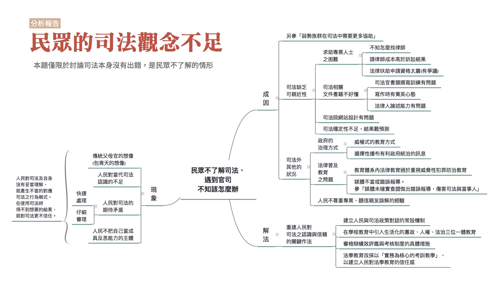

### 彙整人：林瑋婷

### 彙整範圍：

* 黃致豪成因分析報告
* 魏小嵐成因分析報告
* 時瑋辰成因分析報告
* 0621全民司改運動第二階段籌備會議討論
* 0702評估會議討論

### 司法問題：

[一般民眾不熟悉司法實務運作方式，產生誤解](http://talk.justice.care/t/%E4%B8%80%E8%88%AC%E6%B0%91%E7%9C%BE%E4%B8%8D%E7%86%9F%E6%82%89%E5%8F%B8%E6%B3%95%E9%81%8B%E4%BD%9C%E5%AF%A6%E5%8B%99%EF%BC%8C%E5%B0%8D%E5%8F%B8%E6%B3%95%E7%9A%84%E9%81%8B%E4%BD%9C%E6%96%B9%E5%BC%8F%E7%94%A2%E7%94%9F%E8%AA%A4%E8%A7%A3%E3%80%82/49/4)
[遇到官司人民不知道該怎麼辦](http://talk.justice.care/t/%E9%81%87%E5%88%B0%E5%AE%98%E5%8F%B8%E6%B0%91%E7%9C%BE%E5%B8%B8%E4%B8%8D%E7%9F%A5%E8%A9%B2%E6%80%8E%E9%BA%BC%E8%BE%A6/21)

### 網路意見：

（加粗體字者為分析者認為重點所在）

【一般民眾不熟悉司法實務運作方式，產生誤解】

@Yueye

這裡的討論提到了大法官、法官、檢察官、律師、以及犯人、媒體的問題，卻很少提到民眾的問題。
此次鄭捷事件可以看到，民眾對媒體的報導不加思索就接受，恐怕也是台灣司法的問題。

我想表達的是 **台灣的司法改革，不止是改革不合時宜的法條、順從民意的判決，也應該要改革一般民眾的道德觀念。**

@11123

我認為 **把法律納入基本國民教育** 最實在。
美國玩陪審團制，雖然常被嘲諷是馬戲團，但他們的法學教育是從小學就開始了！
我國到現在要學法律卻是要自己掏錢去學校念書，或者去補習班唸書買教學光碟才學的到。這不是一件很離譜的事嗎？
一個離不開每個人的法律,一個影響人生的法律，竟然是要花錢才能學習。
然後許多不懂法律的老百姓，就算看到合乎法律程序的判決，也會自己評斷成違法與不公。
不懂法律的民眾不少，陪審制真的能妥善運作嗎？
我去法院旁聽最常看到的都是沒人，法院都公開審理依然沒人想去旁聽，那改陪審制有什麼意義與用處可言？
我去旁聽還遇過庭務員問我是不是等開庭的...就是冷清到這種程度。
反而是證劵公司的電視牆坐滿一堆人，天天看著數字上下變化...
所以 **真要改陪審制，請把法律納入國民教育，不然絕對鬧笑話。**
覺得老百姓還是要不懂法律才好操縱，那也請學習卷證並送的德國司法體制去改良，而不是把美國的陪審團制當解藥或萬靈丹。

@11117

對於 **法學教育不夠普及的部分，我想強調的部分是民眾對「無罪推定」、「罪疑唯輕」、「罪刑法定」、「審級救濟」...等制度的目的及必要性的理解不足，而不只是對司法實務運作的不理解。**

「一般民眾不熟悉司法運作實務，對司法的運作方式產生誤解」，就字面上意思來看，我認為比較像是「程序」面上的問題，跟我想討論的部分似乎不大相同。畢竟，在對這些攸關人權保障的上位概念不理解的情況下，去談論個別的條文文字或是程序運作，似乎都無法滿足部分民眾對司法的期待。

【遇到官司民眾常不知道該怎麼辦】

@Edward_Tank

目前好的訴訟律師難培養、難尋找，因為願付錢買專業服務的人已經少見，多喜歡自己來，但由於專業度不足，或只參考免費法律諮詢，反而導致訴訟上的不順利。這種亂象許多年了，只是初淺的法治教育（宣導一般民刑法等），或開辦公益法律諮詢，或訴訟輔導，並不一定能解決一般民眾遇到的司法問題。

應該讓民眾知道， **法律也是專業，這個專業會配合許多其他的專業，極其複雜；打官司，就是要找律師，靠自己或電腦、網路處理，其實能做到的有限；** 網路上或其他免費的，只有原則、例外、可能或或許等制式問答，但法律遇到千變萬化的人事物，是會轉彎的；這才是每天辛苦設想、努力工作的律師專業所在。至於如何選任律師？就像選朋友、另一半一樣，沒有深談，會選得下去嗎？

提供法務部之網址供參，各地方律師公會也建置了類似系統。

### 分析範圍：

所謂的「司法實務」，大致可以區分成民事、刑事、行政訴訟三大領域，但很有趣地，如果問一般民眾：司法在幹麼？可能大部分人第一反射想到的是懲惡揚善、把壞人抓起來關等等跟「刑事」司法比較相關的項目。

相對來講，「民事」的糾紛，舉凡別人欠錢不還怎麼辦？樓上漏水到底要誰負責？車禍事故有哪些損失屬於可以跟肇事者求償的範圍？等等私人間的問題，就比較不在這個直覺反應裡。

在這篇的彙整報告裡，由於原先報告分工的緣故，主要是彙整刑事案件（黃致豪負責）以及民事案件（魏小嵐負責）中人民可能誤解司法以及遇到官司不知該怎麼辦的成因。但是比較沒有觸及的是行政訴訟，另外分析的重點也比較是以誤解司法為主，遇到官司不知該怎麼辦為輔。

### 利害關係人： 

法院職員（含法官、書記官、錄事等）、檢察官、法律從業人員（含律師） 、一般大眾

### 相關法律：

憲法、人民參與審判條例（草案）、刑事訴訟法、證據法（包括是否研立單行證據法）、刑法、民法、民事訴訟法、強制執行法

### 相關議題：

國民憲政與法治普及教育、法學教育整體改革、法律白話文（請參考美國聯邦最高法院大法官所製作之判決書；例：Hall v. Florida）、法官、律師、檢察官整體制度改革與績效評鑑、司法科學之推動與普及、推動陪審制度（以及混合參審制度在行為科學層面的問題）、司法可親近性

### 分析結果：

兩位原先的報告人黃致豪及魏小嵐之所以將第四題「一般民眾不熟悉司法實務運作方式，產生誤解」，以及第七題「遇到官司人民不知道該怎麼辦」合併在一起進行分析，主因在於這兩個問題所處理的根本癥結都來自於人民在知識層次的對於司法以及自身沒有妥當的理解。

本報告為了分析上的方便，將範圍限縮在司法人員確實依法行事，但是民眾有誤解或不知道該如何處理的情形。但這絕不是說司法人員不會有問題，事實上審檢辯學有許多的「無知」與「偏視」程度也不下於一般素人，只是這些問題不在這份報告中處理。

以下將先大概描述一下人民在知識層次的對於司法以及自身沒有妥當的理解的相關現象，接著再說明成因。

#### 現象

人民在知識層次的對於司法以及自身沒有妥當的理解的相關現象，可以分成以下幾種情形：

##### 傳統父母官的想像（包青天的想像）

提到法院，一般人多半想到的是，像「包青天」那樣，收到人民申冤，就鋪天蓋地地調查案件，並且認為人民的任務是把案件提到法庭上讓法官知道，剩下的事是法院要負責調查、處理，但其實這樣的想像與現代法院的情形有落差。

###### 法院應該要幫我處理到好

現代訴訟制度裡，法官是居於中立第三人地位，無論在刑事案件或民事案件皆為如此。在刑事案件中是由檢察官提出論告，被告來答辯，法官依據雙方的聲請來進行證據調查。而在民事案件中，則是由原告提出「主張」，被告提出「答辯」，為了支持兩邊的「主張」和「答辯」，還需要提出證據，最終才能由法官做出判斷（判決）。

然而，許多民眾期待的，卻是「法官大人幫我主持公道」，所以無法理解為什麼要提出證據、為什麼要回應對方答辯等等的訴訟程序。

###### 要處罰欠我錢不還（或撞傷我……）的那個「壞蛋」

另外一個情況是，民眾很容易把「法律」等同於「刑法」，期待「法院處罰欠錢不還的壞人」。比如說，某乙欠錢不還，某甲告某乙詐欺，這種情況下，一般不會是刑事上詐欺，而應該是走民事途逕請某乙還錢。而這產生的問題是，刑事程序中出現許多假性財產犯罪，也就是應該走民事程序來處理的案件，卻湧入刑事程序中，這類案件的調查既十分花時間，最後的結果往往又是不起訴。而如果結果是不起訴，有些「某甲們」比較激動，馬上就開罵「反正法律都保護壞人啦！！！」

##### 人民在知識層次上的欠缺

民眾除了仍對當代司法抱有包青天的錯誤想像，對於當代司法有時也欠缺的認識。由於欠缺認識的部分很多，以下只列舉出一部分。

###### 欠缺人權意識

西方法治發展過程，基於對國家濫權的痛切反省，而逐漸發展出了人權論述。基於保護人權的理由，我們會要求們保障刑事案件被告的訴訟上權利，特別是正當法律程序的相關要求，以避免國家權力過於強大下所產生的後遺症。例如任意的闖入民眾家中搜索、押人取供等等。

但是一些民眾對於人權重要性認識不足，覺得只要是壞人，這些程序保障通通都不重要。而問題是「壞人」不見得那麼容易清楚界定，這個難以界定的情形又與司法案件本身有複雜性，而這種複雜性在媒體報導上常常是被過於簡化而片面的呈現。這部分的討論可參考「媒體未確實查證做出錯誤報導，傷害司法與當事人」。

###### 對民事程序欠缺認識

1. 具體法律關係複雜難解

    民事案件的事實、法律關係較為複雜，比如說，勞資糾紛裡工資、加班費、假日加給費用該怎麼算？或者是說，在車禍案件裡，哪些支出是可以向肇事者請求的、哪些不行？什麼時候可以算利息？契約的某個特定約款有沒有違反法律規定？...等等等，這樣較為複雜的內容，民眾可能更難理解。

2. 不了解訴訟流程

    如果一個案件提進民事法院，程序上也有許多規定，比如說，如前面（一）A提到，訴訟過程中雙方都需要提出「證據」來支持自己的主張（或答辯），如果沒有辦法提出證據、或如果沒有如期提出證據，可能會招來不利益的結果，但是當事人不理解，不只程序上造成拖延，也會導致誤會。

    而在訴訟程序中，法官也要指揮兩邊當事人「針對該訴訟的事實」發言，但是當事人可能無法判斷什麼是跟訴訟有關的事實，有時候的發言可能跟案件事實沒有那麼相關，當法官希望導回正題的時候，當時人卻因為被打斷而感到憤怒，覺得法官不願意聽他說話。

3. 不知道取得民事判決之後還要進行強制執行程序

    民事訴訟不是拿到判決就結束了，還需要「執行」那個判決，也就是通稱的「強制執行」。

    目前強制執行程序，債權人必需自己查報債務人財產，但很多債權人不曉得，以為把判決交給法院就可以自動拿到錢，於是有所埋怨，是第一種類型的誤會。

    其次，目前債權人查財產的方式，一般最常見的是從國稅局調財產清單－－也就是說，國家課不到稅的財產／收入，比如領現金的工作，債權人大概也找不到，也沒辦法執行。

    再次是明明知道債務人有財產，卻眼睜睜地無法執行的情形。比如說，債務人有動產：機車一台。如果你要拍賣那部機車還債，那得要找到該部機車的本體才行。可是，機車四處移動，去哪裡找呢？找到了之後，在法院拍賣機車之前，又要由誰保管機車呢？

    還有的情況是債務人把財產藏起來，這種情況下，雖然強制執行法規定可以命債務人報告財產何在，陳報不實或不陳報時可以拘提管收，但實務上鮮少法院會這麼做。

    最後一種情況就是債務人真的沒有錢，根本還不出來。

    以上的幾個情況，都很容易好不容易取得的勝訴判決，變成一張漂亮的紙。「上法院沒用」的印象，就烙進了民眾心底。

4. 不了解民事程序本質上無法滿足所有人

    如前所述，民事訴訟程序的目的是為了讓私人間法律糾紛獲得解決，民眾必需提出相關證物證明自己的權利，而審判最後的結果，當事的兩方中有一方必得退讓，不可能讓每個人都滿意。但是有些民眾對這樣的情形欠缺認識，反而誤認為法律諮詢或訴訟是服務業，一定要提供自己想要的答案。

##### 民眾對司法的期待有所矛盾

民眾既希望法院能快速處理、又希望能仔細審理，正如本次議題裡，同時有「官司拖太久」、跟「司法程序不嚴謹」的項目，但其實這些期待是相互矛盾的。如果希望法院嚴謹地審理案件，速度自然快不起來，更遑論目前法院案件量龐大的問題，這部分請參考關於「法官檢察官案件量負擔大，辦案品質受影響」的分析。

##### 人民不把自己當成具反思能力的主體

前面所提到的幾種現象，在一些民眾不把自己當成具反思能力的主體時，問題就更顯得嚴重。一些民眾可能因為種種因素（將於下說明）而對司法欠缺妥當的理解，而一旦形成這些欠缺妥當的理解時，就很難再去接受不同的想法，甚至回過頭來反省自己當初的想法是如何形成，整個過程是不是有問題。

#### 成因

前述民眾對於司法與自身欠缺妥當的理解，可能來自於以下原因：

##### 司法缺乏可親近性

民眾對於司法欠缺妥當的理解，這有相當的部分是司法本身欠缺可親近性的問題，這又具體呈現為以下幾種情形：

###### 司法專業難理解

司法專業在理解上本來就有一定的難度，這在前面關於民事法的複雜性就可以看出。而這個理解上的難度偏偏又因為以下情形而變得更為嚴重：

1. 司法文書太難看懂  

台灣的判決書的邏輯結構有問題，而且常常沒有好的分點列項，一坨東西寫在一起，根本不知道在講什麼。而偏偏現行的司法官書類撰寫訓練又是不斷複製既有有問題的判決書撰寫格式，這種難懂到沒有意義的作法，也不當地增加基層法官的工作負擔（參時瑋辰的成因分析報告）。

另外，判決難懂也與部分法官有菁英心態有關，這些法官有時會把判決寫得很學術，希望獲得學術界的讚美，但是這樣就變得不容易看懂。

除了判決難懂之外，律師寫的訴狀也不容易懂。一些比較資深的律師認為，訴狀內容也必須很文言文才叫專業，會喜歡酸年輕律師用語太白話不專業。

2. 專業書籍太難看

司法文書不容易看懂，去看法律的專業書籍也會覺得不容易看懂。法律專業書籍常常不必要的用字艱澀，一些內容往往抄外國法，然後中文寫得不像中文，也沒有充份說明為何就是要抄某一國。一些概念的討論有時不僅沒有對原理原則作足夠清楚的說明，也不必要的複雜。

3. 法律普及的書少又有錯

就像科學需要科普的書籍一樣，法律也需要法普（法律普及）的書籍，這是專業知識擴大流傳範圍的重要部分。但是台灣的法普書籍少，然後有的又有錯，民眾讀了反而可能被誤導。

4. 法律人論述能力有問題

前面幾項問題，又都與法律人論述能力不足有問題。這部分的討論可以參考「法學教育培養出只會考試的法律人」的成因分析彙整報告。

###### 司法院網站設計有問題

除了司法專業內容本身難理解，偏偏內容的載具也沒有設計好。最典型的問題就是司法院網站的設計。法學資料檢索系統收錄了各法院的判決，但是系統穩定性低，動不動就當掉。而且就連最基本的判決分享連結都沒做好，沒辦法直接在網路上分享判決內容，阻礙資訊的傳播。最後，判決內容要貼到word檔也很難看，每一列都會斷行，表格一貼可能位置全部跑掉（關於這個問題，有網友提到lawsnote網站可解決判決書排版的問題，但是經測試，表格跑掉的問題還是沒辦法解決）。

最後，在7月2日有與會者表示本題應該刪除，不過或許因為時間關係，沒有提供詳細理由。

###### 司法穩定性不足，結果難預測

法院的判決標準不一，也會造成人民使用司法上的恐懼，不知可不可以相信司法。差不多的事情發生，但結果可能很不同。

###### 求助專業人士之困難

司法專業難理解，另一種替代作法就是尋求法律專業人士的協助，在此主要指的就是律師。但是尋求律師協助也會遇到以下困難：

1. 不知道怎麼找律師

訴訟律師的困境在前面 @Edward_Tank 網友意見相當值得參考。

附帶一提，有些民眾期待評律網可以讓資訊公開，然而，事實是，民事訴訟必然有一邊要退讓，有時甚至是兩邊都要退讓，有的案件雖然以結果來看是要賠償，但律師在過程中已盡力為當事人爭取；另外，也有的律師協助當事人以和解方式處理案件，但這些都不會顯示在評律網的資料裡。

2. 有些案件請律師確實不敷成本

比如以車禍事故損害賠償來講，損害賠償是以填補傷者的損失為限，所以假設A開車撞傷B，肇事責任全在A身上，而B的傷勢不重，醫療單據加起來大約兩千塊錢，修車單據一萬元，那麼就只能向A請求一萬兩千元。

這個例子裡，A請律師是完全不划算的。

另外一個問題是，以現在基層勞工低薪難請假的現狀，付費諮詢或在上班時間請假找專業律師諮詢，可能真的是難以承受之重。

3. 法律扶助制度的問題

台灣目前針對經濟上、社會上的一些弱勢群體已經有法律扶助的制度，可以獲得免費的律助協助。但是有些人經濟能力有限，卻仍無法通過法扶的扶助資格審查，沒辦法獲得法扶的協助。法扶目前仍有審查過嚴和官僚的問題（關於此存有不同意見，也有人主張法扶制度遭濫用，當事人年收甚高仍予以扶助。參第六題：法官檢察官案件量負擔大，辦案品質受影響）。

##### 民眾資訊缺乏的產生

前面講的比較是司法本身欠缺可親近性的問題，但是除了司法本身的問題之外，還有一些其他面向的因素，讓民眾對於司法與自身欠缺妥當理解：

###### 政府的治理方式

目前台灣的教育方式仍然偏向權威，要求學生背誦單一正解，服從規範但不加質疑。政府在資訊的傳播的過程中，也傾向片斷選擇散布對政府統治有利，但卻不完全正確的資訊。這基本上是要把人民培養成不具反思能力的順民，以利統治。這樣的基本背景，十分不利於民眾對司法與自身建立妥當理解。

###### 法普（法律普及）教育之問題

法普教育，就是相對於法律專業教育（常稱為「法學教育」），針對一般民眾以清楚易懂的方式，傳達法律相關知識。但是法普教育目前有以下問題：

1. 學校內法治教育之不足

不知道各位讀者，在義務教育（國中、國小階段），對法治教育的印象是什麼？恐怕內容則不外乎吸毒會被關、買盜版是犯法的之類，偏向刑罰的法治教育。這種教育只著重教育人民「不要觸犯刑事法律」，而不太教導民眾人權觀念，或是民事的相關觀念。這也是為何會有前面提到民眾知識層次上有欠缺的理由。

2. 社會（媒體）教育之失調

媒體不但沒有發揮第四權的效用，反而喜好斷章取義或偏向聳動的報導，這讓誤解的問題而形嚴重。例如之前士林地方法院關於屋主勒死小偷的報導中，明明是小偷家屬「求償」300萬元，民事庭法院根本還沒有開始審理，但媒體的報導讓很多民眾都以為民事法院已經判屋主要賠償。另外，媒體常塑造一個行的正就不用怕的感覺，好像只要自己沒犯罪就不必請律師，法官檢察官自然就會還你公道。但實際上這涉及司法人員會不會主動調查對於被告有利的證據，這是可遇不可求的，因此比較保險的作法還是請律師。相關討論可參「媒體未確實查證做出錯誤報導，傷害司法與當事人」。

###### 不尊重專業的心態

這個問題在台灣的各個領域都有。念設計的讀者們多少遇過「反正簡單隨便幫我畫一個logo就好」的要求；念資訊的讀者們大概也逃不過「反正簡單隨便幫我做個陽春網頁就好」...

這個問題在法律專業上又更形嚴重，因為現代教育普及，法律條文又都是用中文寫成，導致有些民眾讀完法條「覺得」就是自己解釋的意思，也不願接受專業法律人的意見。

比如說，有一位教授講過一個故事：一位先生到法院陳情，內容大意是說，你們這個公文寫的是「假執行」，既然是「假」的，怎麼可以「真的」執行我的財產呢？

事情是這樣的：法律上的「假執行」，意思是「預先」執行的意思。

這個部分的另一個變型是，民眾可能有請教專家，但他們心目中的專家，並非真正的法律專家，在這裡可以借用政大法律系劉教授的臉書提到的一個小故事：

> 剛剛有學生跟我說：有行政人員把某項法規當中的「學生得……（做某行為）」解釋成「學生得ㄉㄟˇ」也就是「學生必須……」的意思。而且該行政人員還堅持「我有問過中文系的，中文系說『得』是『ㄉㄟˇ』也就是『必須』」。
>
> （劉宏恩臉書，2016年5月6日16:31）

為什麼關於一個法令的解釋，不是請教法律系，而是請教中文系呢？

###### 全盤接受別人的不良經驗

一般民眾很少上法院的經驗，大部分是聽說身旁親友的口耳相傳。而由於身旁親友本來也就對司法欠缺妥當認識，因此對應司法的行為模式也有問題，不當的對應模式自然獲得無法令人滿意的結果。如果未經查證就直接相信，也會強化對司法的誤解。例如某甲把他自己的不良經驗向親友某乙抱怨，某乙卻沒有查證就直接相信，甚至跟著再轉向某丙抱怨...，傳話到最後，案件事實已支離破碎，連釐清都不知從何下手。這樣習於不經思考、不經查證就相信資訊內容的情形，與之前提到的權威的教育方式有關，也與不把自己當成具反思能力的主體有關。

##### 小結：司法整體習得的無助如何形成

前面「傳統父母官的想像」、「民眾資訊缺乏的產生」的部分談到人民對司法與自身欠缺妥當的理解可能的成因是什麼，接下來要說的是這種欠缺妥當的理解如何進一步導致民眾對司法極度不信任以及無助感。

由於一般人容易欠缺法律基本常識（只是基本知識，並不要求「進階」知識），也對司法實務不了解，因此更容易受到媒體或者有心人士誤導而產生誤解。一旦有了誤解形成偏見，當自己或身邊人碰到司法程序時，便會基於誤解與偏見而作出相應的行為模式，但這些行為模式與實際的司法實務狀態常有相當的差距，因此最後也容易引發更大程度的無助感（亦即，不知道該如何是好的感受）。

這樣的狀況，也就「產生誤解與偏見、對應司法的行為模式無效、產生無助感」如果一再的發生，就會形成特殊的司法行為基模（schema，心理學上認為這是個體認識周圍世界的基本模式），以及對於司法整體習得的無助（learned helplessness；白話講就是因為不斷失敗而產生「啊反正做什麼都沒用」的向下漩渦）。

#### 解法

如果從前述的司法行為基模與習得無助感模型來理解人民誤解司法、遇到司法案件不知道該怎麼辦，從科學觀點來看，針對人民提出類似認知行為治療（CBT; Cognitive Behavioral Therapy）的行為調整策略，應該是最有效率的行為調整方式。可行方針大略如下：

##### 協助人民認清目前對於司法「現狀」與「實務」無知的事實：

這裡的意思並非司法現狀與實務不需調整（現狀其實相反）。重點在於：這樣做是為了建立人民的「病識感」，了解自己對於司法現況欠缺基礎常識。如果人們不理解自己的問題，那麼就不可能幫助他具體的思考問題，甚至改變認知、調整行為。

在這個階段，透過網路與實體的方式（例如全民司改會議），邀請人民對司法相關議題發言，就算抱怨、謾罵也可以，然後透過經過訓練的司法人員進行深層對話，幫助他們釐清自己的想法，以及持續蒐集相關的意見與情緒。最終，將人民的對話、提問的過程以及這些資訊都整理公開，並在發散之後進行彙整，並找出核心的問題與概念，而不擅自替人民下結論。

###### 提出適當的對策改變人民對於司法的認知：

這一階段的重點在於漸進式調整人民對司法的認知（cognition）。這個過程無需一蹴可幾，但要持續從「通案面」與「個案面」進行。具體建議包括：

1. 長久面/基礎面/通案面的調整：從小學開始在各階段的教育引入具體的、生活化的、非八股式的憲政、人權、法治三位一體教育。如果希望暸解如何以生活化的方式有效推動基礎憲政/人權/法治教育，不妨參考美國公民與法治教育的相關方式。

2. 個案面的調整：具體引入人民參與司法審判之措施，使人民了解：司法的公民參與不僅僅是權利，也是現代公民為了預防國家憲政法治衰敗所必須盡的義務。

3. 建立「專業」與「素人」之間的溝通管道：在法律人之間推行司法教育普及化、白話化，讓專業的法律人可以用一般人就能聽懂的語言溝通司法的概念，相信這也是一切司法改革的核心基礎措施。

###### 基於認知的行為調整策略：

另一方面，需要司法界內部進行具體的司法改革措施以處理上述兩個步驟經過發散、濃縮、提煉得到的具體問題與概念。這些司法改革措施要以專案管理（project management）的方式進行透明、有效率的管理、反饋，並藉此讓人民開始有機會認識問題、改變對司法的認知與行為。
換句話說，需要讓人民知道：

1. 原來我自己與司法根本上有著這些問題存在，而這些問題都有他們各自相關的對應概念（也就是建立「問題意識」，或稱為「病識感」）；
2. 原來我的具體參與/意見等相關的行為確實有可能促成司法的變革（降低習得無助感，了解狀況確實有可能在努力後改變）；
3. 在前面兩者的基礎上，法律工作者要提出可以回應人民具體行動的司法政策修正方式（亦即建立行為與認知改變的正增強系統）。

對應上面這些的具體作法，包括了：

1. 常設的、公開透明的司法改革委員會，以及公民審議委員會
2. 人民陪審制度的實驗、修正或建立新系統（參審制度背離認知行為改變的目的，也沒有公民意識建立與教育的長久良好效果，意義不大）：這還必須搭配建立證據法則、以及律師檢察官武器平等等等司法上的變革。
3. 審檢辯績效評鑑與考核制度的具體修正（陪審制也可以相當程度的達到這個目的，而無需回到傳統的「評分」）。
4. 朝向法學教育成熟化的方向推動法學教育改革，以「實務為核心的考訓教學」為策略，從根本建構人民對於法學教育的信賴感。

###### 建立並固化上述的認知-行為調整模式，形成健康的、可自我修正的行為基模。

以上是舉出幾個實際的例子進行應用。其實我認為整體的司法改革，都是行為修正的問題。

人民對於司法的誤解（想像跟現實不一樣）、以及無助（遇到時不知如何是好），基本上是認知與行為的問題。既然是認知-行為的問題，有效的對應策略或許就應該從認知-行為的調整原則出發，同時從治標（近程）、治本（中長程）下手，將之具體應用在司法實務的修正與改革方案上。

==========

## 弱勢族群在司法中需要更多協助

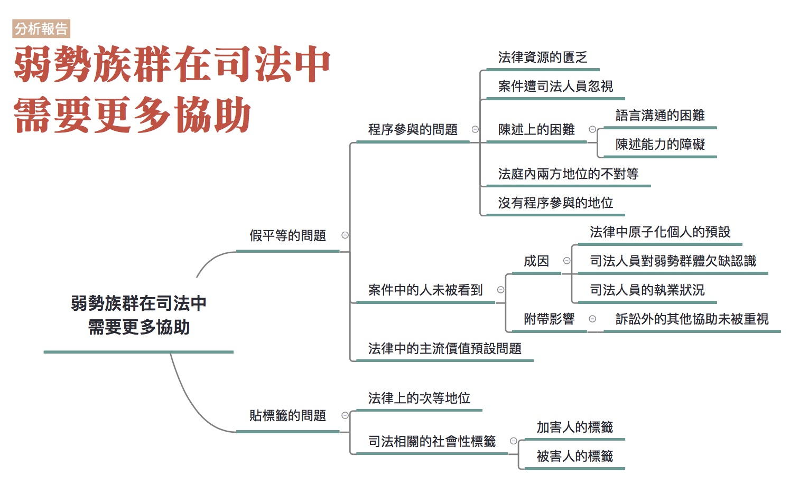

### 彙整人：林瑋婷

### 彙整範圍：

* 李艾倫口述成因分析記錄（記錄人：廖禾安、林瑋婷）
* 張靜如成析分析報告
* 0621全民司改運動第二階段籌備會議討論
* 林作逸相關文章(我是受害者家屬，我主張廢除死刑、畸戀殺機 父母慘死 林作逸推被害人保護)
* 0702、0709評估會議會議討論

### 司法問題：

[弱勢族群在司法中需要更多協助](http://talk.justice.care/t/%E5%BC%B1%E5%8B%A2%E6%97%8F%E7%BE%A4%E5%9C%A8%E5%8F%B8%E6%B3%95%E4%B8%AD%E9%9C%80%E8%A6%81%E6%9B%B4%E5%A4%9A%E5%8D%94%E5%8A%A9/32)

有些弱勢族群，如原住民、新住民、身心障礙者等等，因為文化背景或是語言與台灣主流文化不同，或是因為自身的弱勢處境未受司法所重視，因此在司法過程中遇到許多不被理解，或未受到適當協助的困境。

例如原住民、新住民吃上官司，聽不太懂警察、檢察官、法官在講什麼，所以需要通譯來幫他們翻譯。但是通譯的品質參差不齊，有的會自己加減內容或是對法律用語也不是很了解，導致這些人在官司中吃了虧也不自知。

又例如一些智能不足者，被詐騙集團騙走他的銀行帳戶，卻被當成詐欺幫助犯來處理。或是過動兒被當成罪犯送到少輔院，沒有接受特教協助，反而把他當成很不乖的孩子加以教訓、處罰，甚至最後慘死。

相關報導：[《後來怎麼了》15歲少年的悲劇人生／壹週刊](http://www.nextmag.com.tw/magazine/people/20141105/10116336)

### 網友意見：

@zero490

法官對環境不好或學歷低的被告，常以與本案無關為由不給被告發言，有礙發現真實。

我法庭觀摩的情形是被告要做解釋，描述前因後果，法官卻以與本案無關為由不給發言，而告訴人是高知識背景卻給他最完整的待遇，並在判決書上以告訴人描述的前因後果為判決背景，但對於告訴人的描述，相信很多人都可以知道告訴人會加油添醋，即便錯了，最後也會以記憶模糊來逃避其不實描述。

環境不好或學歷低並非弱勢族群，在弱勢族群上我國司法積極推動保護，弱勢族群在法律上有大概的界定，我所指的是經濟與學歷上的弱勢必須被強調，這部分的人是沒受到特別保護但有被輕視的，弱勢族群在司法中需要更多協助這問題中已經有人提到經濟地位，但應該繼而強調職業與學歷，以前的新聞曾報導高學歷代表有教化可能從輕判決?

舉例而言一個總裁跟一個清潔婦，審理竊盜罪(30000元為例)，法官可能劈頭就問清潔婦她知不知道對方是總裁(潛意識就認為總才不會為這小前爭執而認為清潔婦有犯罪行為)。再以仙人跳的相反例子，一個老師與一個業務員，老師不法侵權業務員，業務員要求賠償，卻最先被認為是仙人跳，只因對方職業不高向?

所以我認為應該強調職業與學歷，只描述弱勢族群可能會使這部分人被忽略。

補充一點，有前科的人也容易影響法官心證。

不過我還是希望能將職業與學歷的弱勢強調一下，我的經驗是法律輔導的，幾年前我曾經在輔導法律問題時就發現了一個問題，當單親家庭或原住民來問問題時，我這邊都可以轉介公設辯護人，而如果是學生或一般家庭的媽媽，我這邊卻不知道怎麼回答，幾個例子讓我記憶猶新，一個是大學女生為她男朋友卻只能請律師，一個媽媽剛死了丈夫帶著小孩只能請律師，一個媽媽剛破產也只能請律師，處理情形是只要你不是低收入戶或原住民或身心障礙你只能請律師，我是希望是不是能將在標題上就將學歷與職業補充上去或著是改成司法弱勢，一般人認知的弱勢族群，像我還沒輔導前我認知的弱勢族群只有有證書的低收入戶、原住民、身心障礙人士，而司法弱勢卻不局限於弱勢族群。

### 分析範圍：

各種弱勢當事人，但是因為原報告人的分析重點分別是法律扶助基金會工作時所會遇到弱勢當事人的狀況，以及移工和新移民，因此本彙整報告所能提及的分析範圍也是以此為主。

### 利害關係人：

法官、檢察官、警察、精神及智能障礙者、少年、移工和新移民、經濟弱勢者

### 相關法律：

民事訴訟法、刑事訴訟法、少年及家事法院組織法、行政訴訟法、法律扶助法

### 相關議題：

司法精神鑑定、法律扶助制度、司法可親近性、現代法律中的基本預設

### 分析結果

對於弱勢族群在司法上需要更多協助這個問題，一開始必須處理的問題就是，討論框架到底要用不同的身份別來區分，還是被不當對待的方式來區分？在7/9的評估會議中，與會者提到用身份作區分可能產生另外的危險，這是因為身份的區分一方面是讓弱勢者的弱勢情況可以被看到，但另一方面產生的危險就是標籤化或是漏未注意。在考量到不可能將所有弱勢者的類型窮盡、避免不必要的標籤化，以及其實一些弱勢處境是普遍的，一般人也會陷入，因此在以下的討論中，將採用被不當對待的弱勢處境來區分。

而一旦不再用常見的身份別來作區分，例如智能障礙者、原住民、移工或移民等等，那到底怎樣叫「被不當對待的弱勢處境」？這些弱勢處境的分類基本上整理自原有的弱勢身份別遭受對待的方式，至於什麼叫做「不當」，由於本篇分析報告是歸納現有的狀況，因此所謂的「不當」，是隨著社會對於弱勢處境的「承認」來變動。舉例來說，歐洲認定弱勢者可能是他和社會溝通的能力比較差，這是比較講求緊密互動的情況下才會認定的弱勢，但關於這部分的討論在台灣目前還不太有，就沒有放到本報告之中。

至於「需要更多協助」到底是指需要哪些協助，其實是解決方法的討論，在本階段不處理，而只先探討應該要注意到的弱勢處境類型。
最後在進入正式分析前還是要提醒，最根本的與其說是要清點完所有弱勢者或弱勢處境，不如說希望大家願意真心理解不同個體以及個體的處境，這才是改變的契機。

在司法中的弱勢處境，大致可以分成兩種情形。第一種是「假平等」的問題，也就是宣稱法律之前人人平等，但其實不同人的處境可能很不同，沒有注意到這些不同而導致人們處於相對不利的地位或易受傷害的處境。第二種是「貼標籤」的問題，也就是注意到某些群體的特殊性，但不去進一步了解或接納被歸類為某些群體的人的真實狀況，甚至傷害他們。

#### 假平等的問題

假平等的問題，大致可分成以下幾個面向來探討：

##### 程序參與的問題

訴訟法上雖然對於當事人有相關的訴訟程序權，但是弱勢者實際上卻可能因為弱勢處境未受到應有的重視，實際上在司法程序的參與過程中，容易處於相對不利、遭忽略的地位，甚至是遭到傷害。

###### 法律資源的匱乏

弱勢者在司法中遇到的第一個難題就是法律資源的匱乏。他可能在經濟上有困難，請不起律師；資訊上有所不足，不知道有法律扶助基金會、不知道怎麼找可靠的律師，甚至不知道自己在法律上可獲得的保護。例如智能障礙者根本不知道自己有「智能障礙」，而且可以作為量刑上減輕的因素。又例如卡債族根本不知道有法律針對卡債有設特別的處理機制。文化上也可能阻礙個人去尋求法律資源，例如原住民在觀念上認為找律師就是作賊心虛，於是放棄在偵查中請律師的權利。

###### 案件遭司法人員忽視

弱勢者無權無勢，有時候他的案件就會遭到司法人員的忽視。例如說之前屏東漁船上，有兩個移工死掉。一個是掉到海裡、一個死在船上，檢察官查了半天連起訴都沒有起訴。又例如或者是來台工作的移工在工地遭電擊重傷後死亡，所有人都表示不認識他、沒有僱用他，但工地包商的前妻卻又曾匯錢給那位移工的家屬。最後找不到人要為這名移工的死亡負責，家屬也沒有獲得賠償（參「電焊工人神秘死亡案」）。

###### 陳述上的困難

一些弱勢者在司法過程中，也會遇到陳述上的困難。這種困難大致可分成兩種情況，第一是陳述能力的障礙，第二是語言溝通的困難。

1. 陳述能力的障礙

    一些精神或智能障礙者不見得能夠理解司法程序在做什麼，也就不知道要怎麼為自己主張權益。一些精神或智能障礙者本身是被害者，但是由於陳述能力的不足，說的話難以被法院所採信。這樣的困境在特教學校的性侵害案件上，又顯得更為嚴重，相關討論可以參考「特殊孩子無法做證？」等相關文章。

    也有一些人不算醫學上所認定的身心障礙者，但是陳述能力也不是很好，法官沒有受過心理溝通的訓練，也不知道該怎麼跟他們溝通。而且法官通常訂庭期只給十五、二十等分鐘，在時間的壓力下，也就更難好好和當事人溝通了。

2. 語言溝通的困難

    語言溝通的困難則常見於外國人、移工、新移民，或是原住民等，母語並非中文的人。在台灣，法庭溝通是以中文為主，在法庭上非以中文為母語者，可能就會因語言的問題而實質上難以充分了解、參與法庭活動。

  1. 熟悉日常語言的使用不代表熟悉法律用語

      外國人、移工、移民或原住民可能日常語言溝通沒問題，而未被詢問是否有通譯之需求，縱使有主動詢問，他們也可能認為自己中文能力已足堪應付司法活動，但實際上他們對於中文無法精確的掌握或根本無法理解法律語言，往往因為理解錯誤而造成誤答，形成不利之結果。

  2. 通譯制度不健全

    1. 缺乏通譯

        根據近三年之統計資料，司法單位與警察機關受理之家暴案件11萬件當中，新移民配偶為家庭暴力受暴者約有9,500多件，但是這當中運用通譯人力資源的僅有108件，比例明顯偏低。東南亞移工相較於東南亞新移民配偶而言，中文能力更貧乏，但是在面對訴訟糾紛時，常常面臨缺乏通譯的窘境。根據聯合國《公民與政治權利公約》第十四條第三款「審判被控刑事罪時，被告一律有權平等享受下列最低限度之保障：(六)如不通曉或不能使用法院所用之語言，應免費為備通譯協助之。」然而，台灣社會制度長期忽視通譯服務在人權上的重要性，在司法審訊相關過程當中，往往只有在法庭庭訊時才有特約通譯人員的編制，在警察機關或其他第一線現場，卻不見得有通譯人員提供翻譯服務。而通譯需求數量被高度低估，也使得專業通譯工作者承接案量有限，無法發展穩定職涯。

        這種通譯的缺乏，也有城鄉差距，以及不同語系缺乏嚴重度不同的狀況。以移民署所提供的通譯人才資料庫為例，目前在那個資料庫上登錄，提供東南亞語系有1326位，然各語言通譯人員所擁有的人數並非一致，且未及於台灣各縣市，部分區域有通譯需求時，將面臨無通譯可提供協助狀況。

        ＜表一＞內政部移民署 通譯人才資料庫東南亞語種通譯服務人數概況
        （資料日期：105/06/15）

        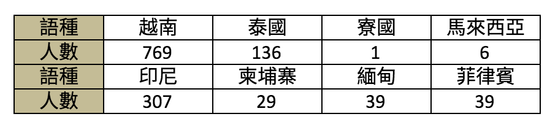

        在缺乏通譯的情形下，許多僅是粗通中文的新移民常常面臨到，必須以不熟悉的語言進行攸關個人權益至鉅的訊問與筆錄，這當中可能造成的人權斲傷，卻長期遭到漠視。

    2. 通譯品質未妥善控管

        縱使好不容易有了通譯，但是通譯的品質良莠不齊也是嚴重的問題。由於缺乏通譯，常會使用臨時的通譯工作者，但是在面對司法相關名詞的通譯工作時，許多臨時的通譯工作者無法精準、正確地進行通譯工作；或者是，通譯者本身就是案件當事人，例如常見的仲介與移工之間的契約糾紛，通譯者本身的立場已經涉入其中，而失去通譯專業所需的中立性。

        通譯的品質良莠不齊與通譯的培訓考核制度不完備有關。法院與檢察署建置之特約通譯名單，二年一期，每期皆須接受相關通譯、法律素養、庭務等等相關培訓；相較之下，移民署所提供的通譯人才資料庫(以各類相關公務單位之通譯溝通服務為主)，雖要求通譯人員必須通過筆試及口試要求方能取得結業證書，然而培訓課程內容及要求之時數顯然不足以應付各類相關公務單位在溝通時，可能會使用的專業用語。為了釐清責任，移民署多次說明，該平台僅為整合現有通譯資源，而不具有培訓、檢核、管理、以及財務支持。但這也呈現了培訓考核制度不完善的現狀。

    3. 通譯費標準不一

        可能使用到通譯的單位包括法院、檢察署、警政單位、移民署、勞政機關、家暴中心及社會局等。但是這些單位通譯並無統一法規，擔任通譯之旅費、交通費等各單位之給付標準也不一致。

    4. 相關單位(例如警察)未正確使用通譯

        除了通譯本身的問題外，使用通譯的相關單位，對於如何正確使用通譯欠缺認識，也是個問題。有警察要求通譯以利誘等方式協助不正取供。甚至有早在通譯到場之前，筆錄已完成，通譯根本未參與所有活動，卻仍要通譯仍簽名於筆錄之上的情形。

###### 法庭內兩方地位的不對等

法庭內的兩造當事人都各自帶著他們既有的社會資源進入法庭，而這些社會資源的差異，就可能會讓兩造在法庭內的地位實質上很不對等，以致於訴訟的勝敗與其說是因為事證本身，而不如說是受兩造不同的社會資源所影響。例如勞資爭議中，資方有專門的法務在協助他，訴訟資料也多半在資方，勞方能取得的有限證據也不見得被採納。又例如在行政法庭上面對政府單位的人民也有類似的困境，政府單位比較有能力請律師、資料在它手上。更麻煩的是政府提供給行政法院的資料還可能用各種理由，要求法院不要提供給人民看。如果行政法院欠缺對於權力不平等的認識，很容易就限制人民閱卷，使人民更陷入訴訟上的不利處境。

###### 沒有程序參與的地位

在當代被害人權益開始受到討論之時，刑事案件的被害人在刑事訴訟過程中不被當成主體也成為了問題。現行的刑事法律主要是處理被告有沒有罪，要判刑多久的問題，而被害人可能希望在刑事司法過程中去了解事情發生的經過，提出自己的想法。在現行的刑事法律中，被害人想追求真相的心情，有時是被忽略的，被害人連想了解最基本的司法到底查了什麼事，都會遇到困難，例如必須請律師去閱卷才能拿到卷宗資料。另外，被害人想追求的真相有時是和司法體系所關心的真相不同。被害人想知道為什麼是自己？為什麼要殺害自己的親人？他是如何殺害？加害人真的後悔了嗎？但事實上可能嗎？這些可能都是被害人關心的，但不是司法的關心所在。
被害人在刑事司法中的參與是很被動的，是由法官、檢察官視需要才傳來問，不想傳的話連講話的機會都不太有。傳來問的時候，也不見得注意到被害人需要受保護的需求。有的檢察官在偵查庭的時候，還把告發人和被告是放在一起，同一庭在偵查，那試問告發人怎麼敢真正地講出來他告發的原因？

##### 案件中的人未被看到

弱勢者除了在程序參與的過程陷入不利處境，他在司法過程中，本身也容易被化約成案件。至於他本案之外的生命經驗、所處的複雜社會處境，都可能被忽略。

#### 成因

1. 基本法律預設是原子化的個人

    當代法律中預設的人是「原子化的個人」。原子化的個人指的就是，人不被視為存在於社會關係之中，而是一個個獨立的個體。人的個體差異被抹除，在法律上都被預設為獨立而同質的具理性思考能力個體。而這樣的預設其實容易讓弱勢者因為所處的社會情勢，導致他處於相對不利或易受傷害的位置的這個問題，遭到忽略。

    當代法律預設著原子化的個人，容易讓司法人員把活生生的人，切割放入法律框架中來看待。舉個例，像是毒品案件，爸爸因為毒品案件入獄了，家裡就沒有經濟來源，媽媽也不太有工作能力，或是工作能力不足，媽媽入不敷出有了卡債。當小朋友開始長大，需要打很多工的媽媽疏於管教，開始出現少年問題；爸爸回來後又失業，開始跟媽媽爭執，就有了家暴、家事案件；若家裡有長輩，又有長照問題。辦案的時候，會發現像粽子一樣，關連性很強；但在法院就只是案號。法官只是看到自己手上的案件，卻沒有看到「人」。

2. 司法人員對弱勢群體欠缺認識

    雖然當代法律基本的預設是原子化個人，但是某些弱勢群體的處境已經逐漸為人所知，甚至規範到法律內，但部分司法人員對這些弱勢群體仍欠缺認識。例如精神障礙及智能障礙者的情形，在司法人員對精神障礙及智能障礙者欠缺認識的情形下，容易誤以為他們就是邪惡、頑劣，或是假裝以逃避刑罰。又例如卡債族的情形，司法人員會問當事人說「都有債務了為什麼不找更好的工作？」、「為甚麼小孩要文具，買文具要錢啊？」、「那你都有卡債了為什麼還要扶養父母？」有些問題問起來很奇怪，背後可能涉及法官不了解處境也不了解相關法律。

3. 司法人員的執業狀況

    為什麼司法人員傾向看見案件卻沒有看見人呢？不同類的司法人員的狀況又可能有些不同：

  1. 法官

      第一點，法官都是非常優秀的人，唸書時成績就非常亮眼、通過司法官特考，某種程度上來說，人生的道路比較順遂。有些法官比較不能理解其他沒有那麼優秀的人為什麼會做這些事情？會有這樣的表現？而有些法官則覺得我苦過，我可以，你為什麼不行？但明顯的是你比較聰明、能考過考試。弱勢不只是比較沒有錢，可能還面臨沒有能力、沒有關係等問題。比如說一位律師，他今天也許一時沒有錢，可是他至少有專業能力，也認識有能力的人。而弱勢民眾相較起來，所認識的人就與前者非常不同，他很容易會在那個輪迴裡一直繞。這是法官難以理解的。

      第二點，管考的問題，當用數字的方式去管理考核法官的表現，結案就變成很重要的事(例如多久可以結案、一個月結掉多少案子)。有的法官會多花點時間傾聽、了解民眾，但也會碰到法官想要快速結案。例如外籍當事人可能要請通譯，也許有一些不是很好的翻譯，或是表達能力沒那麼好，但法官要結案，就會變成壓力。又例如有躁鬱症的當事人，表達的方式會不一樣，但法律人的腦袋有一定習慣的思考模式後，比較不容易去理解他們的思考方式、同理弱勢的處境。這些情形再加上結案的壓力，情況會更不理想。

  2. 檢察官

      檢察官的環境比法官更封閉且更沒有保障。如與相對獨立的法官相比，案件更容易被干擾。而檢察官也一樣有案件壓力。另外，檢察官應該一併注意有利不利，但因為他必須追訴，可能常常會忽略對被告有利的證據。

  3. 警察

      警察相較之下又更便宜行事。譬如說，刑事訴訟法有規定智能障礙者、精神障礙者等在偵查中必須有律師在場。之前有個案件當事人犯了很輕的罪，但警察撥電話給法扶時撥錯號碼，一個小時都沒有接通。警察當時就覺得算了，想趕快問一問，就開始問當事人。後來調閱錄影帶，可以發現那位當事人有相當長的精神疾病病史，他在受詢問的過程表現得很奇怪。警察或許會覺得這是小案件，趕快做完就可以下班，但他沒意識到，這樣的行為讓當事人權利受損。

  4. 律師

      公設辯護人案件量很高，因此分配給每個案件的時間常常受到壓縮，實在很難好好處理每個案子。至於一般律師接法扶案件的狀況，有些律師在面對一些比較不容易相處、溝通、精神狀況也不太穩定的當事人時，會有著「為什麼今天我要提供免費服務？」一種高高在上的感覺。忽略了即便是他們不喜歡的人，也有接近法律的權利。特別是有些年長律師容易較有優越感，會用比較權威的態度對待當事人。

###### 附帶影響：訴訟外的其他協助未被重視

在司法過程中，個體的社會弱勢可能被化約成案件，有時候他的整體弱勢情況在司法過程外也同樣會遭到忽視。甚至因為過於將某類群體的問題「司法案件化」，而忽略了更加社會面的支持與協助。例如少年犯罪的問題，雖然《少年事件處理法》已經有針對少年有特別的保護，但是當少年犯被送到少年矯正體系時，是否受到足夠人性的對待仍是有疑問的。

又例如欠卡債的人，不能只是看到欠卡債要上法庭的問題，而要看到卡債族重新站起來，可能也需要心理支持。

又例如要保護犯罪被害人，不能只看到抓到兇手破案的問題而已，被害人要能重新站起來，需要將他們視為主體來作相關的制度性設計。他們可能需要金錢、需要社會支持，也可能需要與加害人關係的修復，需要單一窗口來處理種種需求。而國家也要看到犯罪發生的社會性成因，不能將問題只推給犯罪者，主動承擔起改善社會、協助被害人的責任。（犯罪被害人的弱勢處境另可參：法務部100年度委託研究計畫--「犯罪被害人保護政策體檢報告」成果報告書）

##### 法律中的主流價值預設問題

在法律當中，也有可能有看似普遍、中立的規定，但其實採用的是主流社會價值的預設。例如當代司法講求是非對錯，不太有關係修復的概念，但是對原住民來說，關係的修復是更重要的，忽視這一點會讓使用司法的原住民造成更多恐懼。例如部落中發生強暴案件，加害人是被害人的親戚，被害人會被說若你訴諸法律，會造成家庭破裂，受害者反而覺得是自己的問題。

又例如原住民狩獵屬於他們的傳統文化，但是當代法律有限制捕殺野生動物、使用槍枝的規定。這些規定原本出自於生活中沒有狩獵傳統者的考量，到底如何能在法律規範中納入原住民文化的考量，現在越來越受到討論，但如何規範仍有爭議。又例如越南有吃狗肉的習慣，就跟台灣人吃雞肉、牛肉一樣。但是台灣的《動物保護法》卻基於台灣人的生活習慣，將狗視為陪伴人的寵物，不可殺來吃，一概將越南移工殺狗來吃的行為視為犯罪。

#### 貼標籤的問題

貼標籤的問題，則主要呈現在以下兩個面向：

##### 法律上的次等地位

在面對一些弱勢者時，有時法律甚至會特別劃定出這一群人的身份，不但不協助他們，反而基於他們的身份而給予特別不利益的對待。例如東南亞籍的婚姻移民常被懷疑是假結婚，並基於懷疑他們是假結婚而設計了一套針對東南亞等特定21國人民的「境外結婚面談」制度。又例如針對移民訂定恣意而空泛的國籍取得限制，或是對於遭受家暴離婚或喪偶的外籍配偶，仍要求嚴苛的財力證明，才能取得我國國籍。這些法律明定的次等地位，使得這些弱勢者縱使走入法院也得不到任何協助。

##### 司法相關的社會性標籤

在司法過程中，有時某些弱勢者的弱勢處境沒有被真正了解並接納，連帶地他還會被貼上標籤，讓他的社會處境更為惡劣。刑事案件中的加害人是一例，先不論冤案的情形，縱使是真正的犯罪加害人，他會犯案也有可能是一系列社會弱勢處境累加的後果(例如湯姆熊隨機殺人案被告曾文欽的情形。相關報導請參：血是怎麼冷卻的：一個隨機殺人犯的世界)。而司法如果不去看到其中的結構性因素，也不給予相關協助，只是讓這些人的處境更為惡劣。更可憐的還有加害人的親人，也還被迫一起承受其他人的排斥與厭惡。

除了加害人之外，弔詭的是刑事案件的被害人也是被貼標籤的一群人。在發生兇殺案件的時候，輿論會以還被害人一個公道為由，要求判被告死刑，但其實不是所有被害人都這樣想。有些被害人是希望淡忘、遠離這些痛苦；有些被害人是希望真正地了解加害人、為什麼他這麼做，然後選擇原諒。然而如果有被害人表達出這樣的心情，反而會被輿論攻擊說「你不了解其他被害人的痛苦嗎？」、「你難道不知道這些人最死有應得嗎？」之類的話。此外輿論雖然表面上是同情被害人的，但是講到真的要協助被害人時，例如幫忙照顧遺族，其實沒有幾個人願意。甚至在論及婚嫁時，被害經驗因為有時會伴隨著坎坷的成長過程，還可能被拿出來挑剔，被認為不是好的結婚對象。

前述貼標籤的問題，可能不只是推動反歧視法，或相關人權公約(如CRPT)的國內法化就能解決的。首先，反歧視法本身另外還有不當限制言論自由的疑慮；再來更重要的是，如果人們不是真正地去理解並接納差異，縱有法律規定，在執行上也會出現難以落實的問題。

==========

## 法官檢察官案件負擔大，辦案品質受影響

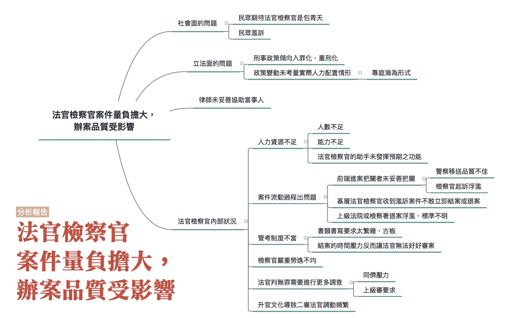

### 彙整範圍：
* 時瑋辰成因分析報告
* 0621全民司改運動第二階段籌備會議討論
* 0702評估會議討論

### 司法問題：

[法官檢察官案件量負擔大，辦案品質受影響](http://talk.justice.care/t/27)

基層法官或檢察官每月的新收案件量很大，面對社會輿論與限時結案的壓力，因為人力、資源不足，使得部分案件調查或審理未能完善，亦使得辦案的品質易受質疑。

### 網路意見

@Edward_Tank

不論至哪一個院、檢，看到第一線面對當事人的院、檢，一個早上或一個下午有時會出現10幾、20幾件案子在審、偵，這品質怎會好？再怎樣認真或加班，沒多久身體就垮了。這時候如果遇到不熟悉法律或其程序的人，其社會輿論或過往經驗等，難保不會影響院、檢的辦案品質。

@ishinji

司法改革似乎都沒考慮到基層法官的心聲，就算再怎麼認真辦案，每週六日都在寫判決，月結報表也是接近百件，這是一個正常制度給法官的負荷嗎？檢方的狀況應該也差不多，所以抱怨程序久、抱怨法官沒耐心，我想司法官應該想更早結案，但是客觀不能啊！

### 報告人
時瑋辰，[原文在此](https://medium.com/@weichenshih/heavycaseloadtw-89e547faf6a4)

### 分析範圍

此問題已經寫明是針對「法官檢察官案件量負擔大」、「基層法官或檢察官」，則問題的範圍應該是排除具有司法行政職務而得以減免辦案量之法官、檢察官，例如檢察長、主任檢察官、院長、庭長等。而此問題又言明「面對社會輿論與限時結案的壓力，因為人力、資源不足，使得部分案件調查或審理未能完善」，自應排除不負有事實調查職務之法官、檢察官，例如最高法院、最高檢、高檢等。

此問題之核心在於「案件量負擔大」與「辦案品質受影響」之關係，依循此脈絡，在問題的分析上，應該有兩個部分：

1. 了解法官、檢察官案件量負擔之情形；
2. 是否有因案件量負擔大，而影響辦案品質之情形。

筆者本人為服務地方法院刑事庭未滿3年之候補法官，雖於極短之時間內、盡力以自己之人際網路，蒐集辦理不同事務、服務於不同單位之經驗及意見，惟礙於自己經驗及蒐集管道之限制，未必能完整掌握此問題，所以報告可能會受限於自身經驗及能力之影響。

### 利害關係人

法官、檢察官、司法行政單位、司法輔助人力（檢察事務官、書記官、法官助理）、司法警察、當事人、律師、社會輿論

### 相關法律

刑事訴訟法第231條之1（退案審查制）、第258條第1款（再議）、第161條第2項（起訴審查制）、第319條（自訴）、第161條第1項（檢察官舉證責任）、第264 條（起訴書之記載）、刑法第168條（偽證罪）、第169條（誣告罪）、法院組織法（員額）、法官法、候補試署法官辦理事務及服務成績考核辦法

### 相關議題

#### 檢察官部分：

司法警察考績制度、雙偵查主體、退案審查制、假性財產犯罪、以刑逼民、濫訴或地毯式提告、當事人多元期待、法院缺乏可預測性、偵續不當發回、檢察事務官之使用、（地檢署）分案規則、（地檢署）移轉管轄、辦案輔助人力、（檢察官）結案書類撰寫、縮減最高檢高檢人力

#### 法官部分：

檢察官實質舉證責任、公訴與偵查檢察官不同、起訴狀一本主義、起訴審查制、欠缺（刑事、民事）濫訴制裁、誣告要件過苛、自訴制度、第三審介入事實認定、欠缺量刑基準、縱容偽證、調動頻繁、法官及法助能力不足、（法官）書類格式簡化、累犯制度廢除、書類審查制度、修法趨勢、管考及評鑑、縮減二三審人力

### 分析依據

時法官為服務地方法院刑事庭未滿3年之候補法官，除個人之經驗外，於2016/6/1收到撰寫此報告之邀請，至2016/6/13前，共收到19份來自法官、檢察官、律師之意見（7份來自檢察官、11份來自法官、1份來自律師），多數來自候補法官、檢察官，服務地點包括：台北、新北、桃園、台中、雲林、高雄、屏東、高等法院。

另在友人的協助下，至2016/6/4至2016/6/9，以設計並發放網路問卷之方式，蒐集到76份法官、檢察官之意見（31份來自檢察官、45份來自法官），多數來自地方法院或檢察署，包括但不限於：臺北、士林、新北、桃園、台中、彰化、南投、雲林、台南、高雄、屏東、花蓮、離島、高等法院。檢察官部分絕大多數（26/31）為偵查檢察官，但亦有公訴檢察官及兼任偵查、公訴者；法官部分，三分之二（30/45）為刑事（一般）庭法官，五分之一（9/45）為民事（通常）庭法官，另亦有民事簡易庭、刑事簡易庭、行政訴訟庭、刑事審查庭、家事庭、少年庭者。

此外，也有其他友人提供法院月報表、司法院2006年所委託製作之「法官工作時數調查研究報告」等資料作為參考，在此一併致謝。

檢察官與法官雖然大部分都是司法特考出身，經過兩年同樣的訓練後依分數及志願分發，然而職務及工作環境大不相同，有必要分別理解，因此以下分析將直接分為檢察官及法官兩大部分，在最後再提出筆者的綜合觀察。

#### 壹、檢察官

##### 一、檢察官的生活

臺灣配置於地檢署之檢察官，於104年6月30日之統計人數為1182人（含地檢署檢察長、主任、襄閱檢察官及公訴、執行檢察官[^1]），而依103年法務部統計年報，新收偵字、他字案件數為496613件（不含相驗案件），平均每人每月需收約35件偵字、他字案。然而，上述數字包括具有行政職務而得以減免分案之檢察長、襄閱檢察官及主任檢察官，亦包括沒有負責偵查職務之公訴檢察官及執行檢察官，亦未考量各檢察署之不同，大部分地檢署檢察官的收案量都遠超過這個數字。

一名在北部大型地檢署的檢察官表示，該署「平均每月每人收案，只計他字和偵字案件約80至90件新案，約有20件會是毒偵案件（編按：指施用毒品案件），剩下的案件約1/3至1/2，……會是假性財產犯罪或被包裝成刑事案件的民事糾紛，例如合夥或公司財務有問題，提告詐欺（、）侵占（、）背信（、）或偽（造）文（書）」。然而，這些大量的假性財產犯罪或被包裝成刑事案件的民事糾紛，偵辦起來一點都不輕鬆，甚至耗費檢察官非常多時間：「大部分的狀況是告訴人兩手一攤說他只知道錢拿不回來，但沒任何證據，這種狀況會需要耗費許多時間調資料，開庭，確認問題爭點，但往往不起訴」，這種案件檢察官認為有犯罪嫌疑但證據不足的，其實占少數，「這種案件多半是雙方的糾紛，但告訴人一怒之下或想節省民事調查的成本，所以先提告刑事。但這種案件無法迅速處理，反而很費時，不起訴以後，告訴人再議，有些高檢（署檢察官）會因為很細微的部分發回，所以我們反而會為了避免遭當事人誤認草率結案、或顧及上級、同署對我們的辦案評價，很努力的找資料確定案件真的是民事糾紛，或是勸和解，這樣當事人（才可能）不會（聲請再議），（但）造成（的結果是）當事人（會）覺得以刑逼民效果很好，或是（這麼做確實）可以減少民事訴訟成本」。

另一名在北部大型地檢署的檢察官表示，「新收量大，努力開庭努力結案，每個月還是未結這麼多，曾經有一周開九個半天的庭，結果案件也沒有降很多，但是書記官會先爆炸」，即使檢察官不眠不休的工作，「機構裡其他成員（例如：書記官、檢事官）及硬體（例如：偵查庭是否足夠）」也無法配合，顯示該署案件量已經遠遠超出現行檢察官數量及地檢署軟硬體之負荷。

非都會型地檢署的檢察官，或許帳面上分案量不如都會型地檢署那麼多，但負擔也沒有比較少。一個西部非都會型地檢的檢察官表示，依所屬地檢署105年4、5月統計資料，若扣除平均每月內、外勤值班大約4至6次（內、外勤值班時只能利用瑣碎的時間處理其餘公務），每日至少需結案3件（偵案、他案、相案），才能維持「收支平衡」。「因個案質、量不同，每個案件所須花費的時間尚難一概而論（簡單常見的酒駕公共危險案件，可能處理1件所需不到1小時，但涉及詐欺、背信等案件1件可能需要1日或到3、4日也所在多有）」，但如果要用簡短的文字說明一般情形，「收到案件後，閱卷、發函調取各項資料（如報案紀錄、帳戶資料等）的前置作業大約30分鐘，開庭訊問當事人、證人所需時間約30分鐘到2小時不等」，「撰寫簽呈、起訴書或不起訴處分書，平均撰寫一案大約平均2小時」，「1個案件前後大約耗時4小時30分鐘，每日需結案3件的話，就要將近13小時完成」，且「以上說明尚不包含辦理緝毒、經濟犯罪、貪瀆、民生、詐欺機房案件等重大刑案或專案需要事先與受指揮偵查的警員、調查單位多次開會溝通案件辦理方式、所需資料、如何掌握被告等人行蹤，與行政機關協調行政稽查、所需資料或檢驗報告，專案收網後，還需耗費整個晚上至1天的時間複訊被告、證人等，所以辦理此類專案前後可能加總需要的3、4天作業時間，則要額外自己以晚上、假日加班的方式去完成，平均1個月1、2件專案已經算低估」，「每個檢察官在上班日就需要平均花上10至13小時處理案件，在當月若有執行大型的專案時，自然會壓縮到其他案件能獲得分配的時間，於是乎，辦案品質是否會受影響？自然不言而喻。」

另一個西部非都會型地檢的檢察官表示，

> 在目前的環境下，檢察官的辦案正確性從93年至103年間，已逐漸從92.2%上升至96.2%，辦案所需天數則從93年平均每件55.96天下降到平均每件48.28天，此應可歸功於檢察官所收受之案件，在目前的管考制度下有嚴格要求，須於固定期限內進行偵察及結案，而起訴後遭判決無罪確定亦將使檢察官的考績受到影響[^2]，然而檢察官的案件負擔並未因上開努力而減少，從93年起，檢察官每年的總終結案件數（除偵他案外，亦含所有其他種類案件）從1344278件上升到1949757件，但總新收案件數亦從1341302件上升至1973300件，每年年底的未結件數仍在持續增加[^3]，顯然即使總結案數增加，依然不足以填補越來越多的案件流入地檢署，甚至已傳出有檢察官疑似過勞死之新聞[^4]。

從前面的數據及幾位檢察官的描述，可以約略了解到基層檢察官案件量之大。以下我們試著從不同面向來解析影響檢察官案件量的前端（案件來源）、後端（案件去向）及內部（地檢署內部）因素。

##### 二、影響檢察官案件量的前端因素：司法警察移送數量及品質

一個西部非都會型地檢的檢察官表示，「檢察官收受案件，以移送單位來判斷，最大宗者為司法警察移送、解送案件」，「司法警察...就刑事案件有其上級管考業績壓力，每年每月均須提出不同種類的專案業績，而業績計算方式之一，便是案件移送地檢署，警察在管考時間要求下移送或解送至地檢署之案件，因時間緊湊，尚須由檢察官檢視是否完足調查，又移送後因其業績壓力減少，亦難期待能有如同移送前之辦案動力；相對而言，無業績壓力之案件，司法警察也容易受到有業績壓力的案件排擠偵查能量。檢察官身為偵查主體，自須審查事證是否完備，如不完備，得依刑事訴訟法第231條之1審查後退案命補足，然檢察官既為偵查主體，須就案件之成敗負責，辦案總期間及案件進行時間依然持續計算，迫於時間壓力下，司法警察如仍無法補足資料，檢察官僅能就所剩的時間繼續偵查，長久下來，檢察官對於行使退案審查權的意願不高，原本應為篩漏司法警察移送案件之機能無法完成，增加檢察官的辦案負擔」，足見司法警察基於業績考量，移送數量多，品質卻不佳，而檢察官受限於偵查期間限制，未能發揮退案審查制，在此情形下，該檢察官建議採雙偵查主體，認為可以立刻舒緩辦案壓力及提高偵查品質。而另一個待過東部地檢署及西部非都會型地檢的檢察官，亦表示同樣的意見，認為一定要採檢警雙偵查主體，否則現在檢察官「又要偵查又要公訴，人力又不補充，神仙也救不了」。

司法警察移送品質不佳，似乎不只是非都會型地檢署檢察官會遭遇的問題。一個在北部大型地檢署的檢察官表示，「收案件絕大多數是警察移送進地檢署，這些案件常常有蒐證不完備的情形，例如：只有被告、告訴人筆錄，但沒有主動再通知卷內已知證人說明；移送持槍射擊恐嚇取財，卻未請鑑識單位勘查鑑識；這種情形的原因很多，有可能是員警的輕忽，也有可能是移送單位對於法律構成要件的不解，使他們不知道應該問什麼、查什麼。一開始案件蒐證不完備，就必須公文往返要求移送單位補正，時間必然延宕」。

而與司法警察移送數量及品質直接相關的，就是司法警察的考績制度，一個西部非都會型地檢的檢察官表示：

> 司法警察的業績，可能會有罪名或是人數之要求，最常見如移送組織犯罪防制條例案件，經檢察官偵查後，往往只見群眾鬥毆或暴力討債事件，未見有何幫規或上下階級之制度，惟檢察官就警察移送書所載明顯不成立之罪名僅能照單全收，事後在於書類中交代理由，而無法退案後命警察補充可證明罪名之證據後再行移送，使偵查資源耗費。為此有必要檢視現行司法警察之考績制度，因人民法治觀念已進步，以刑事案件破獲數而非起訴後有罪判決確定數做為警察績效的計算方式，是否可滿足人民對公正司法的渴求，以及與檢察官合作的辦案品質，可能有待研究[^5]。總而言之，研究法院、地檢署的收案來源，最終皆須與司法警察機關移送案件一併研究，方能發現問題。

##### 三、影響檢察官案件量的前端因素：民眾告訴浮濫

一名在北部大型地檢署的檢察官前已表示，平均每月每人收案他字和偵字案件約80至90件，扣除20件會是毒偵案件，剩下的案件約1/3至1/2，都是假性財產犯罪或被包裝成刑事案件的民事糾紛，『這些案件檢察官為了不被高檢發回（不希望被發回的原因包括：⑴ 發回率直接影響高檢署、同署主任、同署檢察官對該原承辦檢察官的「最初步」辦案評價，亦即統計數字，但原承辦檢察官案件被高檢署發回的真正原因，究竟是原承辦檢察官疏漏或發回原因其實對案件影響不大，通常只有發回後的承辦檢察官看的到完整的卷證才能知悉；⑵如果高檢署發回的理由太過細微且對案件結果不影響，在此種案件偵辦過程中，常發生部分被告、證人會覺得明明這些案件就是私人糾紛、民事案件，為何要一再調查、傳喚，而認為檢察官擾民，反而影響司法威信），必須極盡所能調查證明案件「真的是民事糾紛」或以勸和解方式一次解決所有紛爭，耗費檢察官非常多時間，卻往往不起訴，反而造成當事人覺得以刑逼民效果很好，或是可以減少民事訴訟成本』。但該檢察官也承認，「這種狀況目前我們不知道應該如何改善，因為很難設條件把私人糾紛排除在刑事案件之外，如果提高訴訟成本，又無法保護經濟弱勢或真的需要保護的民眾」。

一個西部非都會型地檢的檢察官表示：

> 告訴、告發及自首案件自93年至103年每年收案數成長幅度從10921件上升至17497件，此應與民眾法治觀念提升有關，然而因下列原因，使為數不少之單純民事案件流入刑事案件偵查：

> 1. 檢察官受理案件無不告不理原則之適用，告訴人所提告之案件可能涉及刑事及民事部分，因民事請求範圍之擴張會促使所繳納之裁判費增加，而刑事案件追加告訴範圍則無此一問題，自可不斷追加告訴範圍，使檢察官就該案花費更多心力偵辦。

> 2. 民事案件當事人如聲請法院調查證據，均須由當事人自行支付，須待勝訴後始得命被告繳納，刑事案件檢察官調查證據係由國家負擔調查證據費用，縱使告訴人最終獲得不起訴處分，對其亦無額外金錢損失，

> 3. 起訴後被害人提起附帶民事訴訟免繳裁判費，亦增加其期待提起告訴後檢察官起訴以免繳裁判費之動機。告訴人如認其與被告間之民事糾紛涉犯刑事案件，向地檢署提出告訴故無疑義，惟立法上是否因為認其具有刑事被害人的特殊身分，而可免除一般民事原告應負擔之義務，尚可再思考。

另一名在北部大型地檢署的檢察官表示，當事人對檢察官的多元期待，也使得案件膨脹，『檢察官是針對有無犯罪、是否構成刑事責任作偵查，但是當事人的期待很多元，希望賠償、希望真相、希望得到自己想要的種種願望，以相驗案件但尚無涉及特定刑事問題為例，相案的辦案期限很短，要在幾個月時間去查家屬想要知道的「任何事情」很容易就逾期，加上上述種種影響案件膨脹的原因，檢察官很難有動力去回應當事人「跟刑事法律構成要件無涉」的種種期待，就像日前偵結的小燈泡事件，即便是偵案，也很難有充裕時間查明家屬想要知道被告殺人的動機、他的心路歷程、他為何長成這樣（等）』。即使當事人有委請律師，但律師訴訟協助能力不足，「有的律師未能針對構成要件做闡述，只是當書狀製造機，跟當事人起舞，未能協助凝聚調查爭點，使得訴訟無法迅速進行」。

##### 四、影響檢察官案件量的後端因素：法院見解浮動

除了案件來源的數量及品質外，案件去向（包括法院及高檢）對檢察官的偵辦亦有相當之影響，這樣的影響可能會加重檢察官的案件負擔。針對法院的部分，影響比較大的是見解浮動的問題。一個西部非都會型地檢的檢察官表示，見解浮動對檢察官有三個層次的影響：

1. 強制處分的裁定，「被告享有說謊權、滅證權、辯護權，反觀檢方的搜索、監聽、聲押都需要法官保留（現在連調通聯也要法官保留），內行人心知肚明的是，明明同樣的聲請內容、聲請證據，A法官同意發搜索票/准予羈押，B法官卻不苟同。結論就是檢警只好挑熟識的法官值班日聲請」，又「例如逮捕詐騙集團領（錢）的車手現行犯，若法官不准羈押車手，整個案子即付諸流水，因車手一飭回必定串供，但是有的法官願意押，有的不願意押，使破案與否淪為擲骰子般的機率問題，而非法律問題」；

2. 證據評價部分，『無罪推定是所有司法單位都認知的價值，檢察官如果連犯罪者身分、犯罪行為都無法察悉，當然是檢警的失職。但是判決與民意歧異的問題不在法官「嚴守無罪推定」的堅持（因為任何民眾也知道不可將無辜之人判罪），毋寧是「證據評價」的問題，一審與二審完全相同的證據資料，卻可以有完全不同的判決結果，這是任何人民都不可接受的』；

3. 量刑部分，「量刑上訴的成功率很低，但是法院內不同法官的量刑卻存在明顯的歧異，被告的命運淪為運氣問題，實有必要統一量刑準則」。易言之，當法院見解浮動時，檢察官將無從依循，等於是鼓勵檢察官去鑽其中的漏洞（或被迫要鑽其中的漏洞），而無法明快的處理案件。

##### 五、影響檢察官案件量的後端因素：高檢發回

一個西部非都會型地檢的檢察官表示：

> 現行再議案件由高檢署檢察官審核後，如認再議有理由，依刑事訴訟法第258條第1款規定，雖可自行調查原地檢署檢察官偵查不完備事項，然實務上仍以命令原地檢署另一檢察官續行偵查之方式較多，惟高檢署檢察官為偵察經驗豐富之資深檢察官，在審核再議理由後，如認有再為偵查之事項，由其自行偵查實為更有效率之方式，且以書面命令應為續行偵查之方式，可能難以傳達高檢署檢察官之本意，故實務上可見地檢署檢察官依高檢署命令調查後再為不起訴處分後，經告訴人再議，仍遭命令續行調查之情形，為免公文往返、重複閱卷及當事人時間、精神之耗費，建議可參考刑事訴訟法第369條，採原則由高檢署檢察官續行偵查，例外發回之方式將會更有效率，並減輕地檢署檢察官之負擔。

另一名在北部大型檢察署的檢察官認為，偵續案件不當發回已經造成基層檢察官的負擔，「有時會見到上級發回續查命令抄律師再議狀，但卻未針對案件法律構成要件做發回理由之闡述，常常抓一些枝微末節命令發回續查，跟法律構成要件全然無涉，只是徒使當事人陷於案件無法確定的地獄中」。

##### 六、影響檢察官案件量的內部因素

除了案件的來源及去向外，還有些其他因素會影響檢察官的案件負擔。首先，就是檢察事務官的運用困難，一個在北部大型檢察署的檢察官表示，「檢事官的開庭時間比檢察官更有限（問題仍出現在偵查庭、詢問室不夠）」，且「要起訴的案件，證人要具結，就必須配合檢察官時間具結」，即使是不起訴案件，雖然沒有審理中爭執證據能力的問題，然而經驗上，也有因為全部給檢事官問而再議時被高檢署偵續發回的，造成程序的浪費。簡單來說，檢察事務官沒有案件處理權限，很難真正協助減輕檢察官的案件負擔，因此有位在西部非都會型檢察署的檢察官直接建議，應「修法賦予檢察事務官對於微罪有處理權限」。另一位在西部非都會型檢察署的檢察官則稱，「檢察官性質上有一半是行政官員，有其主動性及政策上配合事項，例如近幾年的戒癮治療、修復性司法等等，如果又要配合這些政策，人力又不增加，會難以兼顧」，「如果司法任務不斷增加，應有的配套就是增加司法官人力、輔助人力，或修法將非核心事項交給事務官或警察處理」，此部分建議亦與前述兩位檢察官關於檢警雙偵查主體的建議相互呼應。

當檢察官案件量大時，會使得檢察官沒有時間好好處理個別案件，辦案品質差，造成惡性循環，案件來回擺盪間造成地檢署更大的負擔，一位北部大型地檢署的檢察官表示：

> 檢事官或檢察官平常工作已經很繁忙，除了私下彼此討論案件，缺乏平台針對實際案例討論該怎麼查證，不知道怎麼查，就很容易把案件放著，放一放就逾期了，接到逾期管考，就只好囫圇吞棗隨便結一結，然後又被偵續發回，陷入另一輪的惡性循環。且未結案多寡會影響調動。

至於制度層面，一位在西部非都會型檢察署的檢察官表示，分案規則未法制化，造成勞逸不均的循環：

> 現行檢察官收受案件一般均由分案室輪分，惟司法警察有需要透過檢察官聲請強制處分之案件通常會由檢察長或其授權之主任檢察官指揮分配予檢察官，絕大多數的指揮案件均較一般案件需要檢察官更多的心力調查，因此如以人治的方式分配可能使部分檢察官負荷過重，又部份地檢署可能因檢察官承辦特定類型重大案件而有減分一般案件的規定，亦可能加重其他檢察官之負擔，目前因法院組織法賦予檢察長移轉權，因此案件之分配檢察長有最終決定權，如此固然可使案件交由素有專業的檢察官承辦，但也容易染上人治色彩，建議落實檢察署內部民主化，透過檢察官會議建立各地地檢署適合的分案規則，使全署案件均有可循之輪序，特定之專業案件則可採專組內部輪序，如有突發狀況（如當兵、產假、重病等）再以臨時檢察官會議適當分配案件。

而數量龐大的移轉管轄案件造成重複閱卷之負擔，一位在西部非都會型檢察署的檢察官表示：

> 案件經移轉管轄後由另一位檢察官受理，或可有調查證據之便，惟亦使檢察官有重複閱卷之負擔，而每年的移轉管轄案件數甚至較告訴、告發、自首案件為多，為此應有必要使移轉管轄規則法制化，盡量使真正有需要在新管轄區域內便於調查之案件移轉管轄，降低重複閱卷之耗費，且可使高檢署移轉管轄函文如同高等法院裁定般得記載適用法規及涵攝後之理由，提升明確性，減少地檢署檢察官聲請移轉管轄之情形。

##### 七、問卷分析

從問卷分析來看，84%（26/31）的檢察官認為自己的工作時間過長，具體來說，71%（22/31）的檢察官工作天中工作超過50小時，58%（18/31）的檢察官休假日工作超過5小時。認為工作時間少或適中的人（5/31），認為原因包括：手中案件複雜程度不高、擔任公訴檢察官對應的法院股別排庭少。認為工作時間長的人（26/31），原因包括：認為分案量多（22/26）、手中有若干案件複雜度高（18/26）、協助辦案人力不足（18/26）、其他（包括：辦案經驗尚未充足、人民濫訴案件過多、司法警察普遍能力不足／懶惰、前手遺留的案件一概由新分發檢察官承接、公訴組檢察官人數少）。

就檢察官整體工作的各個環節調查，其中就閱卷及案件進行部分，有42%（13/31）認為自己在閱卷及案件進行花費時間過多，45%（14/31）的受測者認為自己在閱卷及案件進行花費時間適中。認為過多的受測者，多數認為的原因為案件量多（10/13），其他原因包括：案件複雜 （2/13）、濫訴或地毯式提告 （2/13）、部分司法警察蒐證草率 （2/13）、辦案輔助人力不足（2/13）、例行行政事務費時多（2/13）、公訴蒞庭案件非自己偵查案件須重新閱卷（1/13）。

就開庭部分，39%（12/31）認為自己在開庭進行花費時間過多，58%（18/31）的受測者認為自己在開庭花費時間適中。認為過多的受測者，認為主要原因為案件量多（6/12），其他原因包括：案件複雜（2/12）、法警人力不足（2/12）、假性財產犯罪多（2/12）、妨害性自主案件開庭時間容易長（2/12）、公訴檢察官少（2/12）、地毯式提告（1/12）、偏鄉辦案輔助設備短缺（1/12）、偵查庭變成心理諮商室（1/12）。

就寫結案書類部分，68%（21/31）的受測者認為自己寫結案書類花費時間過多，認為過多的受測者，多數認為的原因為案件量多（13/21），其他原因包括：書類要求細節太繁雜（5/21）、存在繁複不易處理案件（4/21）、 大量假性財產犯罪案件須撰擬龐雜的不起訴處分書（3/21）、協助辦案人力不足（2/21）。

針對目前辦案的品質是否符合自己的期待部分，81%（25/31）受測者認為尚可，19%（6/31）認為不符合，無人認為符合期待，而90%（28/31）受測者認為此與工作量大有關。至於改善的方法包括：增加辦案輔助人力（25/28）、檢討現行結案書類撰寫方式，刪減不必要的寫作要求（20/28）、優化辦案輔助資源（19/28）、縮減高檢署及最高檢、釋放人力回地檢署辦案（18/28）、修正勞逸不均的事務分配規則（10/28）、增加檢察官人力（6/28）、建立防堵濫訴、或單純民事紛爭大量進入刑事程序的制度（如一定條件的使用者付費制）（4/28）、修正制度，讓高檢署認為再議有理由者須自為偵查（1/28）、強化檢事官考評制度，有效汰換不適任檢事官（1/28）。

#### 貳、法官

##### 一、法官的生活

一個在大型法院民事簡易庭的法官表示：

> 位於都會區及商業中心的地方法院，管轄區內人口眾多，民事案件數量也大。在民事普通庭方面，案件質重，每個股平均未結案件數平均都在七、八十件以上，如果是工程專庭、勞工專庭等特殊案件，法官必須花費更多心力審理與撰寫判決。又以民事簡易庭為例，月收案件量在120件以上，每個股平均未結案件數近來已達三百件以上。過去較為單純的「銀行案件」（即由銀行為原告起訴，關於信用卡、現金卡或其他借款，被告多不到庭而一造辯論的案件）約可能占案件數比例六成，然而近年來「兩造案件」（指非銀行案件，而需由法官多花時間審理之案件）占案件數之比例已節節升高，甚至達一半以上。而這些兩造案件，雖然金額較小，但複雜程度不亞於民事普通庭受理的通常程序案件，內容也遍及工程、勞工、金融、保險、海商及BOT等複雜類型；而依據民事訴訟法一律適用簡易程序的票據案件，很多也牽扯背後複雜的原因關係（因實務上使用票據的人，多半為公司行號，開立票據必有其背後原因，除了借款之外，更會涉及工程給付保證金、交易給付貨款等等錯綜複雜的商業交易行為）。此外，在民事簡易及小額案件中，因訴訟標的價額較低，當事人多半不請律師，而自行撰狀、出庭陳述，面對並非法律專業的當事人，法官需要花更多的心力對一知半解的當事人闡明，然而仍不得其果。且民事簡易及小額案件之案件數龐大，每件案件都需要開庭審理，在案件數高達上百件的情況下，法官需要花相當多的時間開庭。在管考上，民事簡易案件辦案期限僅十個月，民事小額案件辦案期限僅六個月，在這麼高的案件數下，法官每個月都是被大量的辦案期限和遲延案件追著跑，毫無喘息餘地。此外，在現行司法實務運作下也不容許法官在民事簡易及小額案件以較為簡單的方式撰寫判決書（編按：依民事訴訟法第 436 條之18第1項，判決書得僅記載主文，就當事人有爭執事項，於必要時得加記理由要領，惟實務上有許多法院都不敢去使用），每個月如果想要維持「收支平衡」（如果不要讓案件數持續增長，法官必須結掉相對應於新收案數量的舊案），就必須寫出上百件的判決，然而其內容複雜度可能不亞於民事通常程序案件。民事簡易庭面對的是人民最日常的困擾，例如漏水、車禍、欠錢不還、被銀行追卡債…，可以說是法院接觸當事人最多的庭別，一般人民可能不會常常犯罪而被檢察官起訴、進入刑事庭，但上述的民事糾紛倒是層出不窮，日日皆然。在人民最容易接觸到法院的地方，卻是法官最沒有時間逐一傾聽人民心聲的地方，因為如果法官在一個案件停下腳步，會讓其他（非常大量）的案件擱置下來，除了延宕其他當事人的案件之外，更讓法官在嚴格的管考制度下難以脫身。在這樣的情況下，當事人對於法院的誤解自然日增，如果不解決此種工作負擔過重問題，難以想像可以解決。

一個在大型法院民事（一般）庭的法官表示：

> 5月的收案是16件訴字，累積未結是90幾件，新收案的庭期排到二個月後，每篇判決的平均字數約15張A4，每個月可結4、5件已經不錯。如果一個星期兩個準備程序，一件30分鐘，一個星期準備12件案件的開庭，正常上班時間都在看卷與寫爭點、庭前，判決只能帶回家週末寫。

而一名在大型法院刑事（一般）庭的法官表示，每個禮拜只有一天不用開庭，兩個半天是合議自己案件的審理庭，兩個半天是陪席，一個半天是準備程序，「根本沒有一整段連續的時間可以好好寫判決，所以我會利用零碎的時間處理所有的雜件、極簡單的獨任案件、閱卷，如果是承認但需要交代細節，或是被告否認或無罪的判決，大概都要晚上加班或是禮拜六日加班才有辦法寫」，該法院「目前普通庭的情況是訴（字、）易（字、）簡上字判決，如果一個月結不到8件就很難收支平衡，這表示一個禮拜平均要寫2個紮實的判決，上個月我偷懶一點，馬上就爆股了，資淺法官平日加班到9點，假日又進來加一天，這樣的工作時數的同事不在少數」，「以我辦公室為例，有人大概都是7點多就進來」，「最近被管考的是交付審判案件，一直來管考為什麼停滯，為什麼遲延？答案很簡單，因為永遠有更急，已經定期的判決要寫啊」，「我就是只有24小時，沒時間看，沒時間寫啊，雖然心裡這樣吶喊，但是這不是拿得上檯面的正當理由，只好回說已經列為優先處理案件，然後默默打開庭期本，看看甚麼時候可能比較有空檔，盡量擠出時間寫，這樣子的工作節奏真的無法好好思考問題」。

一個在西部非都會型法院刑事（一般）庭的法官亦表示：

> 經過審查庭篩選掉坦承案件後，剩下來的否認案件約4-8件訴易字及8-12件簡字，加上簡字當中有些會因被認為有無罪可能而轉為通常案件的，如果要維持收支平衡，一週大約需要結掉2件訴易字案件及3件簡易案件。另外還加上聲請具保裁定、聲請羈押等聲字案每月也有約4件，分案量並不輕。

從以上敘述來看，不論是在刑事庭或民事庭，法官案件負擔都很大，但刑事庭或民事庭的成因可能並不相同。而在大型法院案多質重，即使在非都會型法院，案件負擔量亦不輕。

##### 二、影響刑事庭法官案件量的因素：部分檢察官未負擔實質舉證責任

首先，是收案的部分，以刑事庭來說，大部分案件出於檢察官的起訴，而檢察官是否有充分負起舉證責任，將大大地影響法官案件的進行。部分檢察官起訴時常常只用籠統的證據清單，未能一一指明證據之關聯性，且偵查而須由法院逐一篩選和勾稽。一個在高等法院服務的法官表示，「依現制，偵查檢察官於起訴書記載證據清單並提交卷證後，即自認其舉證責任業已終了，至於公訴檢察官除於交互詰問時詰問證人外，幾乎毋庸再逐一指明證據之關聯性。實則偵查卷內所夾雜之各項文件，時有重複或與本案並無直接關聯，而扣案證物包含帳冊、交易單據等有時多達數箱，卻全數皆可作為法院判斷被告有罪與否之依據，一旦容許偵查檢察官籠統記載其關聯性，形同法院必須自行過濾篩選證據之關聯性，耗費大量時間。抑或在部分證據數量極其有限、起訴範圍卻極其擴張之案件類型（如性侵害案件認定每周或每月性侵一次，卻僅有被害人之單一指訴）亦無異要求法院自行擴張單一證據之射程範圍，凡此均加重法院原本不應承擔之閱卷或調查責任」，因此，該位法官建議採用起訴狀一本主義，「為避免審判程序之空洞化，並充實檢察官之舉證責任，應由公訴檢察官於公判庭上就其所欲證明之事實，逐一舉出證據所在並陳述其關聯性，使審、檢、辯三方得以聚焦於證據證明力之判斷上，避免其他無關或關聯性薄弱卻又欠缺論證之文件資料，耗損法官過多之精力與時間，亦可促使審理期日提示證據之實質化而非流於形式」。一位律師也表示同樣的看法。

一個在西部非都會型法院刑事庭的法官也表示：

> 事實釐清的問題，不管有罪無罪法官判決都必須交代理由，而且高分院傾向認為一審法官應該要盡調查之能事，因此在案件起訴品質不佳，公訴檢察官又怠惰時，法官會被迫在詰問證人時自己問很多問題，以取得寫判決需要的素材，而偏離當事人進行主義。以過去實習及現在工作的經驗，很多檢察官是來公訴修養或等退休，開庭前並未充分閱卷，也沒有準備交互詰問，僅形式上到庭，使法官在進行案件審理時無法維持一個中立客觀的裁判者的高度。目前起訴書證據清單的撰寫方式也讓很多檢察官弱化書類的論述能力，而僅堆疊證據，法院必須自行建構證據與待證事實間之關連，但這應該是檢察官的工作。我國雖然採交互詰問，但卻未搭配陪審制，除了保障被告對質權利之外，並未使檢察官肩負起更多的舉證義務，法官最後還是自己按照卷證判決，而使法官負擔沈重。

此外，起訴審查制度未能發揮功能，也讓檢察官起訴品質無法提升。一位在高等法院服務的法官表示：

> 刑事訴訟法第161 條第2 項雖規定法院認為檢察官所指出之證據方法顯不足以認定被告有成立犯罪可能，應以裁定通知補正，如逾期未補正，得以裁定駁回起訴，然而此一條文施行以來，實際上以此理由裁定駁回起訴者寥寥可數，究其原因，並不在於檢察官起訴品質已見提升，而是上級審法院顧慮被害人權益與社會觀感，未必支持第一審法院並未進入實體審理即逕予駁回起訴，或因直接判決無罪較不致引發院檢對立，或造成案件處理之延滯，此於被告數個犯行併予起訴、惟其中僅部分犯行證據不足之情形尤然。惟審慎起訴案件，本屬檢察官應盡之職務上義務，倘法院一再姑息而將所有起訴案件照單全收，無怪乎檢察官敢於倉促起訴交由院方審查卷證，不願自己逐一指駁卷證資料而費心製作不起訴處分書

因此，該法官認為：

> 可考慮修法，不限於「逾期未補正」始能駁回起訴，倘補正後仍不足以到達初步形成有罪判斷之門檻（與超越合理懷疑之有罪確信程度不同），均可裁定駁回起訴。

一個在西部非都會型法院刑事庭的法官亦表示：

> 由於檢察官起訴品質良莠不齊，有時會出現檢察官指出之證明方法顯不足認定被告有成立犯罪之可能，而裁定命補正，檢察官未於期間內補正的情況，雖然刑訴161條第2項有可以駁回起訴的規定，但實際上卻顯少被二審法官支持，因此法官對於顯然舉證不足之案件仍傾向諭知無罪判決，而使一開始的起訴審查制度無法發揮減少案件的功效。

##### 三、影響刑事庭法官案件量的因素：部分檢察官及告訴人濫訴問題

檢察官的濫訴問題，可以分為幾個層次。首先，部分檢察官常有浮濫起訴的情形，一個在高等法院的法官表示，「許多案件是檢調、司法自己製造出來的」。一個在西部非都會型法院刑事庭的法官表示，「檢方同學曾說過主任要求不要擋警察的票，因為法院會擋，沒必要破壞檢警關係；類似的情形又如，如果他們打算不起訴，主任也會覺得拼看看，或是追求新聞曝光（媒體矚目，方便未來跟高層爭取經費），雖然證據不甚明確，但以聳動的重罪起訴。票還只是簡單寫一下理由，算了，審理則是花了力氣問證人，但最終證據不足或不成重罪，法院再花很大力氣交代為何是B而非A」。一位律師表示，「這點多少也跟濫權起訴罪不能提起自訴的最高法院判例有關，從而無法對於檢察官的起訴多一道控管機制」。

其次，即使個別案件明顯重複起訴或犯罪事實無法證明，許多檢察官也不願意撤回起訴。一個在西部非都會型法院刑事庭的法官表示，「檢察官因為普遍不願意撤回起訴，而在一些明顯重複起訴或犯罪事實無法證明之案件，仍要由法院下不受理或無罪判決，浪費撤回起訴制度之美意」。一個在大型法院刑事庭的法官也認為，現在「欠缺彈性取消公訴的制度」。

再者，許多檢察官不願意使用緩起訴處分及職權不起訴。一個在西部非都會型法院刑事庭的法官表示，「檢察官使用緩起訴處分及職權不起訴之比例過低，而寧願向法院聲請簡易判決處刑，使法院有大量簡易案件需要處理，甚至有檢察官在酒駕案件具體求刑，希望法院判處被告緩刑，但卻不願意下緩起訴處分之例子」。另一個在西部非都會型法院刑事庭的法官表示，「檢方老師曾說他不太愛緩起訴，因為要是之後撤緩，等於一個案子變三個案子（原案、撤緩、另案），還不如給法院簡判」，而其所屬法院對應的地檢署「緩起訴的密度也確實較低」。一個在大型法院刑事庭的法官也認為，現在「無法落實微罪不舉」。

至於告訴人濫訴部分，一個在高等法院的法官表示，「制度上欠缺對濫訴民眾的制裁」，導致「以刑逼民、再審聲請或類似的情事浮濫」，且「誣告要件認定嚴苛」，亦對此現象有推波助瀾的效果。一個在西部非都會型法院刑事庭的法官也表示，告訴人有「以刑逼民的習慣」，「祖產分不清來告竊佔，車禍賠償喬不攏告肇逃過傷，買賣不成告詐欺，契約問題告背信」，不過該法官也承認「確實很難區分合理界線，但有些民事性質很重的案件，刑庭對民事問題不熟悉也是頗為困擾」。另一個在西部非都會型法院刑事庭的法官表示，「對於告訴乃論案件，在進入訴訟之前如果可以強化調解功能，應可減少法官收案量。但是目前仍經常發生案件進入法院之後再行送調解而調解成立撤回告訴的例子，足見訴訟前的調解制度應該可以再更改善，實質達到避免訴訟的目標」。一位律師也表示，民眾濫訴的問題「可能源自於誣告起訴機會不大」，跟據其執業的經驗，「確實納悶為何誣告相較於其他類型案件不易起訴。對律師來說，如果誣告起訴風險開始提高，他/她確實比較不會建議當事人提出刑事告訴，因為如果不幸害當事人被起訴，律師也會開始面臨紛爭；對當事人來說，當誣告的起訴風險變高，當事人也會開始逐漸有感」。

另外還有自訴制度的問題。現今刑事庭的自訴案件雖然不多，然而自訴案件中部分自訴人未能善盡舉證責任，也使得法院需要耗費過度的力氣在處理自訴案件，一個在高等法院的法官表示，「法院既係以中立之裁判者地位自居，原本即不應身兼蒐集證據之追訴者身分，自訴制度雖已規定應由律師強制代理，然而部分好訟之人仍可藉由部分未必嚴格遵從倫理規範之律師，提出自訴而繫屬於法院。由於自訴人迴避偵查機關之目的不一，雖未必皆為濫訴，然而一旦事證所呈現者未必全然有利於被告，法院恐難避免介入事證之蒐集與調查，既破壞中立裁判者之地位，亦增加其原本毋庸存在之調查證據負擔」。一位律師也表示，「有必要確實落實律師懲戒機制，從而審檢辯三方進行討論，設計有效阻擋弊端之機制」。

##### 四、影響民事庭法官案件量的因素：眾多民眾對法律欠缺了解

一個在大型法院民事簡易庭的法官前已表示，「在民事簡易及小額案件中，因訴訟標的價額較低，當事人多半不請律師，而自行撰狀、出庭陳述，面對並非法律專業的當事人，法官需要花更多的心力對一知半解的當事人闡明」，另一位在大型法院民事（一般）庭的法官表示，「要讓人民信任司法，法院判決的可預見性、以及一般法學常識教育很重要，其實證據的評價在實務工作者的認知應該差距不大，但是民眾是否知悉承攬契約的瑕疵要先催告修補才能請求金錢賠償？借貸契約要意思表示合致還要金錢交付，光只有資金流向或是票據行為是不夠的，未定期限的契約要先催告才逾期，逾期後才能解約；有沒有工作能力不是嘴巴講講就算，可否提出報稅收入證明？這些法律要件的細節規定，或許是人民認為司法背離人民感情的原因」，可見對民事庭法官而言，民眾對法律欠缺了解，直接影響到的是法官案件量的增加，且需要花許多時間向民眾闡明法律規定。

而律師的加入有時候也沒有幫助，一個在大型法院民事簡易庭的法官表示，「律師的良莠對法院的審理影響很大，好的律師跟一般的律師，前者可以節省一半以上的時間」，「但可能因為自己在簡易庭，大多律師都是在消耗樹木跟法官的時間，有的不清楚要件，更多視為繞著非要件的部分在攻防，甚至提出各種證據調查」，「無法集中爭點攻防，漫無目的聲請調查及提出與本案無關攻防（譬如對他造未爭執點不斷主張、聲請證據調查），甚至提出許多即便證明為真，仍會敗訴之證據調查聲請。甚而有律師屢次無故未到庭或每次開庭都遲到、遲不提出書狀，導致訴訟拖延，更侵害當事人權益。然就律師法學素養低落、無職業倫理等事，欠缺公諸於外之管道，同時人民在選擇辯護人時亦欠缺此資訊，使人民訴訟權受影響」。

#### 五、影響民事庭法官案件量的因素：過多濫訴案件

造成過多的濫訴案件原因很多，一個在大型法院民事簡易庭的法官表示：

1. 「實務上不敢使用民事訴訟法第249條第3項裁罰」；

2. 裁判費過低，「即便無理由也提起訴訟想碰運氣，建議提高裁判費之計算，若無資力者可利用訴訟救助。另部分案件類型不收費，如聲請迴避，導致當事人反覆提起藉以騷擾法院，應予以收費」；

3. 「證人、鑑定人之旅費過低，導致濫行傳喚證人、鑑定人」；

4. 專業調解制度、仲裁制度之缺乏，「有許多專業案件，與其仰賴法官再送鑑定，不如先行交具公信力之機關為調解、仲裁，故應多建立如同金融消費評議中心之制度」；

5. 法律扶助制度濫用，「曾收法扶案件係顯無理由案件，以及當事人年收甚高仍予以扶助，法律扶助之經費係人民納稅所得，在法扶資格審查及案件有無理由之評估上應更謹慎」。

##### 六、影響二審法官案件量的因素：撤銷發回、上訴、調動

最高法院過度介入事實認定，也導致案件一再發回，加重高等法院的負擔。一位在高等法院刑事庭的法官表示，「許多案件是司法自己製造出來的，如浮濫撤銷發回」，另一位在高等法院刑事庭的法官表示，雖然最高法院103、104年上訴駁回率高達7、8成，「但大多集中在特定類案件居多，諸如貪污或金融或性侵或選舉」，「發回理由多半還是涉及事實認定，而不是單純法律見解或適用」，『第三審應嚴守法律審之立場，而非介入事實之認定；且事實審之程序處理或事實認定縱有未盡妥洽之處，倘若顯不足以影響判決結果，亦應參酌美國法之「無害錯誤法則」（harmless error rule），不予發回重新審判，以節省司法資源，避免因細小瑕疵以致案件來回於上、下審級之間，或龐雜之金融案件因而難以確定。

而一位在高等法院刑事庭的法官表示，「司法沒有整體的量刑政策」，等於是鼓勵檢察官及被告上訴，以求取其所期待之刑度，而現行的法院實務運作，也是「縱容偽證、否認犯罪」。

由於二審的案件較一審為複雜，調動的因素亦對於案件量的消耗有顯著的影響。一個曾在高等法院刑事庭服務過的法官表示，調動頻繁「使得舊案難案不斷累積，新接案的法官從頭看卷，也是使後案法官負荷變大，品質無法提昇的原因。這一部分同時也是民怨很多的部分。高（等法）院還有很多這種案件」，但該法官亦承認，「一提到調動，這涉及廣義的審判獨立核心領域，也涉及人性。限制調動政策固然癹揮一定功效，但對於不在乎的法官，惡性循環之下，裁判品質無法提昇」。

##### 七、法官或法助能力不足

當然案件量過大，也有可能是法官的能力不足所致。一位在高等法院的法官表示，「許多時候，法官經驗、學識能力不足，不懂得掌握爭點，不會分配時間、使用資源，作案件管理」。另一方面，法官助理的能力不足，亦會加重法官工作的負荷。一個在西部非都會型法院刑事庭的法官表示，「案件分案之後，閱卷過程中會發現有法律問題要研究，以及事實未能釐清。本來法官助理之部分功能在於協助法官研究法律問題，但是以（該）院的法官助理素質而言，此功能相對薄弱，法助只能從事製作卷整、整理附表等較為機械性之工作，而無法進一步協助法官蒐集論文、判決來分析法律問題，相當可惜」。

##### 八、最沉重的負擔：裁判書的撰寫

對法官而言，最沉重的負擔肯定是判決書的撰寫。一個在西部非都會型法院的法官表示：

> 案件審結後，撰寫書類就是最花時間的事。雖然司法院刑事廳力推判決書簡化，但遲至今日都還沒有看到成效，尤其是刑事判決的書類撰寫模式不僅古老且繁雜，有太多事項必須於書類中交代，但大部分被告與告訴人卻無法理解判決書內容，因此導致判決書再精緻也只是寫給二審看的問題。法官應該要把時間精力花在閱讀法律或其他領域相關書籍，獲取新知，並且不斷思考反省現有價值後，產出合乎時代意義與多元文化的判決，但是目前法官因為工作量大、時間有限，加上被判決格式綁住，還有擔心被上級審撤銷的壓力，經常只是上網搜尋類似判決，把理由複製貼上，或是急於尋找最高法院判決判例，而失去獨立創作的能力。要減少法官在判決書撰寫上的負擔，不僅要在政策上簡化判決書，更要使各審級法官都有共識。

一位在高等法院的法官亦表示，「判決書之製作，就爭點事實之認定或重要法律意見之闡述應詳予說明，其餘例行性或制式化之記載則得予省略，或列出法條即可」。另一位在大型法院刑事庭的法官認為，「如果能回歸刑事訴訟法本旨，改變審判的重心，應該能改善許多案件負擔的問題，現在甚麼都要寫判決/裁定，撰寫書類成了最重的負擔，但回歸刑事訴訟法集中開庭，當庭宣判與遵循法定宣判期日，直接在宣判時用錄音的方式講理由，由書記官依錄音製作判決即可」。

就刑事庭的部分，寫判決需要花很時間在前科表的判讀上，以確認被告有無累犯的適用。一個在西部非都會型法院刑事庭的法官表示，『前科表閱讀困難：在目前還有規定累犯的情況下，法官常常耗費很多時間在研究前科表，確認被告是否構成累犯，且歷經數次最高法院決議之後，累犯之認定越趨複雜，但是實際上累犯是否真的有加重的意義，或只是一個量刑因子，都還是個問題。在前科表很長的竊盜或毒品被告案件，法官為了看前科就要花上數小時，不僅增加法官工作量，也只得出一個「是累犯」的結論，但最後評議決定增加的刑度與單純列為量刑因子可能根本沒有差異，非常浪費時間』。

至於簡化書類格式的程序，如協商程序、簡式審判程序、簡易判決處刑，在現行的實務運作下，亦未能充分發揮減少法官撰寫書類負擔的功能。一個在大型法院的法官表示，「像簡式／簡易判決，實務老是喜歡把書類複雜化，我覺得也是沒事找事做，假精確來壯膽，明明法律規定很簡單的判決，我們也要寫好多」。一個在西部非都會型法院刑事庭的法官表示，「協商判決也有類似情形，在（其所屬法院）也很少人用，少人用更沒人敢帶頭」，在某法院即使很多，『協商後仍要撰寫判決（不確定現在是否如此），而不能如法庭所賦予的權利「筆錄代之」，無形中又是壓縮了時間』。另一個在西部非都會型法院刑事庭的法官表示，「對於坦承的案件，應該擴大協商制度與簡易判決的適用，甚至可以考慮宣讀主文的方式判決即可，避免對於坦承的案件仍須花時間無意義的堆疊證據」。

此外，對於尚未通過書類送審成為實任法官的候補、試署法官而言，在書類的寫作上顧忌也較多，一個在大型法院的法官表示，「書審委員的書類控制功能還是很強大」，另一個在西部非都會型法院刑事庭的法官也表示，『判決簡化雖在倡議，但未通過候補試署的法官怕書類沒過還是不敢輕易嘗試，試了也未必能過庭長那關（看習慣舊式了）；認真的庭長審判長也會花很多時間協助修改，壓縮自己辦案時間。但現實上是一堆法官浪費生命在字斟句酌些被告跟民眾根本不在意的東西，無法把力氣花在研究法律問題或是背後犯罪成因；判決也變成你抄我我抄你，因為這樣比較保險，選擇不要寫些「兄弟我獨創」的見解』。

##### 九、近期修法不斷加重法官的負擔

近期各種社會期待常常透過立法來呈現，但在立法的過程中，卻未顧及法院的人力及資源有限，使得個別法官的負擔不斷加重。一個在西部非都會型法院刑事庭的法官表示，「在目前司法院推行專庭的政策下，已經有相當多的專庭（股）」，且「因人力流動快速，專庭法官經常並不如預期專業，因此在案件的審理上也構成負擔」，另「受訓的時數都會比較多」，現在「又要設置強制處分專庭，勢必造成人力更為吃緊」。此外，「現在經常被社會批評的量刑與沒收，都是增加法官審理案件困難與工作量的可能成因。我認為量刑辯論與擴大沒收最可怕之處，其實是把這些都規定為法院職權調查事項，依照目前檢察官的起訴品質，只要是職權調查事項，檢察官就怠於舉證，因此在量刑時案件到底有什麼加重減輕事由、證據在哪裡、以及有什麼要沒收，如果都是法院必須職權審酌，絕對會使法官審判程序更加冗長，而造成起訴書1頁，法院判決10頁的窘境」。另一名高等法院的法官則表示，「重刑化立法」的趨勢也在加重法院的負擔。

##### 十、管考及評鑑

在龐大的案件量下，司法行政亦在管考上多所著墨，許多管考措施固然有提醒法官進行案件的功能，但也使得法官為了應付管考而加重了負荷。一個在大型法院民事簡易庭的法官前已表示，「如果法官在一個案件停下腳步，會讓其他（非常大量）的案件擱置下來，除了延宕其他當事人的案件之外，更讓法官在嚴格的管考制度下難以脫身」，另一名在大型法院民事簡易庭的法官亦表示，「開庭遲延之管考，導致當事人無法充分陳述，以現（在）每件庭期時間僅能安排10~20分鐘之情形下，因案件數量過多，新案都需定2個月後之庭期，若要安排較長庭期給當事人陳述，則勢必收到新案後所定庭期要超過2、3個月以上，而小額案件收案6個月即遲延就會受遲延管考，在遲延管考、案件數量的壓力下，最終僅能犧牲當事人當庭陳述時間。另也因受辦案期間及案件量過多之影響，許多案件無法給予充足時間研究、了解，導致審級制度變成分段調查、審理之制度，實則應給予一審充足人力、辦案期間、資源，使第一審堅實調查相關證據，二審應勇於大量使用失權效，以免一、二審重複做相同之證據調查工作，徒費人力及訴訟資源」。

而近期法官的外部評鑑問題，也影響到法官的負擔，一位在高等法院的法官表示：

> 開庭態度或用語不應成為評鑑法官之唯一事由，應可由所屬庭長或院長先行告誡或促其注意即可；倘若屬於審判核心事項，諸如明顯違背法令程序以致當事人權益確實受有重大損害者，方有啟動個案評鑑之必要。換言之，法官不應動輒為行政管考或個案評鑑所擾，但也不能毫無約制，故而針對「行為瑕疵」、「結果不利」二者兼具之不當執行審判核心事務情形，始有必要透過內部自律或外部評鑑機制予以懲處。

##### 十一、問卷分析

從問卷分析來看，84%（38/45）的法官認為自己的工作時間過長，具體來說，71%（22/31）的法官工作天中工作超過50小時，67%（30/45）的法官在休假日工作超過5小時。認為工作時間少或適中的人（5/31），原因包括：跟其他法院的工作量比不覺得自己很苦、不在意結案數字。認為工作時間長的人（38/45），原因包括：分案量多（32/38）、手中有若干案件複雜度高（33/38）、協助辦案人力不足（21/26）、事務分配規則不合理（7/38）、其他（包括：開庭時間多、人民濫訴案件過多、當事人無律師或律師未適切履行職務、檢方起訴品質有時不佳）。

就法官整體工作的各個環節調查，其中就閱卷及案件進行部分，31%（14/45）認為自己在閱卷及案件進行花費時間過多，有69%（31/45）的受測者認為自己在閱卷及案件進行花費時間適中。認為過多的受測者，原因包括：案件量多（6/14）、當事人無律師或部分律師未適切履行職務（5/14）、案件複雜 （3/14）、濫訴（1/14）、部分檢察官未適切履行職務（1/14）。

就開庭部分，36%（16/31）認為自己在開庭進行花費時間過多，64%（29/45）的受測者認為自己在開庭花費時間少或適中。認為過多的受測者，原因包括：當事人無律師或部分律師未適切履行職務（6/16）、合議案件多（5/16）、卷證提示時間長（3/16）、交互詰問時間多（3/16）、審判長職權訊問及補充訊問太久（2/16）、濫訴（1/16）、案件複雜（1/16）。

就寫結案書類部分，84%（38/45）的受測者認為自己寫結案書類花費時間過多，認為過多的受測者，原因包括：刑事書類要求的格式及細節過多（14/38）、民刑事當事人所有主張、抗辯或辯詞，不管是不是顯無理由都要逐一交代為何不採，寫作內容大增（10/38）、案件量大（9/38）、案件複雜卷證多（6/38）、民事書類在當事人未篩選地主張及聲明下，需交代內容大增（5/38）、部分檢察官起訴品質不佳（1/38）。

針對目前辦案的品質是否符合自己的期待部分，58%（26/45）受測者認為尚可，36%（16/45）認為不符合，僅6%（3/45）認為符合期待，而認為僅尚可或不符合期待的受測者中，98%（41/42）認為無法符合期待的原因與工作量大有關。至於改善的方法包括：檢討現行結案書類撰寫方式，刪減不必要的寫作要求（38/41）、修法減少上訴案件範圍，並裁撤二、三審人力，釋放二審、三審人力回一審辦案（30/41）、增加辦案輔助人力（26/41）、優化辦案輔助資源（22/41）、修正勞逸不均的事務分配規則（9/41）、建立有效機制遏阻民事訴訟的濫訴（4/41）、限制分案（2/41）、徹底翻修前案系統（1/41）、增加法官人數及轉任管道（1/41）、 處理律師素質參差不齊的狀況（1/41）、 推動檢方偵查公訴合一 （1/41）、推動民事訴訟案件律師強制代理制度（1/41）。

#### 參、代結論：如何讓基層法官、檢察官有機會扭轉「臺灣民眾對司法不信任現象」

如果要試圖找到一個貫穿前述各種問題的主軸，可能是一種「司法的窮忙現象」：司法警察在業績的壓力下，移送了很多案件，卻未能做好基礎的蒐證工作；檢察官受限於辦案期限及資源，沒有時間好好把案件的事實問題和法律問題釐清，就匆忙起訴；刑事庭法官需要花很多時間釐清（檢察官應該說明的）卷內證據與起訴事實的關聯性，民事庭法官需要花很多時間去理解（起訴時應該表明的）當事人意思並闡明法律規定，最終再花很多的時間寫判決，當事人卻不在乎內容或看不懂；當事人及律師沒有辦法掌握法律適用，只好靠著廣泛地提起訴訟來賭一個可能性，不滿意判決就再靠上訴賭一次。在這個過程中，所有參與程序的人都花了非常多的時間和精力，法律的界線卻仍踩的模模糊糊。從以上描述來看，這種「司法的窮忙現象」，與「臺灣民眾對司法不信任現象」互為表裡。身在其中的人，不論是司法警察、檢察官、法官、律師，都沒有能力面對民眾對「法律作為一種權威」的不信任，所以管考越來越細、業務越來越雜、文書作業越來越多、書狀越來越長，ㄧ般民眾對司法體系所產出的結果還是不滿意。

王金壽在他的文章中提到：『1994年5月12日，當時台中地院法官林輝煌投書《中國時報》「我是法官，我不願『草菅人命』…」。林輝煌法官將他的意見向「老闆（也就是全體國民）報告」…，他點出幾個很重要的司法運作的困境，…他很想辭職。每個月約八十件的結案量，他不僅必須犧牲健康與家人相處的時間，更嚴重的是，可能犧牲了當事者的權益[^6]』。當時基層法官所發動的司法獨立運動正在展開[^7]，司法預算獨立等成果，也確實開創了「司法獨立」（judicial independence）的空間。對許多經歷過那個年代的資深法官、檢察官而言，或許現今的工作條件及環境已有相當之提升，案件負擔亦已有相當之減輕，然而現在基層法官、檢察官面臨其實另一種來自「臺灣民眾對司法不信任現象」的挑戰：「民主可問責性」（democratic accountability）的挑戰[^8]。

筆者因撰寫「司法改革沒有時間重蹈覆轍」[^9]一文，提及「近年打倒司法威權的行動，未能實質改變審判文化，反而只是將所有壓力由基層法官承擔，使得各地方法院案件量瀕臨崩潰邊緣，難以兼顧各方期待，人民訴訟權益亦因此受損」等語，因而受邀撰寫此次「法官檢察官案件量負擔大，辦案品質受影響」之原因分析。其實，「打倒司法威權的行動」本來就是「司法威權的轉型」的一部分，然而「司法威權的轉型」除了打倒司法威權外，還有「司法信任的建立」的漫長過程，而這個過程是沒有捷徑的，不可能單靠外在的口號、立法、評鑑就能完成，需要的還是司法體系內的法官、檢察官，在一次次個案中接下這個挑戰，與社會對話、建立互信、搭起法律與社會的橋梁。因此，本篇報告的重點不是在比較哪個時期、哪個地點的法官、檢察官工作比較苦，而是具體的呈現現在基層法官、檢察官所面臨的處境，並試圖尋找一條出路，一條讓基層法官、檢察官有機會擺脫「司法的窮忙現象」、接下「民主可問責性」的挑戰、扭轉「臺灣民眾對司法不信任現象」的出路。

### 增補0621全民司改運動第二階段籌備會議及0702評估會議重要討論：

### 彙整人：林瑋婷

#### 一、關於本報告是否為法官檢察官本位主義：

在7月2日的評估會議中，有與會的法官認為本報告帶有法官檢察官本位主義的色彩。因為所有的講法都是站在法官檢察官的立場，如警察不配合、檢察官濫行起訴，其實忽略了警察非只為了移送案件給檢察官、檢察官的存在也非只為了起訴案件給法官，他們都有其他工作，也就是說警察非為了檢察官存在、檢察官也非為了法官存在，但只站在自己的立場當然工作會做不好。

另一位以網友身份與會，實際上是台中地院的法官，也是法官改革司法連線的成員指出，這份報告採用了七十六位法官檢察官的問卷，法官改革司法連線有參與在裡面。雖然這是一位司法官的報告，但他比較像是幫大家收集實證資料，這資料其實是進一步分析的基礎，而非一個主張或確定的論述。太早用本位主義來論斷，這樣不太公平。

另一位長期參與勞工運動但無法律背景的與會者則指出，其實他不懂為何由檢察官法官來說我的案件量太大、人數不足是一個本位主義，因為原本就是要這些人來講啊。就像工作量太大當然是勞工本人來講，雇主不會說你工作量太大。他贊成多一點檢察官法官出來講，並認為或許可以再講得更具體一點，像是勞工運動中的看護就會去說：他一個人要看管幾個人。

#### 二、針對部分報告中的成因，有與會者提出質疑：

##### 針對外部評鑑影響法官負擔一事：

與會者建議刪掉這部分，或把評鑑改成陳情。法官要被評鑑是非常不易的，法官的看法認為注視瑕疵細微，但當事人看來你在法庭上侮辱我為何是瑕疵細微，為何我要被你侮辱，因為你很忙嗎？因為很忙就可以侮辱我嗎？如果說以這十年來法官法生效後到現在，進入評鑑的東西都不是瑕疵細微，量也不多，但陳情就很多。

##### 針對檢察官重覆起訴卻不願意撤回起訴，影響刑事庭法官案件量的問題：

網友

@hcya：說到檢察官明知重複起訴，常不願意撤回起訴，寧可願讓法院判不受理部分。

這要幫忙補充一下，檢察官不小心重複起訴時，除非前訴已判決確定（後訴已經應判免訴，而不是判不受理），否則依法檢察官本來就「不能」對後訴撤回起訴的。

因為在前訴判決確定前，重複繫屬之後訴，並不符合刑事訴訟法第269條第1項所定「有應不起訴或以不起訴為適當」的撤回起訴要件。

換言之，檢察官的撤回起訴本不像告訴人那麼撤回告訴那麼自由，此時係不能也，非不為也

關於網友 @hcya 的意見，會議討論的意見如下：

###### 有與者會指出，在現行法上，檢察官「重複起訴」，法律無法要求檢察官應撤回起訴。面對重複起訴，法院只須對於重複起訴之訴訟，依刑事訴訟法第303條第2款下不受理判決即可。也就是贊同網友hcya的意見。

###### 報告人時瑋法官則認為，原報告不必修改。網友意見只是在澄清法條，但是他訪談其他司法官時，大家認為確實有「重複起訴」的問題，而且還有類似的狀況，例如起訴書比較複雜時，檢察官常有誤引證據，或把兩案併在一起或是一件案件分成兩件的狀況，有時在準備程序已發現瑕疵但檢察官仍不願意撤回。

##### 關於法扶制度遭濫用以致濫訴案件多，影響民事庭法官案件量一事：

有與會者認為，從人民的角度來看，法扶制度目前的審查還太嚴格。說法扶制度遭濫用，可能是多年以來一審法官的看法。

##### 關於民事案件收費過低以致濫訴案件多，，影響民事庭法官案件量一事：

有與者會認為，收費過低的說法是有問題的。民事案件的裁判費各國來講是不高的，我國的裁判費相較之下反而是較高的。

但另有與會的法官提出，他曾經辦幾百人的分割共有物，只要一次送達的費用就超過本案的裁判費。因為他可以用一個比較小的人當原告，裁判費只要繳一萬多塊，一次送達要兩萬塊，我一個案子送達三四次才能結案，就本案看來，這收費應該是過低。個別來講我們要想辦法避免以偏概全的問題，但這些問題也非不存在的。

#### 針對部分報告中的成因，有與會者提出補充：

##### 針對司法警察移送品質不佳，影響檢察官案件量一事：

報告人時瑋法官指出「警察能力不足」是司法警察移送品質不佳的原因之一。能力不足包括警察在個案中對法條的掌握、辦案能力不足，也可能是因為素養不足。

##### 針對民眾告訴浮濫，影響檢察官案件量一事：

在本報告中有提到，有些假性財產犯罪，地檢署檢察官作出不起訴後，高檢署會把原本的不起訴撤銷，叫地檢署檢察官再次進行調查。在報告的正文中沒有說明，為何高檢署會發回續查，而如果地檢署的檢察官仍然認為無起訴必要，直接作出不起訴即可，為何會影響他的案件量。

時瑋辰法官指出，因為假性財產犯罪涉及一個案子是否為刑事犯罪的判斷，當當事人爭執的很劇烈，高檢不想承擔決定責任，就會先撤銷個幾次再說。而案子被撤銷也會影響辦案成績，因此會讓地檢署檢察官在這類案件上花費相當多的時間。

##### 針對檢察官內部人力配置，以致勞逸不均的情形：

有與會者指出檢察體系本身存有不當的人力配置的情形。有些人太輕鬆、有些人已經很有經驗但沒有承擔起辦案的重責。

##### 針對設置專庭，加重法官負擔一事：

關於設置專庭，加重法官負擔一事，數名與者有提出補充意見，彙整如下：

###### 專庭所需的培訓，無法應付法官審判所需

目前專庭的培訓時數可能只是幾十個小時，授課方式仍是傳統的上課、考試，難以應府法官審判所需的知識。結果往往法官是先接專庭，再想辦法增加這方面的專業知識。

另有與會者指出，一些關於弱勢者的專庭，例如原住民專庭、勞工專庭，基本的素養和態度應該是要在基本國民教育階段就應要培養，而非已經變成法官才去培訓此素養。在基本的基礎教育時就沒把這些東西放進來，到後面才補已經太晚，甚至成效不足。

###### 專庭的分配重視勞逸平均甚於專業累積

由於現在的專庭根本專業度不足，結果反過頭來，法官們更重視勞逸要平均的問題。專庭還要補分其它案件，專庭法官也並非找最懂原住民或勞工的人來，通常是輪流。有的更過分，每股都是專庭，假如這個法院有六個法官，六個法官都是專庭。通常法官對專庭最在意的不是專長，而是法官分案的公平，就是某個專庭是不是特別累或難辦，若會三年後就該換人。

專庭的設置流於形式的問題，另外也跟城鄉差距有關。大小法院差很多，小法院就幾個法官要他開專庭有困難，只好每個法官都專庭。人多到一定的程度，也就是只有大都會法官人數多的法院，弄專庭才有意思。

##### 針對部分檢察官、自訴人未負擔實質舉證責任，影響刑事庭法官案件量一事：

在本報告中有提到，法官因為部分檢察官、自訴人未負擔實質舉證責任而加重調查責任，但有與會者質疑，若檢察官、自訴人皆無實質舉證，法官直接判決無罪，怎麼會窮忙，反而應該輕鬆才對。

報告人時瑋辰法官表示，這是因為上級法院對於職權調查範圍要求過多，此外也有同儕壓力。對法官而言寫無罪判決比寫有罪判決難，因為同儕壓力的關係，判無罪要進行職權調查的更多。這樣的情形，也與民眾對法官存有包青天式的期待有關。

##### 針對調動頻繁，影響二審法官案件量一事：

針對二審法官調動頻繁一事，與法院俗稱的「三專生制度」有關。一審法官上二審第一次都不可能實任，原則上三年後就要回任一審，隔兩年後再上去二審才可能實任。這是因為二審法官的名額有限，為了大家都能當到二審法官才出現的制度，為升官文化造成的現象。二審法官升上去當三審法官時，也有類似的情形。

因為法官調動，原本手上的案子又要交給別人重審，導致案件一直累積結不了案，而成為法官的負擔。

##### 針對法官檢察官案件負擔量大的根本問題為何一事：

有與會者認為，法官檢察官案件負擔量大，最根本的問題是「刑事政策」的關係。所有的問題就是要重罪化、入罪化、刑罰化，所以檢察官、法官案子辦不完。

### 概念的補充說明：

什麼是「以刑逼民」？

「以刑逼民」就是我借錢給別人，請檢察官幫我把這個人找出來，我要跟他要錢，這是最簡單以刑逼民的方式；第二是我告你，要告的目的是透過偵查取得需要的證據資料，以證明我在民事上可以取得勝訴判決的資料，這是第二種方式。

以刑逼民的方法很多，例如有一個人買了一個法拍屋，法拍屋上有一個人已經住在上面，他是跟前屋主承租的。承租人租賃期限還沒有到，拍得的人要把他趕走，因此告侵占，就是要用刑事把他逼走。他的租賃應受到買賣不破租賃的保障，但新屋主用刑事試圖把他逼走。為什麼會有以刑逼民？因為包青天的思想，我來找你就是希望你把他趕走。

#### 補充參考資料

法務部曾經委外研究「[檢察機關人力合理化之研究](http://www.ea.sinica.edu.tw/file/File/[%E7%A0%94%E7%A9%B6%E5%A0%B1%E5%91%8A]%20%E6%AA%A2%E5%AF%9F%E6%A9%9F%E9%97%9C%E4%BA%BA%E5%8A%9B%E5%90%88%E7%90%86%E5%8C%96%E4%B9%8B%E7%A0%94%E7%A9%B6%20(2010).pdf)」 

---

[^1]: 參閱法操司想傳媒（2016/5/11），「[人數只比台灣多千人，人力更吃重？日本檢察官的人力配置](http://www.follaw.tw/f05/9557/)」。

[^2]: 參閱[高等法院以下各級法院及其分院檢察署檢察官辦案成績考查實施要點](http://www.rootlaw.com.tw/LawArticle.aspx?LawID=A040090041004100-0970618)。

[^3]: 參閱103年法務部統計年報。

[^4]: 參閱華視綜合報導（2016/2/28），「[過勞？！八仙塵爆案承辦檢 傳心臟病發猝死](http://news.cts.com.tw/cts/society/201602/201602281721193.html)」。

[^5]: 該檢察官補充：

    > 比對警政統計年報（93年至103年）與法務部統計年報可發現一現象，內政部警政署於93年總計案件發生數為522305件，案件破獲數為313848件，此後10年案件發生數及案件破獲數開始逐年下降，至103年案件發生數為306300件，案件破獲數為263515件，可見台灣治安確實相較於10年前良好許多，且刑案發生後已有超過8成的機率可破獲，然而同年的法務年報記載警察、海巡、憲兵機關移送案件則為298454件，扣除同年海巡總案件數4140件，尚有294314件，而憲兵機關總案件數應未搜尋到相關資料，無法判斷，惟軍法案件與海巡案件，佔移送地檢署比率不高，且約從100年開始便有此一現象，應可認與軍事案件偵查權移由地檢署偵辦無關，則為何地檢署所收受之司法警察移送案件數會高過司法警察破獲案件數？尚待釐清。

[^6]: 參照王金壽（2013/11/4），「[司法改革路迢迢：社會學的觀點](https://twstreetcorner.org/2013/11/04/wangchinshou/)」。

[^7]: 關於當時司法獨立運動的歷史及成果，參照王金壽（2006），〈[台灣的司法獨立改革與國民黨侍從主義的崩潰](http://myweb.ncku.edu.tw/~wangc/data/TPSR.pdf)〉，《台灣政治學刊》，10卷1期，頁103-162；王金壽（2007），〈[獨立的司法、不獨立的法官？民主化後的司法獨立與民主監督](http://lawdata.com.tw/tw/detail.aspx?no=194439)〉，《台灣社會研究季刊》，67期，頁1-38；王金壽（2008），〈[台灣司法改革二十年：邁向獨立之路](http://myweb.ncku.edu.tw/~wangc/data/Taiwai%20judicature%20twenty%20years.PDF)〉，《思與言》，46卷2期，頁137-174。

[^8]: 此部分可對照法官法之立法背景轉變，參照時瑋辰（2014），「[法官公開評論案件之範圍及限制：法官倫理規範第17條第1項之解釋](http://tpi.culture.tw/search/searchCp-51-1-1010403115)」，頁21-30，臺灣臺中地方法院103年度研究發展報告。

[^9]: 參照時瑋辰（2016/5/31），「[司法改革沒有時間重蹈覆轍](http://www.storm.mg/article/123988)」。

==========

## 監督法官檢察官的機制失靈

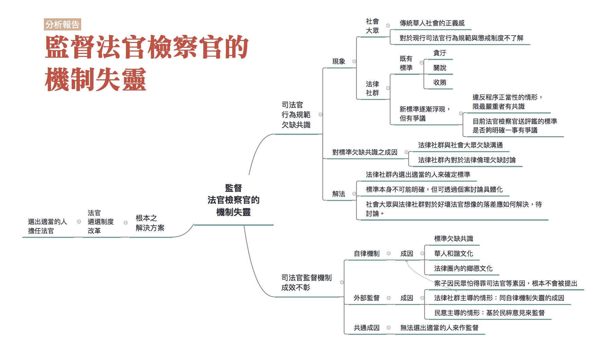

### 報告彙整人：林瑋婷

### 彙整資料範圍：
* 林孟皇口述成因分析記錄（記錄人：陳韋樵、林瑋婷）
* 楊時綱成因分析報告
* 0614全民司改運動第二階段籌備會議討論
* 0702評估會議

### 司法問題：

[缺乏明確客觀審查標準以淘汰真正不適任的司法官](http://talk.justice.care/t/%E7%BC%BA%E4%B9%8F%E6%98%8E%E7%A2%BA%E5%AE%A2%E8%A7%80%E5%AF%A9%E6%9F%A5%E6%A8%99%E6%BA%96%E4%BB%A5%E6%B7%98%E6%B1%B0%E7%9C%9F%E6%AD%A3%E4%B8%8D%E9%81%A9%E4%BB%BB%E7%9A%84%E5%8F%B8%E6%B3%95%E5%AE%98/87/3)

### 網路意見：

@John_Lin

理論上，基於人性的墮落面，無論甚麼群體，都難免有害群之馬，法官、檢察官自不例外，以往確實也有一些司法官出包。淘汰不適任司法官，絕對沒有人說不對，但除了有明確事證足認貪贓枉法的當然淘汰以外，所謂的不適任司法官，如何定義？如何將這樣的司法官挑出來淘汰？根本沒有人知道吧！

@John_Lin

有沒有違反違反第十五條第二項、第三項規定？要件相當明確，審查上應該沒甚麼大問題。

> 第十五條第二項：

> 法官參與各項公職人員選舉，應於各該公職人員任期屆滿一年以前，或參與重行選舉、補選及總統解散立法院後辦理之立法委員選舉，應於辦理登記前，辭去其職務或依法退休、資遣。

> 第十五條第三項：

> 法官違反前項規定者，不得登記為公職人員選舉之候選人。

有沒有違反違反第十五條第一項、第十六條規定，情節重大？也還不算太模糊，審查較困難大概是情節是否重大。

> 第十五條第一項：

> 法官於任職期間不得參加政黨、政治團體及其活動，任職前已參加政黨、政治團體者，應退出之。

> 第十六條：

> 法官不得兼任下列職務或業務：
> 一、中央或地方各級民意代表。
> 二、公務員服務法規所規定公務員不得兼任之職務。
> 三、司法機關以外其他機關之法規、訴願審議委員會委員或公務人員保障暨培訓委員會委員。
> 四、各級私立學校董事、監察人或其他負責人。
> 五、其他足以影響法官獨立審判或與其職業倫理、職位尊嚴不相容之職務或業務。

至於其餘各款情形，則以各種抽象的不確定法律概念為要件，再外掛倫理規範，其規範密度極高，司法官不能犯的錯包山包海，幾乎無限上綱至道德層面及順從程度，好像動輒得咎，因而以情節重大或嚴重性的要件加以調和，降低規範密度，似乎合理。但以各種抽象的不確定法律概念為要件，打擊面又超廣，審查標準的寬嚴就完全存乎審查人員一念之間，難免因不同個案而大異其趣，等於仰賴人治而非法治。另方面，因法官法就個案評鑑的打擊面超廣，但犯錯也不一定構成情節重大，即無法凸顯司法官的正面與負面指標。換句話說，如果司法官再怎樣小心都很難避免真犯錯或得罪當道而被犯錯，那你要他再多注意甚麼？只會逼死人。又如果反正就算有事也很可能因不確定要件而混過去，那心臟強的又怕什麼？結果就是，以上開規定淘汰真正不適任司法官很難，但拿來整肅被看不順眼的有骨頭的司法官，倒是很有用，最後就算評鑑沒事，但名譽、精神、時間都受損了。現行法官法能否將不適任司法官挑出來淘汰？還是造成反淘汰？因欠缺簡單明確可操作的客觀審查標準，實在不樂觀。簡單講，人民所說的恐龍法官、壞法官，實際上到底是甚麼？具備那些要件會成為該被淘汰的恐龍法官、壞法官，根本說不清楚。司法改革關於淘汰不適任司法官的部分，真正需要的是制訂出簡單明確可操作的客觀審查標準，而不是搶當審查人員。制訂出簡單明確可操作的客觀審查標準，當然不容易，卻才是正辦。

### 分析範圍：

以分析不適任法官的標準為何的問題為主，兼論不適任檢察官的問題。

由於原本的分析架構是林孟皇口述成因分析記錄發展出來的，與楊時綱的成因分析報告不太相同，所以本彙整報告是將楊時綱的成因分析報告的內容拆解後補充到林孟口述成因分析記錄中。另外，在補充內容時，也將楊時綱的成因分析報告口語化，一些比較細的法條引用也沒有再放入彙整報告中。

楊時綱的成因分析報告著重點在於說明民眾提出的不適任司法官申訴案（比較專門的用語是，評鑑陳請案）為什麼沒辦法成功使司法官受懲戒。與林孟皇的成因分析報告著重於討論不適任法官為何難以淘汰，重點不太一樣，有興趣的朋友可以自行參考。

### 利害關係人：

法官、檢察官。

### 相關法律：

法官法。

### 相關議題：

法官檢察官人事制度。

### 分析結果：

從網友 @John_Lin 的發言來看，本題原本提問關注的焦點似乎比較是擔憂現行的司法官行為規範準則太過不明確而且陳義過高，擔心被不當操作為整肅遭看不順眼的有骨頭的法官。但是在後來的分析中，原本的問題被擴張為「監督法官檢察官的機制失靈」，相關討論說明如下：

#### 司法官行為規範欠缺共識

由於要監督法官檢察官，前提其實是確認「到底什麼行為是不應該的？」但是關於這一點，其實欠缺共識。就司法官(含法官、檢察官)行為規範欠缺共識一事，可分成社會大眾的面向，以及法律社群的面向來談。

##### 社會大眾：

司法官行為規範的欠缺共識一事，在社會大眾的面向上，可以分成傳統華人社會正義感的問題，以及對於現行司法官行為規範的不了解。

###### 傳統華人社會正義感的問題

在長期的君主專制與威權統治下，臺灣社會有很深層的「包青天文化」，一般民眾對司法與法律的功能想像，多數仍停留傳統華人社會的正義感中。由這種正義感所形塑的好壞法官判斷基準，與我國法律中所引進的普世人權價值不同。這使得社會大眾所想像的法/壞法官，與法律社群的想像有所不同，甚至某些關於好/壞法官檢察官的標準可能是有問題的。

例子: 

1. 2013年11月21日八里雙屍命案被告謝依涵，於一審受判死刑，而於二審第一次開庭時，高等法院法官當庭送日本作家門田龍降的書「與絕望奮鬥」，並當庭跟謝依涵說「這本書的重心，在於被害遺族說了一段名言『死刑的意義在於，讓一個犯了殺人罪的犯人，誠實面對自己犯下的錯誤。』」(法官贈書勸謝依涵面對錯誤) 法官當庭送書教訓被告的案例，國內少見，刑事訴訟法也無規定法官可以當庭送書給被告或不可以，民眾或許認為法官懂得當庭教訓被告，是一位好法官。但是法官送一本「支持死刑」的書給被告，是否未盡調查即認定被告有罪應處以死刑，而心態偏頗？

2. 2014年3月7日洪仲丘案一審宣判，18名被告中，有12位判6月、5月、僅有一位被告受判8個月，普遍被民眾視為輕判且受到批評。(洪仲丘案一審輕判 僅連長8月，餘17人6月或無罪)然而一審承審法官鄭吉雄在審判中時常強勢地批評被告(審判長鄭吉雄 震懾一竿子被告)，卻又受到好評，那這樣的法官究竟是好法官還是不好的法官？

像前述情形，雖然按照現有的法官行為規範，可能是有問題的，但是如果送法官評鑑卻很可能不成立，因為評鑑委員可能受傳統華人社會正義感的影響，不覺得這樣的作法有嚴重的問題。

###### 對於現行司法官行為規範與懲戒制度不了解

一般民眾非長期受法學訓練之人，也不熟悉現行司法官行為規範，因此一般民眾不見得有能力依照現行規範，如法官法上的規定，來判斷司法官的言行是不是違法或不當。特別是我國目前並未全面施行強制律師代理，在這樣的情形下，也不會有律師告訴他可能的問題在哪。

而有些民眾官司輸了之後，就越想越不對，覺得自己明明很有道理，怎麼會輸了官司，一定是司法官有問題，希望將司法官送評鑑，於是就開始找相關的法律規範。但問題是民眾所找出來的行為規範可能比較是枝微末節的事，或是司法官在個案判斷上有相當的空間，例如要不要調查證據，到底要採納哪些證人的說詞。這些點或許可以作為案件上訴的理由，但是卻不見得能夠當作評鑑司法官的理由，這是因為按照現行法官法的規定，送評鑑必須要「情節重大」，這邊的「情節重大」本身就有定義不明確的問題，而如果司法官對於某件事的判斷本就有相當的空間時，就更容易被當成是必須尊重司法官個案判斷空間之處。

##### 法律社群：

在過去，法律社群對於司法官行為規範有比較明確的判準，若法官、檢察官有「貪污」、「收賄」、「關說」之情形，就會被認為是不適任。但是現在這樣的情形已經很少了。

到了現在，法律社群對於司法官行為規範則變得比較模糊。在現在，法官檢察官的作為是否符合程序正當性的要求，以及裁判品質之問題，逐漸開始成為監督法官檢察官的重要參考判準。特別是程序正當性的問題，比起裁判品質是更為重要的判準，因為裁判品質其實相當程度屬於法官的心證判斷，沒有客觀標準。

違反程序正當性逐漸開始成為判斷不適任法官檢察官的標準，但是關於程序正當性的重要性、標準為何，在法律社群內仍欠缺共識。固然一些很嚴重、大家都沒辦法忍受的行為，應該還是有共識，例如一個法官要調解，當事人不願意接受調解，他就衝到調解室去罵兩造當事人。或是法官開庭開到一半接電話，叫律師暫停然後自己講電話。不過還有很多部分，其實大家不是那麼有共識。例如：檢察官得否在起訴時，就具體講他覺得被告應該被判多久或死刑(檢察官動輒具體求刑，未審先判也違反無罪推定原則，監察院有糾正法務部)；檢察官得否違反禁見規範，而私自帶證人之女友接見證人，以策動證人翻供；刑事訴訟法規定，準備程序不得訊問被告本案事實，這是為了避免過去過於依賴自白來判案的問題，但是實務上法官在準備程序一開始就訊問被告的情形比比皆是。

另外，隨著法官法的訂定，法官檢察官開始受到外部評鑑機制的監督，但是並未針到底哪些行為可以提出評鑑，作出明確的規範。在作評鑑時，往往就是直接引用101年1月5日司法院訂立之「法官倫理規範」、101年1月4日法務部制定之「檢察官倫理規範」。但這些規倫理範部分內容偏向於道德宣示與行政細節，是否能用來作為評判不適任法官檢察官的標準，是有問題的。再加上法官法僅規定，如果有法官檢察官違反法官檢察官倫理規範「情節重大」，可以將這名法官或檢察官送評鑑，但是到底什麼是「情節重大」，人人詮釋不同，導致部分法官檢察官擔心，評鑑制度可能遭到惡用。有關係的法官檢察官被送評鑑，就會在「情節重大」的詮釋輕輕放下；而認真有骨氣的法官檢察官反而最可能因此被整，縱使評鑑不成立，但走這一遭聲譽受影響，而且也大大加重他的工作負擔。

關於法官檢察官評鑑制度，是否因標準不明而遭到惡用一事，與會者彼此之間意見並不一致。有與會者會指出，到底評鑑的標準太嚴還是太寬，其實隨著你是站在法官或人民的角度來看，會有所不同。然而與會者之間沒有爭議的是，法律社群對於司法官行為規範，確實欠缺充分討論。

法律社群對於司法官行為規範，欠缺充分討論一事，問題可能出在法學教育。長期以來法學教育不重視法律人倫理的教學與思辨，以往的司法官考試根本沒有法律倫理這一個科目。而長期以來，臺灣的法官、檢察官、律師貪贓枉法、關說、侵占當事人財物等等違反職業倫理的情況，罄竹難書，這正足以說明臺灣整個法學教育的缺失所在。

另外，問題也可能出在法律社群沒有引入其他社群的思考工具或資源。例如說，從現有的法官倫理規範、檢察官倫理規範中的規定就可以看出，其中完全沒有倫理學上對於義務與超義務行為的區分。義務就是你一定要做到的事，沒有做到就應該要加以譴責；而超義務是你做到很棒，但是沒有做到沒有人會怪你。這些倫理學上的分類架構早就存在，只是法律社群不知道。結果，這些倫理規範中放入了許多超義務行為作為行為指標，基層法官、檢察官當然無所適從。

總的來說，關於司法官行為規範欠缺共識一事，可以分成社會大眾的標準與法律社群內的標準有落差，以及法律社群內也欠缺共識兩部分。針對「社會大眾的標準與法律社群內的標準有落差」就必須要思考，是要以社會大眾的標準為依歸，還是以法律社群的標準為依歸？如果有落差的話，法律社群和社會大眾要如何溝通，以確立標準？針對「法律社群內也欠缺共識」一事，除了強化法學教育中關於法律倫理的討論之外，搭配的作法就是在法律社群內選出適當的人選來確立標準。
然而必須注意的是，倫理規範必定有它的不明確性，也就是說，類似於「情節重大」這類不確定的概念可能還是會有，而克服不明確性的作法是透過案例的探討來具體化規範的內涵。 

#### 司法官的監督機制難以有效運作

關於司法官的監督機制難以有效運作一事，可分成法官自律機制的運作情形，以及外部監督機制的運作情形兩部分來分析。

##### 自律機制

當法律人倫理相對模糊，而法官體系與檢察官體系都來自於司法官訓練所，有學長制、期別文化的問題，也有華人和諧的文化，難免法官自律委員會保護法官同僚的心態。而其實，包括法官、檢察官、學者、律師在內的法律人，其實是一個人際網路交往密切、彼此互有牽連的法律社群，除了學校內的學長（姐）、學弟（妹）、家族關係外，彼此可能也是師生、配偶或一定的親有關係，法律人彼此間也會有鄉愿與和諧文化的問題。

##### 外部監督

至於外部監督機制如法官、檢察官評鑑委員會，雖然號稱有法官檢察官之外的人擔任委員，但是評鑑成效也不彰，這部分可以分成兩部分來談：

###### 案子根本不會進入評鑑委員會

如前面所提的，由於民眾不見得了解現行的司法官行為規範及懲戒制度，再來有些民眾擔心得罪司法官而影響自己的案子，都有可能使得雖然實際上司法官有出現違反行為規範，但是卻因為無人申訴所以案子根本不會進到評鑑委員會。

另外，目前評鑑請求的期間過短也是個問題。一般的評鑑請求期間限於案件辦理終結兩年內(註：例外的情形是，因故意或重大過失，致審判案件有明顯重大違誤，而嚴重侵害人民權益的情形，評鑑請求期間是定讞後兩年內，但是要件嚴格非常難成立)，但是這邊的案件辦理終結不是指案件整個確定，而是指案件已脫離受評鑑的司法官之手。也就是說如果是想申訴偵查檢察官或是一審的法官，二審打了兩年就超過一般的評鑑請求期間了。一些民眾要嘛不知道這個期間的限制，要嘛因為案件還在進行中，不願得罪司法官也不願意檢舉，結果想申訴時就已經超過評鑑請求期間了。

###### 已送評鑑但評鑑沒辦法成

有些移送評鑑的案件，確實司法官的行為有違反程序正當性，但是評鑑請求依舊不成立。在此的問題就難以單純理解為「官官相護」了。主要的問題還是回到針對司法官的行為規範，社會、法律人欠缺共識的根本問題，以及評鑑委員會委員選任的方式不具有民主正當性。

首先，許多法官、檢察官被移送評鑑，是因為他們的作為違反程序正當性，但是當社會中根本上對於程序正當性的重要性及其內容沒有共識時，評鑑自然難以成立。再者，評鑑委員會委員是由各專業團體票選，或是由專業團體推舉人選後由司法院院長、法務部部長遴聘，但是這些委員不見得是真心在乎評鑑，可能是為了求名求利。而偏偏目前的選任程序，不會將受選任者的相關經歷或狀況公開，讓他們受公眾的討論與檢視。至於監察院、法評會、職務法庭甚至國會等等，其實都屬於外部監督機制的一環。這些外部機制或由法律專業社群的人主導，或基於民粹意見從事監督，前述司法官行為規範欠缺共識的問題，也一樣會出現。

#### 監督法官檢察官的機制失靈，根本的解決之道：建立良好的法官遴選制度。

監督法官檢察官的機制失靈固然是個問題，不過更重要的是，從前端的法官遴選機制做起，一開始就選出好的法官。

要能做到這件事，需要好的法官遴選委員會的委員。而要能選出好的法官遴選委員會的委員，要靠具有民主正當性的委員選任機制，也就是說，在選任這些委員時，不僅應將他們的經歷或狀況公開，讓他們受公眾的討論與檢視，這些委員的選任更應該直接或間接得到國會的同意。

==========

## 有些警察是執法人員自己卻不守法

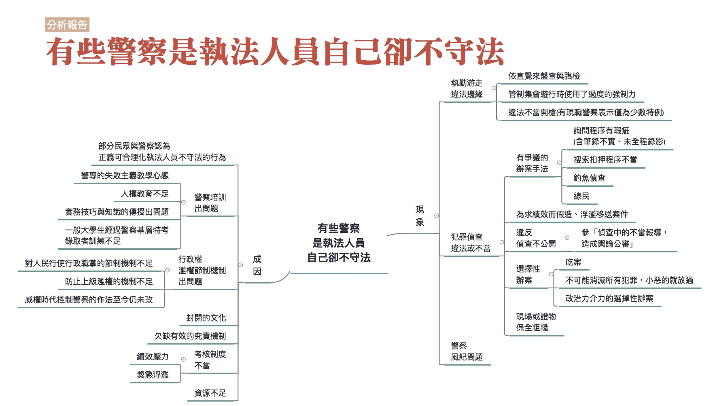

### 彙整人：林瑋婷

### 彙整範圍：

* 郭德田口述成因分析記錄（記錄人：黃盈嘉）
* 現職警察口述成因分析記錄（報告人：林瑋婷。記錄人：廖禾安）
* 時瑋辰成因分析報告
* 0628全民司改運動第二階段籌備會議討論
* 0709評估會議討論

### 司法問題：

[有些警察是執法人員自己卻不守法](http://talk.justice.care/t/24)

台灣的警察在執勤或辦案時，時常不守法。在盤查時未出示自己是警察的證件，未附具體理由就要求民眾提供個資、對民眾進行搜身或翻看身邊的物品。在辦案時，以半強迫的方式取得犯罪嫌疑人的「同意搜索」，甚至以各種可能違反刑事訴訟法的作法，如刑求逼供，或是以威脅、利誘等方式對嫌犯套話，之後再正式作筆錄並錄音。

### 網路意見：

無

### 分析範圍：

本報告分析的範圍涵蓋整個「有些警察是執法人員自己卻不守法」。但是由於大家在討論這個問題時，時常跳到其他警察制度的問題，這些問題雖然不在原本的討論範圍內，但本身相當重要又與警察執法狀況相關，因此在本彙整報告中，也會呈現這個部分。

### 利害關係人：

警察、一般民眾、被告

### 相關法律：

警察法、警察勤務條例、警察職權行使法、警察偵查犯罪手冊、刑事鑑識手冊、集會遊行法

### 相關議題：

臨檢、盤查、偵查、不正訊問、鑑識、集會遊行、用槍、同意搜索、警察風紀、績效、警察養成、警察過勞

### 分析結果：

關於警察執法可能違法或不當的情形，我們分成執勤、犯罪偵查、風紀三面向的問題來討論。執勤指的就是警察執行的各項勤務工作，在這裡指的比較限於涉及行政調查但又還沒有正式進入刑事偵查的工作內容，例如巡邏、臨檢、盤查等等。這類勤務可能涉及對人民即時性地使用強制力，容易有違法或不當的情形，就特別拉出來談。

犯罪偵查也算廣義的執勤範圍，但是特別拉出來談，理由是因為犯罪偵查的後端就是刑事處罰，涉及到把人抓到監獄去關，甚至執行死刑，弄錯的話是很嚴重的事。此外，為了能讓犯罪偵查能夠順利進行，國家也容許對於被告進行各種更加侵害他權利的各種調查行動。此時有必要討論怎樣的調查行動是可以的，而哪些又是不行的。這部分在司法中特別重要，因此把犯罪偵查可能違法或不當的部分又特別拉出來討論。

警察風紀的問題很重要，因為容易涉及包庇犯罪，是嚴重的警察不法問題。但是因為資訊不足，我們沒辦法對這部分的問題比較詳細而且可靠的成因分析。
 
#### 現象

##### 執勤遊走法律邊緣

警察執勤遊走法律邊緣的問題，常見的有以下幾類：

###### 依直覺來盤查與臨檢

其實警察對某些人進行盤查與臨檢，往往依據的是自己的直覺。這些直覺是當警察久了累積起來的，例如會覺得有些人是吸毒臉，或是有前科，結果一查確實是這樣。又例如不願出事證件的人，警察通常就會起疑，會想用各種方式查證，看他是不是通緝犯。又或是有的警察會覺得見警就逃非姦即盜。很多警察都有這種經驗，會直觀覺得你有毛病，因為行為模式還是會透漏出某些訊息。但是這些直覺很難符合釋字535號要求的臨檢要有「相當理由」足認其行為已構成或即將發生危害者。

###### 集會遊行中使用了過度的強制力

在群眾抗爭的場合，警察與民眾間常有肢體接觸，警方該如何拿捏執法的強度，牽涉到比例原則，這在實務上往往操作上不夠細膩。
在集會遊行的狀況，若發生肢體衝突，如果是因警方過度操作執法的強制力，因而造成民眾不必要的受傷，是不是有必要如此，這是要討論的，如果過度操作警察職權行使法的強制力，就有可能牴觸法律界線。

在做成釋字718號解釋後，大法官仍然認為集會遊行需事先申請，譬如說民眾圍在立院門口，警察會直接認定違法而開啟管制，管制方法可能是把民眾圍成一圈，不讓民眾進出，或以優勢警力將建築物圍起來，有人要離開的時候，此時衝突就會發生。有民眾要試圖突破警方管制，過程中與警察發生衝突，民眾覺得我要離開都不行，因而罵了髒話，警察就用現行犯依妨害公務罪嫌逮捕，這就涉及警察利用國家權力的優勢，激起民眾跳入違法的圈套的問題。

###### 違法不當開槍

當今還有一個熱門的問題，警匪追逐的過程中可不可以開槍？警方追捕嫌犯，有時候追的是行政違失行為，此時若警方開槍，開槍的時機往往會被事後檢討。若開槍造成傷亡，勢必還會有國賠責任的問題，而現在法院常做出對警察不利的判定，而使警方必須因此負國賠責任。

法院判決認為如果現場有更好的措施，那就不該開槍，但警察覺得難以達成，可能需要進一步檢討，警察的訓練是不是有所欠缺，讓他們在開槍的時候沒有辦法做好判斷，以致於緊急狀況時無法應付。

關於法院這樣的判決，引發警界不滿。部分警察認為，那就讓嫌犯逃走，避免使用槍械；也有警察強烈要求放寬用槍，警察才能維護治安，保護市民。到底這樣的判決是否會助長警察不當用槍的風氣，存有不見看法。口述訪談記錄的受訪者郭德田律師認為，這反而助長消極、不願改進的風氣，使違法不當開槍的狀況不減反增。但是受訪的現職員警察認為，許多警察對國賠案反彈，認為應該要放寬用槍，其實是希望避免背法律責任，而不是真的想要用槍。事實上，用槍是非常非常少的特殊個案，大部分的警察都會盡量避免用槍。因為大部分的人都承認自己槍法沒有很準，不小心打錯地方了很麻煩。警察在學校為了保持射擊能力，一週打二十發，然而實務上是無法維持這樣的訓練量，通常半年才打二十發，密度完全不能比，因此很難維持射擊能力。如果出事情會被告、被調查，因此警察通常是會消極不使用槍枝。

##### 犯罪偵查違法或不當

犯罪偵查違法或不當的情形，有以下幾種常見類型：

###### 有爭議的辦案手法

1. 詢問程序有瑕疵

    關於詢問程序有瑕疵的問題，十分常見的是正式詢問前先溝通。根據現職警察的說法，詢問前的溝通其實有點像正式演出前的準備，會告訴受詢問人大致方向，或是提示一下，告訴他其實證據都齊全了，請他配合一點，如果不配合也只是讓檢察官印象更不好之類的，然後再開始做筆錄。7月9日評估會議中，有與會者認為這樣的作法有好有壞。好處是，警察一開始根本就不知道發生了什麼事情，你叫他去問，他其實也問不出個所以然來。所以他一定是透過聊天，「一支菸給你，你今天做了什麼事情？」，大概先了解一下來龍去脈之後，他才會進入正式的詢問。而壞處是，警察可能想要透過訊前訊問去誘導一些證人或被告講出不實在的話。

    另外的詢問瑕疵還有：警方不將嫌疑人列為被告，卻列為關係人、證人行詢問，但實際上把嫌疑人當作被告在問。或警察明知當事人有找辯護人來，卻把辯護人支開，把被告帶到小房間去「曉以大義」。可以想見，若被告沒有選任辯護人，可能被告就會要求自白，這樣筆錄的真實性就有疑慮。

    詢問本身有瑕疵的問題，搭配著警察詢問筆錄常常有記載不實的情形(例如明明是誘導，卻記錄成被告主動說出)，以及詢問過程未全程錄音錄影，就更形嚴重，因為後兩者會掩蓋了詢問瑕疵，讓這件事情不受檢視。

2. 搜索扣押程序不當

    搜索扣押程序不當常見之一是「同意搜索」的問題。基本上搜索因為涉及自由權的侵犯，因此原則上是要經過法院准許後才能夠進行搜索，但是「同意搜索」是例外，因為同意搜索講的是警察取得被搜索人真摯的同意，被搜索人自願放棄他的自由權，法院沒有必要為了保障他的自由權再限制警察進行搜索。

    進行搜索。但是實務上時常出現以各種方式威脅勸誘被搜索人同意搜索，而非取得被搜索人真擎的同意。

    另一個常見的搜索扣押程序不當，是濫行扣押手機。

    手機屬於當代的產物，當行為人有違法行為時，現場蒐證警察可能會因為認為手機是可為證據之物，或者是犯罪工具，而要求扣押手機，但可能從表面上行為人違法的事由，看不出扣押手機的關聯性。

    例如在集會遊行中，行為人罵警察、聚眾不解散，其實犯罪事實與行為人持有手機沒有密切關聯，且在正當法律程序之要求下，也不是警察決定要扣就扣，需要有檢察官支持，但部分的檢察官會容許警察扣押手機。

    於7月9日的評估會議中，與會者也指出，不限於手機，在其他證物的扣押部分，也可能有執行不當的情形存在。

3. 釣魚偵查

    基本上這種調查手法並沒有直接牴觸法律。在釣魚偵查的情況，學界討論是可以允許此種調查方式，但若是行為人原本毫無犯意，警察卻故意引起犯意，使行為人實行犯罪因而逮捕，則是不被允許的。

4. 線民

    每個警察單位都有線民，否則沒有情報來源。因為警察不可能穿制服到處抓人，所以若不透過線民，將無法知悉犯罪如何發生。線民的使用，有時會涉及

    容許容許小犯罪發生，目標是要抓到後面的大的。例如毒品案件沒內線很難破獲，也許就要容許小的藥頭暫時存在，以獲取更重要的情報。

###### 為求績效而造假、浮濫移送案件

台灣警察辦案深受績效壓力的影響，有些警察會為了爭取績效而造假或浮濫移送案件。

造假的案例有與會者提供以下例子：以前有肅槍專案，就規定說你一定要在期限之內查獲幾把槍出來。以前士林分局就有一個很有名的栽槍案，他最後一天績效掛零，傍晚突然就通知記者出去，說弄到三把槍。後來那三把槍證實去一個黑道的家裡，然後繳出三把槍叫小弟扛罪。另有與會者提供警界的笑話：以前大家都在垃圾桶撿到槍，後來後來上級就規定不能在垃圾桶撿到槍。大家就變成在什麼河堤邊、公車站牌撿到槍。

浮濫移送案件的情形則是指，有罪的證據不夠充分，警察仍然將案件移送給檢察官。由於警察是為了獲得績效而浮濫移送案件，因此將案件移送之後他又因為業績壓力減小，難有移送前的辦案動力，縱使檢察官要求警察補足資料，警察也不見得會理會。另參「法官檢察官案件量負擔大，辦案品質受影響」。

###### 選擇性辦案與吃案

警察不是每個案子都會辦，一定會有挑的情形。

有一些選擇不辦案的情形，就是常聽到的「吃案」。也就是民眾報案但警察不想處理，所以就連報案記錄都沒有。

另外有一些選擇性不辦案的狀況，比較涉及的是犯罪社會學的問題。學法律的人可能覺得警察知有犯罪發生就應該要偵辦，否則就是違法。但現職警察表示，犯罪是被定義出來的。社會上本來就有很多現象，有個強而有力的力量去要求界定犯罪的時候，就會把很多東西變成犯罪。但是事實上這些東西存在很久了，不可能一次消滅。當警察面對現場的時候就會判斷，這到底有沒有這麼高的惡性？對於常在辦理性交易的警察而言，性交易就是一個本來就存在社會上的東西，但是對於到底要不要『刻意』去抓，有沒有『必要』會讓人感到困惑。

另外還有一些選擇性辦案與不辦案可能就是政治力介入了。

###### 現場或證物保全粗糙

有些警察到現場後會更動現場或移動證物位置，這些都可能影響犯罪事實的還原。另外，警方的證物保全有時候也顯得有些粗糙，證物可能就放在警察辦公室的抽屜，甚至沒有證物袋。例如證物上的指紋是重要的證據，指紋要保存於溫度較低的地方，但各地警察局可能欠缺這些設備，沒有妥善保存，指紋日後進到法院可能就驗不到了。

###### 違反偵查不公開

參「[偵查中的不當報導，造成輿論公審](http://talk.justice.care/t/235)」這一題的討論。

##### 警察風紀問題

警察風紀是重要的問題。一些警察可能涉及簽賭、收賄、包庇犯罪等等的情形。

#### 成因

##### 部分民眾與警察認為正義可合理化執法人員不守法的行為

警察一些執勤或犯罪偵查上的違法或不當行為，部分民眾可能不只不反對，甚至還支持，理由是因為「正義」可以合理化這些行為。

以違法或不當用槍的問題來說，部分民眾期待警察積極用槍，希望警察當場制裁犯罪。在此民眾混淆了警察在法治國家中行為的界線。在法治國家中，為了保護人民權利不受到國家的過度侵害，要讓某個人為犯罪負起責任，會將權力分散給不同機關去判斷及執行，警察並沒有直接對人民執法的權力。可惜的是，政府沒有很努力去教育民眾關於法治國的觀念。像之前的死刑執行，法務部沒有去跟民眾教育、溝通，告訴民眾，為什麼要執行，為什麼這個案子已經符合兩公約最後手段的程度了，只是利用民氣，會讓民眾誤會，我們就是很快要把壞人槍決掉。

而部分警察自己也會用「正義」來合理化不守法的行為。例如部分警察依直覺來盤查與臨檢，這跟法律的規定不符，但因為多數的警察都會有使命感和正義感，有些人就會用正義來合理化自己的行為。

##### 警察培訓出問題

###### 警專的失敗主義教學心態

警專的教育人員有一種很奇怪的心態，就是認為自己的學生程度很差。這種心態讓警專的教育辦得不好。

###### 人權教育不足

目前警專、警大的人權教育是不足的。警專、警大目前是有刑事訴訟法相關的課程，有講一些人權問題，但是就警察的執法需要來說，還是遠不足夠的。

舉例來說，在警察培訓體系中，對於集會遊行的介紹不是從理解人民為什麼要集會遊行，如何保障人民的相關權利著手，而是帶著敵意地將集會遊行界定成暴力事件，這可以參考《保安警察實務》一書。另外，即使是警專的教科書和題目，提到美麗島事件，都還是講高雄暴力事件。學校內就是這樣定調，經過兩年教育之後就覺得這是暴力事件。

又例如，警察會無端去盤查移工的居留證，過程裡面都非常粗糙，帶著很大歧視性。警察對待移工或者新移民，應該要有多元的認識，包容或種族平等等等這樣的觀念。7月9日評估會議的與會者甚至認為，這些認識根本是更基本的人文教育的一部分，但目前這些卻是缺乏的。

在7月9日評估會議中，有與會者指出其實聯合國或是國際的人權組織目前已經有出了非常多人權的教材，包括說警察的改革的教材，或者說警察怎麼比較好地處理集會遊行等等，但是這些警察培訓體系應該都沒有納入。

最後，警專、警大的人權教育不足，不只是教材的問題，更重要的是跟警專、警大中學生就是以不人權的方式被對待，這在生活上就是嚴重的反人權教育。警專、警大重視所謂的「精神教育」，強調服從、上下關係，很像當兵，實際上就是軍事訓練。有現職警察表示，以前在警大被管理的時候，常常讓他感覺非常矛盾，像是學校都有教刑事訴訟法，講說要重視人權，但學校的內務檢查卻直接翻動他們的私人物品。大家覺得得很矛盾，你課堂上學的是人權保障，但實際上卻要接受非人權的待遇，我到底要遵守哪一種？其實警察是有人權概念的，但因為教育被扭曲成說一套、做一套，讓警察覺得很矛盾。

###### 實務技巧與知識的傳授出問題

有現職警察表示，警專、警大中的教學，與警察實務工作所需要的技巧與知識是脫節的，一些實務技巧與知識往往是單位中的前輩教的。這位現職警察表示，當他一畢業就派到外勤時，衝擊很大。去現場搜索，大家都知道法律規範，但到底要怎麼搜索？問人要怎麼問，兇人要到什麼程度，界線在哪裡？被質疑的時候怎麼反駁？這其實都應該在學校講，但實際上是畢業後才在職場中學到。又例如詢問被告前先溝通好要講的內容，他剛畢業的時候也是懷疑這樣好嗎？後來自己承辦案件才發現，如果不事先溝通，其實會問不下去。這些正式詢問前的溝通技巧，是單位裡的前輩教新人的。學校裡的課程縱使有提到警察詢問，也是從刑事訴訟法的角度去講，但是學了法律是不會知道當面對受詢問人時，要怎麼問才能問出東西。搜索也是類似的情形，怎麼做搜索，往往都會看前輩怎麼做，然後學。

關於現場或證物保全粗糙的問題，也與學校教的和實務脫節有關。有現職警察表示，刑事鑑識課程會教一些鑑識科學，但學校教的往往和實務情形不一樣。例如學校裡都教要封鎖現場，但問題在於，你如果必須要進到現場，才會知道真的是現場。不知道這是否是現場，就不會知道是否要封鎖。例如說自殺，要看到屍體才知道，可是當警察一進去，現場就被破壞了。另外，第一線基層員警都要工作，不能一直上課，而殺人等需要鑑識知識的案件又少，知識與經驗都可能跟不上。 

###### 一般大學生經過警察基層特考錄取者訓練不足

7月9日評估會議中有與會者指出，事實上現在除了警大跟警專的教育之外，還有警察基層特考三四等考試，一年有一千多個人是透過這種國家考試進去當警察。他們可能是英文系、電機系、藝術系、音樂系畢業，沒有受過任何的警察專業訓練，只有到警專作基層特考訓練，出來就要擔任警察的勤務。但是警察工作太繁雜了，相關的訓練是嚴重不足的。

##### 行政權權濫權節制機制出問題

警察的英文是Police，這個詞原本就是希臘文，意思就是行政，其實警察是一個行政權。行政權有對人民行使職權時的行政職掌如何節制的問題，這就是涉及警察風紀出問題的原因。我們說不怕官只怕管，你再小的官，再小的管區的警員，你都有管到一樣東西，你管到這樣東西就會有利益，管到這樣東西權力是過大還是過小，這個東西要有節制的配套、制度。

另外，行政權還有如何防止上級濫權的問題，這就涉及上級基於政治考量要基層員警選擇性辦案，或是上級明示暗示基層員警不必守法的問題。在324佔領行政院事件，據了解之所以會發生警察打人的情形，其實是因為長官私下暗示，打的越兇，他們就不敢再佔領，因此警察直覺的反應就是...。可惜的是，關於如何防止上級濫權的機制，目前也是不足的。而警專、警大重視所謂的「精神教育」，強調服從、上下關係，形塑警察體系內部的上命下從文化，也讓上級濫權的問題更為嚴重。

在6月28日全民司改運動第二階段籌備會議討論中，有與會者指出，這其實也涉及轉型正義問題。在威權時代，要先控制警察有服從的性格才能控制社會。為了控制警察，警察採軍隊化的設計，並搭配績效獎懲來控制警察。此外政府也用高福利去換取警察的效忠。

##### 封閉的文化

警察體系有著封閉的文化，也就是說不去了解外界，過於重視內部的團體性，甚至為了自我保護，說一套作一套。這種封閉文化會讓某些反人權的想法在內部不斷強化。例如警察有很多LINE群組，會有工作用的、沒長官的、同單位的、同期的、同隊的等等，一個警察平均有四五個警察群組，關於集會遊行的片面、片斷訊息，會在這些Line群組裡不斷流傳。在這些流傳的訊息中，集會遊行看起來就像是暴民們的行動，有時候看了這些訊息也不知道集會遊行實際訴求的內容。

關於警察的究責，也有受封閉文化影響的問題。如果追究責任會涉及到一整群人，自我保護的機制就會發揮。7月9日評估會議有與會者表示318學運、324佔領行政院中的暴力行為，警察內部是沒有追究的。他不能追究的理由是，那是個集體行為，從下令的現場指揮官到現場的員警，其實不是打人那個有問題，是打人那個跟他旁邊一整群人的問題。但是如果是個別人的檢舉，則仍然可能被團體作切割處理，例如如果有社會地位的人去檢舉個別警察，這個行為可以跟團體作切割的話，例如態度不佳、罵髒話，個別警察如果沒有錄影證明自己沒有前述情形，就會被記申誡。

封閉文化其實從警專、警大就開始形成，因為警專、警大都是集體生活，與外界隔離。有現職警察就表示，封閉其實很不好，警大不像其他大學一樣可以接觸其他系所，接觸不同社會新知；此外警大生絕大多數的時間都要待在學校，對於之後自己執法時所要面對的民眾，容易缺乏接觸與理解。那最終培養出來的警大生就只會考試，與社會脫節，實際上面對民眾時也不知道怎麼辦。

##### 欠缺有效的究責機制

關於警察執勤游走違法邊緣，以及犯罪偵查違法或不當，目前也欠缺有效的究責機制。7月9日評估會議的與會者就指出，目前警察執勤時雖然有編號，但沒有配戴名牌，民眾不容易記憶，讓究責困難。有些民眾在集會遊行的現場被警察暴力對待，在混亂之下，實在難以單靠編號記住施暴警察。另外，檢察官、法官也不太會去追究違法取得證據的警察的責任，這可能與這三者在工作職務上常常需要合作，所以也就睜一隻眼閉一隻眼有關。最後，目前關於警察違法取證的問題，在目前的判例中，也根本不構成濫權追訴罪，因為濫權追訴罪限於追究法官和檢察官。

##### 考核制度不當

警察的考核制度有很嚴重的問題，目前提到的情形有以下幾個：

###### 績效的問題

績效會影響警察的執勤和犯罪偵查，特別是專案績效更是問題重重。專案是由警政署頒佈的重點工作目標，專案會有專案的績效，各個警察局分局的績效也會受到評比。每個專案長則一個月，短則幾天。專案制度本身很不合理。因為怎麼有特定案件就剛好在這個禮拜發現、偵破？如果這段期間剛好那一類型的案件都沒發生怎麼辦？有某些評比項目甚至是傳統或一般偵查手法就很難做的，有點強人所難，例如要求必須在網路上查獲特定案件。

因應專案績效的要求，有些警察就會造假、浮濫移送案件。另外有些警察則會囤案。囤案就在專案執行前就先囤好案，然後到時候看需要什麼再把它拿出來。因為移送可以隔三個月，所以這一切合法，但就是行政效率低。明明都辦完，卻等春安這類專案的執行時間到，再一次移送。矛盾的是，囤案又會跟管考衝突，因為公文管考又會問你為什麼這麼晚移送。

專案其實主要是長官求表現，多數基層警察其實很反感。長官重視專案是因為這就是民眾用來檢視警察表現的方法，而且議員質詢時也會問到警察有什麼作為，專案在這個時候就可以拿出來講。

###### 獎懲浮濫

警察的獎懲非常浮濫。警察可能會因為一些很小的事被記過，例如警察帽子沒有戴好也要被記過。但同時因為有績效又很容易記功，所以有的警察被記幾百個小過，但他也有幾百個小功。過於浮濫的獎懲，讓考核制度失去效用。

##### 資源不足

部分警察一些執勤和犯罪偵查的違法與不當，也與資源不足有關。

現場或證物保全粗糙的問題，跟資源不足密切相關。第一線的鑑識人員其實是不足，很現實的原因就是感覺「不經濟」。真正重大或矚目刑案也並不是那麼多，因此會認為沒必要生產那麼多人員。另外，鑑識相關設備也是不足的。依照規定，警察進入現場要戴手套、頭套、腳套，但實際上有手套就不錯了。警察不會帶手套、頭套、腳套去出勤務，派出所也沒腳套。警察腰包有槍、手銬、相機、警棍、手電筒等等，這些就夠重了，如果還要帶更多，大概會走不動。

另外，警察對集會遊行的敵視，也與在資源有限的情形下，警察負擔過重的勤務有關。一旦有集會遊行發生，警察就要全面停休，吃也不成吃、休也不成休，回去還要做完業務才能下班，工作量暴增，壓力非常大。這強化了警察對陳抗的敵視。

延伸來談，警察過勞其實本身就是目前警界的重要問題。警察的勤務過多，很多勤務其實與維護治安沒有關係，例如有些法院文件領不到就會送到派出所，教召也由警察送。另外，110專線也沒有好好篩選案件，而110派了案基層員警就一定要去現場看，例如有警察曾協助過抓蟑螂、抓鬼、吃臭豆腐太辣、公車冷氣太強等案件。有現職警察表示，台灣公務機關的屬性就是大家互相推事，可以推的就馬上推過去，警政署有點像大家的小弟，很多事情都被到警察身上。

另外，有些勤務根本沒有效果，卻還是要做。例如早有研究指出，見警率(人民看見警察的程度與頻率)對治安的維護是無效的，唯一達成的效果就是安撫人心而已。像明明人多的地方根本不適合使用槍枝，鄭捷案後還是規定要警察揹槍上捷運。不過因為被質詢時，可以拿出來講，所以警方還是會重視提高見警率。又例如派出所員警每個月要去查戶口，像是毒品、竊盜等。訪查其實沒有強制力在，只能聽被查戶口的人口述，也不能得知他說的是真還是假的。而且也不是大家都乖乖在家裡等警察來查，後來很多時候內容是造假的。又例如警察站交通崗其實並沒有疏通交通的功能。但是大家還是很希望看到警察在那裡揮手，就有安全感。疏通交通要靠控燈，可是長官希望基層警察站在那裡，因為這樣能被「看到」。

改善警察過勞的重要作法，就是基層員警團結起來，透過協會或工會，警察的工作環境可以漸進、緩慢的改善。有現職警察表示，警察其實很欠缺「勞動意識」，現在警察常常不被當做人，而是被當做工具使用。如果警察的勞動意識覺醒，也許也可以在其他的方面，例如對陳抗的理解、人權等等做更多反省。

==========

## 司法誤判

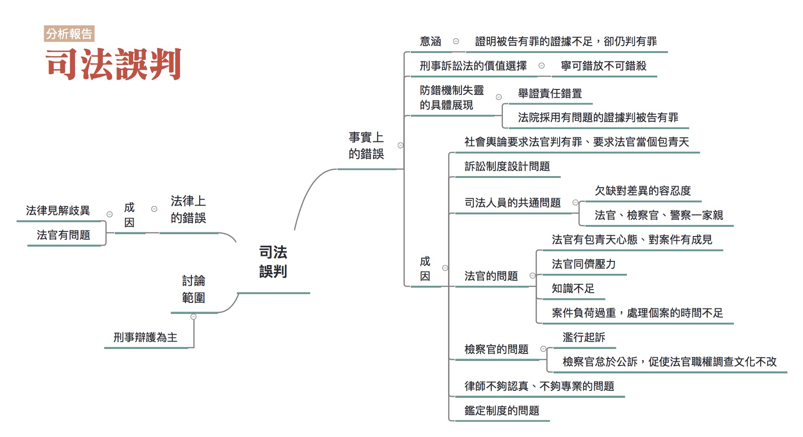

### 彙整人：林瑋婷

### 彙整範圍：

* 林俊宏成因分析報告
* 現職警察口述成因分析記錄(報告人：林瑋婷。記錄人：廖禾安)
* 0628全民司改運動第二階段籌備會議討論
* 0709評估會議

### 司法問題：

[司法誤判造成當事人二度傷害](http://talk.justice.care/t/20)

對司法來說，作出妥當正確的判斷是非常重要的事情。但是這件事就像遙不可及的夢想。部分案件當事人會覺得法官的裁判、檢察官的起訴或不起訴等等弄錯了事實、誤用了法條，遇到事情要上法庭已經夠倒楣了，還遇到誤判更是造成當事人二度傷害。 

例如東海之狼性侵案，紀富仁被警方懷疑涉案，就被踩下體逼著自白，又被逼著下跪跟被害人求婚，檢方並將他起訴求處死刑。後來在紀富仁被羈押的期間，又有一件性侵案發生，DNA鑑定的結果和東海之狼性侵案嫌犯的DNA一致，才發現搞錯人了，真犯人是一位海巡士官長。

### 網路意見：

@102

如何認定誤判！？這應該是整個司法程序應更加嚴謹的問題，且各個學派見解各異，採不同見解自然有不同結果，誤判概念似乎難以適用，或許將證據能力的判斷標準更嚴格化會較有實益。

### 分析範圍：

刑事案件為主。

### 利害關係人：

法官、檢察官、律師、被告

### 相關法律：

刑事訴訟法

### 相關議題：

舉證責任、無罪推定、供述證據、科學證據

### 分析依據：

個人實務經驗

### 分析結果：

在討論司法誤判之前，必須要先認清一個殘忍的現實，司法誤判是司法制度必然發生的一環。因為審判者是人，不是神，人沒有全能全知的能力，無法回到過去，人會被誤導，會有偏見，人會犯錯，所以審判者當然會犯錯，因此只要司法審判是人在審判，誤判這件事，就永遠不可能消失。

因此，為了把誤判的風險降到最低，所以制度上做了各種設計，以防止錯誤的發生，而我們刑事訴訟法制的設計，本質上就是依據這個思考脈絡，所衍生出的一種防錯機制。然而，當防錯機制失效或無作用的時候，就會有錯誤的發生，誤判就會出現。

誤判的發生，用最簡化的分法，大概可以分為法律上的錯誤及事實上的錯誤。因為判決主要是由事實和法律所構成，因此，如果有誤判發生，要不就是事實搞錯了，要不就是法律弄錯了。

#### 法律上的錯誤

法律弄錯了這點，有可能是法律見解歧異的問題，除此之外，應該是比較單純的，大概就是法官用錯了法條，或是法條不該用而用，主要問題應該會出在法官本身。

#### 事實上的錯誤

為什麼事實會弄錯？

##### 事實弄錯的意涵

在這邊要先說明的是法院要如何認定事實？我想大家都清楚，法院是依據證據認定事實。如果證據與認定的事實對不起來，就是「事實弄錯了」。事實弄錯了，在邏輯上可能有「有罪證據充足，但認定為無罪」、「有罪證據不足，但認定有罪」、「無罪證據充足，但認定有罪」，以及「無罪證據不足，但認定無罪」，在這裡我們選擇切入探討事實弄錯的角度是「有罪證據不足，但認定有罪」。為什麼如此選擇，首先是因為這個角度是刑事訴訟法整個防錯設計的最在意的情形。也就是說如果證據無法證明的，即便被告是真的行為人，法院也不能判決有罪。此外，「有罪證據不足，但認定有罪」的相關防錯機制，也涵蓋更嚴重的錯誤情形，也就是「無罪證據充足，但認定有罪」的情形。

而「有罪證據充足，但認定為無罪」也構成誤判，但是並非刑事訴訟法防錯的核心，待之後有時間心力時再處理。

至於「無罪證據不足，但認定無罪」，其實在刑事訴訟法上是說不通的，更極端地來說，這種情形在刑事訴訟法上不能被視為誤判，因為這涉及刑事訴訟法上的舉證責任設定，以及背後的價值選擇。而這正是我們接下來要說明的。

##### 刑事訴訟法的價值選擇

再談「有罪證據不足，但認定有罪」是刑事訴訟法防錯機制的核心，以及乍看很奇怪的「無罪證據不足，但認定無罪」不是刑事訴訟法上的誤判，要先建立舉證責任的觀念。

舉證責任就是事實無法被確認的時候，該由何人來負責？如果是要求檢察官負舉證責任，就表示事實無法被證明的時候，應該由檢察官負責，所以法院應該下一個與檢察官主張相反的認定，認為檢察官所主張的事實不存在。相反的，如果是要求被告對於事實無法被證明這件事負責，當事實沒辦法被證明的時候，法院就應該認為被告主張的事實不存在。舉例來說，如果認為檢察官要負責證明A殺了B，就表示說檢察官要對A殺B這件事負舉證責任，如果檢察官無法證明A殺了B，那就要認為根本沒有A殺B這件事。

如果對於舉證責任最基本的原則沒有問題，下個問題是，如何決定要由什麼人來負舉證責任？在現行刑事訴訟制度的架構之下，原則上就是由檢察官對於犯罪事實的存在負舉證責任。所以當檢察官沒辦法提出證據，證明犯罪事實存在時，法院就不能判決被告有罪。這也就是「無罪推定原則」。

此外，舉證責任還有一個部分，必須要說明，就是我們要用什麼樣的標準，來認定事實已經被證明了？也就是說要證明到什麼樣的程度，才能認為負舉證責任的一方已經證明了他應該要證明的事實？

在這邊有一句耳熟能詳但又難以理解的話「超越合理懷疑」或「無合理懷疑」（beyond a reasonable doubt），這是被認為關於檢察官證明犯罪事實存在的程度要求，也就是說，檢察官必須證明犯罪事實存在到無合理懷疑的程度，才能認為檢察官已經證明了犯罪事實，如果檢察官的證明沒有到達這個程度，就不能認為檢察官已經證明犯罪事實存在，法院就不能判決有罪。

這樣的舉證責任安排，大大的墊高了檢察官證明犯罪事實存在的難度，一旦檢察官無法證明犯罪事實存在，或者無法消除法官對於犯罪事實存在的合理懷疑，那麼法院就應該判決無罪。這其實隱含了一個根本的想法，我們「寧可錯放」，也「不可錯殺」。因為，法院判決有罪與否，取決於檢察官的舉證，如果檢察官沒辦法舉證證明，雖然會造成真正的行為人，因為舉證責任這件事，而被判決無罪，但是在這樣的設計下，無罪的人，並不會因為舉證責任的安排，而被判決有罪，所以這樣的設計可以防止錯殺的發生，避免清白的人被誤認為有罪。

談這麼多舉證責任的目的，其實想說的就是，在制度設計時，做了一個價值選擇，選擇了一個以避免錯殺的思考中心為出發點，並且在這個想法之下，決定了檢察官要負責證明一個人有罪，而且為了避免錯殺，而要求檢察官對於犯罪事實的證明，必須到達無合理懷疑的高度門檻。一旦這個設計的基本思考沒有被遵守，那應這個設計所希望的防錯功能就可能會失效或喪失作用。

##### 防錯機制失靈的具體展現

###### 舉證責任錯置

其實要求檢察官負舉證責任這件事，在我們的法院並不是全然被遵守的，甚至我們的法院通常不需要檢察官證明被告有罪，就會先行認定被告有罪，除非被告能夠在審判過程中證明自己無罪，否則被告很難因為檢察官沒辦法證明被告確有犯罪的事實存在，而被判決有罪。也就是說，我們法院其實是反過來要求被告負舉證責任，被告必須證明自己沒有罪，否則法院就會做出一個和被告主張相反的認定，就是認定被告有罪。

這樣的操作結果，正好和前面提到的防止錯殺思考相反，因為，如此一來，勢必會發生清白的人因為欠缺證據，而被法院基於舉證責任的要求，而被認為是有罪的，錯殺的發生，在所難免。

其實這就是第一個防錯機制失效的情形，因為法院根本錯置了舉證責任這件事情，把舉證責任放在被告身上，這也顯示了法院根本上對於「防錯」這件事的錯誤認知，因為防錯的正確思考，應該是防止錯殺，而不是防止錯放，但法院的操作結果卻是防止錯放，思考方向全然相反。

###### 法院採用有問題的證據

在知道證據應該原則上應該要由檢察官提出這點之後，下一個問題是，檢察官所提出的證據，法院一概都要接受嗎？

回到防錯的基本概念，既然要避免錯誤，想當然的，如果證據的使用，會有高度錯誤的風險，那應該就不能用才對。所以，最基本的想法是，證據應該要有最基本的可信性，如果證據的可信性是有問題的，應該就不能允許使用才對。

那接著要談的是，什麼樣的證據是可信的？什麼樣的證據是有問題的？

可以先將證據區分為人的供述和供述以外的證據。

人的供述就是由人將他的親身體驗講出來，讓其他人可以透過他的說明，得知發生了什麼事情。

然而，以一般的經驗來說，人是不可信的，因為人往往會因為其個人利害或者是某些動機，而選擇他所想要提供的訊息。就算是沒有任何利害或是動機，對於相同的事實，每個人也會因為個人對外的觀察能力，或是因為記憶的關係，或是因為陳述能力的不同，而講述出不同的內容。

相對的，人的供述以外的證據，人講的話以外的客觀可以觀察的證據，一般來說，大概就是文書、證物等這類的東西，這些東西因為透過它們本身外在的狀態、形狀及對外的各類表現，來證明到底發生了什麼事，因此，這一類的證據，是一種客觀上存在的外在情狀，因此，除非有一般物理變化、保存不當或遭破壞的情形，否則這類證據所呈現出的事實，應該是比較可信的。

1. 供述證據的採用問題

    因此，在了解了這二種證據的差別後，應該可以很容易得出，如果要證明犯罪事實存在，應該要比較重視非人的供述這類的證據才對。然而，目前法院的運作上，卻是比較依賴人的供述，以人的供述做為認定事實的最主要依據。

    供述證據雖然比較不可信，但也不是全然不可接受。但是前提是要解決供述者動機、利害及其觀察、記憶、陳述等能力的問題，才能說供述是可以相信的。但是目前法院往往在沒有解決這些問題的情形下，就採用了供述證據

2. 非供述證據的採用問題

    相對於人的供述，供述以外的證據因為是以其呈現外在的狀況來證明事實，因此，若供述以外的證據，沒有發生任何會造成其外在狀況發生變化或者保存上發生問題，否則應該是非常可信的。

    但不幸的是，如果非供述證據不具備合理採用條件，其實它也不見得是可信的。首先，如果有現場保及證物全粗糙的問題，那非供述證物就會有變化、消失的可能。再來，一些非供述證據會涉及使用專業知識來解讀，例如指紋、DNA鑑定等等，如果專業知識的解讀過程出問題，那自然非供述證據也就不可靠了。

    可惜的是，由於我們對於供述以外證據的偏廢，對於非供述證據的合理採用條件為何，也就不夠重視。搭配舉證責任的錯置，結果就是只要是可以用來證明被告有罪的，都是好證據。

##### 防錯機制失靈的各種成因：

至於為何會發生防錯機制失靈，以致誤判被告有罪的情形，可能的成因有以下幾種：

###### 社會面的問題：

社會輿論要求對被告採取有罪推定的作法，會對法官產生壓力，讓法官也採取有罪推定。這在性侵害案件特別容易出現。

另外，人民往往期待刑庭的法官，是伸張人民心目中所期待正義的包青天，自己要發現真實查到底。這不僅影響個別法官的心態，也影響我國訴訟制度的設計。訴訟制度設計有兩種思維，一種是包青天思維，希望法官自己要發現真實，一種是現代刑事訴訟制度的思維，希望法官是程序操作者，聽檢察官、被告兩邊的主張，之後決定輸贏。兩種思維在制度設計中彼此糾葛矛盾。

###### 訴訟制度設計的問題：

訴訟制度設計不佳會容易讓舉證責任錯置，法官難以遵守無罪推定、有罪心證門檻降低。

1. 容易形成定錯效應的制度設計：

    多種制度設計不佳中，以會形成「定錨效應」的作法，特別要注意。定錨效應的意思是，如果你在判斷一個事情之前，你對著這個事情已經有太多訊息的時候，很容易你會形成一個預先的想法，這個想法一旦形成之後，要再移動你的想法很難，非常難。

    首先，在台灣，檢察官起訴後，就會將證明被告有罪的卷證資料送交法院，法官可能就先看了檢察官的資料，在還沒看到被告本人以及被告的答辯之前，就形成了對被告的某些想法。

    再來，目前在台灣，檢察官起訴被告的證據，裡面可能有些證據是有瑕疵的，根本不應該給要作判決的法官看到，但是法官都看到了。例如被告主張警局筆錄是刑求而來的，依照刑事訴訟法第156條應該不能夠提出來做證據的，法官會先審查是不是確實有這件事，確認有這件事後，再說這個證據不能用。但是這個「不能用」的證據法官早就看過了，心證也就受到了汙染。

    最後，法院卷證資料中的前科記錄本身，或是關連於特定起訴罪名(例如毒品罪)本身的司法直覺，也可能就讓法官一開始就對被告形成不好的印象。

2. 架空交互詰問的制度設計

    台灣的刑事訴訟法中傳聞法則的設計，有架空交互詰問制度的可能，是個嚴重的問題。傳聞法則就是指法庭外的證人證詞，原則上不能用來當作判被告有罪的證據，但是在哪些例外的狀況下可以使用。為何在法庭外證人的證詞，原則上不能使用，是因為證人在法庭上要經過「交互詰問」這個程序，考驗他證詞的可信度。如果沒有經過交互詰問，證人證詞的可信性根本難以確認，為了避免誤判，所以原則上應該要排除。

    但是我們的刑事訴訟制度，在很多設計上，卻打破了這樣的基本想法，讓許多沒有經過交互詰問的證據，可能直接用來判決被告有罪。目前刑事訴訟法的設計想法，非常可笑，對於證人說的話是不是可以相信？是不是可以用來判決被告有罪？主要是取決於證人在什麼人面前說話，我們的刑事訴訟法相信，人在官越大的人面前說的話，越值得相信，所以，基本上是以聽話者的身分地位，來決定講話的人說的話能不能信。這樣的邏輯和設計，和之前提到的防止錯判的基本想法，完全搭不上線，完全沒辦法達到我們的目的需求，甚至於使我們喪失好好檢驗證據的機會，反而造成使用了錯誤證據，而發生錯殺的結果。

3. 法官自由心證欠缺明確的依循法則：

    在台灣法官的心證可以說不必依循任何明確的法則。在此情形下，所謂超越合理懷疑才能判有罪的心證門檻，根本不需要什麼說明來支持，這樣的心證門檻設計也就容易淪為純粹的宣示意義了。

    與這台灣證據法則的規範相當簡略甚至可能有問題有關。證據法則指的就是判斷哪些證據可以納入作為判決的基礎，而又該怎麼衡量證據可信度高低的法則。前面所提到的傳聞法則就是有問題的證據法則之一。另外一個有問題的例子就是，違法取得的證據可以權衡後使用為判被告有罪的證據。關於如何權衡只有講說要「審酌人權保障及公共利益之均衡維護」，有講等於沒講，只是開了一個大門讓法官可以想用怎樣的證據就用怎樣的證據。

    另外，前面提到關於非供述證據的解讀，也需要搭配完整的證據法則，然而目前法院對於這些非供述證據的專業解讀並沒有形成一套有效的管控方式。相反的，依據刑事訴訟法的規定，反正只要是法院或檢察官所委託的人，這些專業的解讀就可以在法院上使用，就可以用來斷人死生。依目前法院的運作結果，這些專業上的解讀，我們不太需要探究這些幫助法院解讀專業訊息的人，是否真的擁有足夠的專業能力？也不太需要判斷解讀的程序是否完整？是否可能未依照一定的標準流程，而出現解讀上的錯誤？甚至也不太考慮解讀是否有出錯的可能？其實更誇張的部分是，法院甚至不考慮有些所謂的「專業」是否真的是一種「專業」？所謂的「科學」是否是一種真的「科學」？

###### 司法人員共通的問題

光訴訟制度計設不佳，也不一定會使得刑事訴訟法的防錯機制失靈。防錯機制失靈，更重要的是制度中人出了狀況。司法人員不見得懂一般民眾的生活是什麼，對於事實的判斷與了解可能就會出問題。雖然司法人員不一定要經歷那樣的生活，可是確實需要有一些差異的觀點可以被放到訓練裡面，要有一個最低限度的差異容忍度。

另外，法官、檢察官、警察一家親也是個問題。有些法官、檢察官信賴偏袒警察機構，不太去處理警察違法取得證據的問題，例如不積極處理被告的刑求抗辯。

###### 法官的問題：

法官的一些問題，也使得刑事訴訟法的防錯機制失靈：

1. 基本心態出問題

    部分法官本身有包青天心態，不把自己當成中立的審判者，待檢察官舉證讓自己形成有罪心證才作出有罪判決。在包青天心態的情形下，法官覺得自己應該兼具審判者和調查者兩種角色，主持社會正義，挖掘事情的真相。不過麻煩的是，包青天心態在實際的運作上，容易變成法官採取有罪推定，積極調查對被告不利的證據，以定被告的罪，讓刑事訴訟法的防錯機制被架空。

    另外，部分法官對案件本身有成見，不管兩造怎麼辯，他心中早就決定就是要這樣判。有些法官在找鑑定人時，也會有這樣的情形，他會去找一個會講他要的答案的人。在這樣的情形，防錯機制也容易成空。

2. 法官同儕壓力

    法官同儕團體有傾向判有罪的同儕壓力，如果要判無罪，必須幫被告找很多無罪的理由。這部分的討論可以參考「法官檢察官案件量負擔大，辦案品質受影響」。

3. 案件負荷過重，處理個案的時間不足

    法官案件負荷過重，處理個案的時間不足，在制度設計、心態、同儕壓力相配合的情形下，傾向採取對他來說較為輕鬆的有罪判決。這部分的討論可以參考「法官檢察官案件量負擔大，辦案品質受影響」。

4. 知識不足

    法官對供述及非供述證據的不當採用，有時是與法官知識不足有關。目前一些法醫、鑑識相關的科學對於非供述證據的解讀，已經逐漸為法界所知，例如DNA、指紋等等，但這些科學解讀在哪個環節可能出錯，法官不見得懂。因此當專家或自稱專家的人解讀錯誤時，法官不見得知道，甚至可能照單全收。

    另外一些比較偏向社會科學或行為科學相關的專業，是有助於法官判斷案件狀況的，但是法官不知道可以去請教相關的專家，或不覺得需要。例如目前關於供述證據有司法心理學的研究可以提供關於自白、證人證詞何時是不可信的知識，法官可能不知道。涉及原住民的案件可能需要有了解原住民的專家，涉及精神病患的案件，可能需要精神醫學的專家出庭，但是法官不見得知道請這些專家出庭的重要性。

###### 檢察官的問題：

1. 濫行起訴

    刑事訴訟法上，主要的防錯機制是設在法官身上，但是檢察官其實也有「有利不利一律注意」的義務。但是部分檢察官會有濫行起訴的情形，沒有作好誤判的把關，相關討論可以參考「法官檢察官案件量負擔大，辦案品質受影響」。

2. 怠於公訴

    部分檢察官有怠於公訴的情形，也就是不好好舉證並說明被告為何應該有罪。這件事情很弔詭，乍看之下「怠於公訴」應該不會促使被告錯誤地被判有罪才對，甚至可以說「怠於公訴」正好使被告容易獲得無罪才對。但是這樣的情形在搭配法官包青天心態時，會促成法官調查的文化一直不改，結果反而容易使得法官採取有罪推定的心態。

    也就是說如果是單純的「怠於公訴」，這會促成的誤判類型會是「證據充足，但被告被判無罪」。但是如果搭配法官的包青天心態，它就會轉化為防止被告被誤判有罪的機制失靈的搭配性要素。

3. 偵查與公訴不同檢察官

    目前台灣一個案件負責犯罪偵查的檢察官，和起訴後負責到法院出庭的檢察官，是不同人。這樣的分工會導致明明有一個非常熟悉案情的檢察官，不負責出庭舉證並說明為何被告有罪，卻可能由一個不那麼熟悉案情的檢察官來做這事件。這樣的狀況可以由偵查檢察官與公訴檢察官之間的充分溝通來解決，但目前的協調機制是不夠的。如同前面怠於公訴的情形，原則上這會促成的誤判類型會是「證據充足，但被告被判無罪」。但是如果搭配法官的包青天心態，它就會轉化為防止被告被誤判有罪的機制失靈的搭配性要素。

###### 律師的問題：

因為法律程序涉及了高度的法律專業事項，因此一般人通常沒有足夠的能力及智識可以獨自進行相關的程序，因此，為能確保程序的進行是確實符合所來制度所設計規劃的方向運行，也就必須有具備足夠法律專業背景的人，來協助被告。而律師就是負責這樣角色的人，所以律師必須要夠稱職，才能夠確保被告的權利，如果律師的專業能力不足、或是不認真等等的因素，而無法提供實質而有效的協助給當事人，這樣一來，自然就無從確保當事人的權利，也無法避免錯誤的發生。事實上，有許多錯判的情形，確實也是因為律師沒辦法提供實質有效的協助所造成。

律師的專業能力不足，背後涉及的成因則可能包括教育訓練的不足，以及不好的律師欠缺淘汰機制。

###### 警察的問題：

在發現犯罪現場的時候，現場保存、證據處理、蒐證，都是由警方進行。如果警方沒有處理現場證據保存的實務知識，很可能就會破壞現場的證據，導致冤案發生。在鄭性澤案中，現場槍枝位置遭到警方破壞，被認為是造成冤案的原因之一。根據司改會在警方執法一題的分析，只有較專業的刑案警察才有相關知識，許多派出所的第一線員警並不清楚如何保存現場。

除了犯罪現場的保存，證據的收藏也是很重要的問題，比如指紋需要保存於低溫，但目前並沒有專業的證物庫房，證據的收藏品質不佳，甚至在一些案件中還有證據遺失的狀況。

另外，當事人的筆錄也是很重要的證物，因此若是警方在詢問筆錄的時候使用了不當的手法，就可能會引致後續判決出現問題。

###### 鑑定制度的問題：

鑑定制度，在此泛指各種涉及以專業知識保全、處理，以及解讀證據的相關制度。鑑定制度的問題，比較在刑事訴訟法本身的防錯機制失靈的情形下，使得狀況更為惡化的搭配性要素。因為嚴格講起來，如果訴訟制度設計良好，法官也確實遵守的話，有問題的證據本來就應該在訴訟過程中被發現而且不會被採用。只可惜，現狀並不是如此。

在這樣的情形下，鑑定制度出問題，也會促使誤判的產生。而鑑定制度的問題例示如下：

1. 沒有真正建立起證物保管流程

    如同前面所提到的，警察的現場及證物保全有過於粗糙的問題，這部分的問題除了第一線的警察不見得具備相關知識之外，也與鑑識、司法相關單位沒有真正建立起證物的保管流程有關。舉例來說，假設檢察官在法院提出了一把刀，並指出那把刀是被告所使用的兇刀，但是我們根本沒有任何一套方法，可以確認或追朔那把刀是從被告家中或犯罪現場所取得，我們也無法得知取得後的保管過程中究竟是由哪些人接續持有保管？過程中有沒有可能被汙染？有沒有人也接觸過那把刀？有沒有可能被掉包？

2. 鑑定欠缺標準作業程序

    部分鑑定專業沒有一個標準。例如車禍鑑定委員會裡面有很多不同類型的專家，有修車的、有交通管理的、有交大的教授、有警大的教授，可是每個人見解其實是不一樣的。有時候五個委員判出來的見解跟另外五個委員的見解是完全不一樣，其中有些是很離譜的偏離專業的解釋。也就是說要訂定標準作業程序，才能去檢驗哪些人說的話可信或不可信。

3. 鑑定或專家證人不專業

    一些進入法庭鑑定報告或是專家證人的意見可能有不專業的問題。如果法官不知道，就這樣採為有罪基礎時，就容易發生誤判。

4. 官方的鑑定機關偏向配合自己人

    目前主要的鑑定機關都在官方，即調查局、刑事局、法醫研究所，而官方的鑑定機關可能有偏向合配自己人的問題。例如學長辦案，學弟做鑑識，這個意思就是樓下在查案，樓上在作鑑識，學長辦案有瑕疵，學弟做鑑識可能有不敢指出學長辦案瑕疵的情形。有一些案件裡面也有鑑定機關疑似配合法院定罪需求的情形，比如說徐案、蘇案，都疑似有這樣的情形。

==========

## 法律人的養成出了問題

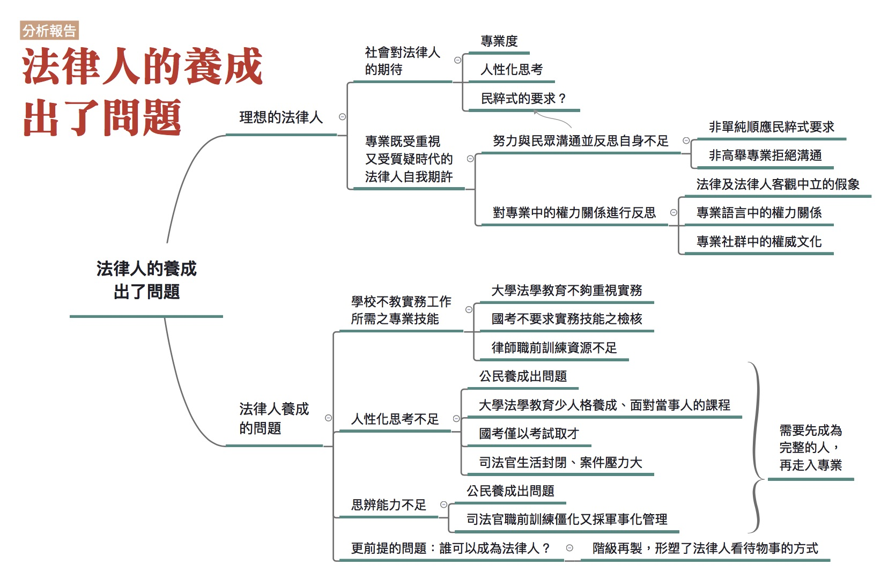

### 報告彙整人：林瑋婷

### 彙整資料範圍：

* 賴瑩真成因分析報告。
* 0614全民司改運動第二階段籌備會議討論。
* 黃致豪成因分析報告中關於「素人」與「專業」間溝通的探討。
* 高涌誠與曾柏文口述成因分析記錄中關於專業主義受質疑的探討。
* 李艾倫口述成因分析記錄中關於法律人只看到案件沒有看到人的討論。

### 司法問題

[法學教育培養出只會考試的法律人](http://talk.justice.care/t/29)

台灣目前的法律系學生絕大多數以通過國家考試為主要目標，而法學教育也是對應著國考的科目來發展。法學教育難以培養出對司法有自己想法，並且願意為在司法中受苦的人們努力的法律人。

### 網路意見

@DDDKKK：

我不贊同這樣的意見。司法官要有社會歷練，關於這點我是贊同，但是司法官考試應考資格所增列的【律師執照+三年專職法律實務工作經驗】，個人表示極度不贊同，因為既然要求司法官來源要廣納人才，那又何必先侷限需有三年專職法律工作經驗，難道我不能當三年服務業或是當三年水電之後，因為對法律有興趣而報考司法官考試嗎？先要求【有三年專職『法律實務』工作經驗】，這就代表司法官的來源還是從象牙塔裡面去找人，我個人比較贊成【幾年工作經驗（不限職別行業）皆可報考】，如此才可以廣納人才，做到司法官能體諒人民所感，因為他們跟我們一樣的出身，更加能夠了解基層人民的想法。

### 分析範圍：

除了實務界的法官、檢察官及律師之外，「法律人」應尚包含法律系老師、學者甚至法律系所的學生等等。但是因為社會上對於法律系老師、學者等人了解不深，亦與一般人在司法上無接觸機會或利害關係，因此在此忽略不談，僅將「法律人」限縮在實務界的法官、檢察官及律師的範圍裡。

### 利害關係人：

法官、檢察官、律師、法律系學生、法律系老師、民眾

### 相關法律：

律師職前訓練規則

### 相關議題：

司法官、律師職前訓練；學士後法律系

### 分析結果：

「法學教育培養出只會考試的法律人」這個命題本身是不正確的。因為它是全稱命題，只要找出一個例外就能推翻，而其實有一些法律人確實是有理想性的，並非只會考試。因此這個問題本身需要被重新詮釋。

這個問題背後涉及的可能是「理想的法律人到底是什麼」的問題，因為正是理想與現實的落差，引發了「法學教育怎麼會培養出這樣子的法律人？」的想法。

#### 理想的法律人

##### 社會對法律人的期待

理想的法律人為何，勢必要探討到社會對於法律人的期待。關於這個問題首先要探討的就是，所謂「法律人」所指的對象包括哪些？因為除了實務界的法官、檢察官及律師之外，還包含法律系老師、學者等等。但是因為社會上對於法律系老師、學者等人了解不深，也與一般人在司法上無接觸機會或利害關係，因此在此忽略不談，僅將「法律人」限縮在實務界的法官、檢察官及律師的範圍裡。

再來應思考的是，「只會考試」的反面解讀，就是「不會○○、不會□□」的法律人，所以目前台灣社會對於法律人的期許，除了「只會考試」以外，還有什麼呢？

以民眾的角度來看，民眾對法律人的期許，首先是專業度。再來是希望法律人在處理案件時，能有更多的社會經驗與同理心，能夠確實理解案情脈絡、當事人的處境、案件背後的成因，與社會現實面的種種考量，而有更多人性化的思考。例如法官不了解求職困難，對已經背負卡債的人問，一個月只賺三萬二你為什麼不找一個更好的工作？這就是一個典型的欠缺人性化思考的情形。

但是，不是民眾對法律人的任何期許都是合理的。有些期許其實是相當民粹，甚至違反人權及法治原則。例如認為「被告某甲殺人裝瘋騙過法官無責免死，台灣的法學教育培養出只會考試的法律人」或「法官罔顧證據，魏應充一審竟無罪！台灣的法學教育培養出只會考試的法律人」又或者「被告某乙殺人竟有律師辯護免死？台灣的法學教育培養出只會考試的法律人」。

##### 專業既受重視又受質疑時代的法律人自我期許

相較於過去，法律是受到很高的重視。以前人說情理法，法是不得不才做為最後的判斷，可是現在法律人當總統，以法最基礎的道德來治理國家是被認為很好的事情，所有人都期待法來判斷所有事情。這使得法律專業在現在是受到重視的。這樣的情形讓法律以及法律人變都得很驕傲。

而與此同時，在民主化以及社群媒體興起的時代，專業人士已經無法不受監督地獨佔特定領域的發言權了。專業人士的各種看法與行為可能會受到一般民眾的批評與質疑，甚至一些被民眾認為不當的看法與行為，還會被放在社群媒體中廣為流傳。這些批評與質疑可能妥當也可能不妥當，但是這就是現狀。

簡而言之，現在是法律專業既受重視又受質疑的時代，針對這樣的情形，法律人可能需要一些自我期許上的調整。

###### 努力與民眾溝通並反思自身不足

在涉及到這些民粹式的期許時，法律人已經不能以自己才是專業，民眾什麼都不懂當作擋箭牌，這種回答已經沒辦法獲得民眾的信賴了。然而這也不是說法律人就應該按照民粹式的期許行事。在專業遭到質疑的當代社會，專業人士要獲得民眾信賴，應該要做的是努力與民眾溝通，在溝通的過程中既努力讓民眾理解法律專業的考量為何，也反省自身有何不足，以及需要改進之處。

###### 對專業中的權力關係進行反思

在專業既受重視又受質疑的時代，對專業中的權力關係進行反思，也成為重視的課題。正是因為法律與法律人享有相當的權力，而這種權力已經不能視為理所當然了，因此法律人對法律專業中的權力關係欠缺反思的問題，也就更形重要。這呈現為以下幾個方面的問題：

1. 法律及法律人客觀中立的假象，欠缺質疑

    法律的立法本身就有立場，法律人本身也有立場，但是這些都被包裝成客觀中立。像是一個臥軌的事件今天怎麼被看待，殺人事件、死刑怎麼被看待，每一分鐘都在做選擇，但是這些選擇都被隱藏起來。看不到立場，有時是因為這個立場屬於主流意見，不會被質疑。另外，法官在體制上也被要求要保持客觀性，即使法官有立場，也要假裝自己沒有立場很客觀。

    法律人對法釋義學的操作，容易出現假中立客觀的情形，這需要特別留心注意。簡單來說，法釋義學指的就是，解釋某個既有的法律規定應該如何適用於個案。法釋義學的操作，並不只是邏輯的套用，它其實涉及了一整套帶有約定俗成意涵的法律解釋體系，以及在這個體系中可能的遊戲、操作空間。掌握了法律解釋體系的約定俗成及操作空間，也就掌握了法律這種權力工具，而這正是法律專業所在。

    法釋義學的操作，基本上是從給定的法律規範出發，但是為什麼要從這些給定的規範出發，甚至是對這些規範本身進行深刻的質疑或反思，其實相當程度超出了法釋義學本身。法學教育中比較有機會反省規範本身存在意義的，是人權相關的課程，但可惜的是，有時人權本身也被視為一種權威、一種給定的更高規範，而不會去更深刻地對於人權相關論述進行反思。偏偏各種法釋義學的操作，往往與操作者的欲望或隱含的世界觀、價值選擇相關，而這些欲望、世界觀、價值選擇在法釋義學的討論中，往往不容易直接成為被檢視的主題。由此法釋義學操作也就容易隱藏起特定立場其實是處於權力結構上的優勢，而不必去解釋為何特定的立場就應該被選擇與維持。

    如果法律的解釋適用會強烈地影響人們的權利、影響人們的生活，那對於為什麼這樣操作，而不那樣操作，其實需要進行深刻地反省。現狀本身就是特定權力結構的產物，可能需要被改變。

2. 對於操作專業語言時所隱含的權力關係，欠缺認識。

    法律專業語言涉及到整套概念體系。要掌握一個概念，其實是需要知道這個概念和哪些其他概念有關以及有別。當熟悉於這些概念體系時，就會將它們視為理所當然的知識背景，很自然的會用一個法律概念去解釋另一個法律概念。在此情形下，法律人忽略了對於這整套體系不熟悉的民眾，很可能是聽不懂他在說什麼的。這樣的情況可能會出現在法官、檢察官、律師與當事人溝通的過程中。

    而這樣的溝通困難隱含著權力關係。當遇到溝通困難時，自許為法律專業人士者，不見得認為自己有責任要改變自己的說話方式，而把問題歸咎為「民眾就是很盧」、「民眾什麼都不懂、都亂告、法庭上都亂講話」等等。但是其實換個角度想，民眾其實是沒辦法使用法律人懂的語言進行溝通，而這樣的不利益很大部分要由民眾來承擔。因為當民眾被法律專業人士認為很盧、亂告、亂講話時，法律專業人士可以中止溝通，於是民眾很可能就得不到法律協助、輸了官司。事後民眾去投訴司法不公，也不會被理會，因為確實從法律上來看，民眾是沒有道理的。

    這樣的情形也可能是法律人被認為欠缺對民眾的同理心的相關因素。而可惜的是，在目前的法律人養成中，著重的仍是如何與社群內的專業人士溝通，而非如何與民眾溝通。

3. 對於法律專業社群中的權威文化，欠缺反省。

    專業主義的弊病，不僅出現在忽視與民眾溝通，也出現在法律專業社群內部，此即專業社會中的權威文化。在專業主義中，會設置一些成為專業人士的門檻來劃分社群，通過這個門檻取得了特定身份之後，你開始可以基於這個特定身份作一些其他人不能做的事，這種「能與不能」本身就容易被操作為權威文化中差別對待的正當性來源。在學校中，有許許多多的同學因為國考而焦慮，覺得自己沒有考上國考法律系就是白唸了，人生就失去了重要的價值，這種狀況甚至會延長至畢業後那段準備國考的期間。這種焦慮其實就是法律專業社群權威文化的一種延伸，而這種焦慮是有真實來源的，因為確實，法律系學生有沒有通過律師考試，會被不同的看待與對待。這種專業社群的權威文化，窄化了人對於自身未來的想像，也窄化了人們彼此平等對待與相互尊重的可能。

#### 法律人養成的問題

相應於前面所提的社會期許就可以發現分析的範圍不能只停留在大學法學教育，因為問題不會只限於大學法學教育，而必須拉到整個法律人養成的過程出了什麼問題。從法律人養成到底出了什麼問題，大致可以分成以下幾個面向來談：

##### 學校不教實務工作所需的專業技能：

現有的大學法學教育是學者教育，而不是實務工作者的培訓。課程內容不僅缺少實作培訓，老師教的學說也常常與社會脫節。學校所學的根本無法應付實務工作的需求。而目前的國考也都沒有實務技能之檢核，從通過國考到能熟悉實務，往往還有遙遠的路。

這樣的問題在職前訓練資源相對不足的律師界來說，問題更形嚴重。律師職前訓練期間非常短暫，且訓練經費亦非常拮据，致使訓練品質無法提升，影響律師執業的品質。

關於學校不教實務工作所需的專業技能一事要怎麼解決，涉及大學法學教育到底應該走學者教育還是實務工作者培訓路線。到底要怎麼作，仍待討論。但提到如果法學教育仍要維持學者教育，就容易出現學說與實務脫節的問題，此時從學生到實務工作者的銜接培訓，就非常重要。

##### 人性化思考的不足：

目前的大學法學教育欠缺法律人人格養成的相關課程，學生缺少對於人權正義、社會價值等面向的思考能力。在大學法學教育實作培訓不足的情形，學生也少有機會接觸到各種當事人，並在老師的指導下認識當事人不能只被化約為「案件」，而應該更加全面地將他視為活在社會中、有各種故事的「人」來看待。

而目前的法曹考選又僅以考試取才，對學生來說重要的是準備考試，而不是去了解社會以及社會中人們的生活。而在通過國考後，人性化思考的培養，也只能靠各個法律人的境遇與反思。特別是法官檢察官在進入官方體系後，生活封閉而且案件壓力大，人性化思考的培養往往更加困難。

不過話說回來，人性化思考的培養，放在大學法學教育之後，有太晚之嫌。它其實應該算是基本公民教育的一部分，是每個人都需要要培養的思考方式。

##### 思辨能力的不足：

如果法律人思辨能力不足的話，在面對民眾質疑時，就難以反省自己到底應該要照著民意做，還是堅持自己的看法，也難以反思專業中的權力關係。

關於思辨能力不足一事，不能只認為是大學法學教育的問題，是台灣基礎的公民教育不足的問題。台灣整體的教育都不夠重視思辨能力的培養，教出來的只是順民。在法國替哲學會考，或美國的寫作課訓練，都會去要求區辨事實跟意見，他們從小就開始教導孩子要提出自己的論述，如何進行邏輯思辨。但台灣的教育不重視這些，我們學到的是在哪些場合裡面我們應該要做什麼事，我們才不會被批判，不能說真話。真話往往只有在家裡才能說，不然就會被主流的人或是有權威的人攻擊。

更糟糕的是司法官訓練所還採取軍事化管理及僵化式的訓練，將司法官變成完全接受規則，完全接受制度的運作，造成這些未來的檢察官、法官們完全服膺於體制運作而沒有思考能力。將來在審判實務上，也更容易臣服上級的見解，而不去思考這見解是否過時，是否合於時代潮流，欠缺反省批判的精神。

人性化思考不足以及思辨能力不足，其實都應該拉到更前面的基本公民教育不足的問題。也就是說，在教育上面我們怎樣讓人先學好做一個完整的人，所謂完整的人是包括看到具體人的處境與差異、能思考能採取行動去改變結構、能夠對倫理進行思辨，這些基礎都做好後才開始作專業分工的角色，進入工具性的訓練。

##### 更前提的問題：誰可以成為法律人？

在7月2日的評估會議中，有與會者提到，其實法學教育只照顧他們四年加上後面一些職業訓練，可是我們應該要去看，之前到底誰被身邊的人鼓勵去讀法律系？這裡有階級屬性的問題，而這其實已經決定很多事情了，那四年可以改變的已經不是很多。很多法律人也鼓勵自己的下一代繼續讀法律，在此可能有專業的行業自我再製的情形，而這可能已經在一開始就決定了法律人看待事物的方式。為什麼法律人被認為看不到困苦民眾的生活實況、為什麼推崇主流價值而不加反省，都可能與此有關。

==========

## 民眾覺得法院判決與社會脫節

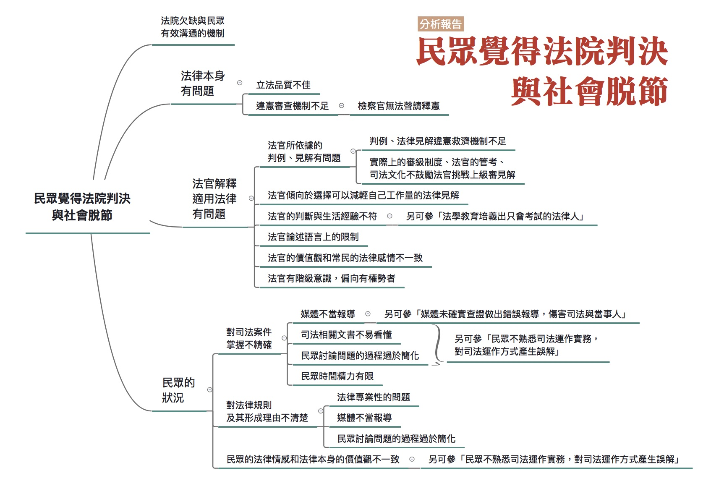

### 彙整人：林瑋婷

### 彙整範圍：

* 徐偉群成因分析報告
* 0628全民司改運動第二階段籌備會議討論
* 0709評估會議討論

### 司法問題：

[有些法律不正當，也有些最高法院判例決議與社會脫節。](http://talk.justice.care/t/88)

有些法律不正當，或最高法院判例決議與社會脫節，就會陷司法於不義。

### 網路意見：

@John_Lin

有些法律不正當，或最高法院判例決議與社會脫節，就會陷司法於不義，因此大法官對於釋憲案的處理，對於社會影響很大，不只影響釋憲案本身的當事人，也會惠及眾多類似遭遇的人，如果被聲請釋憲的法律很重要，特別是實務常用的法律，尤其是法官為當事人聲請釋憲時，更應該優先處理，大法官早一點完成釋憲，就早一點救大家脫離苦海。

### 分析範圍：

本題的全部範圍。

### 利害關係人：

民眾、法官、國會

### 相關法律：

法院組織法

### 相關議題：

判例制度

### 分析依據：

個人教學經驗、法律問題研究

### 分析結果：

原成因分析報告作成人徐偉群認為「有些法律不正當，或部分最高法院判例決議與社會脫節」，歸結起來可以理解為「民眾覺得法院所下的判決與社會大眾的期望不相符合」。但是關於這樣的看法，於7月9日評估會議中，與會者有不同看法。與會者指出，「有些法律不正當，或部分最高法院判例決議與社會脫節」，應該只是「民眾覺得法院所下的判決與社會大眾的期望不相符合」的成因之一。

如果回去看原本這個司法問題被網友John_Lin提出的脈絡：「有些法律不正當，或最高法院判例決議與社會脫節，就會陷司法於不義，因此大法官對於釋憲案的處理，對於社會影響很大，不只影響釋憲案本身的當事人，也會惠及眾多類似遭遇的人，如果被聲請釋憲的法律很重要，特別是實務常用的法律，尤其是法官為當事人聲請釋憲時，更應該優先處理，大法官早一點完成釋憲，就早一點救大家脫離苦海。」會發現徐偉群在處理這個問題時，在詮釋上確實超越原本網友提問的範圍。因此如果去看分析報告的內容，確實有如同7月9日評估會議與會者指出的情形。

但由於徐偉群詮釋後的司法問題仍包含原本的網友提問所認為要處理的問題，因此仍以徐偉群提出的架構來分析本題，也就是為什麼「民眾覺得法院所下的判決與社會大眾的期望不相符合」。造成此現象的原因可粗分為以下幾點：

#### 民眾的狀況

##### 對於司法案件的掌握不精確:

民眾平常的時間精力有限，加上司法相關的文書如：新聞稿、判決書等閱讀不易，所以對於案情或判決的掌握並不精準。而公民理性討論的文化並不足夠，社會缺乏清楚易懂的正確資訊來促進討論，而使得對於司法問題討論過於簡化、有限。如果能引導民眾在充分資訊的情況下進行對話，其實民眾的想法可能就會開始調整變化。再來，民眾獲得資訊的主要管道—媒體也會影響對案件掌握的精確程度，因此媒體的斷章取義，甚至刻意操作都會是問題之原因。

##### 對法律規則及形成理由不清楚:

法律相關問題本來就有一定的專業門檻，再加上公民教育在法律面向的耕耘不足，民眾在缺乏詢問管道的情況下，便容易不理解法律背後的形成理由等。而無論是公民討論的文化不精緻，以及媒體報導缺乏教育意義等，都無法提供給人民一個良好的了解法律規則及形成之管道。

##### 民眾的法律情感和法律本身的價值觀不一致:

社會中普遍存在的民眾法律情感和法律本身的價值觀可能不一致，例如：刑事訴訟程序中被告人權的要求，民眾不一定接受。更進一步的，這還涉及民眾的世界觀，例如，國際間有廢死潮流，但是多數台灣民眾仍然贊同死刑；民眾對於國際人權公約陌生，而且覺得與自己無關。另外，有時候國家也會刻意操作、強化這類民眾情感，例如在重大政治事件發生時，用執行死刑來移轉焦點。

#### 法律本身有問題:

法律本身有時真的有疑問或缺漏，這涉及兩方向的問題，第一是立法品質不佳。有與會者舉「肇事逃逸罪」來說明有問題的立法。如果你騎車在路上，有人從後面撞你，你受了一點非常輕微的擦傷，對方也是，是一公分乘以一公分的瘀青。人家從後面撞你所以你都沒有過失，雙方都覺得沒什麼。你剛好有什麼事情急著要離開，結果你一離開可能構成肇事逃逸罪，一年以上七年以下有期徒刑。林佳龍立委把它改成致人於死或重傷逃逸者，這比較明確，如果重傷或死亡你不能逃要留下來，但是經過朝野協商，法務部意見加進來，就變成致人死傷逃逸。社會上很多人覺得肇事逃逸很可惡，但實務上有很多是非常輕微的。

第二是違憲審查機制的不足。7月9日評估會議中，一位與會的檢察官說，目前法官適用法律認為法律違憲，可以停止審判聲請釋憲。但檢察官在適用法律時，也會覺得某些法律違憲卻不能聲請釋憲，這是有問題的。

#### 法官的狀況

##### 法官所依據的有判例、見解有問題：

法官判決所依據的判例、固有的法律見解可能是有問題的。「判例」就是最高法院法官們開會從最高法院裁判中選出一些裁判，並擷取其中關於法律解釋的部分，作為各級法院作判決時遵循的依據。7月9日評估會議中，一位與會的法官認為，這是台灣獨創的制度，讓最高法院取得比立法者還要高的位階。因為判例是從判決中挑出幾段話，甚至還可以改文字變成一個像法律的東西，嚴重違反法律保留原則。大家都不知道事實是甚麼，也套用那個要件，變成台灣另外一部法律，判例是法官心中的憲法。

這位與會的法官並舉攜帶兇器竊盜罪的判例，說明為何判例可能是有問題的。在判例中指出，只要是客觀上足以殺傷人的器械，就是兇器。因此竊盜時，不必考行為人的主觀，只要他帶著類似像刀的器械，就構成攜帶兇器竊盜罪，刑度會加重。但是我們都知道偷香蕉一定要拿鐮刀才能割下香蕉，偷一串香蕉大不了判20天，但如果帶鐮刀就變成凶器，不管主觀上是不是有行兇的意思，就要判六個月以上有期徒刑。如果他是累犯的話你還要關七個月。實務上還有偷竹筍帶竹筍鏟判七個月，去許願池挖銅板判7個月，這樣的法律每個人都用那麼自然，但這個判出去民眾根本無法接受。

判例或最高法院法律見解有問題，在目前的大法官解釋實務中，原則上是不能聲請釋憲的。台灣可以釋憲的對象，依據大法官審理案件法來說，其實只有法律、命令。後來大法官自己作出解釋，放寬了人民可以針對最終審法院適用的判例、最高法院決議（當存有不同法律見解時，最高法院內部可能召開會議，決定要採哪種法律見解）聲請釋憲，但法官仍不行。大法官們認為，如果法官本於自己對憲法的確信，本來就可以不適用有違憲之虞的判例。至於法律見解違憲的問題，則至今仍然不得聲請釋憲。

與會的法官表示，雖然依法如果判例或是最高法院法律見解有問題，法官是不一定要遵守的，但實際上的審級制度、法官的管考以及司法文化，讓這件事變得很困難。這位與會的法官說，以前他在當候補法官的時候就攜帶兇器竊盜罪的案件，如果無法證明被告有行兇的意思，他都判這不叫凶器。結果檢察官就一直上訴，高等法院就一直撤銷。甚至撤銷到最後，高等法院在判決裡寫，原審法院猶固執己見，反過來變得是他固執己見。不理會判例除了會讓自己的判決被上級審撤銷，如果是還沒有取得實任資格的法官，他甚至還會可能因此成績不及格不能當法官。

另外，既有的司法倫理文化，也阻礙下級審法官去挑戰有問題的判例或最高法院法律見解。這位與會的法官也以自身經歷為例說明。他提到自己曾經參加一個最高法院出身的大法官退休的研討會，這位大法官在致詞的時候說他一輩子最榮耀的事情，是當最高法院法官的時候，他寫的判決被挑選了四十幾則作為判例。這位與會的法官表示，他那時候真的恍然大悟，最高法院法官的判決被當成判例是很榮耀的，現在有小法官說這個判例根本不對，甚至去聲請判例違憲，背後就是不尊重司法倫理的文化。

##### 法官傾向於選擇可以減少自己工作量的法律見解：

法官的工作狀態，若判決或決議有諸多解釋可能時，法官傾向於選擇減少工作負擔的法律見解，這正是法官本位的例子。

##### 法官的判斷與生活經驗不符：

有些法官的判斷是依據他在學校教育、法官養成教育、司法文化或沿流的司法慣例來作成的，但這些可能跟一般生活經驗有所落差。例如：刑法221強制性交罪，之前法官會以被害人沒有激烈抵抗為由，而認為沒有構成強制性交。可是在強暴案的現場，有些被害人可能因為害怕而不反抗，但不反抗不代表他的性的自主意志沒有受到壓制。

##### 法官論述語言上的限制: 

由於法官必須依據法律進行審判，但是現行的法律或實務見解可能是有問題的，個別法官不見得認同，卻仍然必須使用這些法律概念來進行論理。例如如法官不願意動用死刑，但現行關於是否應該判處死刑用的是「教化可能性」，所以法官必須用被告可教化作為說詞，包藏其他他不願意動用死刑的真正理由，可是這樣進行論理時就會顯得理由可笑，例如用被告國小成績優良之類的理由，說被告有教化可能性，這就容易讓人民無法接受。

法官想透過判決讓被告仍有教化可能的情況得到理解，卻不能成功，其背後原因是，司法程序本身缺乏修復功能，來處理被告與社會斷裂的關係。

##### 法官的價值觀和常民的法律情感不一致:

法官的判斷關鍵與民眾所注重內容可能有所不同，例如：頂新案法官判無罪，是因為法官認為證據不足，堅持程序正當性與證據法則；而民眾重視的是判決之結果，顯示雙方對於法律的價值觀不一致。

##### 司法包庇權勢者或偏頗:

部分法官有階級意識，造成有些判決有包庇權勢者的情形，容易造成特權問題。例如：趙滕雄行賄葉世文案，前者付錢免入監，後者卻判刑21年。

#### 法院欠缺與民眾有效溝通的機制

法院應該更積極主動地與人民溝通，例如把判決理由告訴人民，趁機會做法治教育等，但目前的法院缺乏與民眾溝通的機制，也有溝通不夠用心等問題。

==========

# 評論觀察

==========

## 關於司法改革的意象與想像／蔡博方

**蔡博方**

從90年代後期以來，「司法改革」議題在台灣社會逐漸受到重視，似乎不再是個陌生的詞彙。直至2016年的今日，「司法改革」承載了許多社會期望（或懷疑），更再次證明「司法改革」已是勢在必行。既然很少人會認為現行的司法制度是完美無缺的、不可能都不需要改革的，那麼，或許有些值得思考的問題可能在這理所當然之間被悄悄地略過。例如：「司法公信力這麼低，所以不能不改革？」、「司法改革朗朗上口，司法不改革難以開口」、「到底是不能不改革才推動改革，還是因為有著重要關懷才必須持續推動改革？」這類的問題。

雖然這些問題乍看之下會以為是來攪亂的，但實際進行討論之後，或許也可以助於我們釐清：當我們講到司法改革的時候，我們心中連帶著浮現那些想像？而這些想像又如何有助於（或有礙於）我們對司法改革的認識？

很遺憾地，台灣社會對於司法制度的信任一直不是很高。從貫時性的觀點來看，司法制度長期被視為政治統治者的工具，從現代法律引進的日治時期到國治時期，從民主化時期到兩次政黨輪替，各種關於「司法公信力」的量性數據報告或者質性文字資料都沒有報過喜訊。台灣民眾對於司法制度的信心長期不足。從共時性的觀點來看，情況似乎也是好不到哪裡去。台灣社會相對於所謂的「歐美先進國家」來說，社會大眾普遍比較不信任司法制度與司法人員。其中可能有文化、宗教、教育等等諸多外部因素，也可能有法律制度或法律文化等等的內部因素，一時之間無法詳細說明。總體而言，不會有太多的人認為台灣社會對於司法制度抱持著高度的信心。

乍看之下，「司法公信力」與「司法改革」之間的關係好像很緊密。由於要挽回民眾對於司法的信任，因此有必要積極推動司法改革，或者反過來，如果司法改革逐漸取得成果之後，應該有助於提升社會大眾對於司法的信任度。很遺憾的，兩者的關聯並不如表面上看到得那麼直接有關。背後的關鍵在於，一方面，兩者都是司法制度內在問題所造成的結果，不但彼此看似相關無法被認為具有因果關聯，更有明確的第三項「共因」存在；另一方面，「司法公信力」大多是一種從社會大眾視角出發的感受，而「司法改革」則更像是從法律人的視角出發的感受，即使在指涉內涵上可能有所交集，兩者仍是不同視角所見的產物。

這樣看來，我們才能更好地理解，為何在「司法公信力」長期低迷的情況下，台灣社會仍然漸漸認識到「司法改革」的重要性。「司法公信力」與「司法改革」之間好像也未必非得綁得這麼緊，兩者之間沒有必然關連。反過來說，「司法公信力」不高確實是大個問題，但是，「司法改革」好像也不是都只在回應這件事情。司法改革之所以重要且必要，似乎不全然是或者至少不立即是因為司法公信力低落。

如果是這樣的話，那麼，司法改革在台灣社會到底是怎麼樣一個獨自存在的事情？從一個比較簡化的歷史回顧，我們可以看到三種不同時期的「司法改革」與其社會意象。

首先，1970年代以前的「司法改革」呈現一種「司法革新/發展」的意象，處於法律制度的「確立」與「改革」尚未清楚區分的年代。司法制度本身的規範上是否足夠、在實踐上是否有所落差，這類「法律現代化」的問題是「當時的司法改革」的主要議題。然而，司法制度如何脫離「黨化司法」、司法從業人員「門檻壟斷」的問題，也構成了當時社會大眾認為司法制度有必要「革新」的原因。不論如何，或許這些議題在當時的脈絡下，未必都以「司法改革」一詞來呈現。

接著，1980-90年代統治正當性出現危機、社會運動風起雲湧的年代中，以「爭取司法獨立」或「抗拒政治介入司法」作為當時的「司法改革」最顯眼的標籤。對外，「懲治叛亂條例」與「刑法一百條」的廢除是關鍵的抗爭議題；對內，各種司法行政民主化的改革從基層檢察官與法官開始發酵。我們可以從「對外/對內」兩方面，各自看到「司法獨立」與「司法自治」的意象。一時間，這種「司法獨立/司法自治」的新形象，逐漸蓋過了前面「司法革新」的意象。

然後，從1999年的「全國司法改革會議」開始，「司法改革」所呈現的意象又有了新的面貌，一種更多元並存卻又更難以理解的狀態。審、檢、辯、學四種司法工作者(其中也包含了「官方/民間」與「高層/基層」的差異)，使得司法改革的路線與論述更為多元化，然而，這種多元化的狀況是否能夠回應社會大眾的期望與需求，不無疑問。過度狹窄的專業主義與本位主義可能只有一線之隔，而民眾被以多元化的方式代為發聲，似乎仍與「司法改革」的理想或宣稱相去甚遠。

這三種不盡相同的「司法改革」意象，各自有著自己的歷史舞台與社會脈絡。我們很難說哪一種已經完全消失，更不能相信它們各自所針對的問題已不復存在。在說清楚它們想要爭取甚麼之前，至少，對於它們「不想要」什麼或排斥抗拒著什麼，我們似乎認識得比較清楚一些。

司法改革的「革新/發展（或現代化）」所拒斥的是傳統的華人法律文化（不論是習慣或是固有法），它希望能夠以「現代法治」的進步形象來掃除司法制度中傳統、陳舊的狀態；司法改革的「獨立/自治」所拒斥的是威權政治或司法行政的影響，它希望能夠以「民主法治」的平等形象來去除於司法制度中獨斷、恣意的狀態；司法改革的「多元/專業」所拒斥的是單一立場的司法工作者的過份主導，它希望能夠以「相互制衡」進而「溝通對話」的方式來去除司法制度中長期的本位主義、專業主義的問題。然而，我們想要問的是：這些看似必須被鄙棄的東西，真的能夠完全地被清除掉嗎？台灣社會的三種司法改革有一天真的能夠去除傳統法律文化、去除與政治的關聯、去除專業主義的代言嗎？

從這樣的反問來看，答案好像不是很容易。或者，更沮喪地說，在我們還沒搞得很清楚「司法改革」要甚麼之前，似乎已經意識到「司法改革」也不太能那麼完全地拒斥它所不要的東西。從這個角度來看，三種不同的「司法改革」意象坐落於特定的歷史脈絡，卻又可以並存在一起。其中關鍵與其說是它們所追求的東西仍然尚未完成，不如說是它們所拒斥的東西一直從未被完全排除。身處於21世紀的當代台灣社會，即使在司法制度上已經有諸多「回不去了」的進展，我們似乎還是與傳統法律文化、與司法制度的內部或外部的政治力、與各種固守自身立場的法律專業人士並存在一起。

那麼，「司法改革」就因為這樣而「自始客觀不能」了嗎？也不盡然。

認識到司法改革在台灣可以具有這麼不同的形象，首先的作用就在於瞭解到：司法改革既然在過去可以有不同的樣貌，沒有理由在未來也只能有一種特定的方式。在這些差異性之中我們也同時認識到，其實並沒有太明顯的「不改革/要改革」的對立（甚至將此對立與「保守/進步」扯在一起）。衡諸過去的經驗，實際上「要改革」一直都佔據了主流意見，反倒是「不用改革」是難以說出口的。關鍵在於，如何在既有的幾種司法改革意象上，再增添更多新想像？

以民間司法改革基金會近年來的經驗為例，我們可以發現，除了直接與司法制度有關的事情（例如：個案救援、個案評鑑、特定司法制度改革）之外，民間司改會也為台灣社會對於「司法改革」增添了不少新的想像。舉例而言，今年開始的「全民司法改革運動」從蒐集問題、分析成因、找出解方的三階段，都採用了網路平台作為新的參與方式。這種嘗試的「新」不在於科技本身，而在透過科技輔助所帶出來一種新的資訊傳遞方式，有別於過去法律人習慣的溝通方式。一方面，透過網路介面收集問題，並且以「心智圖」的方式進行問題歸類，不同於法律人長期習慣的「爭點整理」。另一方面，在會議之前與之間的意見彙整，打破過去會議之前/之後「分別投書、隔空交戰」模式，會議期間以「各方代表、齊聚開會」模式。即使「全民司法改革運動」仍採用了過去的「選代表，來開會」模式，這些新的溝通模式可能帶來一種新的嘗試，有待持續觀察它所產生的作用。

除此之外，民間司改會近年來開始向下紮根，舉辦了各類「種子培力」的活動，積極地把司法改革的想法交給年輕世代的高中職學生（校園模擬法庭、暑期營隊）、大專生（實習計畫）、新進律師（律師交流培力）。這些活動初看之下與實際的司法改革並未直接關聯，而比較屬於法治教育的範疇，然而，它藉著跨越世代而跨越了「法律人/非法律人」那道長久以來堅固的界線。試想，吸引認同特定司法改革方向與理念的未來法律人成為法律工作者，未必比從既有的法律工作者中號召認同司法改革者，來得費時費力。一個實際的例子是，在「全民司法改革運動」的某階段會議之中，其中一份撰寫實證分析資料的志願者，竟是服務於地方法院刑事庭未滿三年之候補法官。或許，法律人新世代的內部認同感，可能成為一種跨越「審、檢、辯、學」立場固性的出路。相對於過去既有的三種司法改革意象，或者其他司法改革團體，爭取「年輕世代」的提前參與無疑是一種創新。

當然，這些嘗試或許會招來許多批評（例如：司法陽光網所引起的爭議），但是，從長遠的角度來看，民間司改會似乎正在積極地建構「第四種司法改革意象」。使用新媒體作為介面、帶進新世代的參與，對於其他社會團體並不是太新鮮的事情，但是，對於法律人群體卻是如此！或許在多年以後回顧起來，這些嘗試性的作法反而成為替台灣司法改革寫下新的一頁的關鍵轉折。認同民間司改會的實際作為與否是一件事，對於司法改革來說，不能忽視的是另一件事：如何在既有的想像上，為司法改革持續注入「新想像」。既然「過去」還沒完全過去，「未來」也不會真的都「尚未來到」。

從「司法改革」在台灣社會受到重視開始，就需要源源不絕的想像力，以作為持續地推動實際改革的動力。「想像力」並非全然「不實際」，有時候它的作用「比法律人所能想到的更為有力」。畢竟，任何長期缺乏想像力的司法改革（或改革者），本身可能就會立即成為被改革的對象。

==========

## 司法改革，鄉民如何參與？／林瑋婷

**林瑋婷**

2015年8月25日，時為總統參選人的蔡英文，發表了她的司法改革政策談話。她承諾在當選總統之後，一定會召開「全國司法改革會議」(以下簡稱「全國司改會議」)，廣納民意並親自領導司法改革。

2016年初，蔡英文順利當選，她是否會兌現召開「全國司改會議」的政策承諾？這是財團法人民間司法改革基金會（簡稱民間司改會）持續關注的重點。

類似場景曾經出現在90年代末期。那時民間司改會也持續要求李登輝總統，召開並親自主持全國司改會議。這個所謂的「全國司改會議」最後在1999年7月6日至8日間召開，雖非由李總統主持，但三天會議集結了125位院、部、審、檢、辯、學、中央民代、警界、民間團體等各界重要代表，作成32項司法改革議案的決議，留下兩本堪稱巨冊的會議紀錄。

然而，如果你問現在的法律系學生，是否聽過全國司改會議，絕大多數學生都是搖搖頭。如果你問一些法律學者，你得到的回答可能是先點頭，再搖頭：「那只是一場大拜拜而已，沒什麼實質意義」。

如果1999年的全國司改會議只是場大拜拜，為什麼2016年的今天還要再來一次？或是說，在2016年的現在，假使要再召開「全民司改會議」，作法上可以有怎麼的不同，而能更加有「實質意義」，讓司法變得更好？要釐清這點，我們得先回到90年代，了解那個時空背景下的全國司改會議，再回來看2016年民間司改會想推動的全國司改會議又是什麼。

### 1990年代台灣：「國是會議」作為改革濫觴

1990年代的台灣，政治制體上的威權逐漸消退，但是「黑金」（即黑道、金錢與政治的掛勾）興起，社會上有監督政府、盼望改革的氛圍。當時的司法十分不受人民信賴。

1995年時任國民黨秘書長的許水德，隨口一句「法院是國民黨開的」，道盡政治人物將干預司法視為理所當然的時代背景。部分法官檢察官涉嫌利用權位來貪瀆，面對升斗小民時又顯得高高在上，處理訴訟傲慢而草率，無視社會弱勢者的苦難，甚至毫不在意地顯露出歧視與偏見。這些情況存在已久，但1990年代大眾媒體的興起，各種民間團體的發聲，讓問題更明顯地被暴露，而這都一再引發民眾反感。

偏偏，官方的司法改革又是推拖牛步。1994年時任司法院院長的施啟揚召開了「司法改革委員會」，但除了開會，沒有太多具體表現，也沒有積極納入民間的聲音。一群改革派律師由於對官方進行司法改革感到失望，也認為改革運動必須從民間開始、由下而上，因此於1995年成立「民間司改會」。

要怎麼促成大刀闊斧的司法改革，又能納入民間聲音？在當時，一種可能作法就是召開「國是會議」模式的司法改革會議。

自1990年代起，「國是會議」被視為執政者廣納民意的重要機制。這種會議在不既有的政府體制，而是由執政者邀請各界人士，特別是民間、反對勢力這些難有參與既有政府決策者，一起來開數天的會議討論並作出決議。開完會後，會議決議的執行回歸原本的政府運作機制。

其中最典型的例子，就是野白合學運代表促請時任總統的李登輝召開，最後導致動員勘亂終止以及國會定期改選決議的那場。換個角度說，「國是會議」是上位執政者在面對體制內反改革力量時，挾外力施壓以取得施政正當性的一種政治作為；而對於一向難以進入政府決策機制內的民間或反對勢力，這也是讓自己主張高度曝光，進入政府決策的政治機會。

### 民間司改會的微妙角色

其實，民間司改會從1997年，就與律師公會全國聯合會、台北律師公會、法官協會、台灣法學會，共同拜會總統李登輝，希望總統李登輝親自召開「全國司改會議」。後來會拖到1999年，一來是因為李登輝沒有打算親自召開，而責請司法院來主辦。二來是關於會議人選，官方和幾個民間團體遲遲沒有達成共識——而民間司改會等團體，就從促成會議轉為抵制會議。

直到1999年李登輝任命翁岳生為新任司法院院長，才改變這樣的情形。翁岳生與法界的改革派較具有互信，提出的籌備會議參與人員，結構上民間過半，參與人員名單也較受改革派的認同。

民間司改會雖然不再抵制，但卻猶豫是否參與這場會議。首先，全國司改會議的召開者仍是司法院，而非總統，民間改會擔心會議無法協調整體政府資源，並可能遭受反彈。此外，民間司改會也認為：需要有一個民間團體，在會場外集結民間監督制衡的力量，同時又不參與會議，以免淪為替會議結論背書而難以施壓。因此民間司改會內部開會決定，雖然個別成員可以用不同身分參與「全國司改會議」，但是民間司改會本身則不派代表參與會議。

1999年6月7日，民間司改會與數個關心社會公平、弱勢族群的民間團體，共同恢復（註一）了「全民改革司法行動聯盟」。聯盟指出，從全國司改會議名單來看，法律人佔了八成以上，其餘一成為行政官僚，僅有一成非法律人是以所謂「社會賢達」的名義參與會議。一般民眾承受司法好壞的後果，但這場會議，並沒有以他們為主體——特別是弱勢。

### 1999年全國司改會議有何意義？

1999年7月8日全國司改會議落幕，三天的會議形成了一些重要的改革決議，例如：司法院審判機關化，以免司法行政對審判的干預；走向金字塔型訴訟制度，也就是藉由將第一審建立為堅實的事實審，限縮二審及三審的上訴範圍，以避免人民累訟。這場會議未能納進更多弱勢民眾聲音，許多重要改革議案受法務部阻擋而未通過，固然十分可惜，但是就事論事，這些會議結論對於司法改革的推進，也十分重要。

如同其他國是會議，全國司改會議只形成大方向的結論，結論的具體化與執行，仍回歸到既有政府體制內。但這產生了一個問題：官僚擬定出來的具體作法，可能又跟民間團體想的不同，導致民間團體又轉為抵制。

就以金字塔型訴訟結構的推動為例：官方推出「限制上訴」法案，以減少上級審負擔；但民間團體認為堅實的事實審尚未建立，冒然限縮上訴，會造成案件誤判民眾卻上訴無門，因此極力抗議並阻擋修法。

總而言之，1999年的全國司改會議，可以視為體制內外改革者的裡應外合，藉由社會力的集結與展現，賦予體制內改革者更強的正當性，對抗體制內反改革者，將改革議程納入政府體系的運作中。不過，實際上能進入會議的聲音仍有限，這個有限性來自於實體會議參與人數的限制、會議天數的限制，也來自於這個會議欠缺明確機制，去蒐集並回應會議外的改革聲音。

### 2016年民間司改會的新嘗試：開源審議

2016年蔡英文當選總統，她明確提到要舉行全國司改會議。對民間團體來說，這是個高度曝光自身主張，影響政府決策的政治機會；但從過去經驗，這個政治機會的效果可能相當有限的。

不過2016年的社會情境已經和1999年有些不同。2016年的現在，網路成了許多人生活的一部分。而網路訊息傳遞的迅速、可能範圍之大，也非任何單一個人或國家容易一手掌握。隨著網路發展，出現了一種新的公共參與形式：將公共議題相關的資訊盡可能地在網路上公開，以形成監督與改革的力量。

隨著時代變遷，民間司改會也發生了轉變。近兩年，民間司改會納入一些資訊背景、非法律背景的成員，為民間司改會開啟了「開放資訊式」改革路線。相較於傳統的，著重於提出自身改革議程的倡議路線，開放資訊的路線，則更重視促成司法各方面的公開透明、政策的開放討論本身，而不預設政策討論的結果。

2016年民間司改會想嘗試「舊瓶裝新酒」。希望藉由再一次的全國司改會議，將「開源審議」的作法帶入官方的司法決策之中」。「開源審議」的作法分成三個階段：一、蒐集各界意見，了解大家認為司法有怎樣的問題。二、召開專家會議，釐清這些問題的背後成因為何，有沒有結構性的問題需要改變。三、針對這些結構性問題，評估有哪些制度上的解方。如果有多個解決方案，那麼就多案並陳，評估優缺。

這三階段過程必須盡可能公開透明，並且降低非法律專業者的參與門檻，也就是用字盡量易懂，並提供理解上必要的背景資訊。在整個過程中也要讓各界有表達不同意見的管道，若有不同意見就要盡量蒐集進來，列入討論並予以回應。

若推動這種作法，就不會像過去官方邀請幾百個人開幾天會議，決定司法改革大方向。而是需要官方老老實實地蒐集各界意見，進行各種調查研究，與民間共同討論司改政策及其執行細節，並視需要開多次會議。重點也不再是投票表決，而是清楚呈現各種論點、確認是否存在尚未考慮的盲點。最後會議結論可能沒有法律上的強制力，而是藉由呈現說理，讓社會大眾進行監督與公評，由此形成政策決定的壓力。

這個凝聚共識的模式，不同於過去全國司改會議的想像，也不為法界所熟悉，民間司改會為了推廣它，先架設了一個「全民司法改革運動」網站，蒐集各界對司法的意見，並盡量公開所有的意見處理、討論與回應。正是因為民間司改會重視公開透明，因此不採用司法院「意見信箱」（其處理與回應民眾意見的方式是個別而隱密）的作法，反而採用線上「討論區」形式，當中所有意見處理與回應都可受檢視，其他人也可以參與。

### 可能遭遇的困難

這個模式本身讓人期待，但是民間司改會要去推動，還要克服一些困難。最主要的困難就在於，民間司改會過去被認為是倡議團體，有自己的立場和主張，和檢、院、官方沒有太多互信和合作，這其實不利於各界合作，更不符合「中立平台」的形象。民間司改會在試辦這個模式時，如果欠缺不同意見者的參與，討論很可能會過於偏頗。此外，民間司改會到底能否能放下既有的組織立場，來呈現不同意見，也是重要而困難的問題，特別當意見涉及反人權的主張之時。

接下來，縱使這個模式受官方所採用，要良好運作，也有一些困難要克服。審議系統的良好運作，需要理想的溝通條件，例如大家真誠地希望彼此相互溝通理解，而不是利用各種話術角力。但是台灣法界與政治上的話語文化，總是少不了相互鬥爭或交易協商。如何從各種爾虞我詐的算計，轉為開誠佈公的討論，需要很多努力。

再來，這個模式要能形成政策決定的壓力，也有賴於台灣公民社會對於司法議題持續的關心與參與。目前政府或立法院的政策或立法，都很看所謂的「民意風向」。然而那些因一時重大案件的發生而出現的「民意風向」，往往混雜著害怕、恐懼、憤怒的各式情感抒發。而這些政策要求往往對於既有的司法問題欠缺了解，提出來的要求，也不見得能解決自己心中擔心的問題。這種情形若是持續，恐怕這個新模式也難以發揮作用。

最後，網路本身雖開啟了某些社會參與的可能，但也有某些門檻。因為習慣用網路來表達及討論的人，仍是相對少數、年輕的族群。特別是討論區如何使用──從註冊、找到自己有興趣的議題，到發言參與討論，每個步驟對於不熟悉網路討論的人來說，都是一道關卡。如何讓網路討論工具更友善，如何蒐集非網路世代的意見，並與網路討論串連整合，都是必須面對的課題。

說了那麼多的困難，其實是希望大家正視並一起解決它們。司法政策不應由少數政治或司法菁英所把持，開源審議開啟了新的可能。它需要更多人的投入，才能真正讓司法變成全民的。你，願意一起來加入這場「全民司法改革運動」嗎？

==========

## 不可不知的十個「全民司改運動」祕辛？一次揭露！／黃盈嘉

**黃盈嘉**

民眾對司法不滿意度持續探底，宣告著司法改革的關鍵時刻到來，而在政黨輪替後，由總統親任召集人的「全國司法改革會議」，被認為是挽回司法信任度的一帖特效藥，但到目前為止，官方對於「全國司法改革會議」要怎麼開，似乎還沒有具體想像。

其實！司改會從五月開始就已經進行會議的實際模擬，過程中累積了很多經驗 ~~，同時也累積了很多負面能量~~ ，現在要將「全民司改運動」的10個寶貴心得分享給你～

### NO.1 會議一定要高品質直播嗎？

在社群網路的時代，只要有手機人人都可以直播，堪稱最吸引眼球的宣傳方式，而在全國司改會議中也不例外。一場高品質的直播，必須出動許多工作人員及專業的拍攝器材， ~~但對像司改會這樣的非營利組織來說，所費不貲~~ ，但透過現場直播，可以讓司法議題傳遞得更快更廣。由於每一個與會者的發言、意見全部都可以受公開即時檢視，也能免除黑箱操作、利益交換等疑慮。通常只有畫質清楚、不會斷訊、甚至可以同步呈現對話的直播，才能吸引觀眾持續關注、引起討論。因此，高品質直播是不可欠缺的！

### NO.2 會議資料白話文運動！

透過會議前公開議事資料，有利各路的意見匯流，讓與會者及網路參與的大眾可以在開會前就將寶貴的意見提供給我們。如此一來在開會前一周，勢必要公布議程及參考資料，但是對 ~~人力常年吃緊的~~ 司改會來說， ~~內部會議資料通常都是在會議前幾天甚至當天，才有驚無險的產出~~ ，要在一周前定稿，實在是一大挑戰。更難的是，我們所釋出的資料「必須讓每個人都能看得懂」，絕對不能出現「非難謂其不具必要性」這種法律人愛用的句子，可以說自己先改革了自己慣用的寫作方式。幸好真誠感動天，資料還是如期公開了，證明 ~~只有來不及的司改會，~~ 只有要不要，沒有來不及。

### NO.3 找不到的利害關係人！

在全民司改運動之初，我們天真的設定了在分析司法問題，以及設定解決方案的時候，要有利害關係人到場，例如：法官、檢察官、書記官等司法從業人士，有了他們，將可就各方案提出現實面的考量，或提出其他對案。但是因為實務界人士對我們有「多元化」的想像，即使發出諸多邀請信，但仍有受邀請的法官、檢察官私下表示：「雖然很想參加，但實在不想黑掉啊」，而婉拒我們的邀請。沒關係，在我們努力遊說後，運動的宗旨還是獲得了部分實務界人士認同，進而參與並給予意見。這個運動如果能有任何一點成功，都要感謝所有參與者的熱心協助！ ~~要感謝的人實在太多，就感謝天吧！~~

### NO.4 湊不齊的非法律人！

司法改革會議必須有非法律人的加入，才能讓民眾對司法真實的聲音，真正進入司法改革會議中。我們設計出「非法律人過半」的會議組成模式，避免會議被法律人所主導。台灣可能有2200萬人都不是法律人，找幾位來參與會議，那有何難？但司改會實際邀請非法律人參與時，就時常得到「覺得自己不懂法律，幫不上忙」或「覺得司法跟自己沒有關係」的回應，使得我們在邀請時，真的是挖空心思，必須反覆說明非法律人參與會議的重要性。事實證明，非法律人參與會議，讓我們看到跟過去完全不同的視野，而非法律人參與後，也對司法有更深一層的認識。

### NO.5 不小心就炸裂的問題分析與解法

一個被提出的司法問題，可能涉及很多面向的成因，不同的成因可能又有不同的解法，原本預計票選出的10個司法問題，都必須仔細分析及設定解法，但在解析完成後，發現一個司法問題經緯萬端，例如網友票選第一名的司法問題：「偵查中的不當報導，造成輿論公審」，就包含現今媒體特殊的生態、司法人員不當洩漏偵查資訊、官方欠缺澄清機制……等等成因，而解法可能有：報導下標示警語、劃定公開與不公開的明確界線、司法必須與民眾進行白話溝通……等等，分析與解法不一而足，份量實在太大，司改會僅能在有限的時間與人力下，先擇定出部分司法議題做解法設計，其他的問題暫時要先割捨，有能量後再續處理，真的感到非常可惜。

### NO.6 無法抑制對心智圖無限擴張的愛（？）

我們對10個司法問題做出分析後，因為涉及的議題多，因此決定做成容易了解分析報告體系的心智圖，以利鳥瞰議題架構，但是隨著問題越分析愈細緻，涉及面相廣度擴大， ~~開地圖砲的下場，~~ 造成心智圖無限擴張，最後必須使用好幾張A4紙拼接，才能把一個問題的心智圖完整呈現，但因為與會人數多，受限於沒有足夠勞力大量手工拼接，後來只好決定跟大圖印刷做好朋友。

### NO.7 你網路參與系的？

網路世界臥虎藏龍，隨時可能出現比你還專業的參與者。司改會希望會議過程中，凡是對議題有興趣，並曾經給予有價值建議的網友，都能來參與會議，因此在會議前的開放討論區中選出多名網友邀請與會。而某次會議來了一位網友，在他自我介紹後， ~~各！位！觀！眾！~~ 才發現他其實是一名法官，在會議中也為我們從實務的角度帶來法官對司法改革的專業觀察。

### NO.8 身為一個小編，沒有隨時回應問題也是很正常的吧！

在蒐集問題階段，積極參與的鄉民們，對司法現狀總是有五花八門的觀察。身為一個專業的小編，耐心的收攏與回覆海量又超展開的問題是必須的，例如：「烏龍判決害人不淺！」、「我覺得我們的司法都在睡覺」，如何將這樣主觀性的想法，轉化為實際的司法問題，考驗著小編的智慧。有時候留言者短短幾句話，小編就花幾個小時的時間研讀判決書、和網友一起釐清事實，實在要花很多精力呀！

### NO.9 逐字稿是很棒的東西，希望每個人都有一個！

會議如果做夠成逐字稿，討論過程才經得起外界檢視，會議的內容或名言佳句，將來也容易被流傳與引用。但是！每次開會時間動輒3個多鐘頭，參與人數場場都逼近15人的會議，做出來的逐字稿數量實在可觀，多就算了，還必須趕在下一次開會前釋出，讓與會者能先行預習之前會議的進度。還好司改會有一群熱心志工們協助，不厭其煩地重聽再重聽，校正過一遍又一遍，才能如期將精美的逐字稿在網站上公開。

### NO.10 鍵盤大鄉民

會議進行時，除了網路影像直播，還有專業鍵盤手文播，以一分鐘打200字的速率，將會議討論的內容，即時呈現在聊天室，讓網友可以第一時間了解現況、參與討論，更能直接向與會者提問並得到回應。擴大會議參與的同時也實踐法制教育理念，會議的開放與即時互動，是鍵盤參與的最佳典範。

感謝 ~~被標題騙進來的~~ 各位耐心看完司改會的經驗談，我們的「全民司法改革運動」還沒結束，接下來要進行司法問題解法的研究，同時，我們對於政府舉辦的「全國司改會議」，監督也不會停歇。除了公開透明是會議最基本要求，在蒐集民意方面要做得更徹底、細緻，還必須找更多元的專家參與問題分析，在作解法時，也要能夠將民間團體動能的侷限都排除。嫌貨才是買貨人，我們期盼政府能做得比司改會更好！

==========

## 網路真的可以討論問題嗎？全民司改運動的嘗試／雨蒼

**雨蒼**

這次全民司改運動，司改會使用了線上的平台討論相關問題，也讓不少問題能浮上檯面。不過，許多人都很疑惑，網路真的能成為政策討論的好地方嗎？

事實上，在網路上討論問題，很多時候就得跨越三道高牆：無知之牆，不清楚相關的法規、論述；白目之牆，缺乏討論素養，不知道如何有效評論，以及資訊爆炸之牆，相關論述太多而無法解析。

在無知之牆方面，我們需要先整理好相關的資訊，讓他成為容易入口、簡單易讀的資訊，幫助大家了解。在白目之牆方面，透過小編的主動引導，幫助大家能進行理性的討論；最後，透過焦點討論法，我們可以再爆炸的討論資訊之中解析出對方真正的想法，並加以回應。

在此，我們從挑選平台開始，帶大家了解如何建立平台，並成為一個稱職的小編。

### 挑選平台

我認為，一個好的平台如果要營造良善的討論氣氛，首先板主需要有權限和能力處理人身攻擊的留言。網路討論中的人身攻擊容易引發討論者的情緒，進而引發離題的攻擊，因此是首要處理的標的。在這個問題上，如果板主有權直接修改情緒性的留言，並以私訊的方式通知發言者相應的修改以及原因，就能防範人身攻擊留言引發的情緒與論戰。

不過，就算理性討論，也可能因為涉及不同問題而離題。要解決這個問題，就需要「搬移留言」的功能，將離題的留言搬到適當的主題之下。

為了要有這些功能，我們借鑑[vTaiwan](https://vtaiwan.tw)的經驗，採用了[Discourse](https://www.discourse.org/)討論版。這個討論版的板主可以修改其他留言，也能搬移留言，還能標記某些留言為「具體留言」，鼓勵參與者以更好的方式參與討論。

同時，我們的版規也明文規定，使用者發佈的內容不會「對特定族群做出攻擊發言」、「申訴個人案件並請求解決」，這樣板主就可以依據版規處理人身攻擊或是個案申訴的留言。

接著，依據不同的版面，我們可以設定不同的權限。在開放大家提問的版面，我們開放大家開新主題留言；但在深化討論的討論串，我們則設定使用者只能在既有的討論串底下回文。藉著這個方式，我們也能限制使用者在各個討論版的行為。

不過，我們的平台也不是沒有缺點。雖然有這些安全機制，但也有不少人認為我們的平台需要比較多的資訊素養才能好好使用。這確實是兩難。不過，在這之間，我個人更傾向於採用好的工具，並引導大家熟悉使用。

接下來，板主又該怎麼回應留言呢？要回應留言，第一步就要先看懂留言。這邊，我們推薦大家使用焦點討論法（ORID）的方式來解讀留言。

### 焦點討論法

ORID是事實（Objective）、感受（Reflective）、想法（Interpretative）、決 定（Decisional）。其中，大部分的留言涉及到前三者，只要好好分析留言，就能理解這個人依據怎樣的事實、產生怎樣的感受以及想法。

舉例來說，有人留言提到，「民眾對媒體的報導不加思索的接受，恐怕也是台灣司法的問題。司法改革不只有改革法條，也應該改革一般民眾的法律觀念。」前面「民眾對媒體的報導不加思索的接受」可視為客觀事實，而中間的「恐怕也是台灣司法的問題」則是感受；最後的司法改革應當改革一般民眾的法律觀念，則算是想法。

有些留言只提到感受或是想法，就可以依此請他補充客觀事實，以作為他想法的佐證。有了客觀的事實，就能理解他究竟看到怎樣的觀點、想談論怎樣的問題。

像是有人在留言提到，「[連正當防衛都要確保歹徒不死，卻無法確保無辜民眾不被歹徒害死](http://talk.justice.care/t/49/2)」，就可以請他補充他看到的案例，並據此分析後請他表示意見。也有人說，「律師左手受雇辯護，右手評鑑法官，法官法官判決因此荒腔走板」，我們也會具體分析法官評鑑處理的狀況，請他進一步表示意見，釐清他的想法。

透過這種方式，就能讓討論立基於大家都能認可的客觀事實，而避免在空泛的想像或感受上打轉。如果他提到的事實有誤，我們也能在澄清之後進一步請他提供意見。

不過，板主也不是沒有侷限。受限於自己的生活、工作經驗，板主也可能會有偏見。在[一則留言](http://talk.justice.care/t/111/8)中，我誤以為網友要討論的是一般民眾對司法的誤解，但經過進一步溝通，我才發現他想談的其實是法官能對錯誤的法律加以反映。因此，一旦發現錯誤，坦然的面對錯誤並加以修正也是很重要的事情。

當然，面對一些激烈的留言，我也可能會有點情緒。如果遇到這種狀況，我會先去休息幾個小時，再花點時間慢慢把留言看完，並加以拆解，避免自己受到情緒的影響。同時，也要假設對方只是不太會表達想法，不要讓對方的情緒影響自己。

無論如何，正如唐鳳在諮詢的時候跟我們說的，板主就是服務業，宗旨在營造一個讓大家樂於討論、願意說出真話的環境。希望藉著這個方式，讓小編與網路平台可以帶大家跨越三道牆，真的帶領大家討論，並把真實的問題與建議呈現出來。

==========

## 全民司改運動分析會議直播幕後觀察／趙偉伶

**趙偉伶**

今年七月初，我參與了民間司法改革基金會（以下簡稱司改會）發起的「全民司法改革運動」，為兩場評估會議進行網路直播。

即使歷經全國能源會議、自由經濟示範區、網路智慧新台灣⋯⋯種種「廟堂之上」高規格的直播，這場「江湖論劍」的民間版會議，仍然讓我們驚豔：

在資源極度有限的情況下，司改會不僅將整場活動辦得小而美、五臟俱全；從直播台的幕後視角觀之，這次全民司改運動分析會議，更有許多力求創新、週到之處，讓我們看見「追求相互理解」司法環境的可能性。

### 網路直播會議：技術之外，更要有心

進到這次會議之前，我想先談談「網路直播」這件事。

近六年來，由於影音器材成本降低、串流平台成熟，加上臉書等社群網站的普及化與高黏度，擁有一個對外發聲的「自媒體」，幾乎成了所有組織的標準配備——這讓這些組織得以繞過大眾媒體，透過影片、直播，直接向群眾溝通。

這兩年，經過太陽花運動的震撼教育、以及開放資料社群（open data community）的循循善誘，公共議題的全程直播，更成為「促進會議透明、開放全民參與」的重要手段之一。

網路趨勢、公民運動風起雲湧之際，在司法、醫療等高度專業化的領域，追求白話易懂、友善近用、以使用者為核心的民主化呼聲，也不絕於耳。判決、法案或病歷，不再以「官」、「師」字輩看得懂、方便寫為足，促成利害關係人（被告、原告、病患、家屬、甚至全民）的理解和取用，更是需要兼顧的價值。

如此背景之下，此次分析會議以議題（而非法條）為中心，用常民口語來討論困境和解方，再配備全程錄影、網路直播，好像是順理成章、再自然不過的事。

但會議的網路直播，不是把機器架起來、按下放送鍵就好；充其量，它只是為「資訊接收、概念理解、群眾溝通」服務的一種工具。工具背後的精神與方法——或說，「善用工具以服務目標價值」的匠心獨運——決定了直播能否擴大參與、有效溝通，抑或只是勞民傷財、徒具形式。

### On the same page：全民司改運動分析會議的創新與貼心

這次分析會議的成功之處，正在於不只採用網路直播，更使其與「議程設定、會議流程、遠距與非即時溝通」相互配套，讓會議直播的目標價值——盡可能讓更多的人 on the same page——得以開展。

On the same page，除了字面上「在同一頁、資訊同步」的意思之外，更重要的是，透過「我知道你知道我在說什麼，你也知道我知道你在說什麼」的對話狀態，充分交換意見、趨同存異，進而捏塑共識。

這次會議「匠心獨運」的創新與貼心，值得提供未來公眾會議借鏡參考：

#### 多元的成員組成

這次分析會議邀請的對象，除了法官、檢察官、律師、學者等專業人士，有一半與會者並非司法從業人員，而是引入犯罪被害人、原住民、NGO、教育、媒體、網友⋯⋯等角色。這樣的安排，讓討論能以通俗語言進行。即使不免出現法律圈內行話，藉由「民眾」的即時提醒，也能很快翻譯為白話、補充背景知識。

對直播的觀眾而言，這樣的討論大幅降低理解門檻，提高觀看、發問、評論、再傳播的意願，無形之間，擴大了關心司改議題的受眾。

對現場成員來說，這場會議加入更多對現況、解法的描述、提問、釋疑，讓不同角色從各自觀點，為「當前司法困境、司改爭議」問出更好的問題，不至於太快跳進單一的議程倡議、司改主張，淪為各說各話。

#### 平面的對話空間

不同於傳統大型會議「起立上台、限時限次發言、主辦方綜整回應」，這次會議採取「平面對坐、輪流發言回應、主持人引導」的形式。雖是看似不起眼的座位安排與議程設計，對於構成對話氛圍卻有莫大影響。

在能夠直視彼此雙眼和表情的空間裡，我們更容易保持開放心態、專心地聽與說，而不至於陷入「爭取發言機會！等下就輪到我！連珠砲暢所欲言！」這類構思蓄勢、講演說服的心理狀態。

透過主持人的眼睛，和全覽式直播畫面，我們可以觀察到聆聽者對特定發言的反應；在盡可能平均發言機會的前提下，主持人也有意識地「讓討論白話、讓對話發生」，因此，能夠解答疑難、正反論辯、補充知識脈絡的發言者，得以優先回應彼此，而非「面向主席、觀眾」說話。

這樣的設計，有助於在時間限制下，撐開對話自由度、提升討論品質。例如外界較難得知實務狀況、各方觀點紛呈的「司法官評鑑與過勞、警察風紀、監所管理」等問題，就因此得到深入的討論，與「原來如此」的理解。

#### 發揮引導功能的主持、報告、彙傳人

會議要能流暢進行，除了需要與會來賓貢獻各方觀點，豐富討論內容之外，協助人「說得更好、聽得更懂、想得更深」的引導者（facilitator）更是不可或缺的靈魂人物。這次分析會議的四位工作人員，各司其職地分攤了引導的任務：

* 報告人瑋婷：在每項議題的開場，對照心智圖，向與會者及直播觀眾報告司法宿疾的「癥」點。即使沒有讀過「第一階段：健康檢查」大量的意見資料，也能很快進入狀況，了解該問題為何廣受關注、備感迫切。心智圖以關鍵字為核心、串聯開展的形式，也有助於聚焦注意力，引導開放式討論。

* 主持人雨凡：在討論進行中，持續觀照與會者的發言、回應狀態，柔性控制會議進行的流程節奏，調整各議題、發言者所佔的時間配比，並適度說明如此調整的原因（心證公開）。

    由於傳統會議對議題比重、發言時間的嚴格限制，往往扼殺對話、發想的氛圍；但在超過三、五人的對話情境，要讓人暢所欲言、卻又不能讓其他人欲言又止，就會需要像雨凡這樣「心懷對話意識、隨時察言觀色」的主持人，協助交棒，讓話題在不同人之間接續下去。

* 主持人雨蒼：不同於雨凡的風格，雨蒼在討論進行中，扮演著意見收攏、提問釐清的角色。

    他是「第一階段：健康檢查」負責回應、彙整線上意見的小編，熟悉題目與爭議的各個面向，很清楚現場討論是否點題；另一方面，由於他不是法律人、具備公民記者背景，又長期在腥風血雨的 PTT 八卦板撰寫普及文章，雨蒼擅長從麻瓜的角度，幫還在狀況外的聽眾問問題。我認為，所有涉及專業知識的會議，都需要有這樣小字典、小精靈般輔助理解的角色。

* 網路彙傳人梅慧：這次會議不僅現場來賓可以發言，透過直播，網友也能在聊天室，針對當前議題發問或評論，並納入現場會議的討論。要讓網路直播跳脫電視台式的單向宣傳，成為串聯「場內 x 場外 x 人群 x 訊息」的同步器，關鍵正是網路彙傳人（暱稱小編）。

    梅慧在主持聊天室的過程，除了讓網友感知到「被回應、被聽見、話傳到」之外，重點是她體現了網路小編「身段柔軟、細膩週到」的特質，讓身處遠距而不免隔膜的網友，也能感受到自己貢獻的意見是受歡迎、被理解的。

    例如這次直播中，曾出現觀眾對特定發言、與會者的負面情緒抨擊，但經過網路小編的安撫處理，加上主持人的認真解譯，原本尖銳激烈的網路言論，也轉化為會後訪談題目，成為會議的養份。

### 善用多媒體、超連結，讓媒體服務「現場討論」及「事後取用」

過往提到法律的媒體呈現形式，不外乎是長篇累牘的文字、文字、文字。但這次分析會議採用了多種線上、實體的媒材，盡可能地讓「媒體形式」去服務「會議討論」。

* 圖像化的心智圖彙整：讓遠近觀眾看著同一片影像，一覽無遺、同步爭點
* 便利貼蒐集現場意見：讓與會者自由發想，盤點主辦方議題設定不足之處
* 直播影片收錄討論實況：與會者的話語、表情、動作、氣質，以及簡報、心智圖、現場筆記，都原聲原影保留下來
* 發佈大頭貼逐字稿（Sayit）：會議實況文字化，可速讀、搜尋、引用、超連結

為一場會議留下可資徵引的多媒體紀錄，價值在於：讓具備時代意義的意見、反省與論辯，更容易被記得，也更有機會重複使用，而非曲終人散、束之高閣（誰記得、找得到1999全國司改會議中，誰講了些什麼？）。

甚至，所有剛才提到的議程設計、主持引導、媒材應用等實驗，不管結果是成功或失敗，都可以成為改善未來公眾會議形式的參考。

### 開放心態與機動變通

我們認為：這次全民司法改革運動，和其他公眾會議最不同之處，在於籌辦團隊雖有「希望達成的目標、想要促成的價值」，但對於「會議怎麼舉辦、產出哪些內容」保持靈活彈性，不預設立場。甚至在活動期間，有意識地「透明化」司改會原有色彩，將角色從倡議者轉換為中介者，藉此容納更多元、熱烈的討論，例如：

* 籌辦之前，針對議題設定、意見蒐集、討論形式等，多方諮詢過往公民參與、會議虛實整合的經驗，在舉辦形式和產出內容上，重新開啟「全民司改還可以做」的想像。

* 由下而上蒐集意見、綜整議題：在「第一階段：健康檢查」，透過網路平台，票選大家認為最迫切的司法問題，鼓勵網友對問題發表感受和意見，再做綜合整理；到了「第二階段：體能評估」，更透過現場與會者的便利貼發想，拓充、深化該場次討論議題。

* 最讓我們印象深刻的是，在兩次直播過程中，發現在原定規劃之外，還有兩件事值得一做：

    1. 邀請來自不同領域與會者，面對鏡頭，說出民間對官辦司改會議的期待；
    2. 針對網友超出本次議題、但值得全民思辨的質疑，在會後專訪相關領域的來賓，做出回應

原本抱持姑且一試的心情，在中場休息時，嘗試向司改會提案，沒想到主辦方竟欣然接受，主持人也在短短數十分鐘做好準備，順利引導與會者完成這兩項任務。

在我們眼中，開放性與機動性，正是根植於網路世代的文化基因。這次全民司改運動，引入了開放、機動的做事文化，非常期待司改會整理、公開執行經驗，讓更多人看見文化衝擊與融合的過程，提供關心公眾會議、法界文化的朋友參酌、思考。

### 全民司改運動仍要處理的問題

當然，全民司改運動在嘗試創新的同時，不可免地也有缺失之處：

#### 「非法律人過半」的目標，對「網友兼任法官」的身分質疑

分析會議「非法律」代表的來源之一，是在線上意見平台積極參與討論的網友。雖然主辦方邀約多位活躍的網友親臨現場討論，但唯一應邀參加的 Bill Tsai，恰巧職業是法官。

網友、法官身分的重疊，讓部分關注會議的朋友，議論主辦方宣示「非法律人過半」的決心。未來追求「多元成員組成」的公眾會議，在設定代表組成、劃分領域邊界、邀約不特定人士時，都需要更細緻的思量和對外說明。

雖然「是網友、也是法官」的現象引起非議，但在此需要提醒：司改會「非法律人過半」的設定，是在解消專業壁壘的過渡階段所採取的手段，而非目標。

在法界和民間欠缺共通語言的現況下，要針對迫切的病灶、爭議進行有意義的討論，聚集夠高比例的麻瓜，向黑色巨塔輸入外部觀點、不時戳戳法律人講白話，的確是必經道路。

但類似「婦女保障名額」的概念，當性別平等／司法民主化、常民化進到較成熟階段，讓性別／職業標籤的權重，壓過實質的言論與作為，將有礙我們趨近終極目標。我們應該檢驗的是，若自主參加的網友代表，兼具司法職業身份，是否了阻礙這次會議「非法律人過半」的立意。

再者，既然專業壁壘解消是不可抵擋的趨勢，以職業別、公協會、學經歷等傳統尺度，去預判一個人所持的立場、知識與關懷，仍然陷入了「鐵板一塊」的錯誤想像。

以這次會議為例，願意應邀在「民間」司改會議直播上公開露臉的檢察官、法官，某種程度都已經是法界的黑羊。但如果仔細聆聽，網友法官 Bill Tsai 的發言，和司改會根據口袋名單邀請的司法官，仍有相當的異質性。以網路討論貢獻度作為邀約的依據之一，相較於傳統公眾會議，純以檯面上產業頭人、意見領袖作為與會代表來源，相信仍有擴充多元組成的價值。

### 主辦方與技術廠商的橫向溝通仍顯倉促

雖然司改會在籌備前期，徵詢過會議直播的可能性與限制，主持人雨蒼也有過網路直播經驗，但這次會議大量採用了便利貼、心智圖，要讓這些媒材所承載的內容，完備地再現給觀看直播的參與者，其實需要比傳統會議更複雜的配置。

可能因為人力、時間的緊迫，這次主辦方留給直播的溝通時間，相對於前述的創新與貼心，仍嫌不足。例如：會議當天到了現場，我們才得知議程中加入「在便利貼白板綜整議題」的設計，在欠缺合適記錄工具的情況下，只能臨時徵召司改會的錄影機，遠距離側拍。但直播前的觀眾，其實只看得到便利貼色塊，看不清與會者提供的關鍵字、和主持人綜整意見的板書。

對我們來說，直播不只是把訊號播出去而已，讓人看見「有在開會」而已；而是希望盡可能解消會議實體／虛擬參與的界線，讓遠端直播觀眾，獲得接近現場參與的資訊體驗，不必到場，也有足夠的參與感。因為溝通不足（而非技術或預算限制）導致體驗不佳，是我們在執行這次會議直播的一大缺憾。幸好主辦方開放、機動的特質，我們得以調整第二場會議的進行方式和配套設備，解決了這些問題。

根據多次會議直播經驗，將技術提供者視為外部配合廠商、而非團隊協作成員，待內容底定，才單向要求技術廠商配合（甚至忘記知會），是主辦方的通病。即使像司改會如此用心籌備會議的單位，仍然發生橫向溝通的問題。

單向開出規格、要求技術配合，或許在牽涉較單純的背版印刷、場地租用上行得通，但在「媒體即內容」的思維之下，如果希望直播或影片，成為「會議空間的延伸」與「擴大溝通的渠道」，那麼將媒體技術提供者，視為會議內容團隊的一員，在議程規劃階段，頻繁同步資訊、密切協作，是不可或缺的功課。

### 全民司改運動會議的經驗，能帶給司法改革哪些啟示

司法改革要能推進、文化環境要更健全，眼前的關鍵，是在納入多元、異質的眼睛與聲音。

畢竟進到民主時代，作為紛爭解決機制的司法，要能讓日益複雜的社會關係衝突 settled down，再難仰賴政治威權或專業權威的壓制，而要謀求對話、理解、共識後的安心與鎮魂。

過往法律人擁有非常強大的文言傳統，擅長以概念的凝鍊與涵攝，意簡言賅地處理問題；又習慣以單向宣達的方式，諭知陷入混亂、困惑的當事人：事情這樣就會解決了，相信我準沒錯！

但在網路時代，口語傳統復興。運用老嫗能解的詞彙，將複雜概念循序漸進講述清楚，搭配延伸的閱讀、佐證資料支持論證，在同步或非同步的環境（前者如現場會議、後者如 VR 空間），面向利害關係人與關心議題者，進行多次來回的溝通，或許才有機會導向「屬於全民」的司法。而這樣的溝通模式，也是法律人訓練中較為欠缺的。

因此，分析會議納入影音直播的執行經驗，不僅僅在規格和態度上，對官方版司改會議的做出示範，更向法律人示範了一種新的溝通模式——如何善用議程設計與媒體創新，盡可能讓最多的人 on the same page。

如果絕大多數人在司法（改革）的議題或個案上，都能獲取高質量、友善近用的資訊，並擁有平等參與、發表意見的機會，再透過懷抱「群眾溝通」意識的引導與彙整，產出共識，並確保共識的執行與問責——相信不但能減少民眾被司法系統排除、拒絕的感受，重建對它的信任，或許還有機會，在高度爭議、立場分歧的題目，逐步追尋民約的合致。

我這麼期待著。

### 結語

我非常喜歡這次全民司改運動的網址：[justice.care](http://justice.care)。回想自己不管是少時就讀法律系，或是近年以網路影音推動群眾溝通，最初的起點，都是「關心」二字。我相信在法律界孜孜矻矻、負軛耕耘的前輩們，對司法改革，擁有最高濃度的經驗、知識與關懷，而透過不厭其煩的講解與溝通，經驗可以傳承、知識可以分享、關懷可以感染——願「司法正義關心者」的隊伍愈見壯大。

==========

## 開啟新頁的艱難，終將留下不斷調整的美麗痕跡／呂家華

**呂家華**

接到司改會邀約，提供一份關於「全民司改運動」的觀察。老實說，我寫的掙扎與牛步。原因是我無法、也不想針對運動本身的操作技術與細節提出建議或評論。我想說的是：民間團體中有人願意嘗試在團體倡議的同時又做公共審議，是一個挑戰，但或許也將會是個趨勢。尤其，當新政府宣稱要舉辦所謂的「司改國是會議」之後，民間團體也啟動「全民司改運動」，這之間的關聯與互為影響會是什麼？這樣的觀察充滿了艱難。

### 其一之難：民間團體新的角色定位

一直以來，不少社會運動與倡議團體走在這個社會的前頭，以堅強的意志與信念去影響政治議程。如何遊說修法與立法，或者是擁有有強大的專業者提出論述，是跟政府爭取或陳抗的重要子彈。然而，這樣的操作路徑下如何能擴大民眾參與，有一定的困難與矛盾。

2014年318的一系列運動，隱喻了下一個階段民主政治形式中很重要的一塊：人們其實不再渴望只靠一個領袖或少數一群人來告訴我們怎麼做，但也不是完全排除決策系統。只是對那決策系統的想像（或說期待），更多像是組織與促導不同意見的角色。人們要的不只是那少數一群人要做什麼，或要我們做什麼，而是創造什麼樣的方式讓想要參與或關心的人可以一起想像如何進場。其實，這是一個很大的挑戰，如何承載這樣的期待，對台灣新的社會能量十分重要。那不只是選舉時的投票，或伴隨選舉前後所增加（或施壓）的遊說與倡議而已，那將是同步於既有形式之外，創造更多人們能夠參與的形式。

然而，相對較好的公共參與（特別是公共審議）非常仰賴前期的資訊獲得（well-inform）與呈現，程序本身的建構也就需要投資，光是在這個部分需要付出的時間與人力成本就不少。民間團體有多少的資源與能耐可以在倡議之外同步支撐這樣的公共審議空間，不只是成本的負荷，也包括角色是否能夠多重的存在與彈性轉化。

以司改會為例，作為一個司法倡議團體，司改會長期與部分法官、檢察官立場不同，但在全民司改運動中，司改會又必須扮演中立的角色彙整意見。該如何保持中立，卻又同時在其他議題上保持司改會既有立場？這是其中的一個挑戰。

### 其二之難：民間力量與政治意志如何互為影響

當新政府也對外宣稱將要啟動「司法國是會議」時，民間團體的挑戰除了如何重新界定角色外，走過這些過程後，是否真能將其訴求經過商議後，透過政治人物的意志導入既有的司法程序與司法相關的行政程序中進行改革？以及，過程裡是否能夠透明讓法界不同位置的觀點都能如實呈現，且擴大民眾更認識司法且參與的空間？這些都是需要「民眾、不同觀點的法界人士或團體，以及政治人物和行政機關」在多重網絡關係間，提出具體理由彼此說服與影響。

特別是1999年就曾舉辦過全國司改會議，若會議的籌備、舉行，與會議後的執行，都仍只是用同樣的思考邏輯與框架，透過技術上引入直播、網路平台就據以宣稱不一樣，很有可能只是增加形式展演的畫面擴散，而非實質的討論。司改國是會議也無法避免是相當政治性的場域，若能藉此擴展未來為常態性討論、或是有持續性平台進行會更好，目的就是不要只是在那幾天或幾個月之內要大家做出結論。同時這也較能化解刻意操作會議過程的疑慮。因此，如何透過籌備委員會進行類似預備會議的定位、動機的溝通，同時也對溝通做定義相當重要。議程和程序都要建立在政治系統與民間參與者有一定的共識之上，確立遊戲規則讓所有參與者知道。因為，溝通不能僅是已有一份既定的想像去說服人，更需要廣納不同的意見與想法，並彼此調整。

政府、民間團體以及整個社會不能再僅把公民參與當成工具或技術來用。因為公民參與的本身，是需要有綱要性的藍圖與架構，因為公民參與本身就是一種價值，要有一個政策去支持他。支持公民參與的原則是要持續性、及早溝通，且參與審議後能夠落實與課責，甚至還能定期的延續討論與檢討。因此，全民司改運動若能影響司改國是會議，所謂的「開啟新頁」將是一個全面性的價值觀導入，不只是個別司法改革項目的爭取而已。這樣的價值導入應至少如司改會在全民司改運動所努力的 **（一）過程開放、透明** ，以及 **（二）釐清問題、爭點**。

對我而言，「過程開放、透明」與「釐清問題、爭點」，都是公共政策的討論基礎。「過程開放、透明」包括： 1)一開始即將遊戲規則與時程安排揭露，與為何這樣設計的說明，以及 2)討論階段如何進行，3)討論到一個階段又會如何影響最後的結論與執行。「釐清問題、爭點」也包括了過往相關政策歷史的演進、發展與曲折之原因。那不是大事紀的時間表列項目即可，而是真實呈現每個時間點所遇到的權力與分配問題，以及不同位置上的觀點與詮釋。若沒有理解這相關的權力關係、利害關係人的狀態，並在其中導入更多人參與理解，就可能造成台面上表淺的不對等關係的複製。而，有時真正得去做的事情，就是必須去觸碰那尖銳的劃界或權力或分配的問題。

現在台灣民間社會彼此有許多的橫向連結，再加上科技網絡的運用，未來，成熟的民間社會應該長成什麼樣子？這是台灣一個很大的課題。從今年初的總統選舉來看，台灣社會發展中長出來的政治意志，最清晰的是之前的「打倒國民黨」，那未來呢？各項議題運動與執政的民進黨親疏遠近很不一樣，面對政黨、政府（行政機關），彼此的對立與友善度也不同，在不同階段，如何重新進行問題診斷？如何與民眾溝通？未來與民進黨及其他政黨的關係？怎麼跟政府體制互動的另一種（或不同）可能？如何因應台灣下一個階段面臨最嚴重的「治理」的問題？

尤其，當政府打開越來越多公民參與機會時，我們必須思考民間社會中的民間（議題）團體，將與公部門間會有多重的關係。該如何在其中，介入政府的政策過程？民間團體對網路技術工具，以及各種新興的公民參與方式認識多少？民間團體對整個參與趨勢的轉變掌握了多少？以及是否已經意識到這幾波台灣在參與模式的創新，陸續對哪些議題網絡產生影響？這可以細分幾個層次，民間團體從新興參與工具使用到整個趨勢的掌握（甚至是影響），到進一步如何介入政府的規劃達到民間想要的民主進步社會，都涉及接下來民間社會如何面對組織內部運作、新興技術與趨勢，以及面對政府的多重複雜關係。

對我而言下一個階段最重要的事情：不能再只是提出看似創新的模式（無論是否透過網路或是其他新興科技或是任何參與的模式），卻仍用舊的推動形式或邏輯，不去處理我們國家社會內部的系統問題。因為：
**審議的技術並不一定帶來民主**
**開放的技術也不一定真的開放**

談參與、治理，談政策溝通背後面對的都是政治、都是權力的問題，這不代表政府與民間就一定是對立的，裡面有很多複雜多重的關係需要不斷的選擇，也因此，對我來說，談所謂的「全民司改運動」，絕不是由少數一群人去與取得權利獲得政治位置者說該怎麼做即可，而是如何透過實踐與嘗試，改變整個政治的參與形式。我想，這也是全民司改運動的艱難與美麗之所在。

